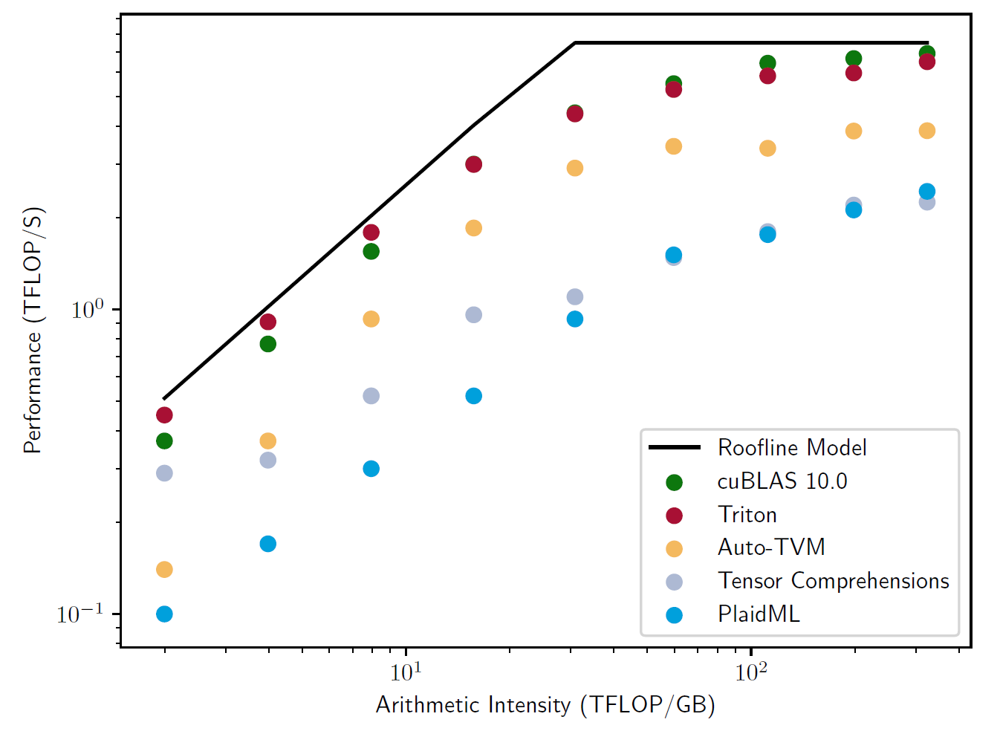
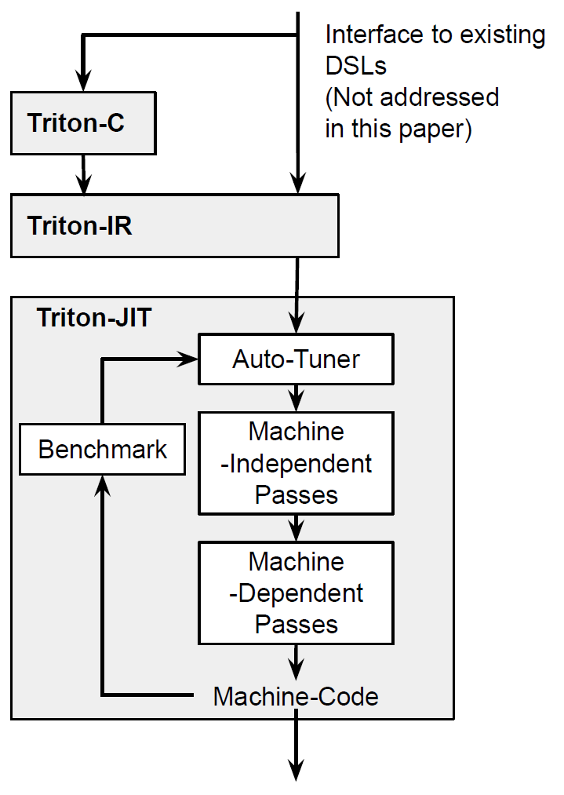
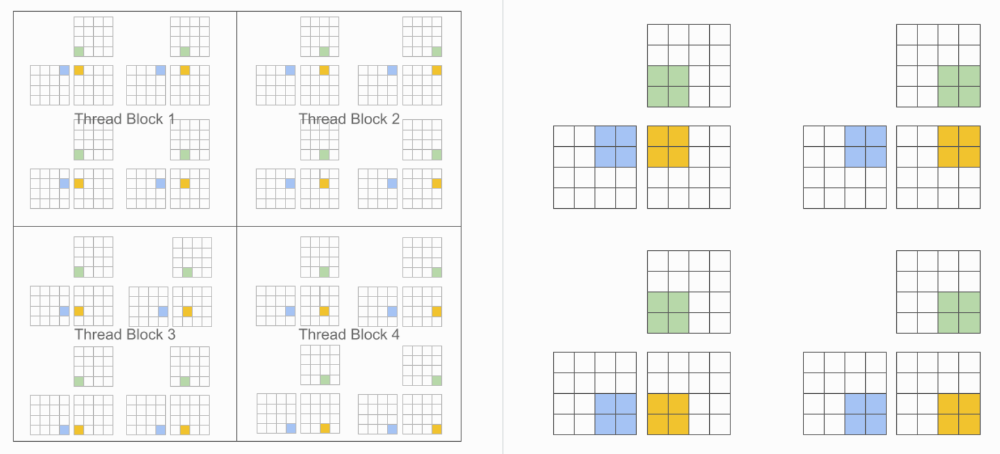
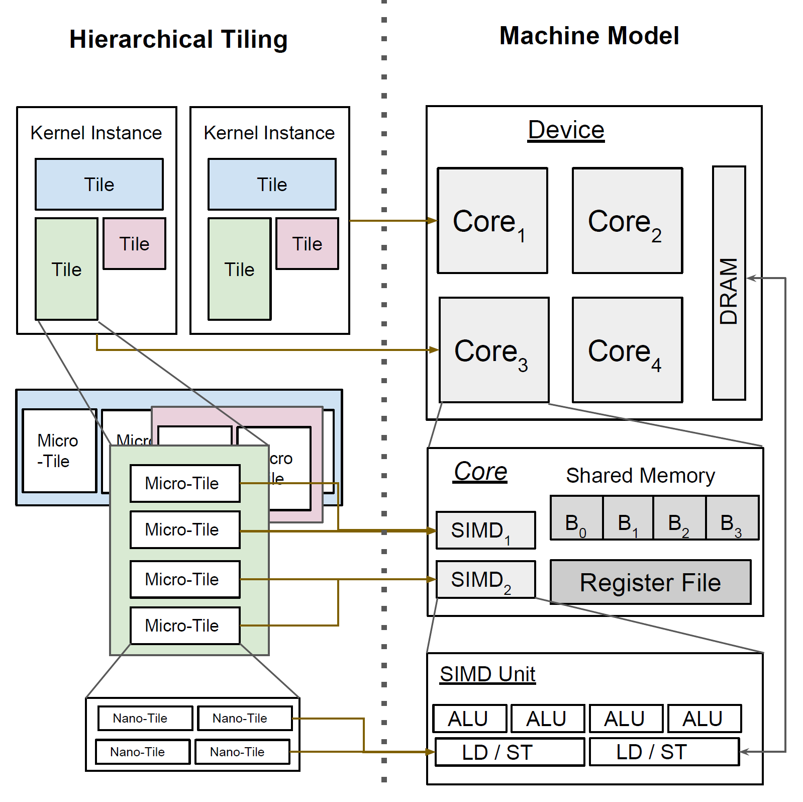
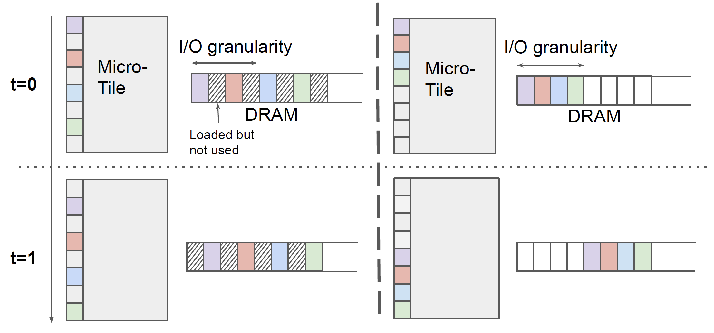
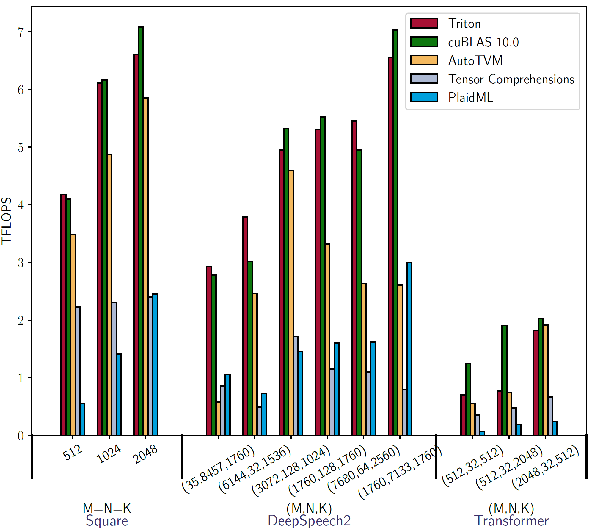
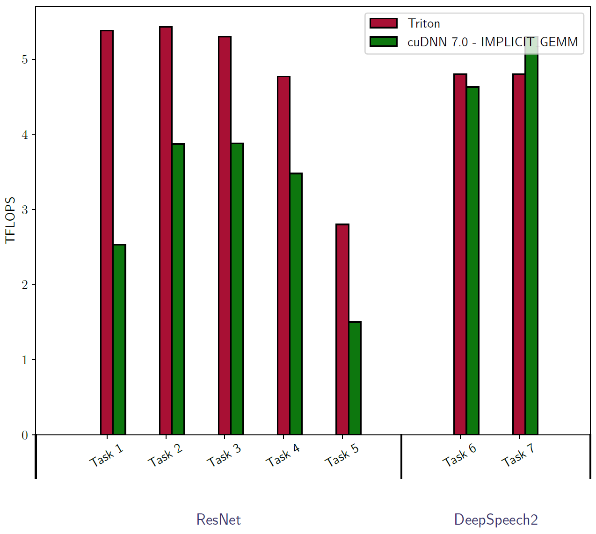
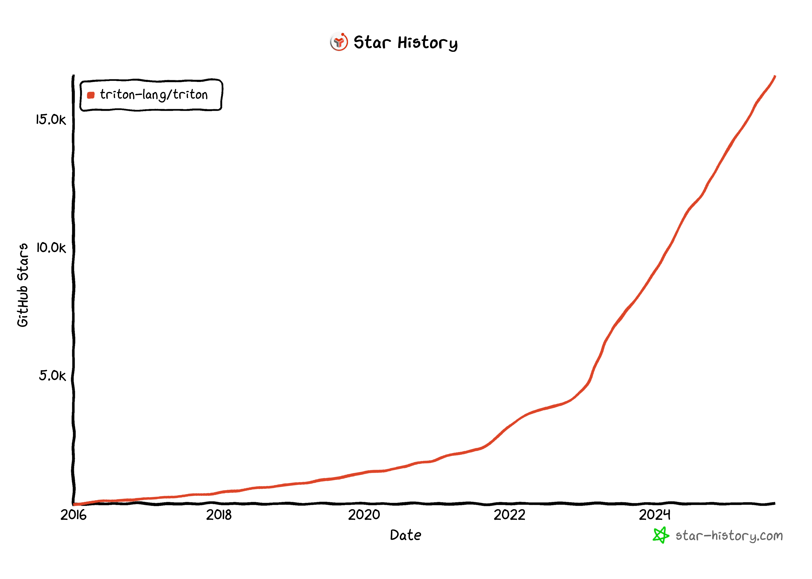

# Background & Motivation

## A Bottleneck in Deep Learning Innovation

- Vendor libraries (cuBLAS, cuDNN) are fast but **inflexible**.
- Novel research ideas require **custom kernels** and are usually limited by the performance.
- Writing high-performance GPU code is **expert work** and **not portable**.

## Existing Solutions Limitations

- **Vendor Libraries (cuBLAS, cuDNN):** Highly optimized but only support a restricted set of operations.
- **Domain-Specific Languages like TVM, Tensor Comprehensions:** More flexible, but often much slower than vendor libraries in practice.
- **Hand-written Micro-kernels:** Fast and flexible, but require immense manual effort and are not portable.

## The Performance Gap

{fig-align=center}

- Existing DSLs often lag behind hand-tuned vendor libraries.
- There is a need for a **new abstraction that combines expressiveness with high performance**.

## The Tile Abstraction Opportunity

- Tile = statically shaped ND sub-arrays
  - **Tiles are fundamental for GPU memory optimization**
  - Need compiler infrastructure specifically supporting tile-level operations
  - **Balance between performance and expressivity** for custom operations
  - Enable researchers to **implement novel operations without GPU expertise**

- **Existing compilers lack native tile-level operations**
- **Need for unified tile-centric language and compiler**

## Goal of Triton

- An open-source language and compiler centered around the concept of **tiles**.
- Aims to build portable and efficient implementations of any tensor program.

# System Design

{fig-align=center}

- **Triton-C**: C-like language with tile operations
- **Triton-IR**: LLVM-based intermediate representation
- **Triton-JIT**: Just-in-time compiler with auto-tuning

## Triton-C: tiles & broadcasting

A C-like language for tile operations.

- **Simplified SPMD model**
- **Tile-centric syntax**: `int tile[16, 16]`
- **Built-in functions**: `dot`, `trans`, `get_global_range`
- **NumPy-like broadcasting semantics**

{fig-align=center}

## Triton-IR

- **LLVM-based** IR for tile-level analysis.
- **First-class tile types**: `i32<8, 8>`
- **Novel instructions**: `reshape`, `broadcast`, `trans`, `dot`
- **Predicated SSA (PSSA)** for control flow within tiles

## Triton-JIT (tile-centric)

**Machine-Independent Passes**
- Automatic pre-fetching
- Tile-level peephole optimizations

**Machine-Dependent Passes**
- Hierarchical Tiling
- Memory Coalescing
- Shared Memory Allocation & Synchronization

**Auto-Tuner**
- Automatically extracts & optimizes parameters (e.g., tile sizes)

{fig-align=center}

## Triton-JIT (tile-centric)

**Machine-Independent Passes**
- Automatic pre-fetching
- Tile-level peephole optimizations

**Machine-Dependent Passes**
- Hierarchical Tiling
- Memory Coalescing
- Shared Memory Allocation & Synchronization

**Auto-Tuner**
- Automatically extracts & optimizes parameters (e.g., tile sizes)

{fig-align=center}

# Evaluation

## Setup & baselines

- GPU: NVIDIA GTX1070
- compare vs **cuBLAS**, **cuDNN**, **AutoTVM**, **TC**, **PlaidML**.

## Matrix Multiplication Performance

{fig-align=center}

- Matches cuBLAS (90%+ peak GPU performance)
- 2-3× faster than Tensor Comprehensions/PlaidML

## Convolution Performance

{fig-align=center}

- Comparable performance for DeepSpeech2 workloads

# Triton Today: From Research to Industry Standard

## The Rise of Triton

- Project Triton was continued at OpenAI.
  - GPT-2 & GPT-3 was powered by Triton language.
  - Its value was proved by the success of GPT series.
- It has evolved from the C-like "Triton-C" into a Python eDSL, making it far more accessible.
- Rise with Generative Large Language Model

{fig-align=center}

## Widespread Adoption

- **Favoring ML Research:** Many researchers use Triton to quickly implement & validate their ideas
- **Industry Standard**:
  - **PyTorch:** CUDA-free inference with PyTorch's `torch.compile`
  - **LLM framework:** the first-class backend in popular LLM frameworks
- **Growing Ecosystem**:
  - **Different Backend:** Triton-CPU, Triton-TPU, Triton-NPU.
  - **Educational:** Universities are offering courses on programming GPUs in Triton language.
