## Memory fragmentation issue

- Serving or training LLMs require substantial amount of memory.
- Tensor frameworks like PyTorch adopt a caching allocator which maintains a \textbf{physical} memory pool.
- The efficiency of caching allocators degrade quickly as the service progresses:
    - Popular memory saving techniques are employed: recomputation, KV cache offloading, distributed training and low-rank adaption.
    - Frequent and irregular memory allocation requests.

## Memory fragmentation issue

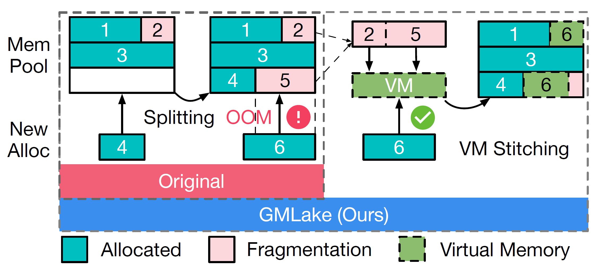{fig-align=center}

## Memory Management of DL Framework

Three types of memory management:

+ GPU native allocator
  - Simple and inefficient
  - 9.7$\times$ slower than PyTorch caching allocator
+ Caching allocator
  - Split-based
  - Physical memory
  - Fragmentation issue
+ Virtual memory allocator

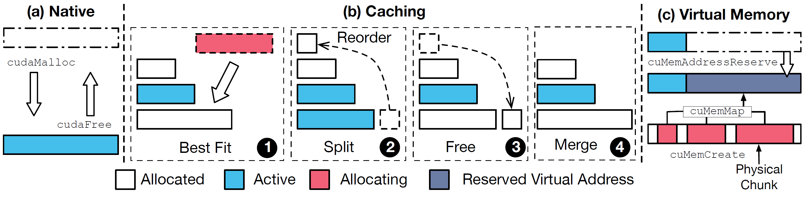{fig-align=center}

## Memory-efficient Optimizations in DNN inference and training

+ **Recomputation (R)**: drop several layers' computation results (activations), later recalculate them.
+ **Offloading (O)**: KV cache blocks swapping, DeepSpeed ZeRO offloads FP32 optimizer states to CPU memory.
+ **LoRA (L)**: rank-decomposition matrices

**Memory-saving but poor memory utilization**

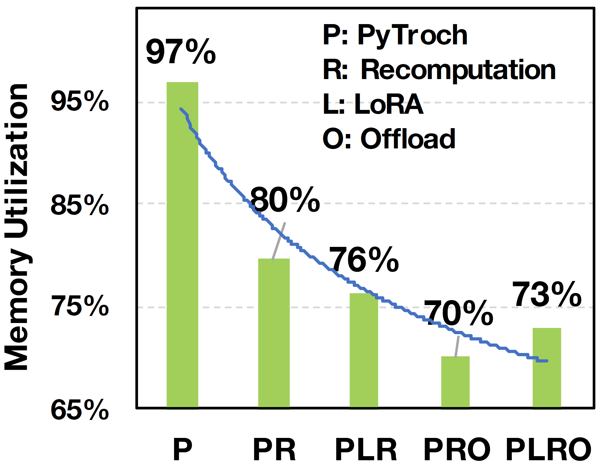{fig-align=center}

PyTorch origin: 46K allocations with an average size of 93MB.
PyTorch + LR: 76K allocations with an average size of 85MB.

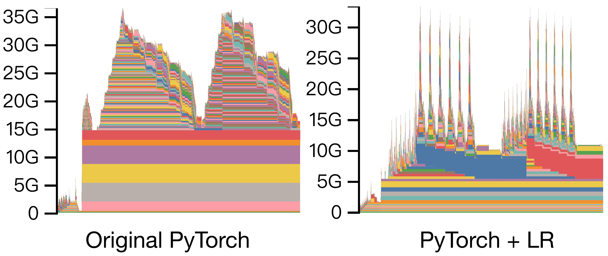{fig-align=center}

## More fragmentation in Distributed Training

Parallel techniques partitions inputs, layers, weights, intermediates, optimizer states, ...

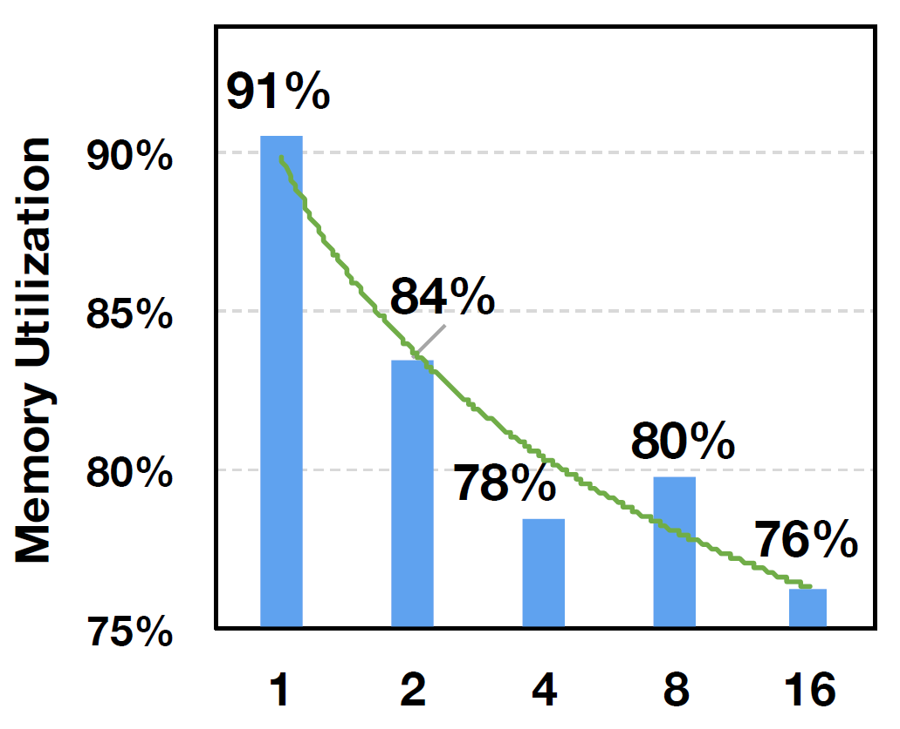{fig-align=center}

## Low-level Virtual Memory (VM) Management

VMM can allocate and map the non-contiguous physical chunks, which can tackle GPU memory fragmentation issues.

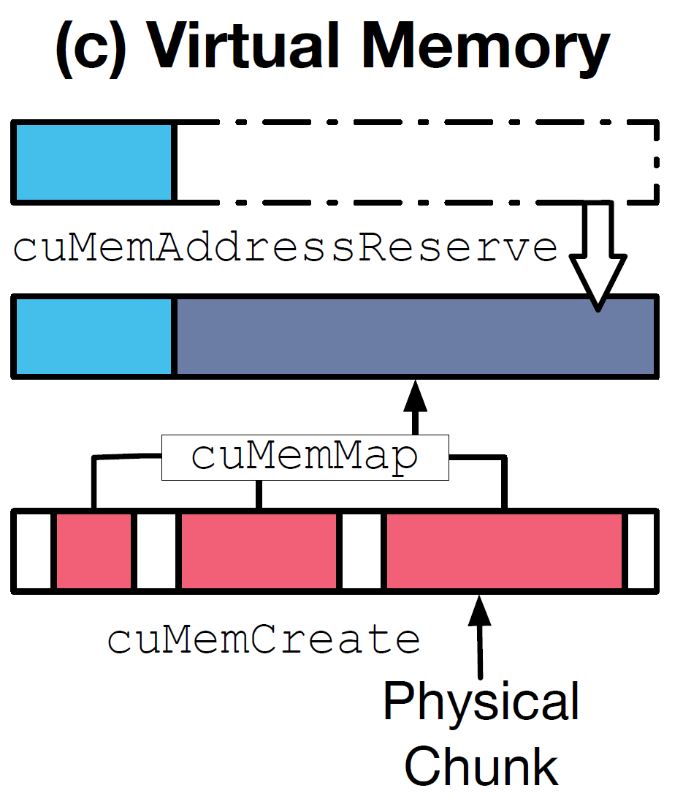{fig-align=center}

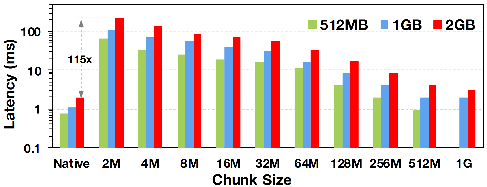{fig-align=center}

Original virtual memory allocator on GPU still presents many challenges and needs further optimization.

| Chunk Size     | 2 MB    | 128 MB | 1024MB |
| -------------- | ------- | ------ | ------ |
| cuMemReserve   | 0.003   | 0.003  | 0.002  |
| cuMemCreate    | 18.1    | 0.89   | 0.79   |
| cuMemMap       | 0.70    | 0.01   | 0.002  |
| cuMemSetAccess | 96.8    | 8.2    | 0.7    |
| Total          | 115.4   | 9.1    | 1.5    |

Table: Execution time normalized by cudaMalloc

# GMLake Design

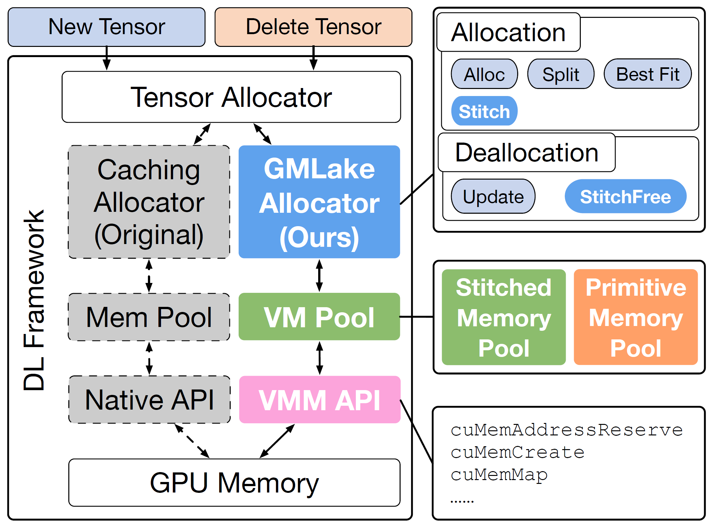{fig-align=center}

- **Virtual memory API**: low-level APIs employed to instruct the GPU to allocate and free memory using virtual memory addresses
- **Virtual memory pool**: Foundational data structure designed for caching virtual memory
- **GMLake allocator**: functions, algorithms and strategies to manage the VM pool

## Virtual Memory API

VMM APIs are used to build **primitive blocks (pBlocks)**, the smallest unit (2MB chunk size) accessible to high-level tensors:

- **AddrReserve**: Reserve the VA of a pBlock for the given size
- **Create**: Create physical chunks
- **Map**: Map all physical chunks to the virtual address

## Virtual Memory Pool

Given that original VMM APIs are time-consuming, it is crucial to reduce their usages to achieve high efficiency for GMLake.

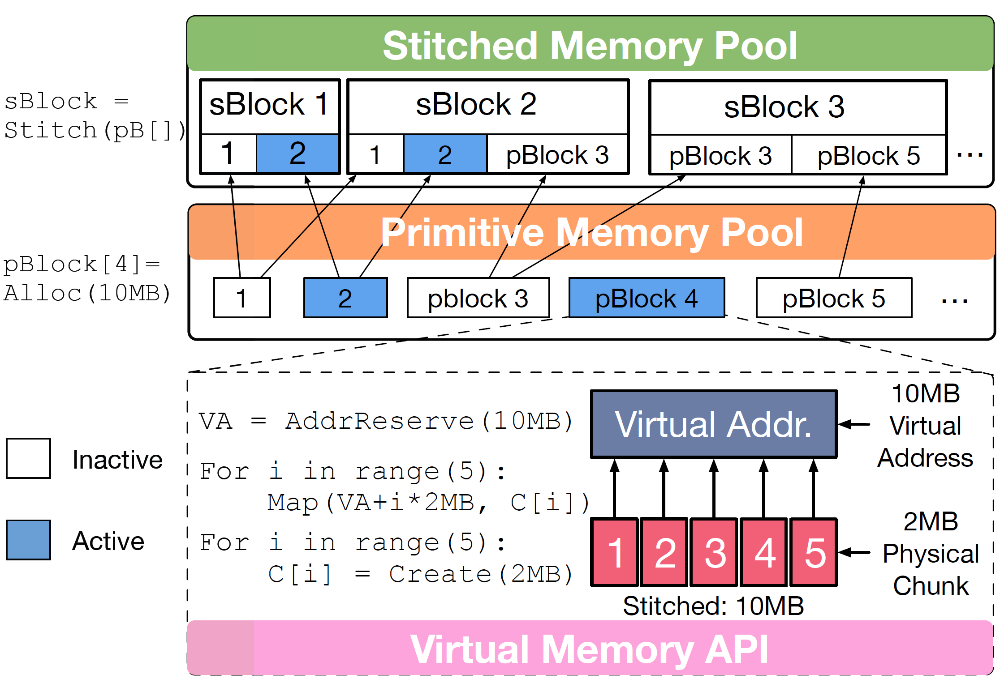{fig-align=center}

- **pPool**: a sorted set of pBlocks
- **sPool**: a sorted set of sBlocks
  - Each sBlock consists of multiple pBlocks
  - Each inactive pBlock can be used by multiple sBlocks
  - sBlock remaps pBlocks' VA, making it accessible by high-level tensors

## Allocator

### Allocation Module

- **Alloc**: allocate a new pBlock
- **Split**: divide a pBlock into smaller pBlocks
- **Stitch**: create an sBlock

### Allocation Strategy (best fit)

- Exact match (S1)
- Single block (S2)
- Multiple blocks (S3)
- Insufficient blocks (S4)

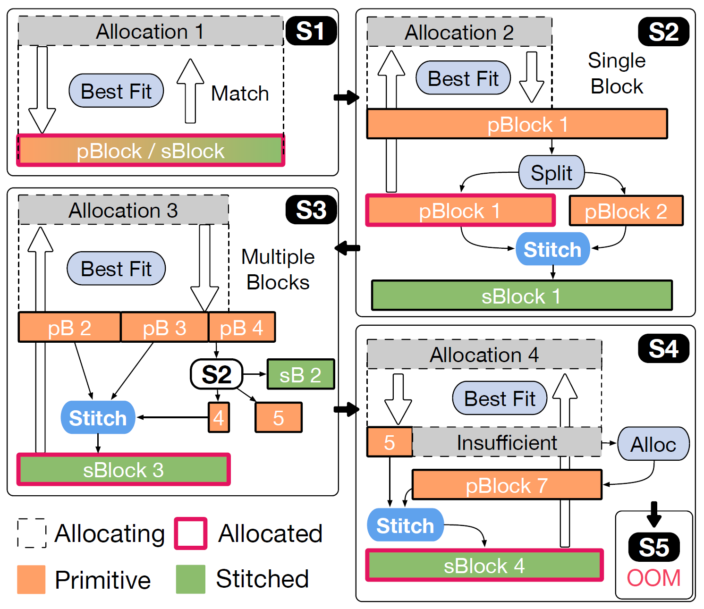{fig-align=center}

### Deallocation Module

- **Update**: remove the links between tensors and blocks, put the VM back to sPool
- **StitchFree**: release LRU inactive sBlocks

## Defragmentation Strategy Analysis

* Only when there's no enough memory blocks (total size), will the allocator request new physical memory blocks from CUDA.
* DNN model training is highly regularized, therefore, after a few iterations, S2-S4 no longer occurs. (?)

## Evaluation

### Environment Setup

+ Testbed:
  + Intel Platinum 8369B
  + 1TB DRAM
  + 8x NVIDIA A100 80GB
  + NVLINK

| **Model**      | **Strategies** | **DDP Framework** |
| -------------- | -------------- | ----------------- |
| OPT-1.3B       | L R O          | DeepSpeed         |
| GPT-2          | R O            | Colossal-AI       |
| GLM-10B        | R O            | FSDP              |
| OPT-13B        | L R O          | DeepSpeed         |
| Vicuna-13B     | L R O          | DeepSpeed         |
| GPT-NeoX-20B   | L R O          | DeepSpeed         |

Table: Benchmark specifications.

### Metrics

Memory utilization ratio: $\frac{PeakActiveMemory}{PeakReservedMemory}$

### Memory utilization on memory-efficient stategy combinations

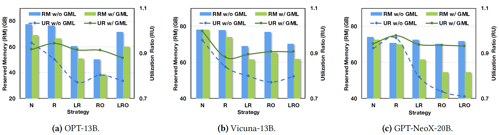{fig-align=center}

- Complicated strategies lead to fragmentation
- GMLake effectively reduces fragmentation to 5%-10%

### GPU scale-out

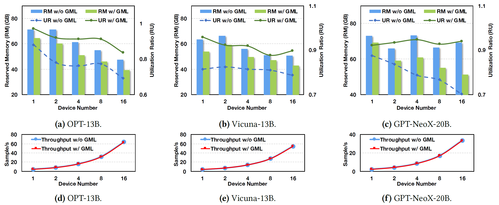{fig-align=center}

### Different frameworks

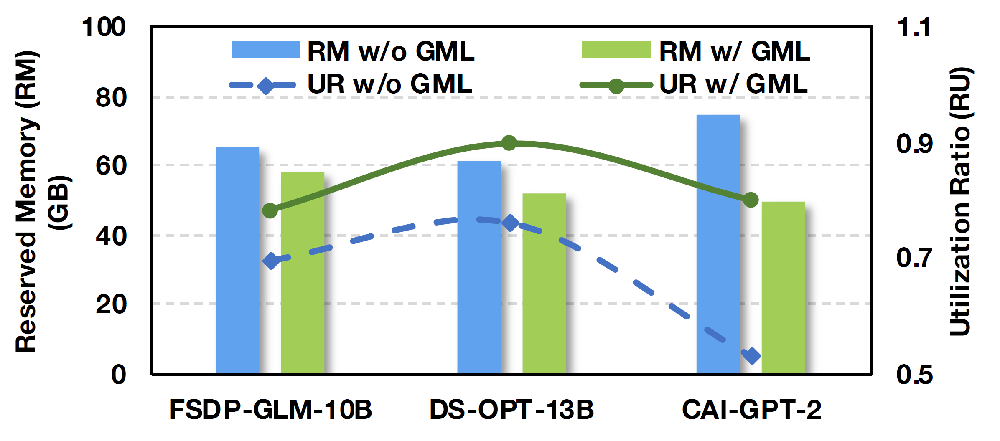{fig-align=center}

### Different batch sizes

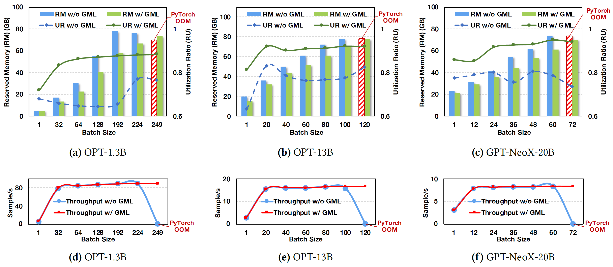{fig-align=center}

### Memory trace

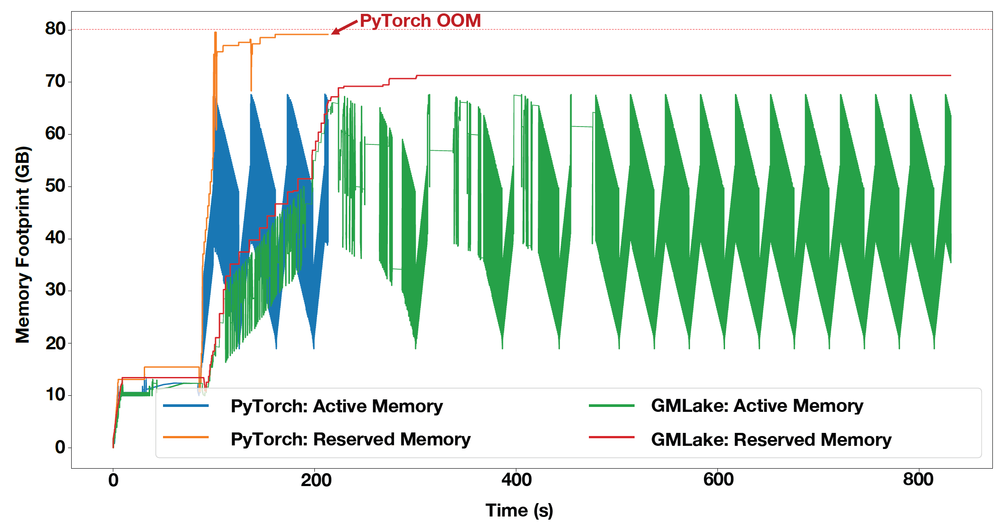{fig-align=center}
