## Semi-structured Log

Internet-scale services can produce a large amount of logs:

- Increasingly appearing in semi-structured format.
- At Uber, the amount of semi-structured log data can exceed 10PB/day

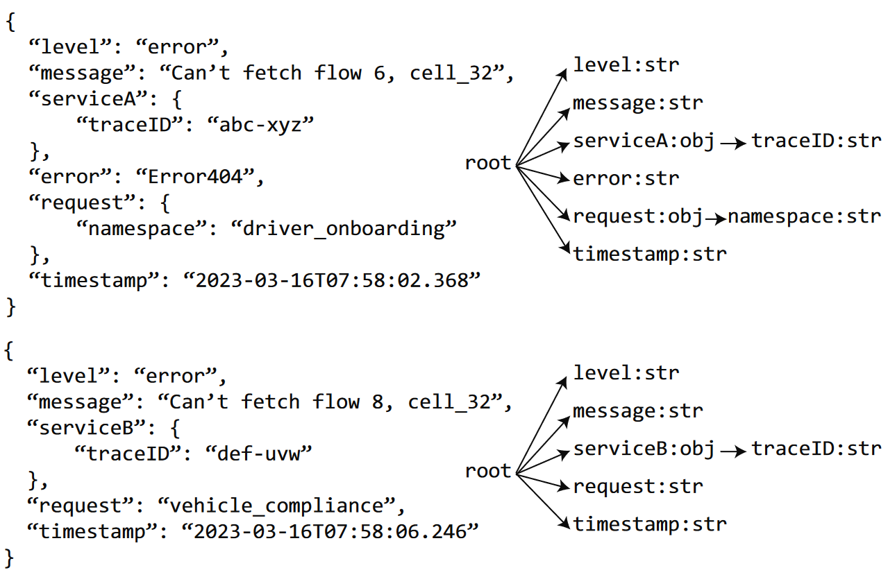{fig-align=center}


## Existing systems

### 1. Semi-structured logs can have different schemas within a dataset.


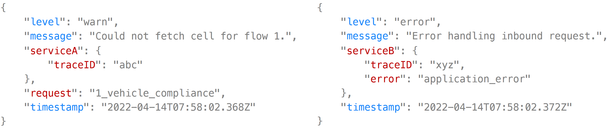{fig-align=center}


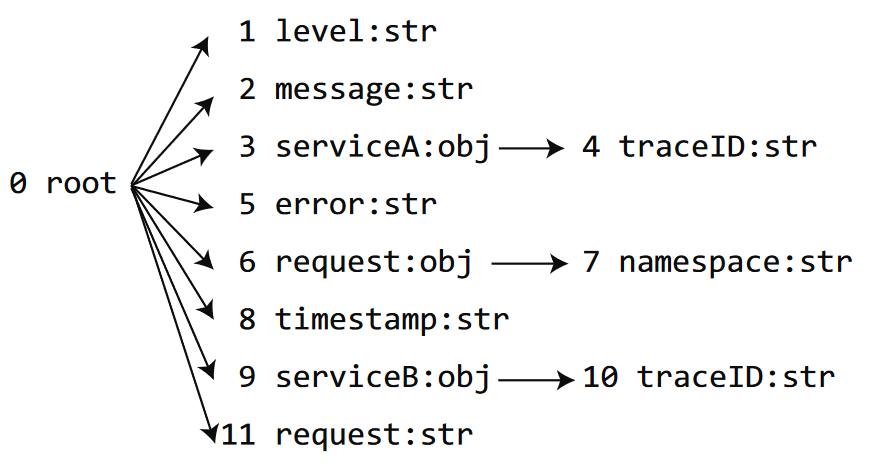{fig-align=center}


### 2. Traditional RDBMS cannot handle semi-structured data

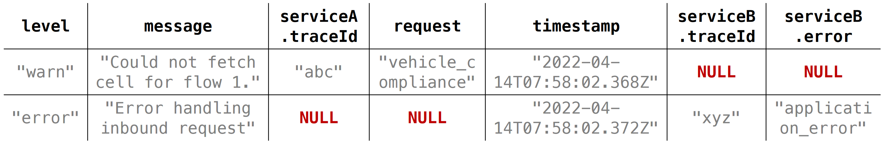{fig-align=center}


- Spase table
- Predefined schema
- Lack of flexibility


### 3. Limitations of systems with native JSON support (SSDMS)

E.g., MongoDB's BSON, PgSQL's jsonb and Oracle OSON.

```json
{
  "hello": "world"
}
```

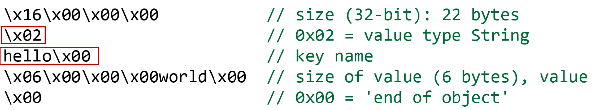{fig-align=center}


+ Low compression ratio
  + Extra metadata
  + Row-oriented format


### 4. Index-based search engines

E.g., ElasticSearch

- Low compression ratio
  - Inverted indexes
- Low ingestion speed
  - Ingestion involves complex processing
  - Building indexes for every word in the record.
- High resource usage
  - SSDs


## Characterizing Semi-structured Log Data

1. 16 frequently used log datasets (LogA-LogP) from Uber and 5 log datasets from open-source softwares.
2. Real-world queries on semi-structured log data by analyzing a total of 23,091 queries spanning twenty days from Uber; 7665 of them are unique.


### 1. Schemas are dynamic (up to 6176 unique schemas), but also **repetitive**

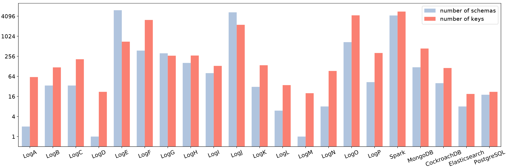{fig-align=center}


- On avg, 25000 records share the same schema. (40 unique schemas/dataset)
- Median: 162 unique keys


### 2. 71% of the values are variables (single-word strings)

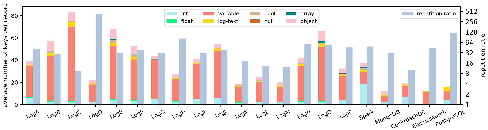{fig-align=center}


- 71% *variables*
- 10.8% *objects*
- Few *boolean*, *float*, *null* and *array*
- Only 28 of the 7,665 (0.4%) of the unique queries explicitly search on an *array* field.


### 2. 71% of the values are variables (single-word strings) and they are highly repetitive

{fig-align=center}


- 71% *variables*
  - Average 58.2 repetition ratio ($\frac{\text{all variable values}}{\text{unique variable values}}$)
  - On average, each query contains 2.7 filters on *variable* fields.
  - E.g.: `level:"warn"` or `level:"error"`
- 10.8% *objects*
- Few *boolean*, *float*, *null* and *array*
- Only 28 of the 7,665 (0.4%) of the unique queries explicitly search on an *array* field.


### 2. 71% of the values are variables (single-word strings) and they are highly repetitive

{fig-align=center}


- Each record contain:
  - 1.6 *log-text* keys
  - 4.0 *integer* fields
- 41% of queries contain filters on *log-text*.


### 3. 29% of the queries can be completed only by querying the schema structure.

- Key existence
- Value type checking


## Overview of uSlope

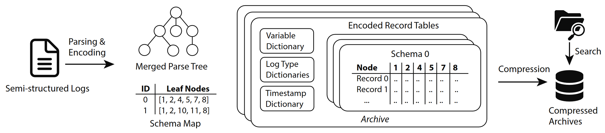{fig-align=center}


1. Decoupling the storage of schema metadata from the storage of each record
2. Grouping records by schema to store them into well-structured tables, and apply efficient encoding
3. Optimized schema metadata lookup to speedup search.


### Merged Parse Tree 

1. MPT can special unnamed nodes. (e.g. non-repetitive key name like UUID or filepath)
2. MPT allow a node to include the value
3. MPT can encode log-text field with key-value pairs. (`{.. "message":".. latency=35, status=OK, type=READ, ..."}`)
4. MPT has more fine-grained string types: timestamp, variable, log-text.


### Schema Map

1. Unique leaf nodes => unique schema

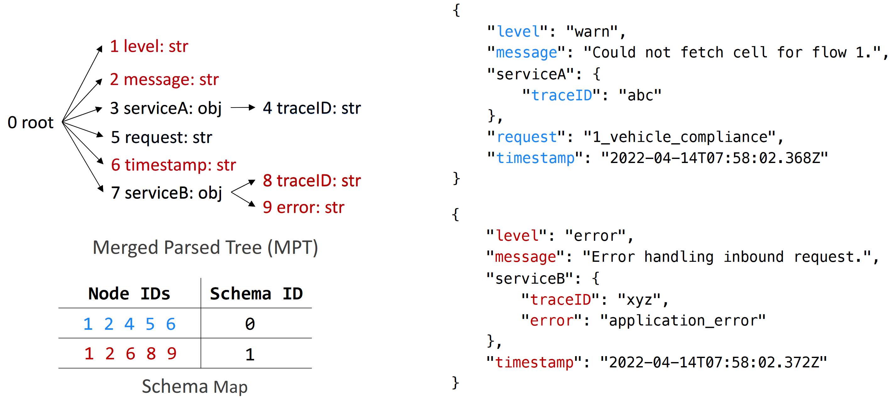{fig-align=center}


### Encoded Record Table

1. One table for each schema to store values
2. Each table is perfectly structured
3. Type-specific encoding
4. Columnar order
5. ERTs are buffered in memory.
   - compressed and archieved to disk when reaching the size limit

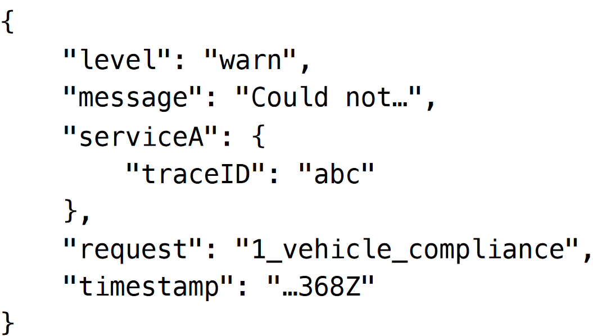{fig-align=center}


### Encoded Record Table

1. One table for each schema to store values
2. Each table is perfectly structured
3. Type-specific encoding
4. Columnar order
5. ERTs are buffered in memory.
   - compressed and archieved to disk when reaching the size limit

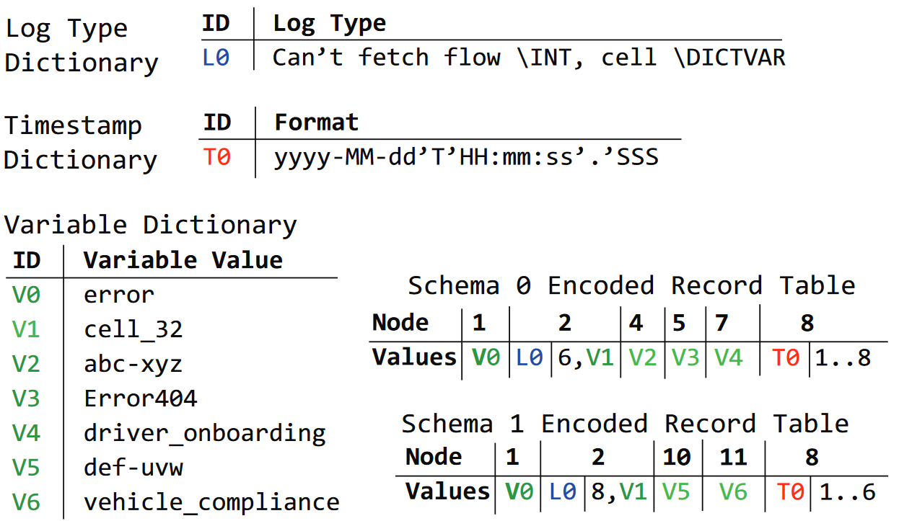{fig-align=center}


### Search

1. Constructing AST (KQL language)
2. Key resolution
3. Schema resolution
4. Search on strings
5. Column decompression and scan


## Evaluation

### Environment Setup

1. Xeon E5-2630v3
2. 128GB DDR4
3. MooseFS over multiple SATA HDDs

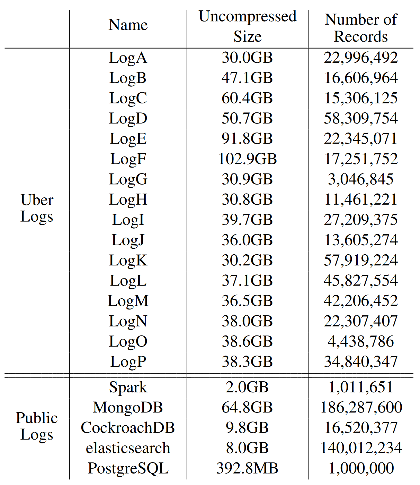{fig-align=center}


### Compression ratio

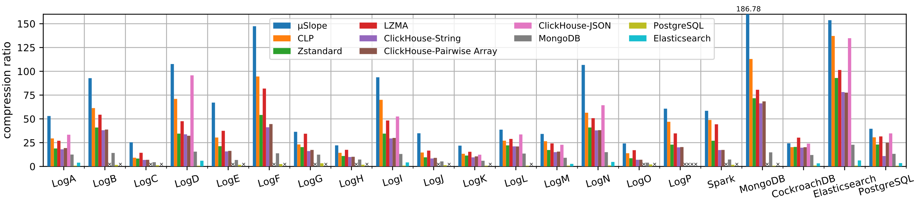{fig-align=center}


- 68:1 compression ratio on average


### Ingestion speed

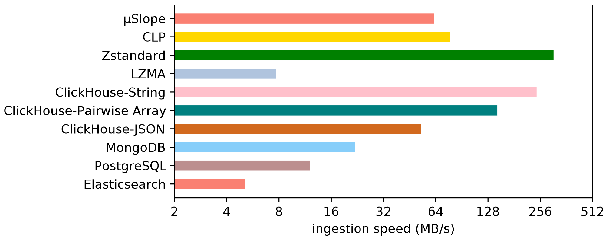{fig-align=center}


### Search performance

9 queries from Uber and 6 from public software

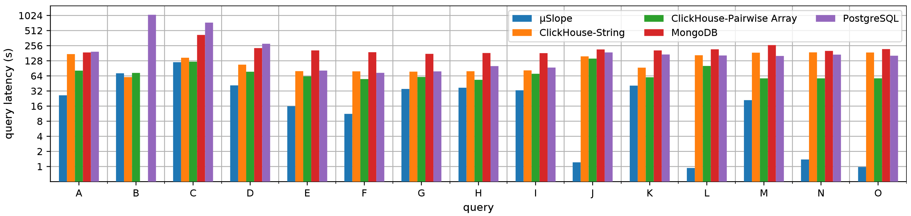{fig-align=center}
