# Trusted Execution Environment

- Trusted Execution Environment (TEE) is an important security requirement, especially in running security-sensitive applications on public cloud
  - Fully-trusted operator => problematic
  - Fully homomorphic encryption => slow
  - property-preserving encryption => weak
- Hardware-based techniques are actively proposing:
  - Trusted Platform Module
  - ARM TrustZone
  - Intel Software Guard Extention (SGX)

# Side-channel attack on Intel SGX

Intel SGX attracts significant attention due to its availability and applicability:

- Processes running inside an *enclave* can use almost every unprivileged CPU instructions without restrictions

1. Monitor page-fault or page-access sequence:
   - SGX allows an OS to fully control the page table of an enclave process
   - Malicious OS knows exactly which pages an attacked enclave attempts to access by monitoring page faults.
   - No measurement noise
   - **Noise-free, but coarse-grained**
2. Measure cache hit/miss timing
   - **Fine-grained, but noisy**

## Limitations of controlled-channel attack

- Coarse-grained page-level access patterns
- Recently proposed countermeasures against the attack prevent only the page-level attack. Therefore, a fine-grained side-channel attack (if exists) would easily bypass them.

# Intel SGX

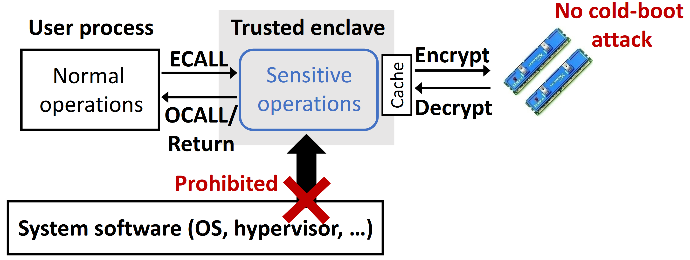{fig-align=center}

- allow only enclave code to access memory of the same enclave
- an on-chip memory-encryption engine encrypting/decrypting data before writing to/reading from physical memory

## Enclave context switch

{fig-align=center}

- `EENTER` and `EEXIT`
- Asynchronous enclave exit `AEX` due to exceptions and interrupts
- `ERESUME` to resume the execution from `AEX` interrupt
- During a context switch, SGX conducts a series of checks and actions to ensure security.
- However, SGX doesn't clear the branch history (branch target buffer)

# Branch prediction and branch target prediction

- Branch prediction is a procedure to predict the next instruction of a conditional branch by guessing whether it will be taken.
- Branch target prediction is a procedure to predict and fetch the target instruction of a branch before executing it.
- Modern processors have the BTB to store computed target addresses of taken branch instructions and fetch them when the branch is predicted as taken.
- Branch history is also recorded (taken or not taken, as well as targte address) in BTB.
- BTB has limited capacity.

## Last Branch Record

The LBR is a feature of Intel CPUs that logs information about recently *taken* branches, including branch instruction, target address, whether mispredicted and **elapsed core cycles between LBR entry updates**.

- An attacker may be able to know fine-grained control flows of a victim process by using LBR.
- However, an enclave doesn't report its branch executions to LBR unless in debug mode.
- LBR also has limited capacity

## Branch-prediction side-channel attack

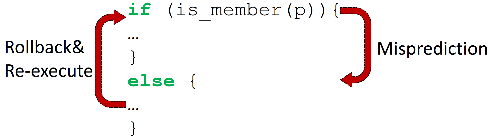{fig-align=center}

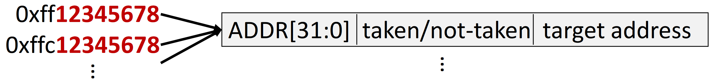{fig-align=center}

The branch-prediction side-channel attack aims to recognize whether the history of a target branch instruction is stored in BTB.

- BTB only uses lowest ADDR[31:0] as index.
- The attacker can determine whether the probed branch instruction has been taken by:
  1. Constructing a shadow branch instruction with colliding address
  2. Executing the shadow branch instruction
  3. Measure the execution time

## Challenges of branch-prediction side-channel attack

1. The addresses of branch instructions cannot be easily guessed.
2. BTB entries can be easily overwritten before an attacker probes them due to limited capacity.
3. Timing measurement of branch misprediction suffers from noises.
   - Colliding branches affect each other's prediction

## Challenges of branch-prediction side-channel attack

1. The addresses of branch instructions cannot be easily guessed.
2. BTB entries can be easily overwritten before an attacker probes them due to limited capacity.
3. Timing measurement of branch misprediction suffers from noises.
   - Colliding branches affect each other's prediction
   - High variance

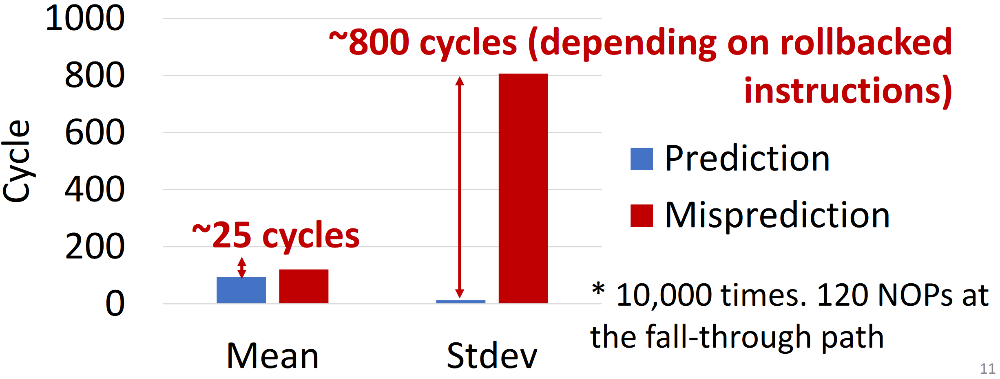{fig-align=center}

## Challenges of branch-prediction side-channel attack

1. The addresses of target branch instructions cannot be easily guessed.
2. BTB entries can be easily overwritten before an attacker probes them due to limited capacity.
3. Timing measurement of branch misprediction suffers from noises.
   - Colliding branches affect each other's prediction
   - High variance
   - Difficult to synchronize target and shadow branches

# Branch Shadowing Attack

- Apply LBR to a shadow branch to identify branch prediction results instead of timing
- Realize near single-stepping by increasing timer interrupt frequency and disabling the cache

## Threat Model

1. The attacker knows the source code or binary of a target enclave
2. The attacker interrupts the execution of the target enclave as frequently as possible to run the branch shadow code.
   - via a local APIC and/or disabling CPU cache
1. The attacker recognizes the shadow code's branch predictions/mispredictions by monitoring LBR's performance counters
2. The attacker prevents or disrupts the target enclave from accessing a trusted time source.
   - avoid the detection of attacks because of slowdown.

## Overview

### Step 1: Prepare a shadow copy of an SGX program to monitor it with LBR

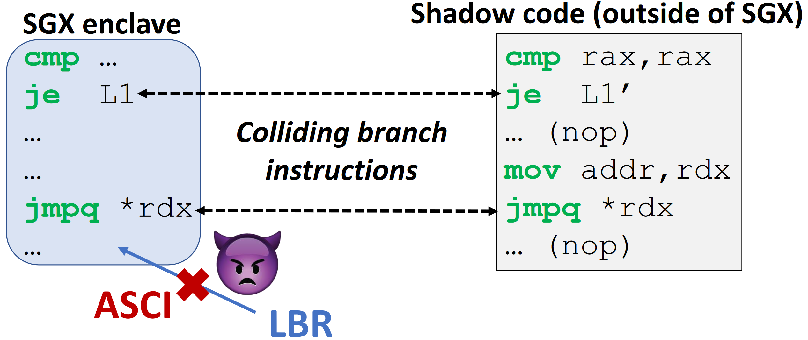{fig-align=center}

### Step 1: Prepare a shadow copy of an SGX program to monitor it with LBR

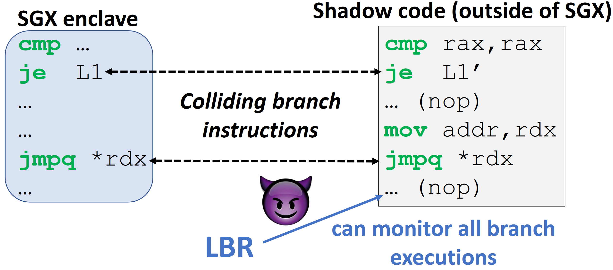{fig-align=center}

### Step 2: Interrupt SGX execution and monitor shadow code with LBR

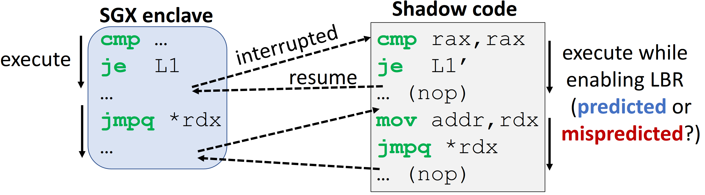{fig-align=center}

For a conditional branch, LBR reports condition prediction result (taken or not taken).

Whether or not shadow branches were correctly predicted reveals the history of target branches.

### Step 2: Interrupt SGX execution and monitor shadow code with LBR

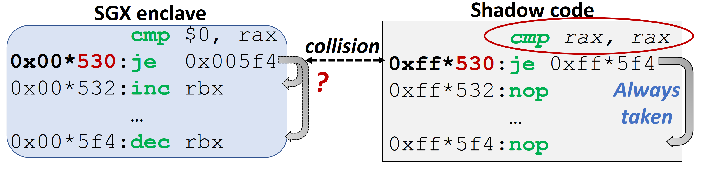{fig-align=center}

- Because LBR does not report not-taken branches, the shadow branch should be always taken.
- If the target (probed) branch has been **taken**, the LBR reports: the shadow branch has been **correctly predicted**.
- If the target (probed) branch has been **not taken**, the LBR reports: the shadow branch has been **mispredicted**.

### Step 2: Interrupt SGX execution and monitor shadow code with LBR

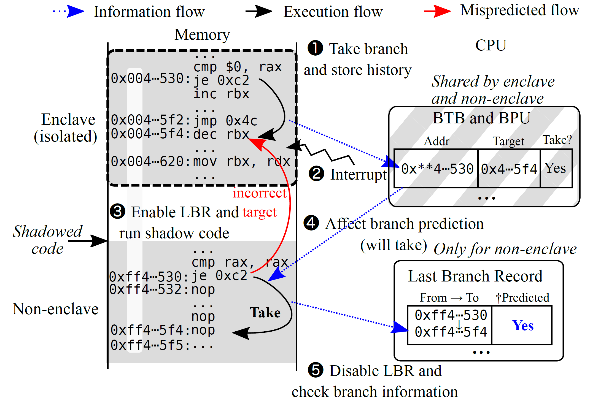{fig-align=center}

- Because LBR does not report not-taken branches, the shadow branch should be always taken.
- If the target (probed) branch has been **taken**, the LBR reports: the shadow branch has been **correctly predicted**.
- If the target (probed) branch has been **not taken**, the LBR reports: the shadow branch has been **mispredicted**.

### How to shadow indirect (unconditional) branch?

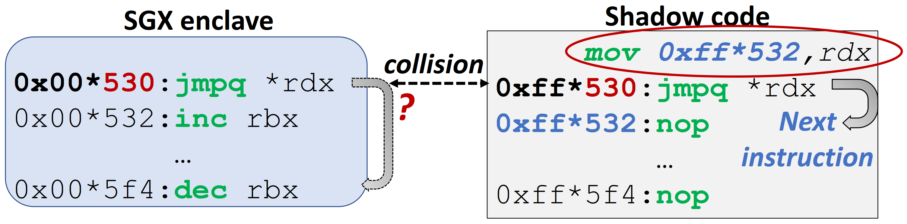{fig-align=center}

For an indirect branch, LBR reports a target prediction result (whether the jump address is correctly predicted).

- Use next instruction as the jump address of shadow indirect branch => Because real application won't jump to next instruction
- If the target (probed) branch has been **executed**, the LBR reports: the shadow branch has been **mispredicted**.
- If the target (probed) branch has been **not executed**, the LBR reports: the shadow branch has been **correctly predicted**.

## Near single-stepping: Frequent timer and disabled cache

1. Increase APIC timer interrupt frequency
   - about 50 `ADD` instructions between two interrupts (~50 cycles)
   - Not enough for short loops
2. Disable CPU cache
   - about 5 `ADD` instructions between two interrupts (~5 cycles)

# Evaluation

## Attack RSA Exponentiation

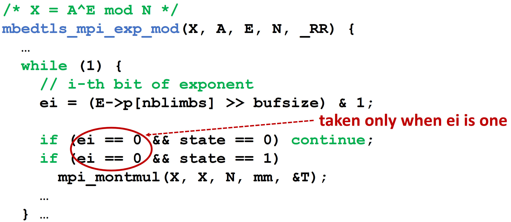{fig-align=center}

- RSA-1024 decryption with two executions of `mbedtls_mpi_exp_mod` with two different 512-bit CRT exponents in each iteration.
- On average, the branch shadowing attack recovered approximately 66% of the bits of each of the two CRT exponents from a single run of the victim.
- about 10 runs are enough for fully recovery

## Countermeasure: Flushing branch state at SGX context switch

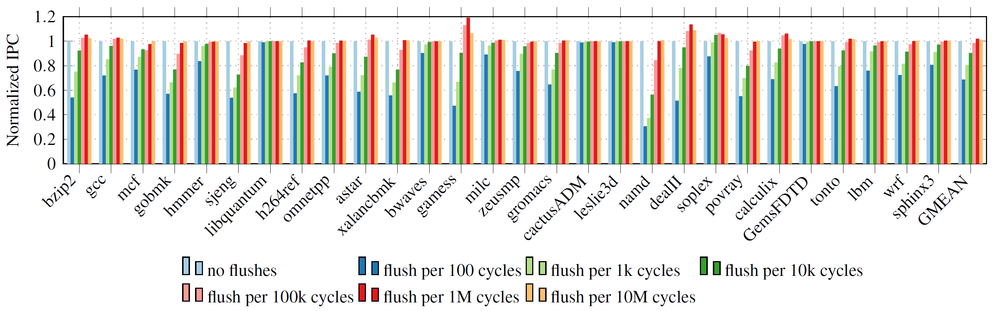{fig-align=center}

- Most effective, but need hardware modification
- Overhead depends on the flush frequency
  - ~2% overhead when flush at every 100k cycles.

## Countermeasure: Flushing branch state at SGX context switch

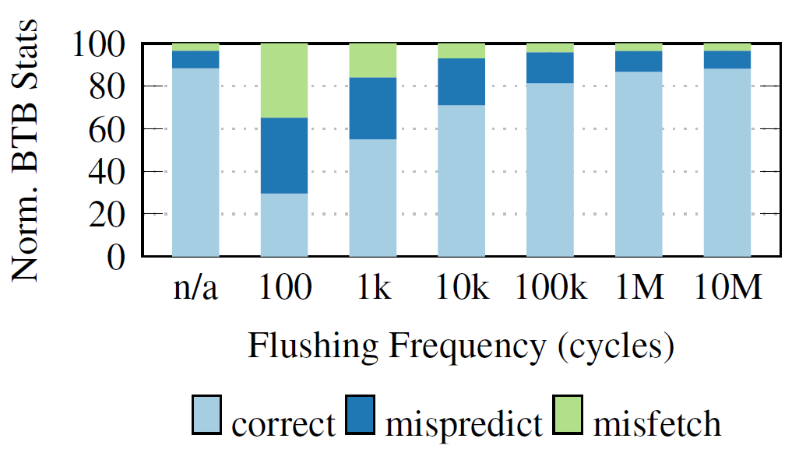{fig-align=center}

- Most effective, but need hardware modification
- Overhead depends on the flush frequency
  - ~2% overhead when flush at every 100k cycles.
- The BTB and BPU statistics are also barely distinguishable beyond a flush frequency of 100k cycles.
