# Background and Motivation

## Weight-only Quantization

- Effectively reduce LLM model size
- Using fewer bits to represent each weight
- Reducing GPU DRAM usage and access

## Weight-only Quantization

- Only **4-bit** and **8-bit** quantization are well-supported on modern GPUs

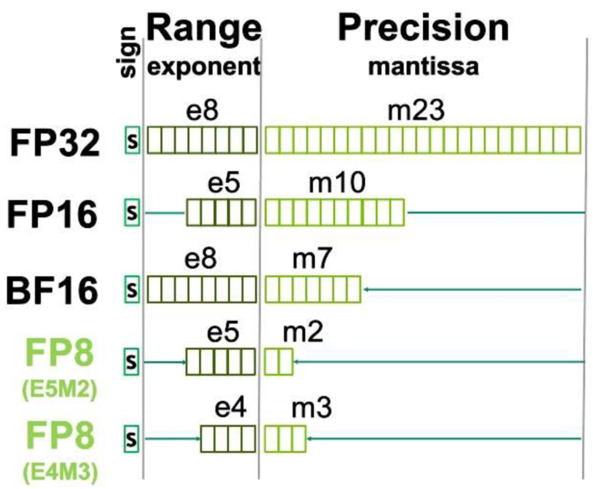{fig-align=center}

**More choices of bit-width for LLM quantization?**

## FP6: A "Sweet Spot" for LLM quantization: Better model quality

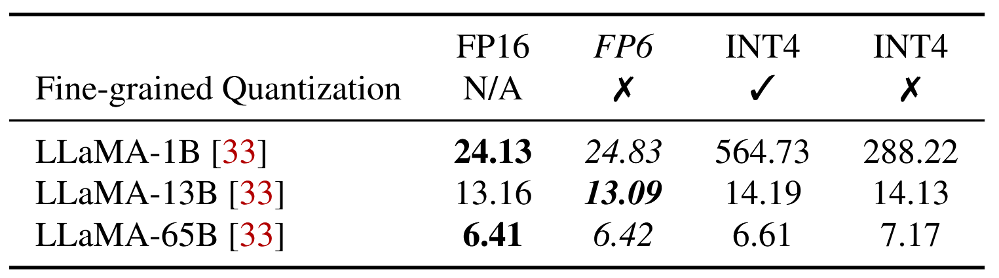{fig-align=center}

- INT4 causes more quality degradation
- INT4 requires fine-grained quantization

## FP6: A "Sweet Spot" for LLM quantization: Lower inference cost

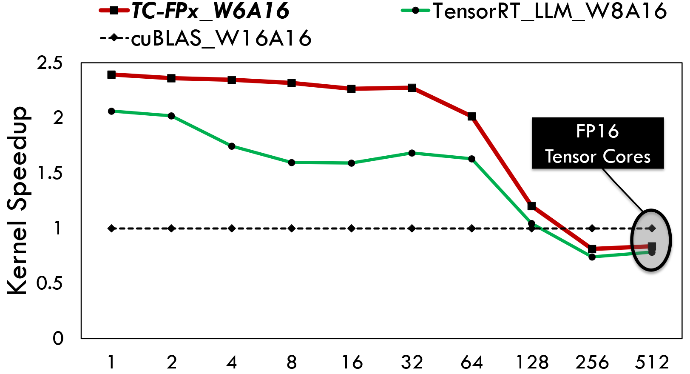{fig-align=center}

- Effectively reducing LLM serving cost, e.g., LLaMA-70b.
  - DRAM usage: 130GB(fp16) => 49GB(fp6)
  - Number of GPU required: 2 GPUs => 1 GPU
- Accelerating the speed of LLM token generation
  - Up to 2.4x/1.45x faster than fp16/int8 baseline

## Tensor Cores vs. SIMT Cores

- SIMT cores (CUDA cores) are responsible for general-purpose processing tasks operating on vector data.
- Tensor cores are specialized for accelerating matrix multiplication.
- Tensor cores has 16.0x higher FLOPS than SIMT cores on A100.

# Design Choices and Challenges

## Design Choice 1: single kernel or two kernels?

- **Fused GPU kernel is better**: on-the-fly dequantization
  - Eliminating DRAM read/write of the de-quantized weights
  - on-the-

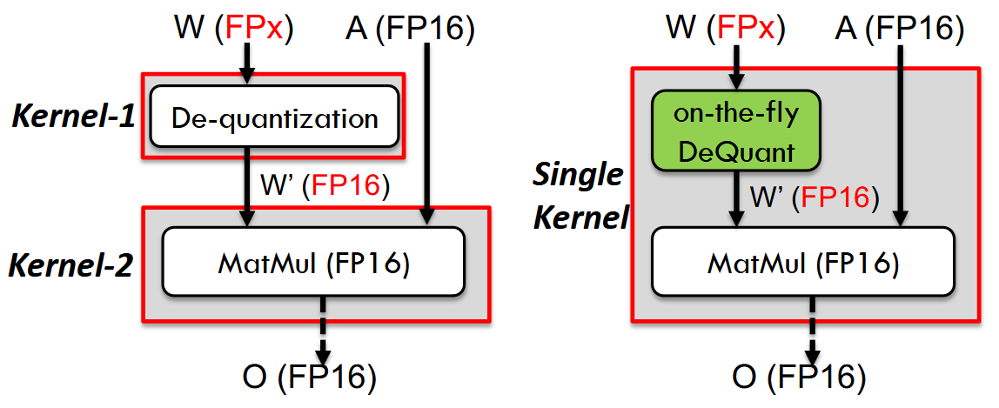{fig-align=center}

## Design Choice 2: Tensor cores or SIMT cores?

- Some on-the-fly dequant methods use SIMT cores: AWQ.
  - An order of magnitude slower
  - A large fraction of SIMT core's computational power is used on dequantization

## Design Challenges 1: Irregular Memory Access

- Global DRAM => Shared memory => Per-thread private registers
- Minimal input of Tensor core is an 8x8 sub-matrix
  - Each GPU thread should hold a pair of weights in its registers
  - Minimal access size is a 32-bit word
- Alignment

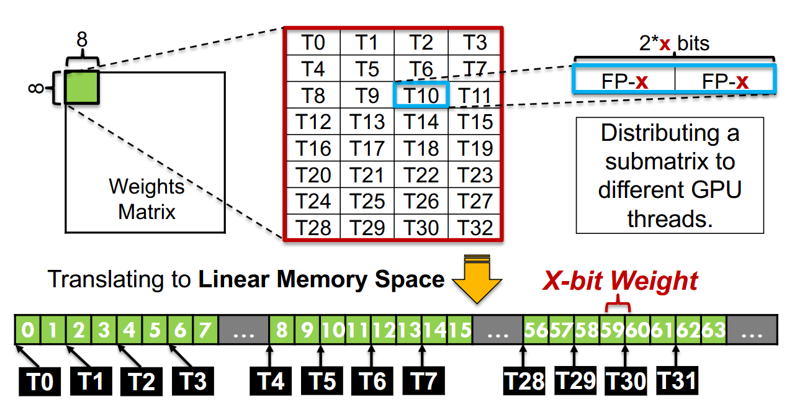{fig-align=center}

## Design Challenges 1: Irregular Memory Access

- Global DRAM => Shared memory => Per-thread private registers
- Minimal input of Tensor core is an 8x8 sub-matrix
  - Each GPU thread should hold a pair of weights in its registers
  - Minimal access size is a 32-bit word
- Alignment

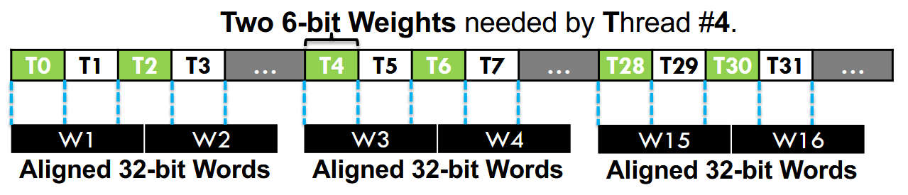{fig-align=center}

## Design Challenges 2: High Computation Overhead of De-quantization

- The runtime overhead of FPx-FP16 de-quantization can be extremely high, which easily slows down the overall execution.
  - Complex bit-wise operations

# Design

## Overview

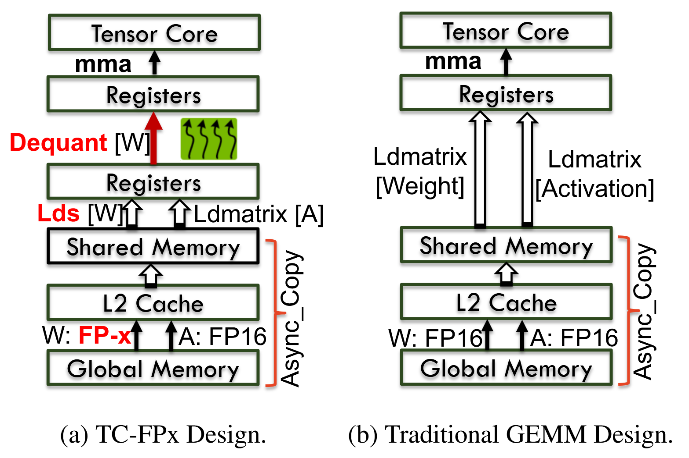{fig-align=center}

## Ahead-of-time Bit-level Pre-packing

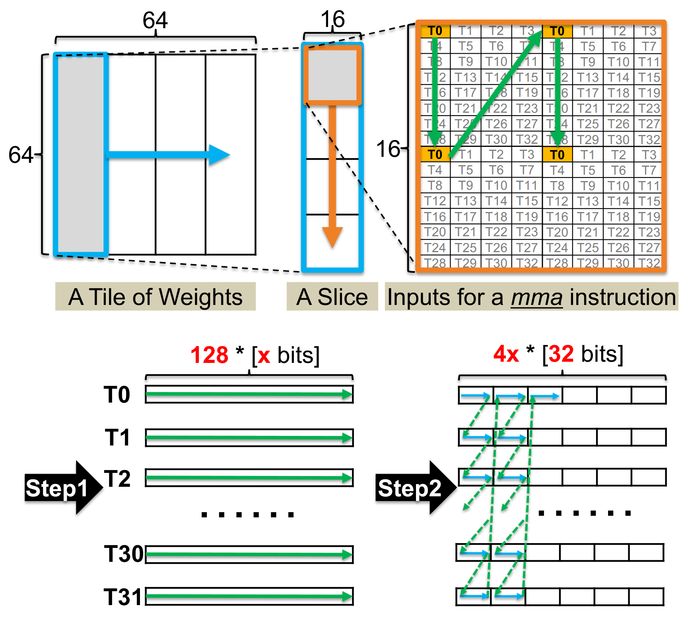{fig-align=center}

- WARP-level tile (64x64) => Slices => 16x16 chunks
- Each thread handles totally 128 weight. (64x64/32)

- **Step 1: Per-thread Wight Gathering.** The weights are combined and stored continuously within each group and each group of weights will be consumed by a certain GPU thread.

## Ahead-of-time Bit-level Pre-packing

{fig-align=center}

- WARP-level tile (64x64) => Slices => 16x16 chunks
- Each thread handles totally 128 weight. (64x64/32)

- **Step 2: Bit-level Assembling per WARP.**
  - 128 x-bit items are viewed as 4x 32-bit items
  - To begin with, the first 32-bit items of all threads are stored continuously.

## SIMT-Efficient GPU Runtime

### Parallel De-quantization

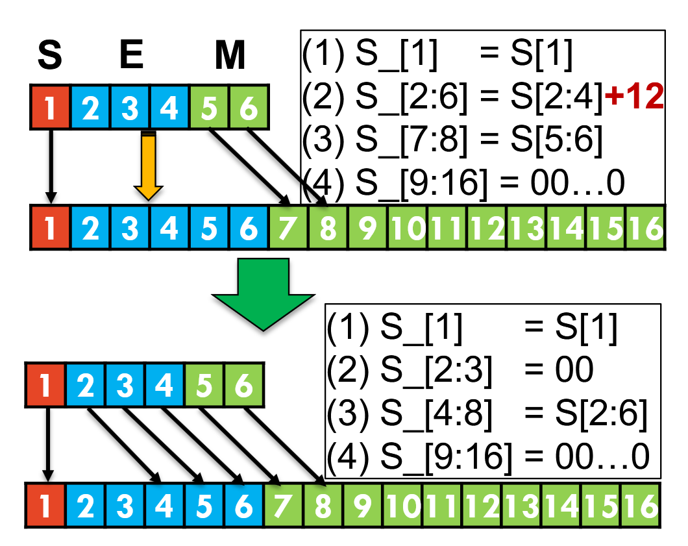{fig-align=center}

- Optimized FP6 to FP16 cast
  - only 2 bit-wise AND + 1 SHIFT + 1 OR

### Parallel De-quantization

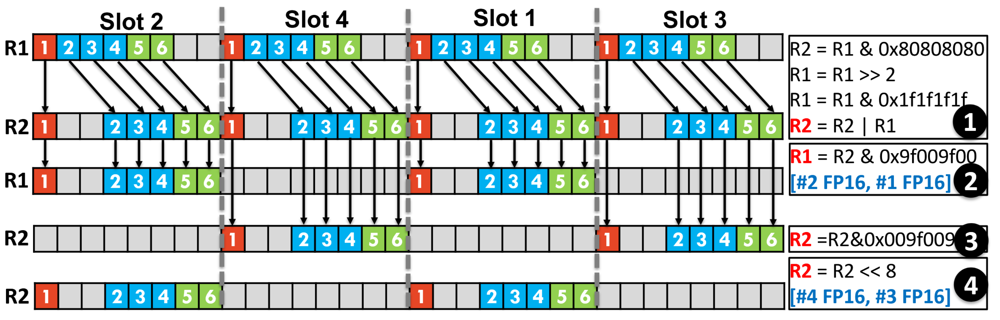{fig-align=center}

- Bit-level Parallelism
  - The 32-bit registers are treated as four processing slots
  - Each slot works independently with the same instruction but different input FP6 data

## Weight Split and Stitching

- Ahead-of-time Weight Split
  - FP6 => 2E + 4M
  - store exponent and mantissa separately
- Runtime Weight Stitching

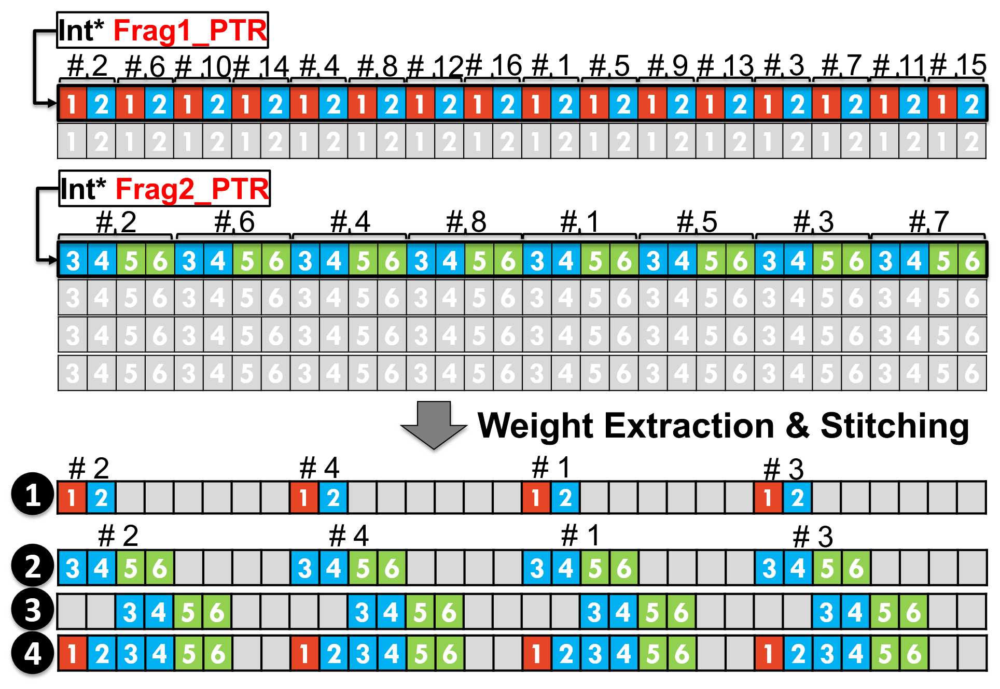{fig-align=center}

## Software Pipeline

### Slice-by-Slice De-quantization

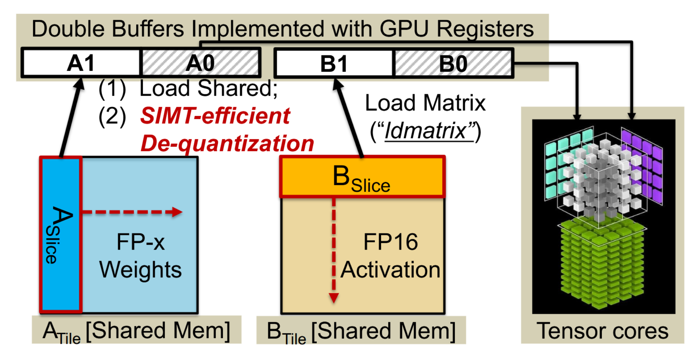{fig-align=center}

- load next tile (cp.async)
- MMA previsously dequantized slice (mma)
- Dequantize current slice
- load matrix to tensor core register (ldmatrix)

### Effective Overlapping

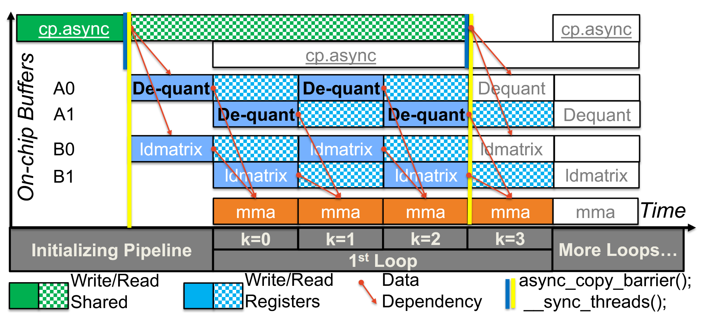{fig-align=center}

# Evaluation

## Environment Setup

- **Kernel Benchmarking**
  - Linear kernel (MatMul)
  - Baselines: cuBLAS, TensorRT-LLM, Bitsandbytes
  - Platform: NVIDIA A100-40GB
- **End-to-End LLM inference**
  - Decoding throughtput
  - Prompt length: 0.5K
  - Decode length: 1.5K
  - Platform: NVIDIA A100-SXM-80GB
  - Framework: DeepSpeed

## Kernel benchmarking

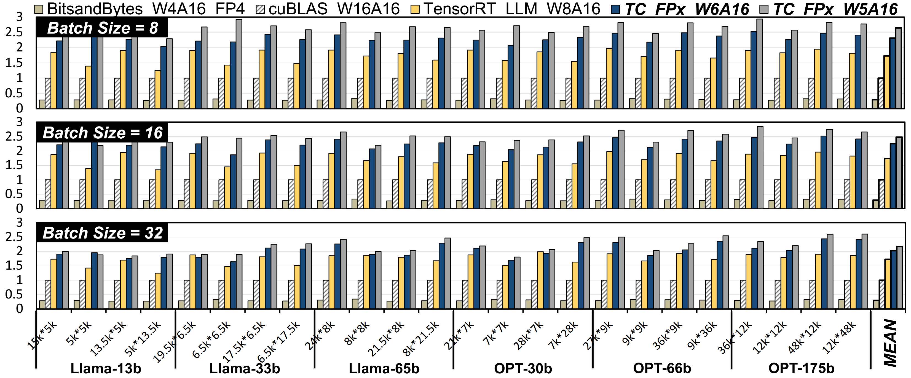{fig-align=center}

- 7.3X/2.2X/1.3X faster than FP4/FP16/INT8
- 8.1X/2.4X/1.4X faster than FP4/FP16/INT8

## End-to-End LLM Inference

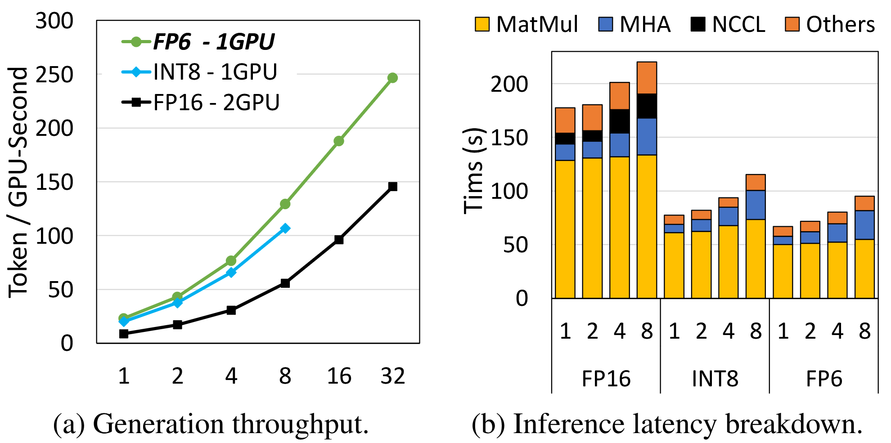{fig-align=center}

- 1.69X - 2.65X higher throughput than FP16 baseline.
- Up to 2.31X higher throughput than INT8 with batch size 32.

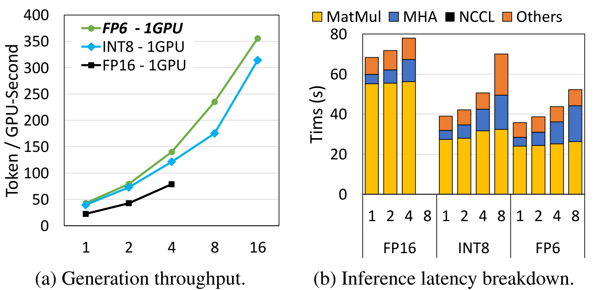{fig-align=center}

- 1.91X/1.86X/1.78X higher throughput than FP16 at batch sizes 1/2/4
- 1.09X−1.34X higher throughput than INT8
