# Background and Motivation

## Cloud Local Disk

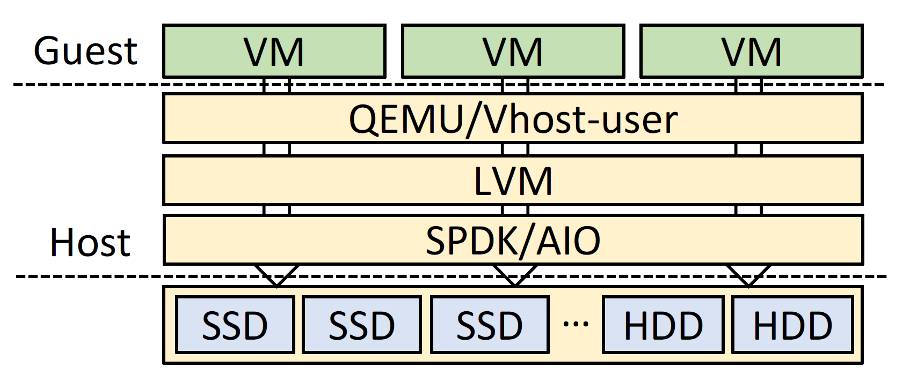{fig-align=center}

There are trend that customers choose cloud local disks for their VMs for higher performance.

- Disks are local to the host. (not cloud disk attached through network)
- Logical Volume Manager (LVM) wraps local disks as multiple logical disks.
- VMs can subscribe and mount logical disks.

### Cloud Local Disk: Resource granularity

- Cloud vendors usually set a proportion of the whole physical resources as the finest granularity.
- The user can subscribe one or multiple such proportion(s), to avoid oversubscription.
- For example,
  - AWS D3.xlarge has 4 vCPUs, 32GB memory and 6TB local disk (3x2TB HDDs)
  - AWS D3.8xlarge has 32 vCPUs, 256GB memory and 48TB local disk (24x2TB HDDs)

### Cloud Local Disk: Resource granularity

- However, the capacity of local disk multiplies, the performance doesn't.
  - The storage performance of local disks cannot catch up with multiplied computing resources.

### Cloud Local Disk: Challenges

- Recent datacenter-grade CPUs has more and more cores.
  - Cloud vendors can now provide more VM instances.
- Easy to add more memory
- Challenging to **scaling up both the capacity and performance of the storage.**
  - Western Digital's 22TB CMR HDD still provides 250MB/s bandwidth, similar to its 8TB SKU and earlier products.
  - NVMe SSDs provide enough performance but the capacities are limited. => higher cost

## High-density NAND Flash SSDs

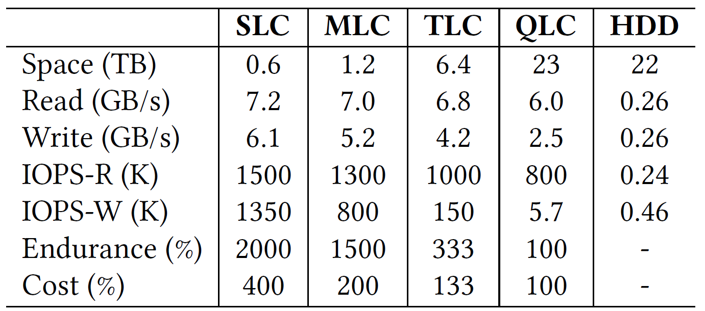{fig-align=center}

- NAND density has gradually increasing from SLC to QLC.
- QLC-based SSDs:
  - comparable capacities to HDDs
  - 10x higher throughput

## Preliminary Attempts

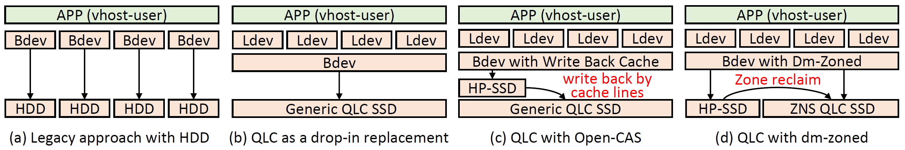{fig-align=center}

- Lagacy approach: 8x2TB HDDs
- Drop-in replacement: 1 QLC SSD to replace 8 HDDs
- QLC with Open-CAS
- QLC with dm-zoned

### Evaluation

- 8 VMs, each with 7 vCPUs and 28GB memory
- Each VM is assigned with one logical device.
- FIO inside VMs

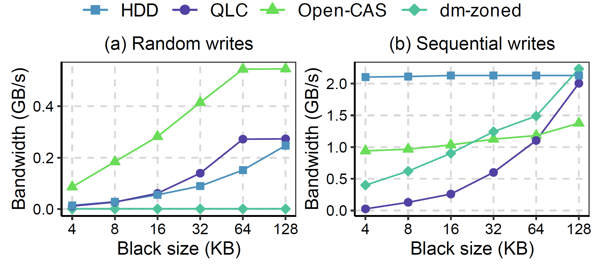{fig-align=center}

### Analysis of Attemp 1 Drop-in Replacement

{fig-align=center}

- Bad performance
- NAND-level write amplification
  - frequent small writes => significant amplification triggered by GC
  - sharing the same QLC SSD causes different data with different lifespans to be stored in the same erase block

### Analysis of Attemp 1 Drop-in Replacement

- Bad performance
- Device-level write amplification
  - Large capacity: large L2P table
  - QLC SSDs usually adopt a much larger indirection unit size (64KB vs. 4KB in TLC SSDs)
  - Miss-sized or Miss-aligned write causes amplification

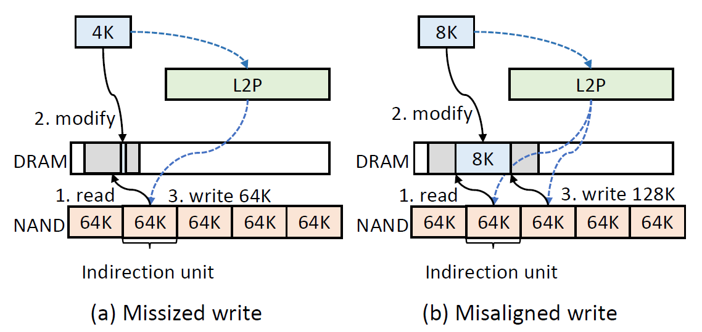{fig-align=center}

### Analysis of Attemp 1 Drop-in Replacement

- Bad performance
- NAND-level write amplification
  - frequent small writes => significant amplification triggered by GC
  - sharing the same QLC SSD causes different data with different lifespans to be stored in the same erase block
- Device-level write amplification
  - Large capacity: large L2P table
  - QLC SSDs usually adopt a much larger indirection unit size (64KB vs. 4KB in TLC SSDs)
  - Miss-sized or Miss-aligned write causes amplification
- Endurance

### Analysis of Attemp 2 Write-Back Cache

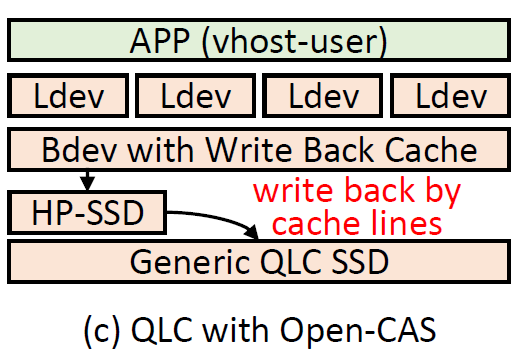{fig-align=center}

- Use a high performance SSD (HP-SSD) as write-back cache to absorb small writes
  - HP-SSD: Intel P5800X, 800GB
  - 64KB cache granularity

### Analysis of Attemp 2 Write-Back Cache

{fig-align=center}

- Good random performance, still bad seqential throughput
- High cost

### Analysis of Attemp 3 ZNS-based Solution

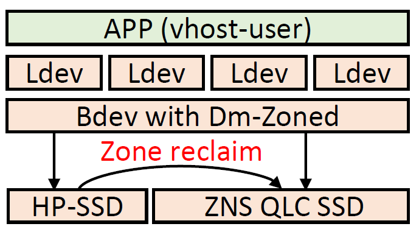{fig-align=center}

- Linux dm-zoned to manage mapping tables in the host
- a series of random zones backed by HP-SSD
- a series of sequential zones backed by ZNS-SSD
- Seq writes directly go to sequential zones
- Random write first go to random zones, later migrated to sequential zones in bulk (an entire zone).

### Analysis of Attemp 3 ZNS-based Solution

{fig-align=center}

- Small sequential writes can be merged in write-back cache solution
- Directly appending large sequential writes to sequential zones avoid paying extra effort
- 10MB/s random write throughput
  - One-by-one zone migration design in Linux dm-zoned
  - Under high-pressure workloads, the dm-zoned would be constantly busy with migrating zones.

# Design

## Overview

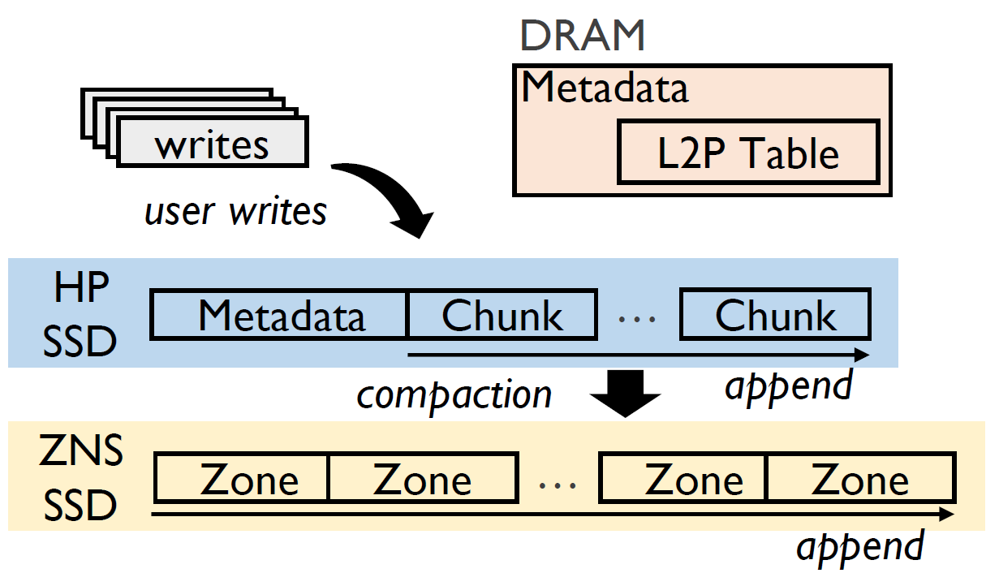{fig-align=center}

- Two-level L2P table for fine-grained address mapping on ZNS SSDs
- Fast and highly endurable SSD as a log-structured write cache to aggregate data and flush to underlying ZNS QLS SSDs
- Mapping page with 4KB granularity to alliviate device-level WA
- CSAL groups data with similar lifespans to QLC SSDsm reducing NAND-level WA

## Two-Level L2P table

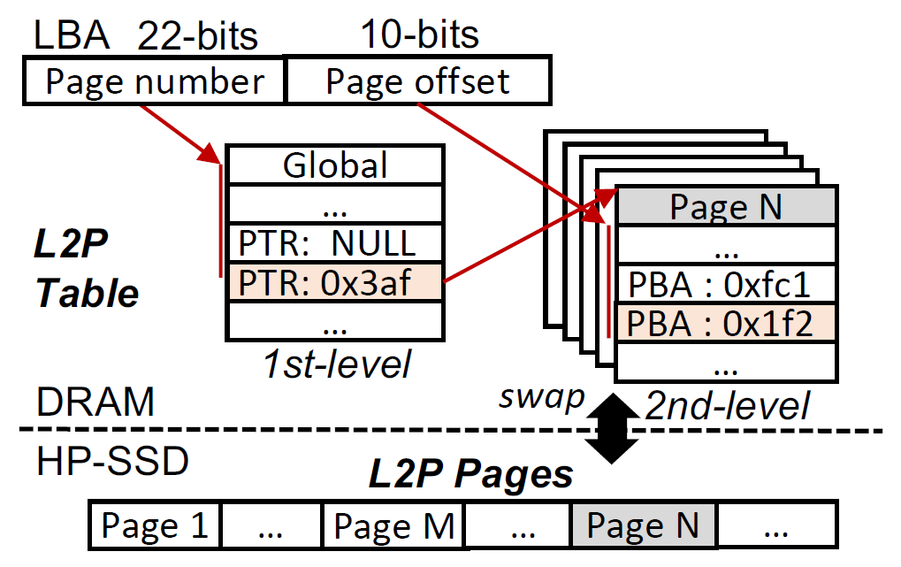{fig-align=center}

- A 16TB SSD requires 32MB first-level table and 16GB second-level tables.
- The first level table constantly resides in host memory.
- Second level tables are cached in memory (2GB).

## CSAL Data Flow

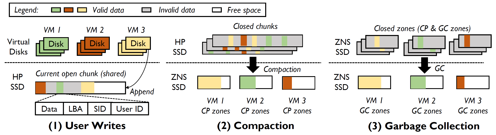{fig-align=center}

- **User writes**: append to current open chunk of log-structured write cache.
- **Compaction**: aggregate valid data by VMs and then flush to isolated zones of QLC.
- **Garbage collection**: reclaim zone spaces by VMs.

## On-disk Layout of HP-SSD

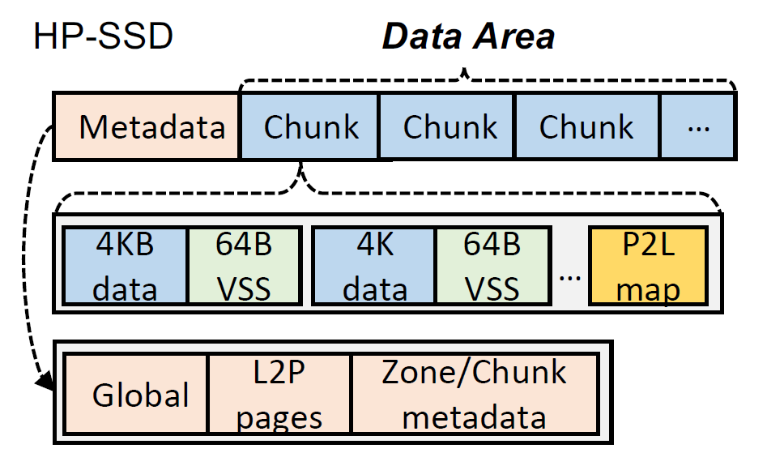{fig-align=center}

- VSS contains:
  - SID
  - Chunk status: open/close/free
  - LBA
- Only one chunk is open for write anytime

## Runtime metadata

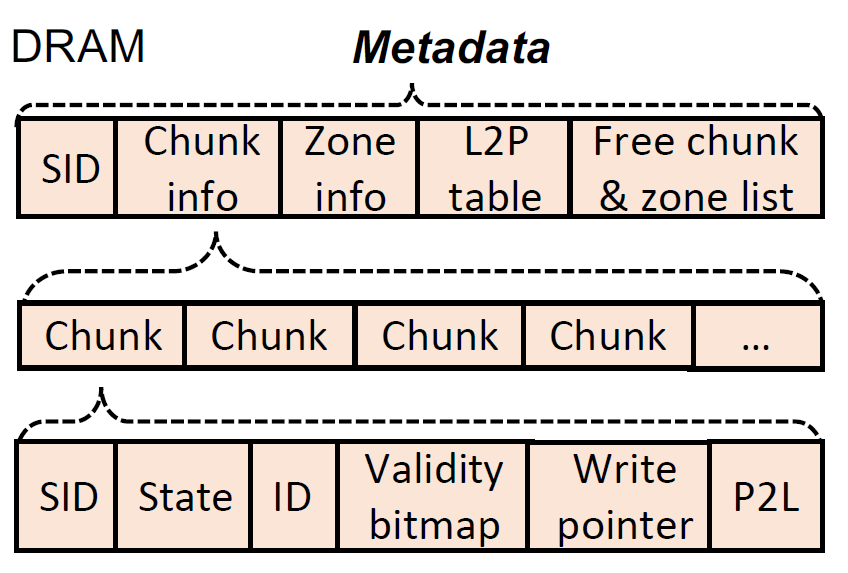{fig-align=center}

- Free chunk list
- Current open chunk's P2L to speedup compaction and crash recovery

## Crash consistency

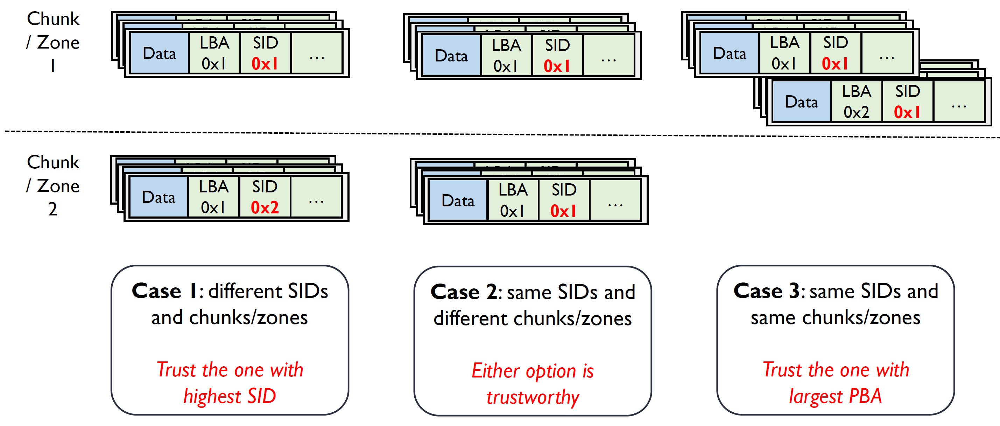{fig-align=center}

- Case 1: an earlier version in QLC SSD and an updated version in the open chunk of HP-SSD
- Case 2: crash during compaction
- Case 3: frequent updates on the same LBA

## Crash recovery optimization

1. P2L table after one chunk is filled up
2. Checkpoint

# Evaluation

## Environment Setup

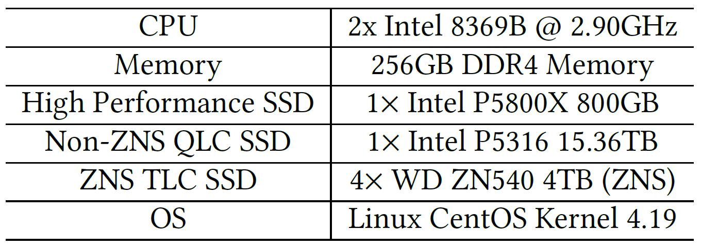{fig-align=center}

- Software:
  - 8 VMs, each owns one 2TB logical device
  - Hypervisor: QEMU + Vhost-NVMe
  - FIO
- Implementation:
  - Non-ZNS QLC SSD uses SPDK's zone bdev functionality
  - CSAL is implemented as a SPDK bdev
    - it has been merged into SPDK mainline

## Uniform Writes

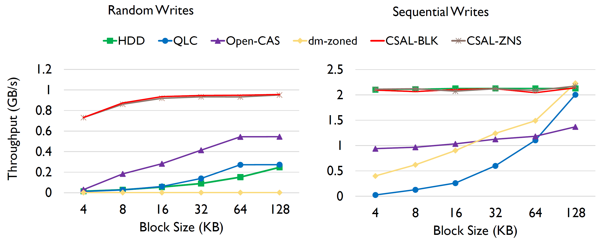{fig-align=center}

- Higher performance under random writes than all candidates.
- Comparable performance as HDDs under sequential writes.

## Skewed Writes

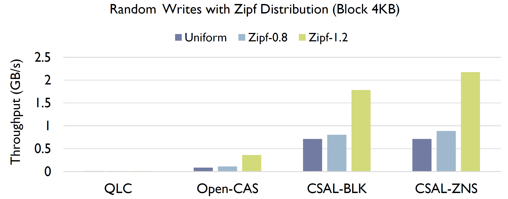{fig-align=center}

- Up to 6x higher performance compared to Open-CAS under Zipf 1.2 (heavy skewed).
- Open-CAS suffers performance loss due to large granularity of indirection units (64K).

## Write Amplification

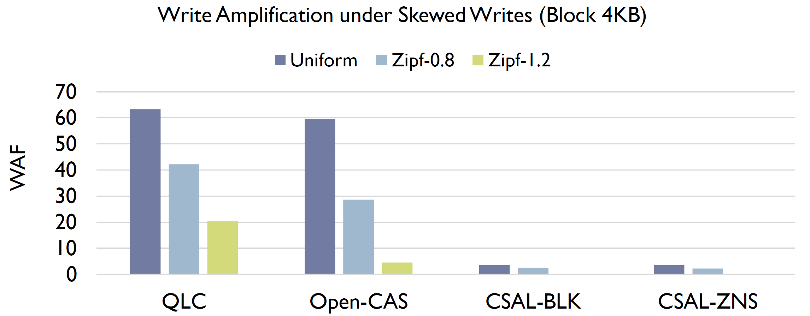{fig-align=center}

- More skewed distribution leads to less data flushed to underlying QLC.
- Raw QLC and Open-CAS are bounded by 64K indirection units (device-level WA).
