# Background & Motivation

## Kernel scheduling matters

- **Performance**
  - Fair share
  - Priority
    - Latency-sensitive: key-value store
    - Throughput-oriented: video rendering
- **Security**
  - Two threads from different tenants on different physical cores
- **System Stability**
  - run system daemons periodically

## Difficulties

### Implementing schedulers is hard

- Programming in kernel
- Complicated synchronization (RCU, atomics, etc.)
- Hard to debug
- Stability
- Maintenance
- Manually port to new kernels or upstream to Linux
- Slow to upgrade production machines (reboot required)

### Deploying schedulers is even harder

Deploying changes to scheduling policy requires deploying a new kernel across a large fleet.

- Cloud providers will make frequent changes to fix bugs and tune performance
  - not tolerated

### Custom scheduler/data plane OS perworkload is impractical

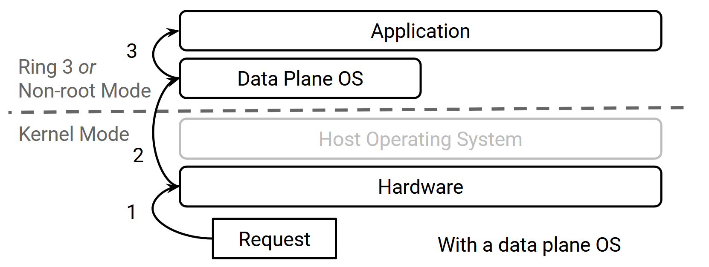{fig-align=center}

- Need a data plane OS for every app and scheduling policy
  - Not feasible in a shared cloud environment
  - Far from production

### Custom scheduling via eBPF is insufficient

- BPF program has limited expressiveness
  - BPF verifier must be able to determine that loops will exit
  - limited accessible kernel data structures
  - floats are not allowed
- BPF program runs synchronously
  - must react quickly to scheduling events
  - cannot make decisions later

### Different scheduling policies for different applications and platforms

- Need to modify scheduling policy quickly
  - New classes of workloads
    - low-latency workloads
    - throughput-oriented workloads
  - Different platforms
    - NUMA nodes, AMD CCX or many-cores
  - Need to get the upgraded polices onto machines quickly

### Offers flexibility in policy only at a per-CPU level

- Linux constains policies to the per-CPU level (per-core level)
  - Doesn't support cross-core or cross-policy scheduling
- Need centralized models
  - Work-conserving policies for microsecond-scale workloads
- Need per-socket models
  - Per-NUMA-node
  - Per-CCX
- Support multiple tenants

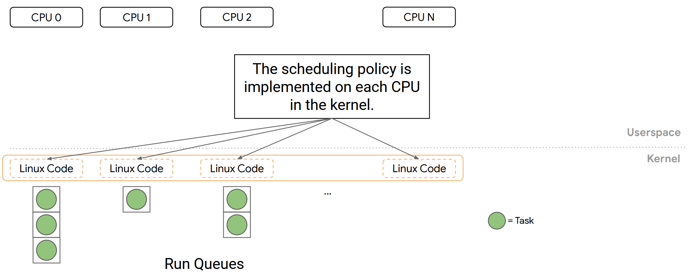{fig-align=center}

### Offers flexibility in policy only at a per-CPU level

- Linux constains policies to the per-CPU level (per-core level)
  - Doesn't support cross-core or cross-policy scheduling
- Need centralized models
  - Work-conserving policies for microsecond-scale workloads
- Need per-socket models
  - Per-NUMA-node
  - Per-CCX
- Support multiple tenants

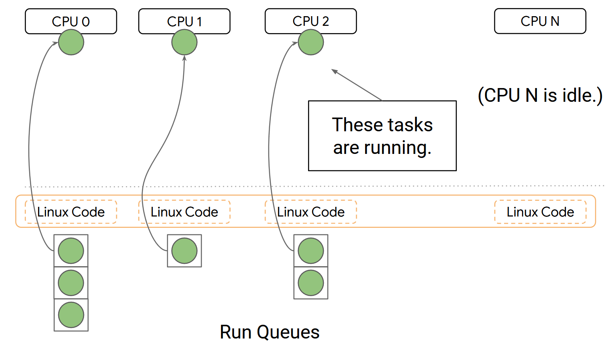{fig-align=center}

## Design Goals

- Easy to implement policies and port across machines
- Optimize policies for a wide variety of targets
- Scheduling decision delegation
- Composition and partitioning
- Non-disruptive updates

# Design of ghOSt

- Runs scheduling policies in a userspace process
- Fast and flexible abstractions
- Supports a variety of scheduling policies
  - μs-scale workloads
  - Co-locate latency-sensitive apps with batch apps
  - Multi-tenant workloads
  - Centralized, partitioned, and per-CPU policies
- Upgrades are quick -- only a process restart required

## Overview

- Linux kernel scheduling class
- All scheduling policy runs in a **userspace process (agent)**
  - policies can be written in any language and debugged by standard tools.
  - ghOSt exposes thread state to the agents via *messages* and *status word*.
  - Agents instructs kernel on scheduling decisions via *transactions* and system calls.
  - In case of agents crash, the system falls back to default scheduling.
- The userspace process receives notifications about key events
  - E.g., task block, task yield, CPU timer tick, etc.
- Scheduling decisions committed to the kernel via transactions

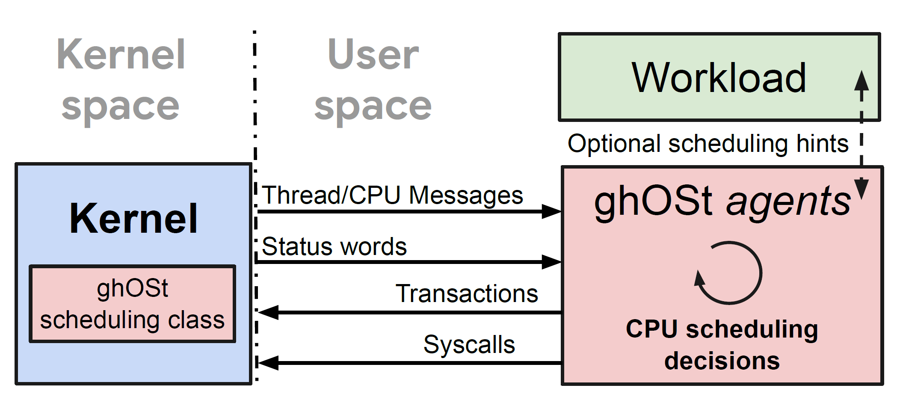{fig-align=center}

## Example 1: per-CPU scheduling

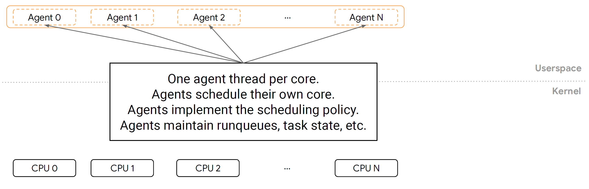{fig-align=center}

## Example 1: per-CPU scheduling

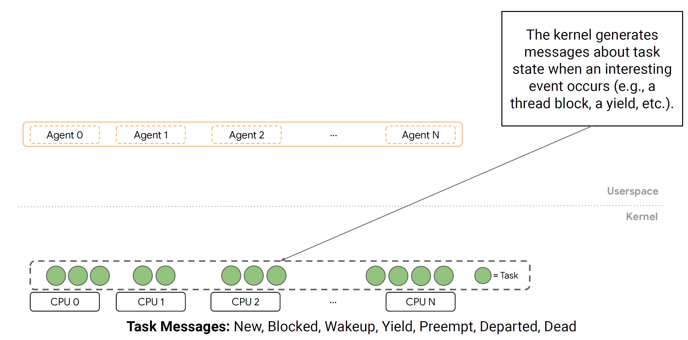{fig-align=center}

## Example 1: per-CPU scheduling

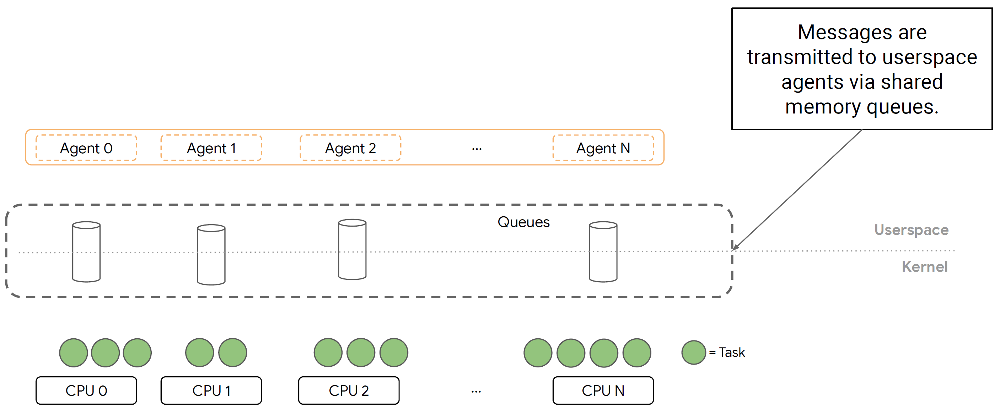{fig-align=center}

## Example 1: per-CPU scheduling

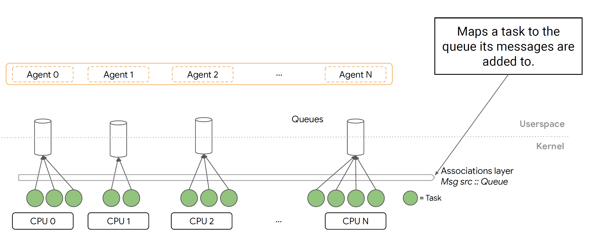{fig-align=center}

## Example 1: per-CPU scheduling

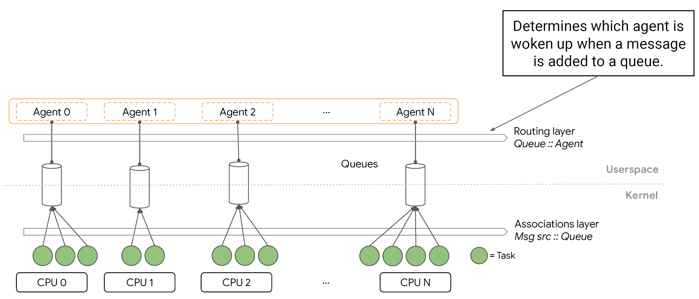{fig-align=center}

## Example 1: per-CPU scheduling

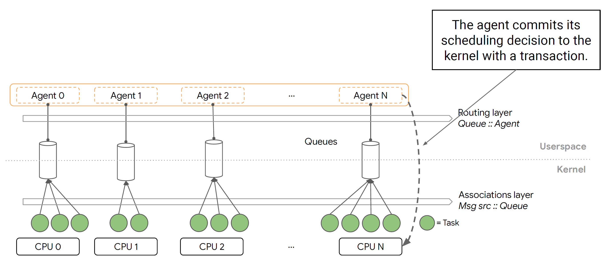{fig-align=center}

## Example 2: centralized scheduling

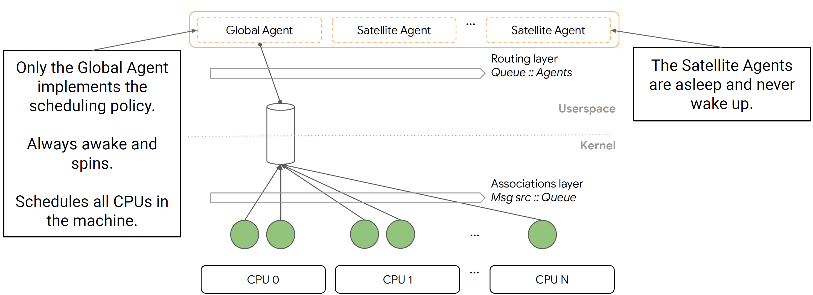{fig-align=center}

## Kernel-to-Agent Communications

### Exposing thread state to the agents

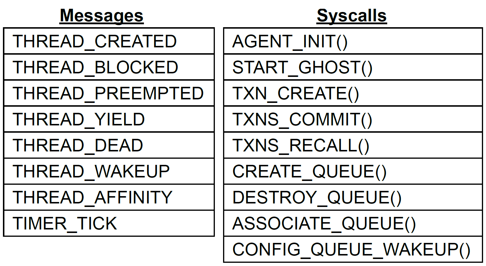{fig-align=center}

- Messages are delivered to agents via shared memory message queues
- Each thread scheduled under ghOSt is assigned to a single queue
  - Messages about the thread's state changes are sent to that queue
- Thread-to-queue assignment can be changed at any time
  - Threads without explicit queue assignment fall back to default queue

### Queue-to-agent association

- Queue-to-agent association is flexible
  - can be changed any time via ASSOCIATE_QUEUE()
- Multiple message listening mode
  - Wake-up: a queue can be configured to wakeup associated agents when messages are produced
  - Poll: agents can consistently poll the queue

### Synchronizing agents with the kernel

- While the agent is making decision, new messages may arrive which could change the decision.
  - Each thread has a *sequence number*
  - When a message of the thread is generated, the sequence number is incremented and included in the message.
  - The agent commits its decision to kernel via *transactions*, which includes the most recent sequence number.
  - The kernel compares the sequence number. Outdated transactions fail.

# Evaluation

## Environment Setup

- 2-socket Intel Xeon Platinum 8173M, 28-cores per socket
- Linux 4.15
- 383GB DRAM
- 100Gbps NIC

## Microbenchmark

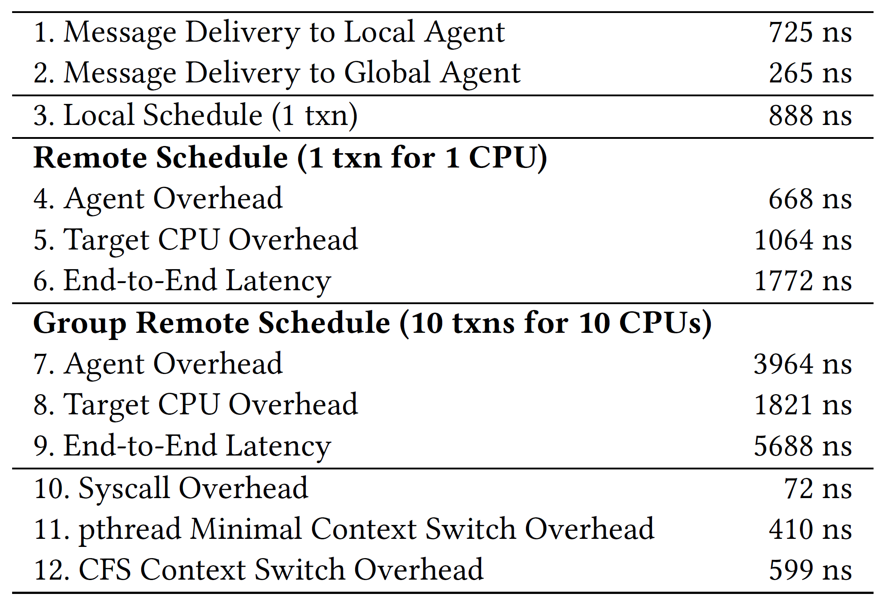{fig-align=center}

- ghOSt overhead breakdown:
  - Message delivery overhead: Line 1-2
  - Scheduling overhead
    - Local scheduling (per-CPU policy): Line 3
    - Remote scheduling (centrialized policy): Line 4-9
  - Syscall overhead: Line 10
- original Linux scheduler overhead:
  - pthread context switch: Line 11
  - CFS context switch: Line 12

## End-to-End Latency: Google Snap

- Snap is a packet processing framework:
  - One main polling thread that processes network traffic
  - Additional worker threads are spawned as needed when traffic increases
- 1 server and 6 clients
  - 5 clients send 64KB packets, one client sends 64B packets to the server
  - the server replies each a symmetrically sized packet
  - 10K packets per second per client
- Benchmarks
  - MicroQ: a microsecond-scale read-time linux scheduler
  - ghOSt: centralized FIFO scheduling policy

## End-to-End Latency: Google Snap

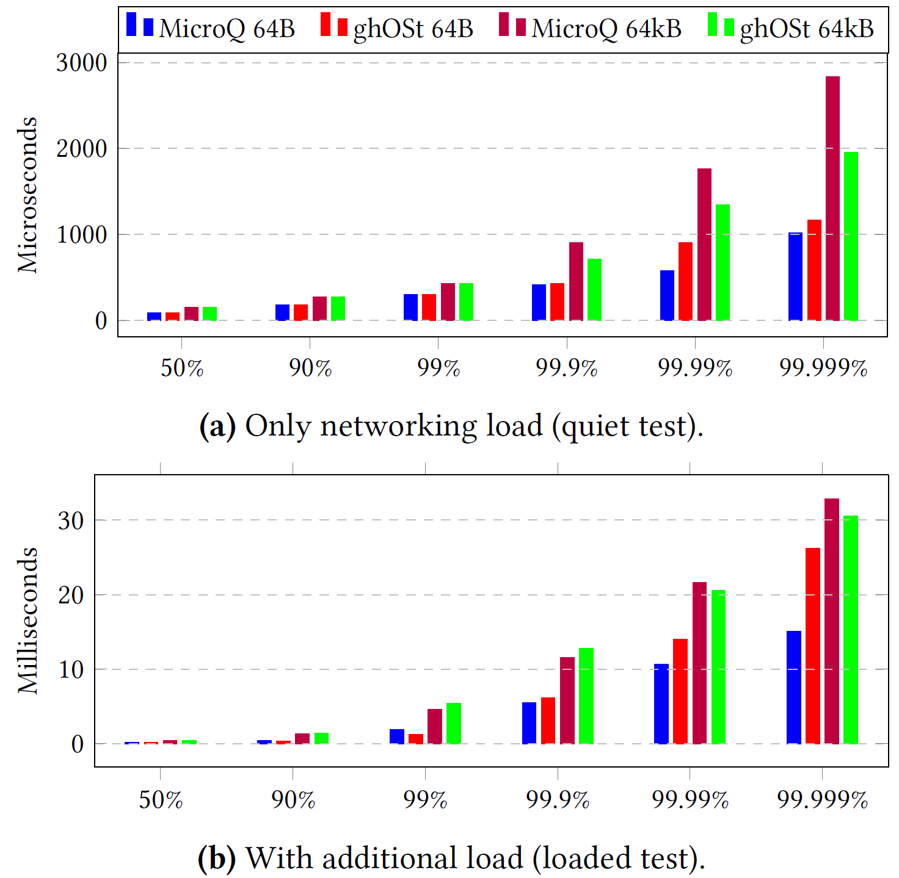{fig-align=center}
