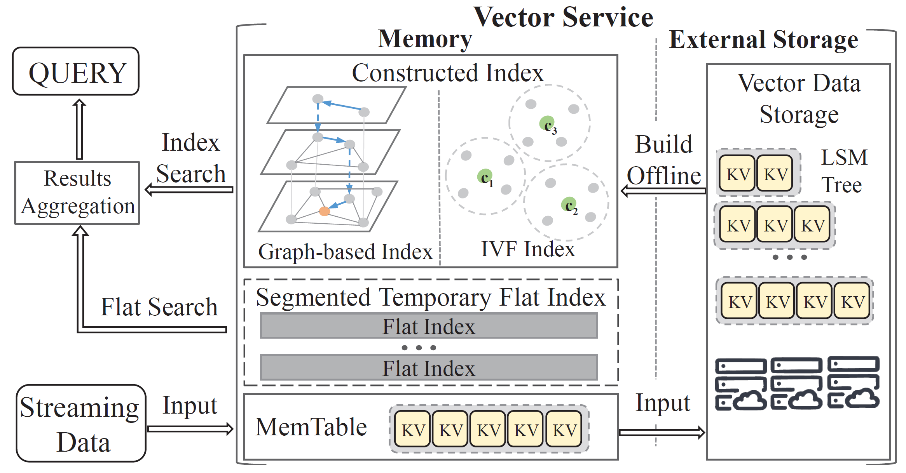
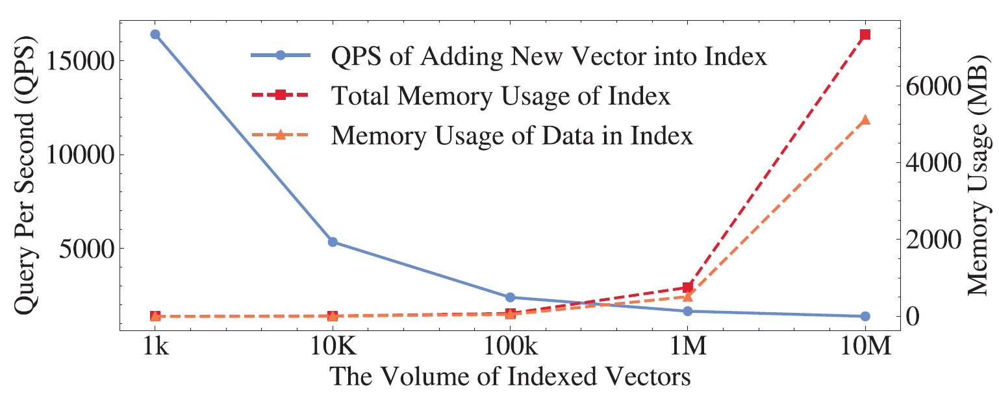
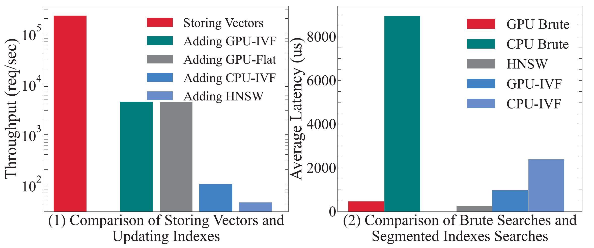
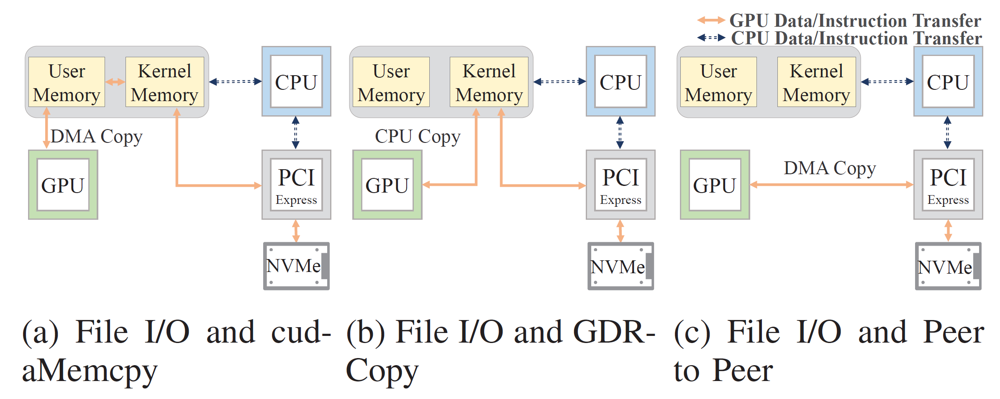
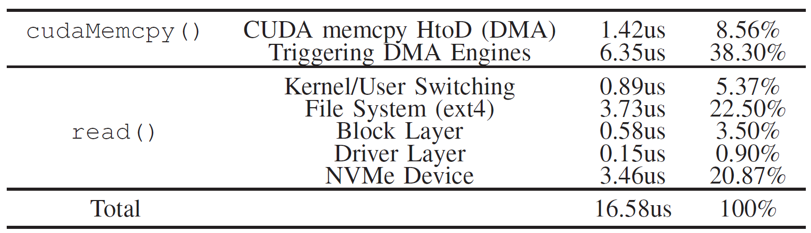
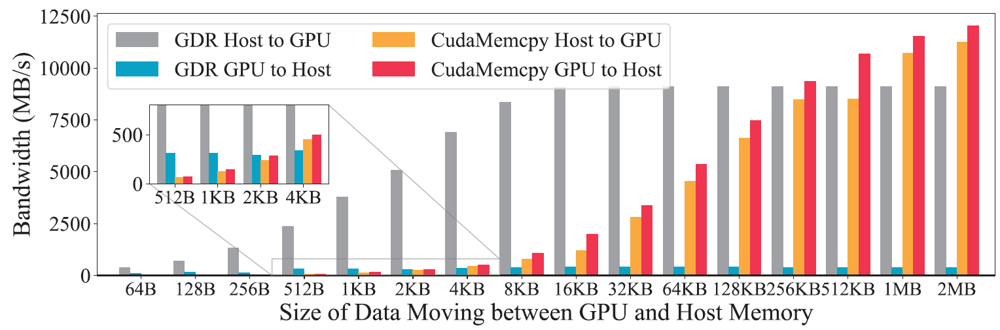
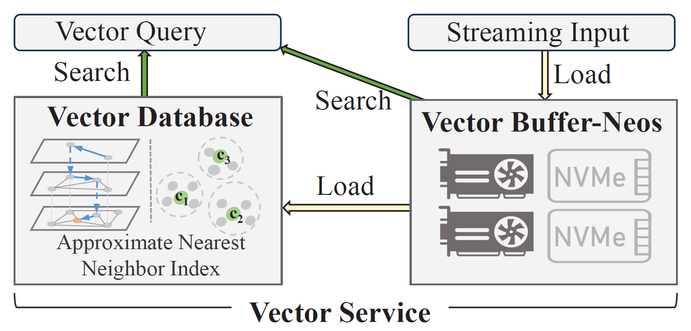
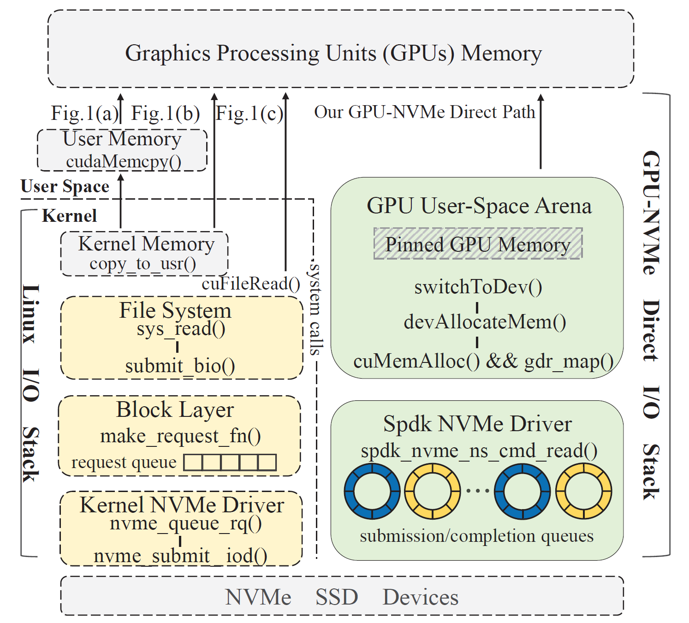

# Background and Motivation

## Low-Latency Online Vector Service: the status

**ANN indexes cannot be maintained effectively in real time when new vectors are being added constantly.**

- Vectors cannot be retreived before being indexed.
  - Updating indexes immediately **reduces throughput**.
  - Build temporary indexes then batch updating offline **hurts freshness and accuracy**.
- To achieve low-latency search, most of vector DBs store indexes and entity data in-memory.
  - Substantial memory is needed.
  - Streaming new data could occupy the memory => use high performance SSDs to mitigate performance bottleneck
- Vector Search on GPUs
  - Faster computation
  - Lower memory capacity 

## Vector Service

{fig-align=center}

- In-memory vector index constructed offline that supports efficient searching algorithm.
- Streaming new data without index, searched inefficiently (flat search)

### Updating contructed index

{fig-align=center}

- Quickly dropped performance when updating index whenever new data arrive.
- Substantial memory requirement for keeping the index in-memory

### Temporary index for streaming new data

{fig-align=center}

- Two common methods can be employed for incremental streaming new data:
  - Constructing temporary index on new data
  - or, directly brute-force search without indexing

## I/O stacks between GPUs and NVMe SSDs

{fig-align=center}

- Traditional way: CPU-centric DMA copy
- GDR-Copy: CPU-centric PCIe read/write
- P2P: GPU-centric DMA copy

## I/O stacks between GPUs and NVMe SSDs

{fig-align=center}

- Traditional way: CPU-centric DMA copy
- GDR-Copy: CPU-centric PCIe read/write
- P2P: GPU-centric DMA copy

## I/O stacks between GPUs and NVMe SSDs

{fig-align=center}

- Traditional way: CPU-centric DMA copy
- GDR-Copy: CPU-centric PCIe read/write
- P2P: GPU-centric DMA copy

## GPU Direct I/O stack

- Control:File metadata management and IO commands are constructed on CPU-side.
  - Heavy Linux filesystem and IO stack
- Data transfer: Direct block IO between GPU and NVMe SSDs.

## Motivation of Vector Buffer

{fig-align=center}

- Support efficient searching on latest vectors before merging them into constructed index.
  - Neos provides results from latest vectors.
  - Vector databases provide results from merged data.

# Design of Neos

{fig-align=center}
