# Background and Motivation

## The number of cores is increasing.

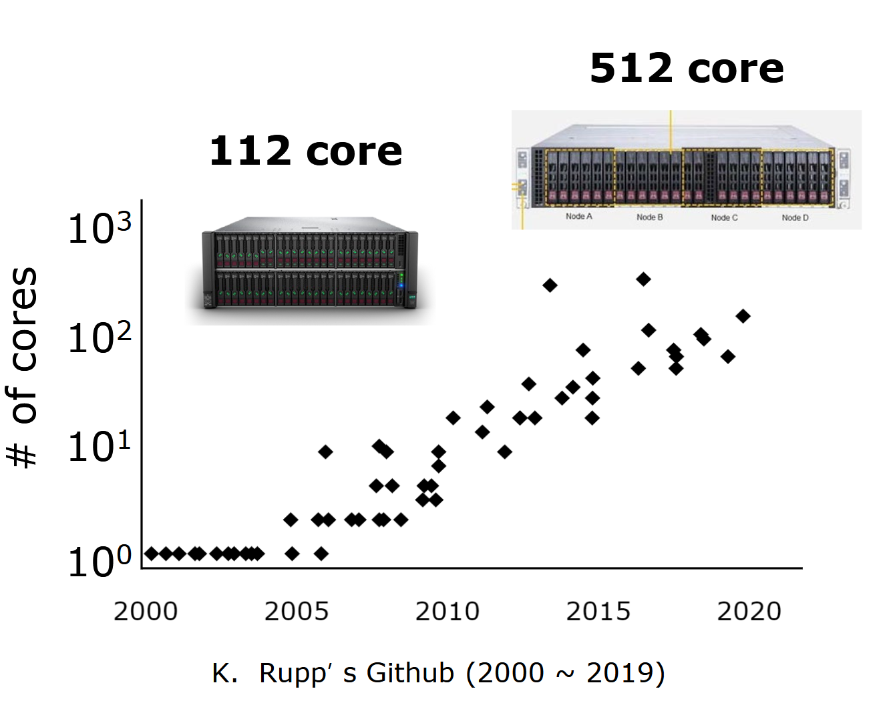{fig-align=center}

## The devices are getting faster and quicker.

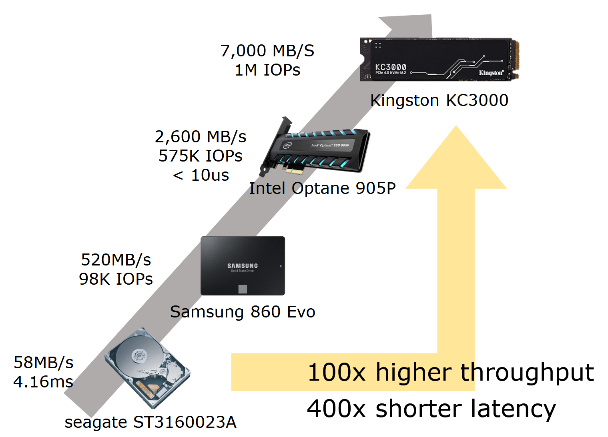{fig-align=center}

## XFS

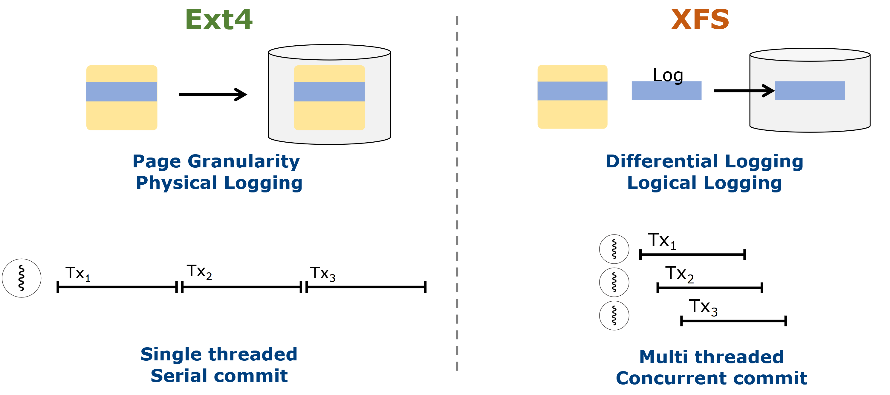{fig-align=center}

- XFS uses B+tree to manage free inodes, dentries.
- XFS adopts differential logging

## XFS: In-memory Logging

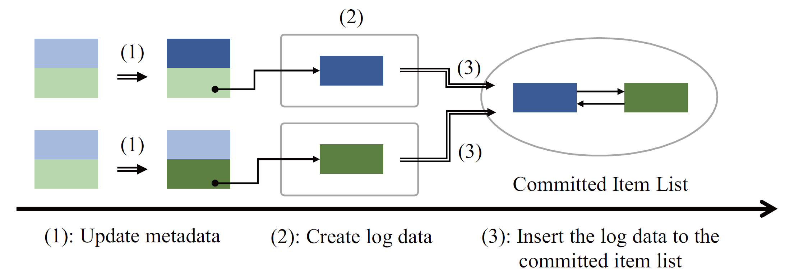{fig-align=center}

- The filesystem is responsible for two types of operations:
  - *In-memory Logging*: Updating the state of the in-memory filesystem
    - creat(), unlink()
  - *On-disk Logging*: Synchronizing the in-memory filesystem state to the disk
    - fsync()

## XFS: On-disk Logging

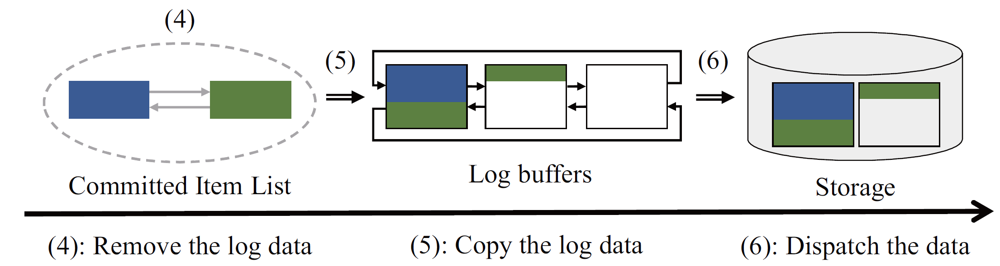{fig-align=center}

- The filesystem is responsible for two types of operations:
  - *In-memory Logging*: Updating the state of the in-memory filesystem
    - creat(), unlink()
  - *On-disk Logging*: Synchronizing the in-memory filesystem state to the disk
    - fsync()

## Differential Logging

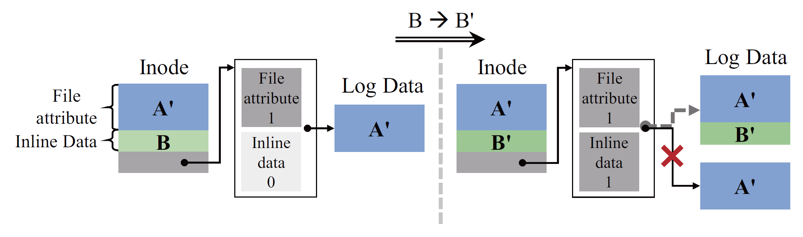{fig-align=center}

- Differential Logging allows multiple concurrent in-memory metadata updates.
- Each metadata update would end up with add/merging log data into log list
  - Acquiring a spin lock on log-list

## Scalability Analysis: Throughput

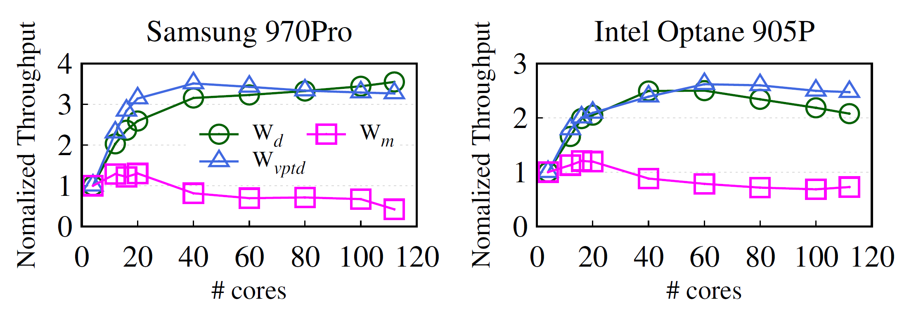{fig-align=center}

- Throughput is normalized against the throughput with 4 cores.

## Scalability Analysis: Latency

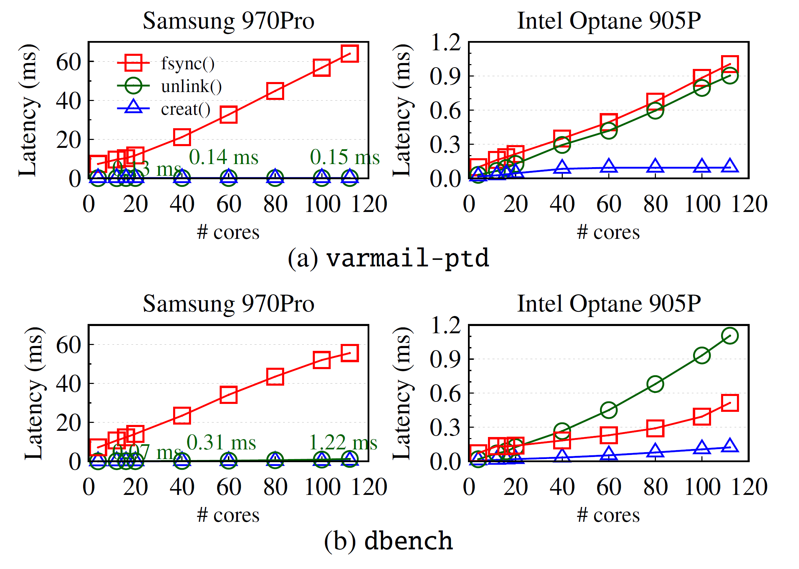{fig-align=center}

## Scalability Analysis: Lock waiting time

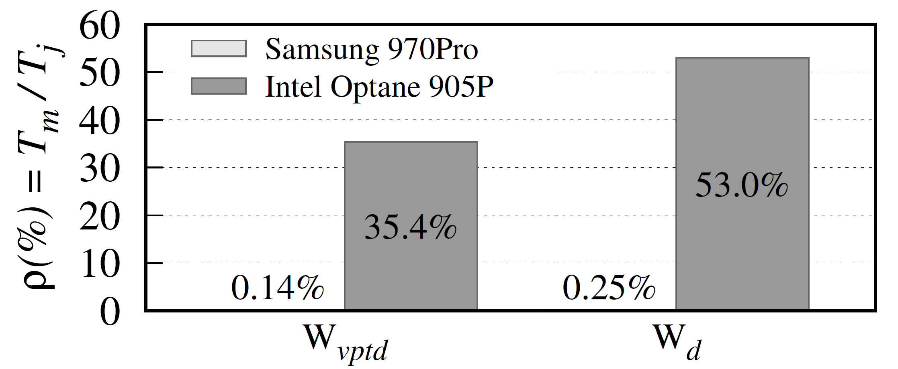{fig-align=center}

- As the performance of SSD improves, the in-memory logging becomes the bottleneck

## Scalability Analysis: Component Analysis

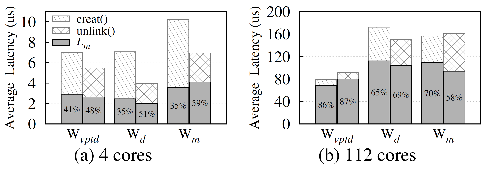{fig-align=center}

- In-memory logging begins to dominate the latency of metadata operations.

## Scalability Analysis: Component Analysis

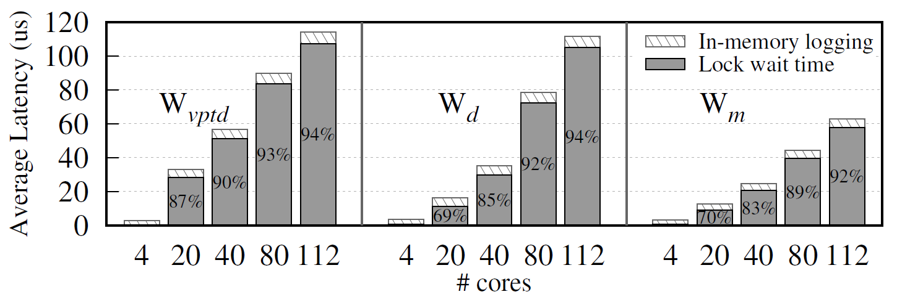{fig-align=center}

- In-memory logging begins to dominate the latency of metadata operations.
- Within in-memory logging, the overhead mainly comes from lock contention on log list.

## Contention on the Log List

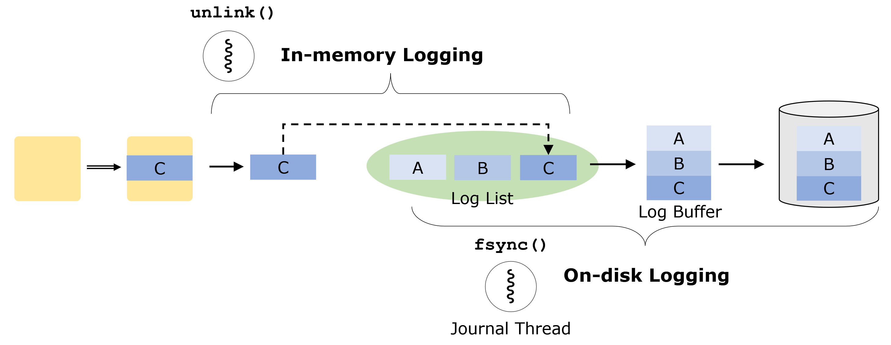{fig-align=center}

- Multiple concurrent in-memory metadata operations competes for the lock.
- In-memory logging contends with on-disk logging.

## Contention on the Log List

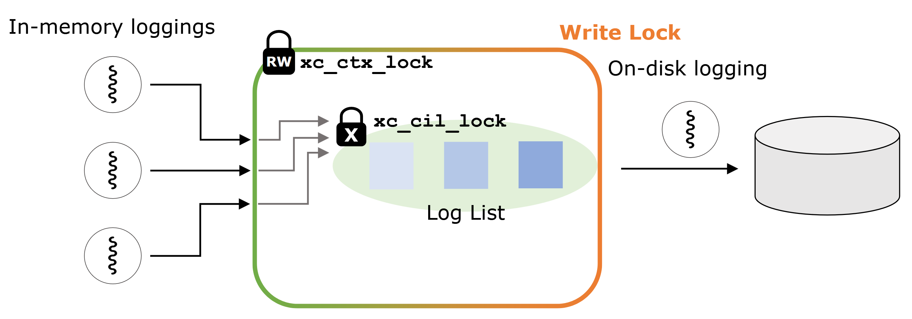{fig-align=center}

- In-memory logging threads use two locks.
  - Firstly acquire R-lock when checking
  - Then acquire X-lock when merging and inserting
- On-disk logging acquires W-lock when journaling

## Contention on the Log List

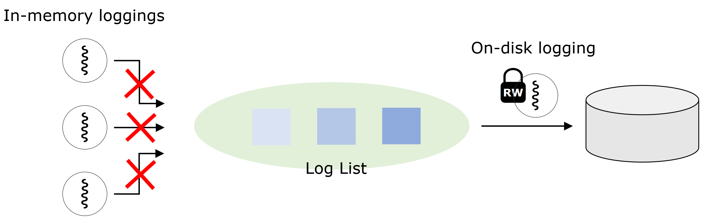{fig-align=center}

- When on-disk logging holds the write lock, **all in-memory loggings are blocked**.

## Contention on the Log List

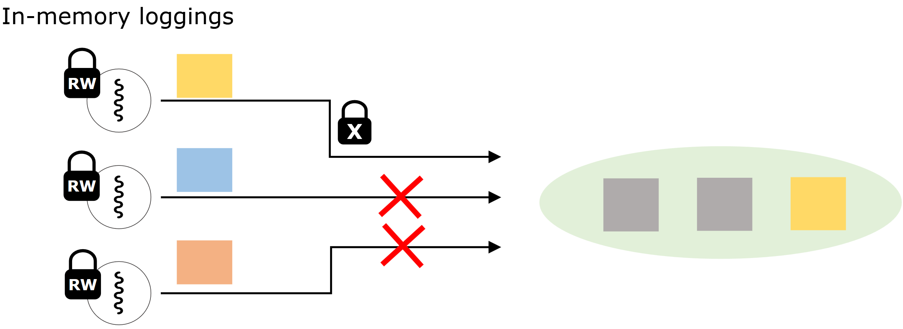{fig-align=center}

- Although in-memory loggings hold the R-lock, **the multiple in-memory loggings are serialized**.

# Design of ScaleXFS

## Double Log List

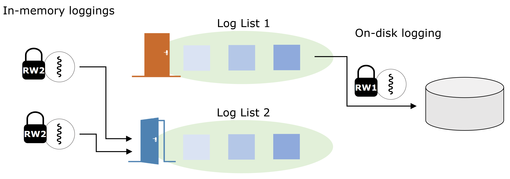{fig-align=center}

- When on-disk logging holds write lock on one list, the in-memory loggings access another available list.

## Per-core In-memory Logging

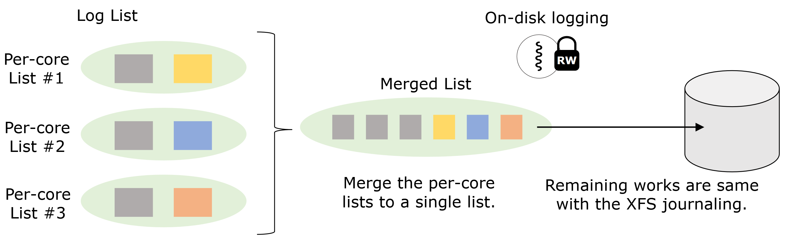{fig-align=center}

### Merging Mechanism

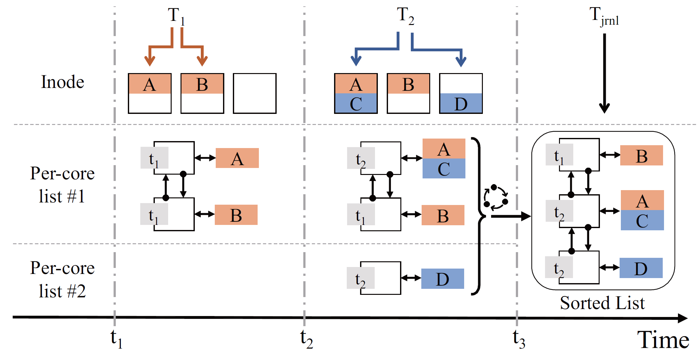{fig-align=center}

## Optimization: Strided Space Counting

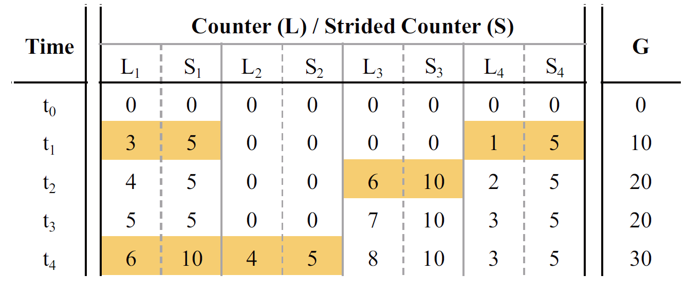{fig-align=center}

- A space counter is used in XFS to estimate the size of disk space to be occupied by the log list.
  - Protected by a global spinlock
- In ScaleXFS, per-core space counter (L) and per-core strided counter (S), global counter (G)

# Evaluation

## Environment Setup

- 4-sockets Intel Xeon Platinum 8276, 112 cores in total.
- 512GB DRAM
- NVMe SSD: Intel Optane 905P
- Baseline: XFS
- Scale-XFS:
  - S-XFS-D: double log list
  - S-XFS-DP: + per-core log list
  - S-XFS-DPS: + per-core strided space counter

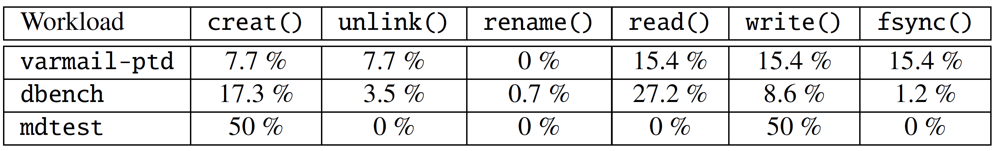{fig-align=center}

## Lock Contention

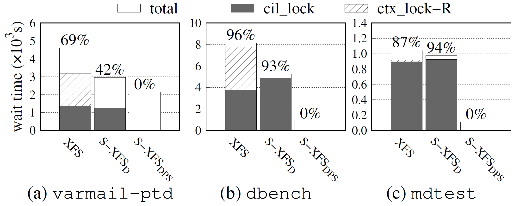{fig-align=center}

## Latency of create, unlink, fsync

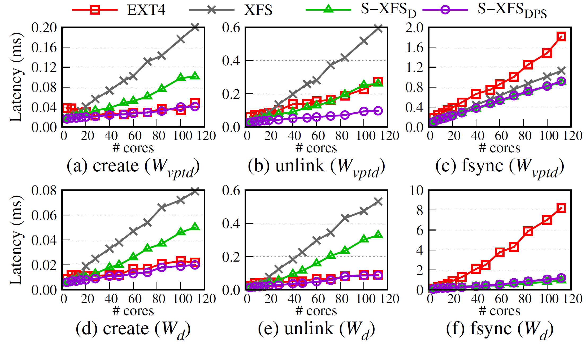{fig-align=center}

## Throughput

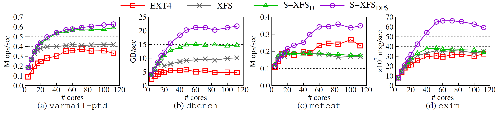{fig-align=center}
