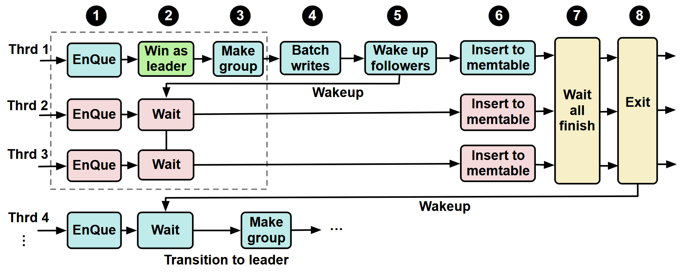
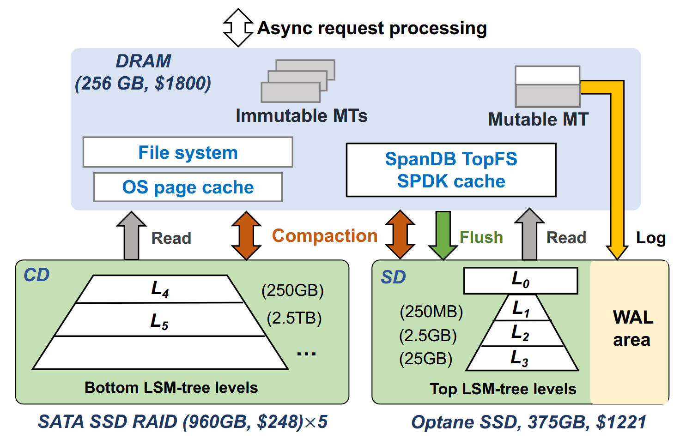
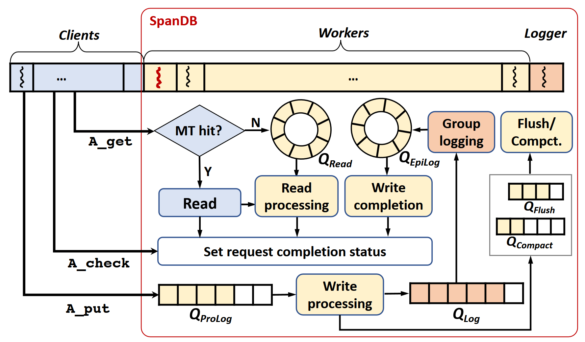
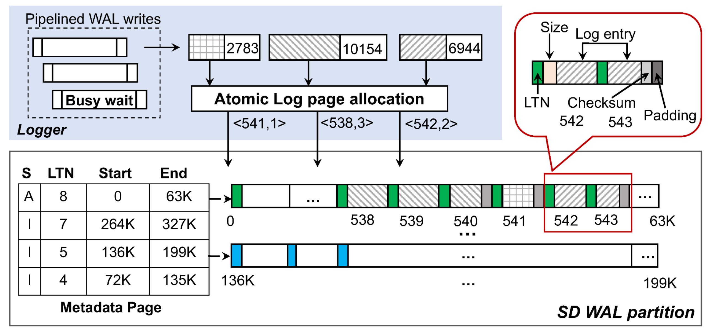
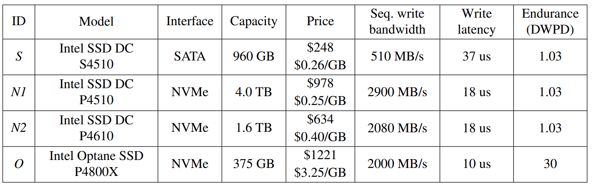
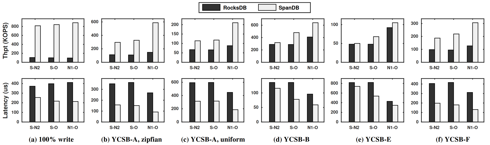

# Background & Motivation

## Performance-Cost Dilemma
- SATA SSDs or high-density NVMe SSDs
  - Low cost (0.26$/GB)
  - Limited performance
- High performance NVMe SSDs
  - motivate new KV designs to make use of ultra-low latency and high bandwidth.
  - High cost (3.24$/GB)
  - Considerable investment to migrate to new data layout
    - SPDK

## Group WAL Writes are sequential

{fig-align=center}

- Group WAL is commonly used to offer better write performance on slow drives by promoting sequential writes
- Group WAL is serialized in existing systems
  - Bad for low-latency SSDs
  - synchronization contributes to \>80% of WAL latency on Optane SSDs

## Goals

- **Cost-effectiveness**: coupling small, fast devices with larger, slower ones
- **Full utilization of fast device**: latency, bandwidth, and capacity
- **Compatibility**: enhancing widely used RocksDB, no new data structures

# Design

## System Architectre

{fig-align=center}

* **Hybrid Storage**  
   - Speed Disk: WAL + Top LSM Levels (0-3)  
     - Read/Compaction => OS page cache + OS FS
   - Capacity Disk: Larger LSM Levels (4+)
     - Read/WAL/Compaction => TopFS => SPDK
     - TopFS is a lightweight shim FS

## Async Request Processing

{fig-align=center}

- Originally, synchronous request processing creates a thread for each request. => BAD
  - low core utilization
  - context-switching cost
- Four new queues: one for reads ($Q_{read}$), and three to break up writes ($Q_{ProLog}$, $Q_{Log}$ and $Q_{EpiLog}$).

## Parallel WAL with SPDK

{fig-align=center}

- Each logger grabs all requests in $Q_{Log}$ and aggregates these WAL entries.
- WAL writes to log area on raw device via SPDK
  - **Concurrent**:
    - Atomic log page allocation
    - better NVMe SSD utilization
  - **Pipelined**: steal SPDK polling time for checking/preparing others.
  - Additional metadata management for consistency without FS
- When MemTable is flushed, current log page group is closed, a new group is created.

# Evaluation

## Environment Setup

- Platform:
  - Intel Xeon Gold 6248 20-cores X2.
  - 256GB memory
  - 4 types of data center storage devices
    - S: 4+1 RAID

{fig-align=center}

## YCSB v.s. RocksDB

{fig-align=center}

- RocksDB: WAL on SD (but via OS FS)
- Full write: up to 8x higher IOPS, 2x lower latency
- 5:5 RW: 4x higher IOPS, 3x lower latency
