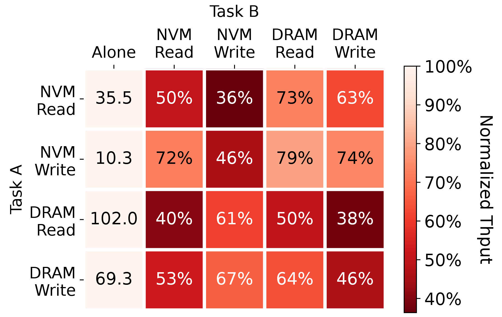
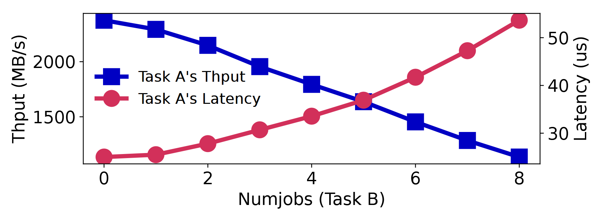
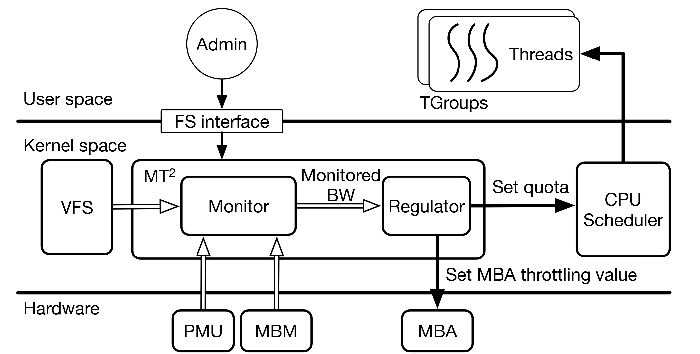
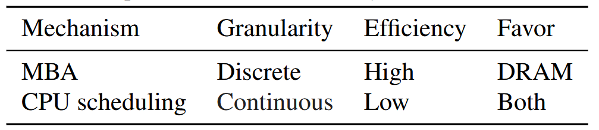
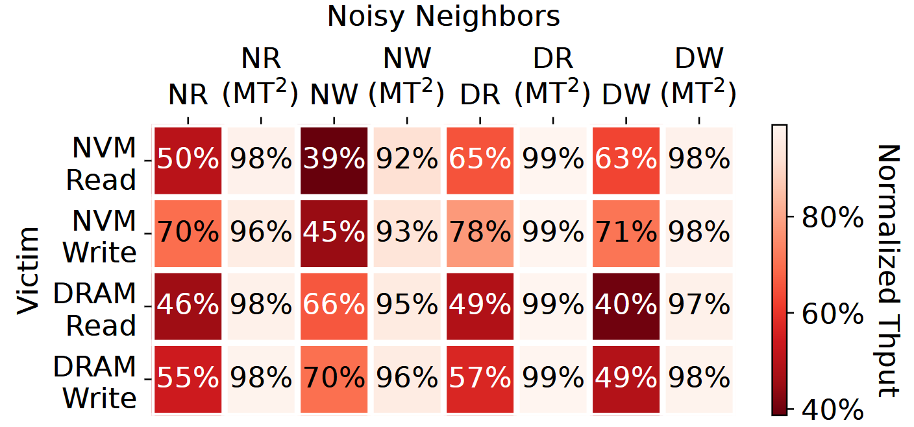
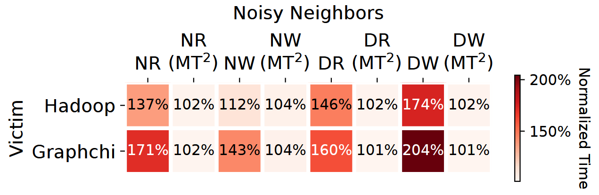
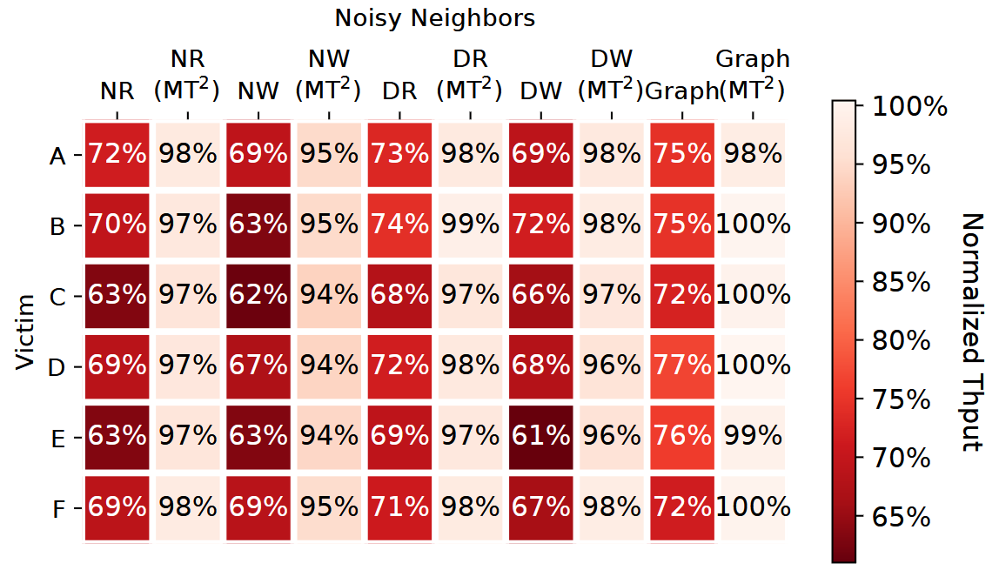

# Background & Motivation

## Memory Interference Problem

- Multi-tenant environment: VMs, applications or containers of different users share the same memory bus.
- Concurrent memory accesses from different tenants interfere others.
- "Noisy neighbors": memory-intensive applications

## Memory bandwidth throttling (regulation)

- **Intel Memory Bandwidth Monitoring (MBM)**
  - Monitor bandwidth from L3 cache to next level of memory hierarchy
  - A group of logical cores can be assigned with a resource monitoring ID (RMID)
  - The tracked bandwidth information is recorded in special registers (MSRs).

- **Intel Memory Bandwidth Allocation (MBA)**
  - MBA provides approximate control over memory bandwidth with negligible overhead.
  - A configurable rate limiter between each physical core and the L3 cache.
  - By setting the delays inserted to memory requests

## New challenges on hybrid NVM/DRAM platforms

- **Memory bandwidth asymmetry**
  - Differet memory access types yield different maximum bandwidth. (DRAM reads, DRAM writes, NVM reads and NVM writes)
  - The actual available memory bandwidth heavily depends on the proportions of different kinds of memory accesses in the workload.
- **Different interference degree**
  - different types of memory accesses interfere with each other differently
- **Inadequate memory regulation mechanisms**
  - Existing methods work for DRAM-only platforms => available bandwidth is easy to estimate

## Analysis of memory interference on hybrid NVM/DRAM platforms

{fig-align=center}

- The impact of memory interference is closely related to the type of memory access.
- NVM accesses affect other tasks more severely than DRAM accesses.

## Analysis of memory interference on hybrid NVM/DRAM platforms

{fig-align=center}

- The impact of memory interference is closely related to the type of memory access.
- NVM accesses affect other tasks more severely than DRAM accesses.
- the memory access latency is negatively correlated to the bandwidth usage

# Design

## Overview of Memory Traffic Throttle (MT^2)

{fig-align=center}

- **TGroups**: Threads are grouped into Throttling Groups (TGroups) for monitoring and regulation, integrated into Linux cgroups.
- **Monitor and Regulator**:
  - **Monitor**: Collects data from various sources (PMU, MBM, VFS, modified PMDK) to estimate bandwidth per TGroup for four memory types: DRAM reads/writes and NVM reads/writes.
  - **Regulator**: Dynamically adjusts bandwidth using mechanisms like Intel MBA and CPU scheduling.

## Bandwidth Monitor

- **Read Bandwidth**: Uses PMU counters to track DRAM and NVM read accesses directly.
- **Write Bandwidth**:
  - **NVM Write**: user-space applications can write to NVM in only two ways
    - **file APIs (write)**: MT^2 hooks VFS to track writes to NVM.
    - **CPU store to memory-mapped files**: Applications report NVM writes via modified PMDK libraries.
  - **DRAM Write**: Intel Processor Event Based Sampling (PEBS)
- **Interference Detection**: Measures latency of memory accesses (reads via PMU queue metrics, writes via direct sampling) to detect contention, correlating latency spikes with bandwidth interference.

## Regulation Mechanisms

- **MBA (Memory Bandwidth Allocation)**: Throttles DRAM traffic via hardware-enforced delays but is ineffective for NVM.
- **CPU Scheduling**: Adjusts \#CPU cores assign to the applications via cgroups to limit compute and memory access time, effective for both NVM and DRAM but less efficient than MBA.

{fig-align=center}

## Regulation Mechanisms

- **Dynamic Throttling Algorithm**:
  - **Step 1: Identifying Noisy Neighbors**
     * **Priority-Based Selection (Disruption degree)**: NVM writes, NVM reads, then DRAM accesses.
     * **Detection Criteria**:
       * **Prevention Strategy**: TGroups exceeding administrator-set bandwidth caps are flagged.
       * **Remedy Strategy**: When system-wide interference is detected, the TGroup with the highest NVM write/read or DRAM usage is identified as the noisy neighbor.

## Regulation Mechanisms

- **Dynamic Throttling Algorithm**:
  - **Step 1: Identifying Noisy Neighbors**
  - **Step 2: Applying Throttling**
     * **For NVM Writes/Reads**: Use **CPU scheduling**
     * **For DRAM Accesses**: Use **MBA** to throttle DRAM bandwidth. If MBA is already at its lowest setting, CPU scheduling is applied as a fallback.

## Regulation Mechanisms

- **Dynamic Throttling Algorithm**:
  - **Step 1: Identifying Noisy Neighbors**
  - **Step 2: Applying Throttling**
  - **Step 3: Relaxing Restrictions**
    - Increase CPU quota
    - Increase MBA throttle value

# Evaluation

## Experiment Setup

- **Server**
  - Dual-socket 28-core Intel Xeon Gold 6238R CPUs.
  - Memory:
    - DRAM: 6×32 GB DDR4 per socket.
    - NVM: 6×128 GB Optane DC PM per socket (App Direct mode).
  - NUMA: cross-socket traffic is disabled
- **Workloads**
  - **Micro-benchmarks**:
    - **fio**: use `libpmem` for NVM access and `mmap` for DRAM.
  - **Real-World Applications**:
    - **Hadoop** and **GraphChi**: pagerank algorithm (81K nodes, 1.7M edges).
    - **RocksDB**: YCSB
    - **TailBench Workloads**: `img-dnn` (image classification) and `masstree` (KV store) for latency-critical scenarios.

## FIO

{fig-align=center}

## Hadoop & GraphChi

{fig-align=center}

## RocksDB

{fig-align=center}
