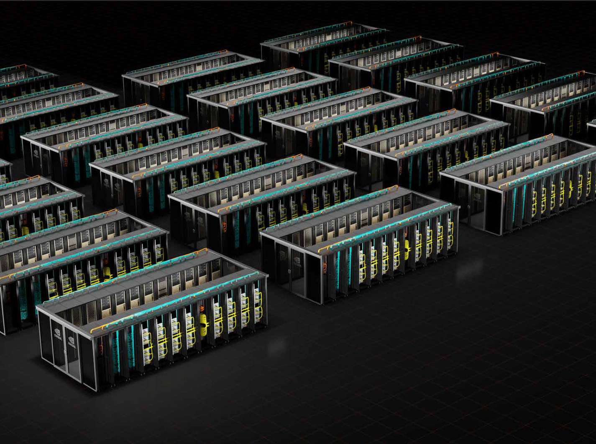
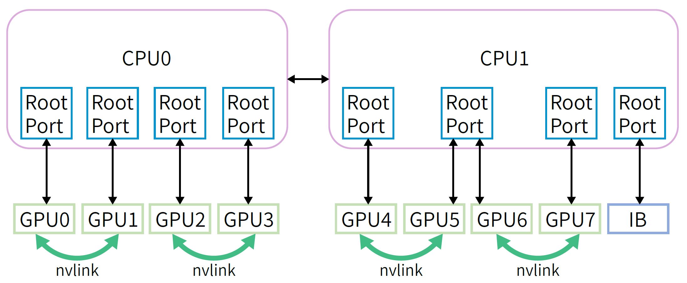
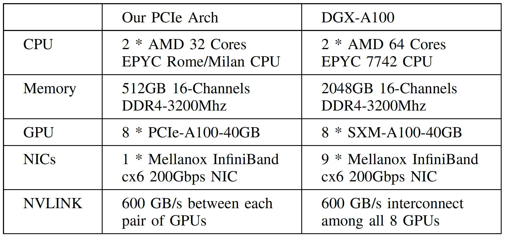
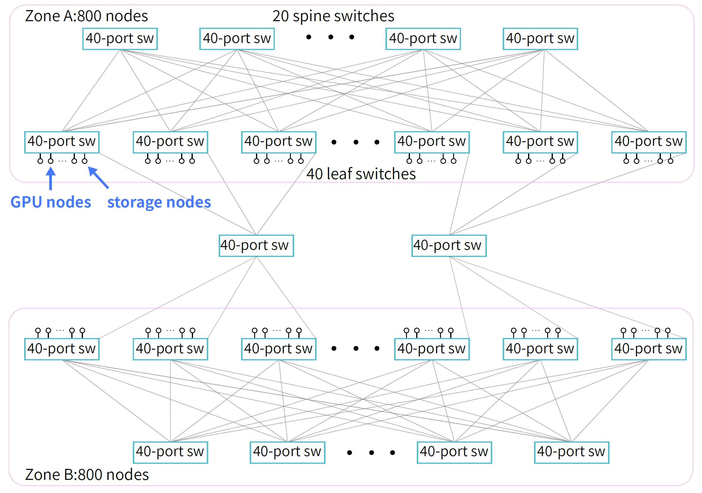
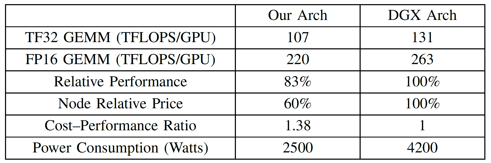
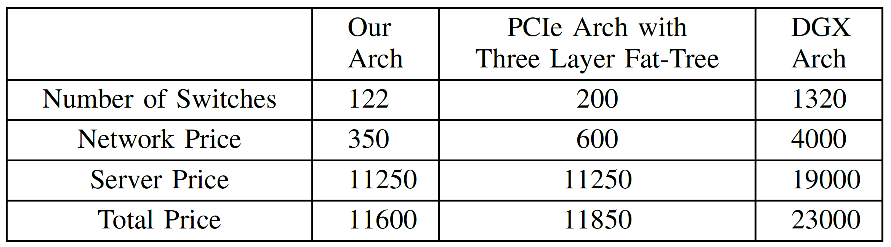
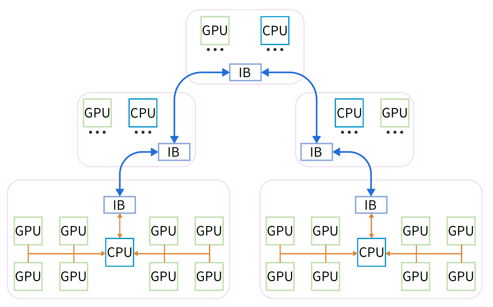
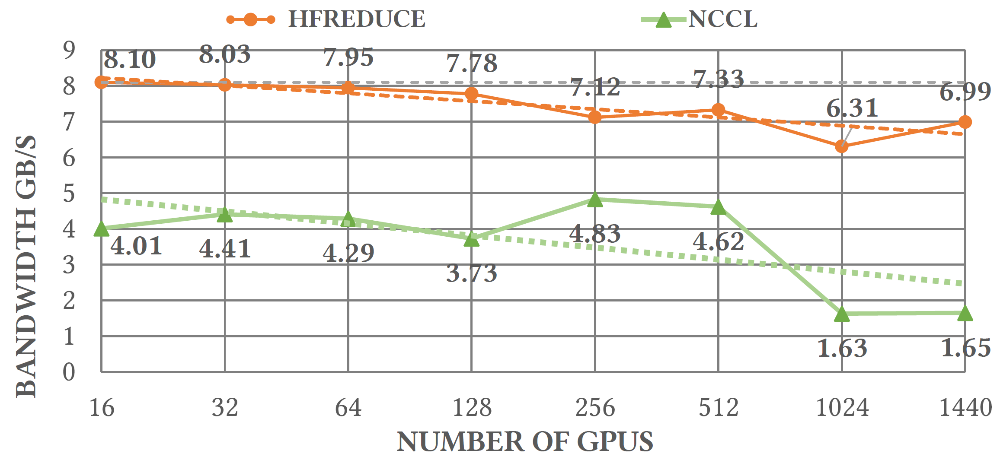
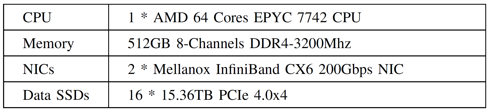

# Background & Motivation

## Challenges in Models Training

### Training Efficiency

- **Training a LLM demands thousands of GPUs and consumes substantial storage and network resources**
- **Achieving efficient training at massive magnitude is crucial**
   - **Communication**: training LLMs involves dividing models among GPUs that communicate extensively for progress.
   - **Operation optimization**
   - **Data pre-processing**
   - **GPU memory consumption**

### Training Stability

> Meta reported an average of one failure per 3 hours while training Llama 405B model on a cluster containing 16,384 H100 GPUs.

- Stability is vital from a production standpoint as training a big model with a trillion tokens may span several weeks.
- In DL training, stragglers and hardware failures are common occurrences.

## HPC and AI Clusters of This Era

1. *HPC Inadequacies for AI Training*: traditional supercomputers like TianHe-2A focus on FP64 calculation and doesn't support FP16.
2. *GPU based HPC*: GPU-based supercomputers like Frontier and Summit utilize highperformance GPUs to tackle large-scale computations.
   - High cost of specialized hardware
   - Low energy efficiency

## HPC and AI Clusters of This Era

3. *GPU Clusters of Large Companies*: AI clusters from Meta, ByteDance and NVIDIA usually adopt an architecture similar to DGX.
   - GPUs within each node are fully connected through NVLink switch.
   - Nodes within each rack are fully connected through IB switch.
   - Very high performance
   - Very high cost

{fig-align=center}

## HPC and AI Clusters of This Era

4. *AI DSA Clusters*: Google TPU cluster and Intel Habana Gaudi use accelerators highly tailored for efficient AI workloads.
   - Weak software ecosystem compared to the maturity of NVIDIA's offerings.
5. *Cloud Service Providers*: AWS and Azure offer flexible and scalable resources for AI training.
   - Significant accumulated cost: not good for long-term projects spanning around 2 years.

## Challenges in AI infra

- **Large-scale GPU cluster is needed**
  - Models are growing larger
  - Researchers often need to train multiple models simultaneously
- **Overall system construction cost**
  - TCO, power supply, cooling, networking, storage, disaster recovery
- **High-performance**

# Design

## Fire-Flyer 2 Cluster

### PCIe A100 Computation Node Architecture

{fig-align=center}

- 8 A100 PCIe GPUs and 1 CX6 IB NIC: directly connect to the CPU, without using a PCIe switch.
- IB NIC occupies a separate PCIe root complex, thus avoiding performance interference with the GPU.
- Use NVLink Bridge between each pair of GPUs instead of using NVLink switch

### PCIe A100 Computation Node Architecture

{fig-align=center}

- 8 A100 PCIe GPUs and 1 CX6 IB NIC: directly connect to the CPU, without using a PCIe switch.
- IB NIC occupies a separate PCIe root complex, thus avoiding performance interference with the GPU.
- Use NVLink Bridge between each pair of GPUs instead of using NVLink switch

### Network Topology: Two-Layer Fat-Tree with Storage and Computation Integrated

- 1250 compute nodes containing 10000 A100 GPUs
- 200 storage nodes
- **Fat-Tree topology** for high bisection bandwidth
- **Two-zone network with each zone two-Layer fat-tree** for lower cost
   - Less IB switches and less IB cables than a single-zone three-layer fat-tree

{fig-align=center}

### Cost Performance

{fig-align=center}

- 83\% performance of DGX
- 60\% GPU cost and energy consumption of DGX

### Cost Performance

{fig-align=center}

## HFReduce: Hardware-Software Co-Design in Network

- Allreduce operation is essential for aggregating gradients across GPUs.
- HFReduce is an allreduce library specially designed for Fire-Flyer 2.
  - Suitable for Fat-Tree topology
  - CPU
  - Small data transfer optimization
  - NUMA-awareness

### Overview of HFReduce

{fig-align=center}

1. Intra-node reduction
   1. HFReduce asynchronously transfers data to CPU memory (Device-To-Host, D2H)
   2. Upon arrival of data, HFReduce performs reduction add operation using CPU vector instructions
2. Inter-node reduction
   1. Double Binary Tree algorithm for inter-node allreduce using RDMA
   2. Finally, the CPU returns reduced gradients to GPU via PCIe (Host-To-Device, H2D)

### Optimizations of HFReduce

- H2D transfer: optimized by GDRCopy to write data to 4 GPUs at once within the same NUMA node.
  - GDRCopy allow GPUs to retrieve data from CPU caches without additional reads from host memory
- NUMA-awareness: D2H destination memory is interleaved across two NUMA nodes for maximum bandwidth
- Optimized CPU SIMD reduction computation for various data types FP32/FP16/BF16/FP8.

### Advantages of HFReduce over NCCL

1. **Reduced PCIe Bandwidth Consumption**
   - NCCL's ring reduction is not suitable for PCIe:
     - 2n-1 PCIe in-bound and 2n-1 PCIe out-bound transmissions
   - HFReduce only requires n-1 in-bound and out-bound PCIe transmissions
2. **No GPU Kernel Overhead**
   - NCCL's allreduce operation requires GPU kernel execution, which can affect other computational kernels on the GPU.
   - HFReduce uses GPU's Copy Engine for PCIe transfer and CPU for reduction computation.

### Reduce Performance

{fig-align=center}

### Bottlenecks of HFReduce

{fig-align=center}

- HFReduce achieves 8GB/s allreduce bandwidth, lower than the theoretical bandwidth of 13.3GB/s
- GPU5 and GPU6 share the same PCIe root complex port, sharing the PCIe bandwidth of 37GB/s compared to 54GB/s of other pairs

## HaiScale: Special Optimizations for DL Training

- HaiScale optimizes 4 kinds of parallelism
  - Data Parallel (DP)
  - Tensor Parallel (TP)
  - Pipeline Parallel (PP)
  - Expert Parallel (EP)
- TP is applied to each pair of NVLink-Bridged GPUs.
- DP is applied to 4 pairs of GPUs within each nod.
- PP is applied inter-node

## 3FS: High-Throughput Distributed File System

### 3FS components

{fig-align=center}

- 3FS is specially designed for Fire-Flyer 2 AI cluster to fully utilize the high IOPS and throughput of NVMe SSDs and the RDMA network.
  - **Cluster managers**: cluster configurations and sevice status
  - **Meta services**
    - File system meta data are stored in tables of a distributed key-value storage system.
    - Strong consistency
  - **Storage services**
    - Chain Replication with Apportioned Queries (CRAQ)
    - File content are split into chunks, which are replicated over a chain of *storage targets*.
    - A chain table maintained by meta services contains an ordered set of chains.
    - Fat-Tree topology
  - **Clients**
    - RDMA transfer

### 3FS-KV

- 3FS-KV is a shared-storage distributed data processing system built on top of 3FS
  - Supporting 3 access models: Key-Value, message queues and object storage.
  - KV context caching on disk

## HaiPlatform

- HaiPlatform is a time-sharing scheduling platform for cluster resource management for developers
- The developer write platform coding rules to ensure that is can be a interruptable task:
  - Accepting the interruption signal from the cluster;
  - Saving checkpoints (model parameters, optimizer states, KV cache, etc)
  - Ack to the cluster interruption
  - Recovering from checkpoint and continue to run

## Stability and Robustness

### Checkpoint Manager

- Training LLMs can span several months, during which unavoidable hardware failures may cause training interruptions.
- Checkpoint Manager for second-level saving and loading:
  - Parameters and optimization states are asynchronously transferred from GPU to CPU host memory
  - They are further divided into chunks and written to 3FS using the 3FS batch write API
  - During the saving process, each tensor is recorded with its index and the offset within the checkpoint for convenience of loading

### Validator

- An automatic validator program runs weekly on nodes to verify:
  - hardware frequency, link speed and status
  - CPU stress and memory bandwidth
  - GPU memory test
  - GEMM test
  - Allreduce test
  - Storage node stress test
