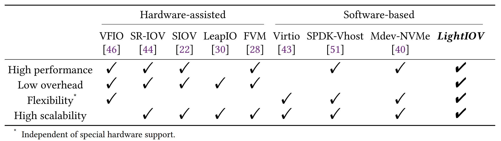
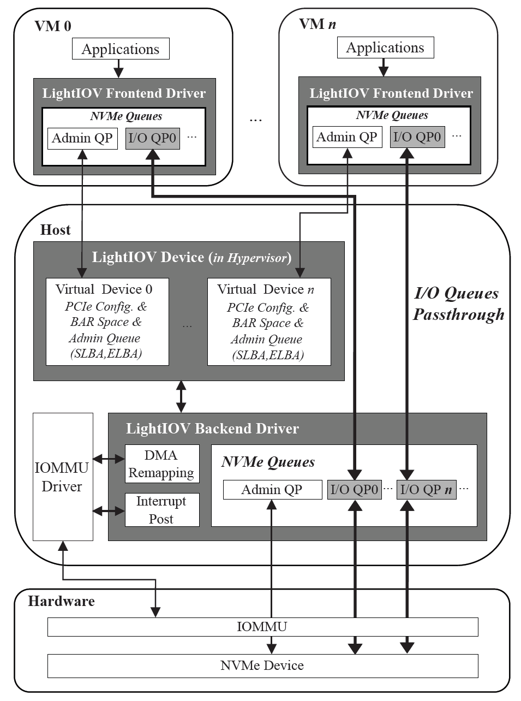
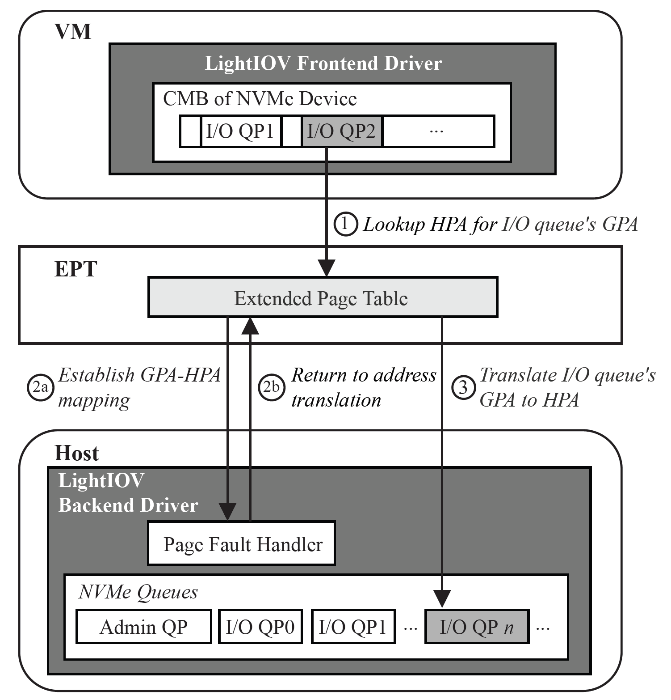
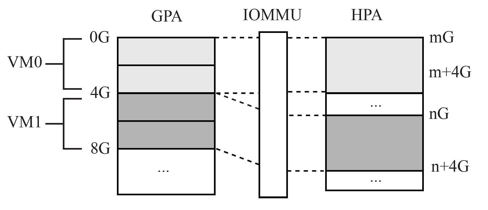
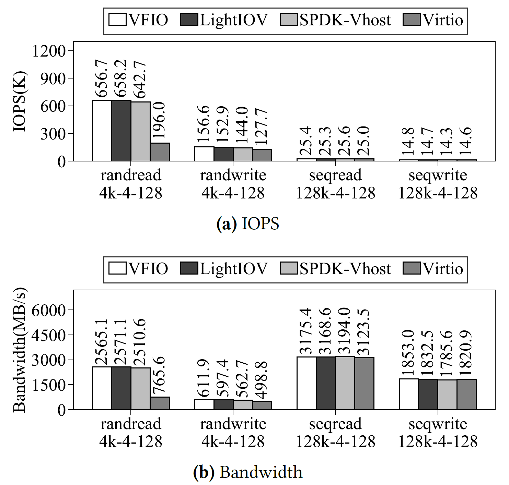
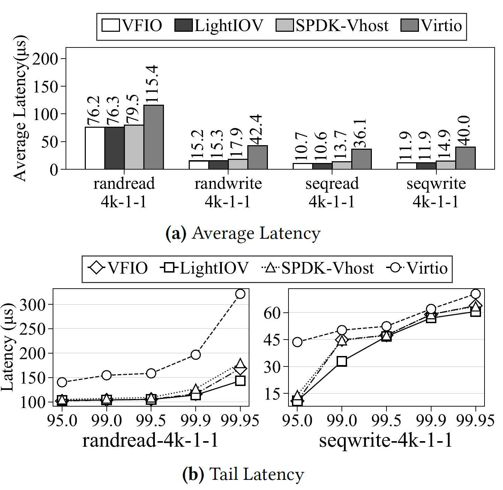
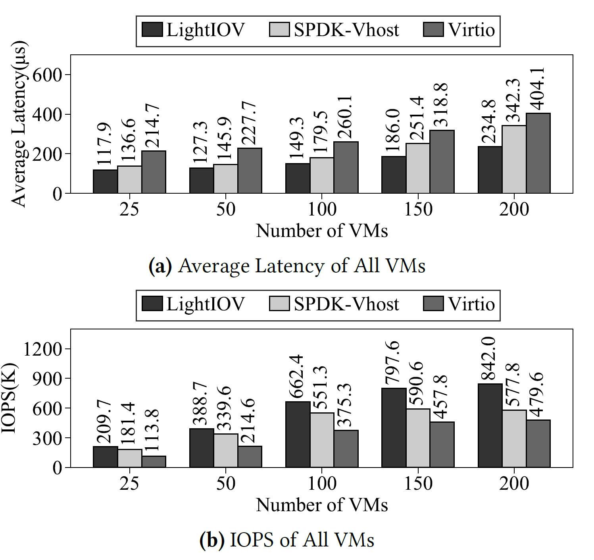

# Background & Motivation

## Why NVMe Virtualization

- Huge Capacity and its growing
- Deep queues and high parallelism
- Cost effective
- Predictable Reliability

## Goals of NVMe Virtulization

- High performance
- Low overhead
- Flexible
- High scalability

## Existing solutions face trade-offs

### Software-base solution

- **Full virtualization** (out-dated)
  - **High overhead** (CPU emulates storage devices)
  - No modification to guest OS kernel
- **Para virtualization** (widely used)
  - Modification to guest OS kernel
  - **Low performance**
  - virtio
    - a front-end driver in guest OS kernel and a backend driver in the hypervisor
    - communicate via shared memory (vring)
- **Polling-based virtualization**
  - **High overhead**
  - spdk-vhost
    - use dedicated CPU cores to poll virtual queues and device queues for high performance

### Hardware-assisted solution

- **Virtual Function IO (VFIO)**
  - Near-native performance by allowing direct access from VM to SSDs.
  - Require IOMMU support (Intel VT-d, AMD-Vi)
  - **Lack of shareability**: exclusive device assignment
- **PCIe Single-Root IOV (SR-IOV)**
  - multiple virtual PCIe functions => support multiple VMs
  - Require SR-IOV capable SSDs

## Conclusion

- **Software-based solution** (e.g. virtio, spdk-vhost)
  - **Performance degradation** (virtio only achieves 50% of native performance)
  - **High CPU overhead** (spdk-vhost requires dedicated cores per SSD)
- **Hardware-assisted solution** (SR-IOV, VFIO)
  - **Limited flexibility and scalability** (require special hardware support)
  - **Near native performance**

## Motivation

{fig-align=center}

- LightIOV is a software-based approach to bridge these gaps:
  - achieve high performance (near-native IOPS/latency)
  - low overhead (no dedicated CPU cores)
  - flexibility (no hardware dependencies)
  - scalability (support thousands of VMs per server)

# Design

## System Architecture

{fig-align=center}

- Three components:
  - LightIOV backend driver in host kernel
  - LightIOV frontend driver in guest kernel
  - LightIOV virtual device in hypervisor
- Major techniques
  - **Control & Data Separation**
    - Different virtualization approach for control and data resources
  - **IO Queue Passthrough**
  - **DMA Remapping & Interrupt Post**

## Control & Data Separation

- LightIOV divides the NVMe device resources into **control resources** and **data resources**.
  - **control resources** (PCIe configuration, BAR space, and admin queue)
    - Not in the critical IO path => Emulated in the hypervisor by LightIOV virtual device
  - **data resources** (I/O queues, doorbell registers, interrupt resources, and LBAs).
    - Directly mapped to VMs using NVMe **Controller Memory Buffer (CMB)**

## IO Queues Passthrough

> The NVMe Controller Memory Buffer (CMB) is a configurable memory region within an NVMe storage controller that allows the host to directly access. It is defined in the NVMe spec to enhance performance and reduce latency in I/O operations.

- **The LightIOV backend driver** creates I/O queues on the host and maps them to VMs via the CMB.
- **The LightIOV frontend driver** in VMs uses these queues directly, leveraging Extended Page Tables (EPT) for GPA-to-HPA translation. Page faults establish mappings once, avoiding recurring overhead.

## IO Queues Passthrough

{fig-align=center}

- **The LightIOV backend driver** creates I/O queues on the host and maps them to VMs via the CMB.
- **The LightIOV frontend driver** in VMs uses these queues directly, leveraging Extended Page Tables (EPT) for GPA-to-HPA translation. Page faults establish mappings once, avoiding recurring overhead.

## DMA Remapping & Interrupt Post

{fig-align=center}

- **DMA remapping for isolation**
  - Multiple VMs share the same device, may have same GPA-HPA translation
- **IOMMU interrupt remapping for direct interrupt posting**
  - device interrupts directly go to VMs

# Evaluation

## Experiment Setup

- Server
  - 2x Intel Xeon Platinum 8163, 48-cores
  - Intel P4510 2TB
  - Linux 4.19 kernel
- Benchmarks
  - FIO
  - RocksDB
- Compared solutions
  - LightIOV
  - VFIO: baseline (near-native performance, non-sharing)
  - SPDK-Vhost: Polling-based solution
  - virtio: widely-used para-virtualization

## Single VM: Throughout

{fig-align=center}

- LightIOV achieves 97.6–100.2% of VFIO's IOPS

## Single VM: Latency

{fig-align=center}

## Multiple VMs on two SSDs: IOPS

{fig-align=center}
