# Background & Motivation

## The Rise of Mobile LLMs

*   **Trend:** Growing interest in running LLMs locally on mobile devices (e.g., Apple Intelligence, Android AI Core).
*   **Drivers:**
    *   Enhanced Privacy (data stays on device).
    *   Reduced Latency & Offline Capability.
    *   Personalization.
*   **Feasibility:** Advancements in mobile-sized LLMs (1B-10B params) show comparable performance to larger models.
*   **Applications:** UI Task Automation, Smart Reply, Context-Aware Assistants.

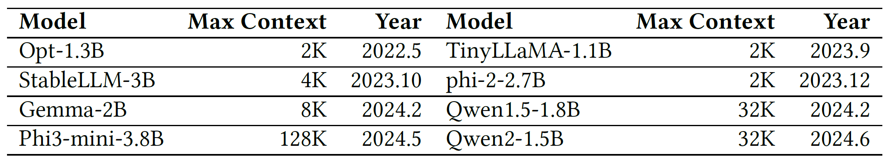{fig-align=center}

## The Problem: High Inference Latency

*   Even mobile-sized LLMs (Gemma-2B, Qwen-1.8B) are too slow for interactive use.
    *   *Example:* UI task step takes ~8s (Qwen-1.8B on CPU).
    *   *Example:* Email reply takes ~27s (Gemma-2B on CPU).
*   **Bottleneck Analysis:**
    *   **Prefill Stage (Prompt Processing)** dominates End-to-End Latency (up to 98%!).
    *   Decoding Stage (Token Generation) is often less critical for mobile tasks.
*   **Why Prefill is Slow on Mobile:**
    *   Mobile tasks often use *long prompts* (UI context, user history).
    *   Mobile CPUs/GPUs have limited parallel compute capacity compared to servers.

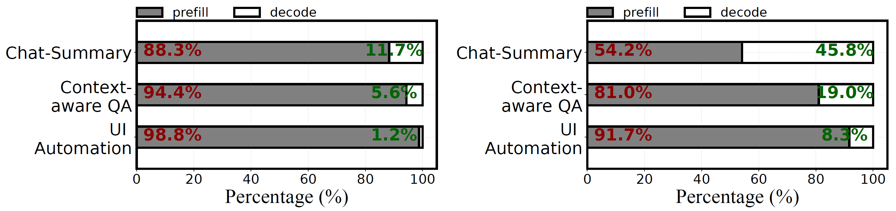{fig-align=center}

## The Opportunity: Mobile NPUs

*   **Neural Processing Units (NPUs)** are ubiquitous in modern mobile SoCs (Qualcomm Hexagon, Google Edge TPU, etc.).
*   **Strengths:**
    *   **High INT8 Performance:** Optimized for integer math (e.g., 73 TOPS). Up to 18x/4x faster than CPU/GPU on CNNs.
    *   **Energy Efficient:** Lower power consumption than CPU/GPU.
    *   **Less Resource Contention:** Dedicated hardware, unlike GPUs used for rendering.
    *   **Unified Memory (often):** Reduces data transfer overhead vs. discrete GPUs.

*   **Goal:** Can we leverage NPUs to accelerate the compute-bound **prefill** stage?

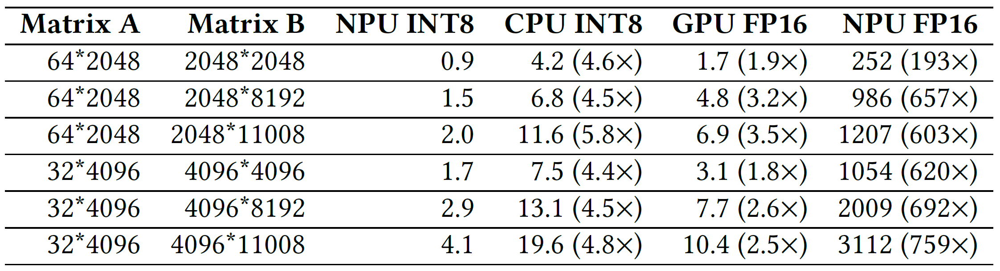{fig-align=center}

## DNN Execution Workflow on Mobile NPUs

- **NPU Environment Setup**
  - Initialize NPU drivers and allocate memory.
- **Compute Graph Construction**
  - Translate model into NPU-specific IR.
- **Graph Optimization**
  - Compile, Operator fusion
  - Memory layout adjustments
- **Graph Execution**
  - Execute optimized graph on NPU with **fixed-shape** inputs.
- **Cleanup**
  - Free NPU memory and resources

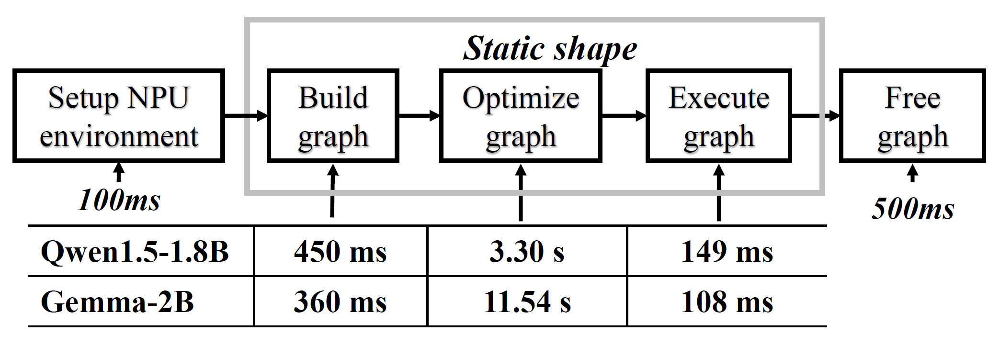{fig-align=center}

## The Challenges of Using NPUs for LLMs

*Directly* using NPUs for LLMs is inefficient due to fundamental mismatches:

1.  **Variable-Length Prompts vs. Static NPU Execution Graphs:**
    *   NPUs need pre-compiled, fixed-shape graphs.
    *   Re-compiling for each prompt length is extremely slow (e.g., ~11s for Gemma-2B).
    *   Padding to max length is computationally wasteful.

## The Challenges of Using NPUs for LLMs

*Directly* using NPUs for LLMs is inefficient due to fundamental mismatches:

1.  **Variable-Length Prompts vs. Static NPU Execution Graphs:**
    *   NPUs need pre-compiled, fixed-shape graphs.
    *   Re-compiling for each prompt length is extremely slow (e.g., ~11s for Gemma-2B).
    *   Padding to max length is computationally wasteful.

2.  **LLM Quantization vs. NPU Architecture:**
    *   LLMs need fine-grained (per-group) quantization for accuracy due to activation *outliers*.
    *   NPUs are inefficient with per-group MatMul (requires splitting, float reduction overhead - up to 10x slowdown).
    *   NPU-friendly per-tensor quantization hurts LLM accuracy significantly.

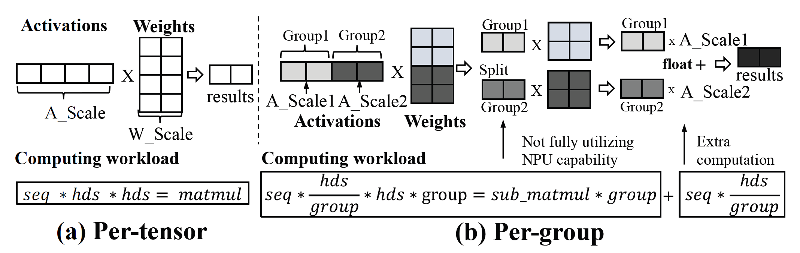{fig-align=center}

## The Challenges of Using NPUs for LLMs

*Directly* using NPUs for LLMs is inefficient due to fundamental mismatches:

1.  **Variable-Length Prompts vs. Static NPU Execution Graphs:**
    *   NPUs need pre-compiled, fixed-shape graphs.
    *   Re-compiling for each prompt length is extremely slow (e.g., ~11s for Gemma-2B).
    *   Padding to max length is computationally wasteful.

2.  **LLM Quantization vs. NPU Architecture:**
    *   LLMs need fine-grained (per-group) quantization for accuracy due to activation *outliers*.
    *   NPUs are inefficient with per-group MatMul (requires splitting, float reduction overhead - up to 10x slowdown).
    *   NPU-friendly per-tensor quantization hurts LLM accuracy significantly.

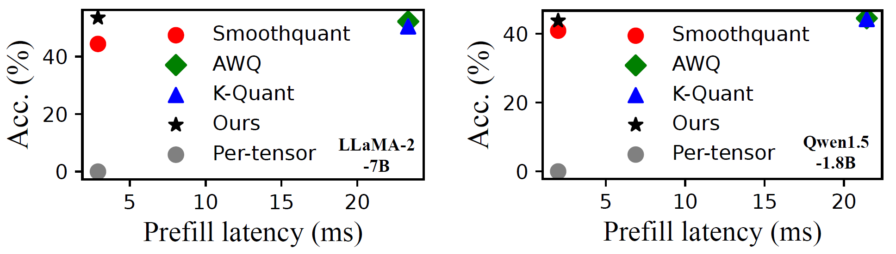{fig-align=center}

## The Challenges of Using NPUs for LLMs

*Directly* using NPUs for LLMs is inefficient due to fundamental mismatches:

1.  **Variable-Length Prompts vs. Static NPU Execution Graphs:**
    *   NPUs need pre-compiled, fixed-shape graphs.
    *   Re-compiling for each prompt length is extremely slow (e.g., ~11s for Gemma-2B).
    *   Padding to max length is computationally wasteful.

2.  **LLM Quantization vs. NPU Architecture:**
    *   LLMs need fine-grained (per-group) quantization for accuracy due to activation *outliers*.
    *   NPUs are inefficient with per-group MatMul (requires splitting, float reduction overhead - up to 10x slowdown).
    *   NPU-friendly per-tensor quantization hurts LLM accuracy significantly.

3.  **Ubiquitous Floating-Point (FP) Operations:**
    *   LLMs still require FP ops (LayerNorm, Attention, Softmax) for accuracy.
    *   **NPUs are very slow at FP math.** Offloading FP ops to CPU/GPU easily creates bottlenecks.

## The Challenges of Using NPUs for LLMs

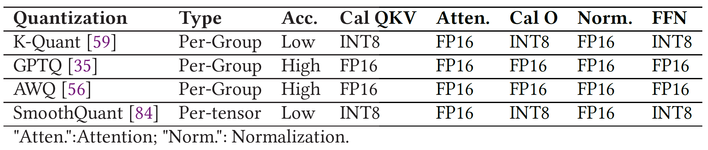{fig-align=center}

# System Design

## `llm.npu`: System Overview

**Goal:** **Reduce prefill latency** and energy-consumption for mobile LLMs through NPU.

**Key Idea:** Maximize NPU usage for INT8 compute, while strategically using CPU/GPU for FP ops and outlier handling to maintain accuracy and efficiency.

**Core Techniques (Re-constructing Prompt & Model):**

1.  **(Prompt Level) Chunk-sharing Graphs:** Handle variable lengths efficiently.
2.  **(Tensor Level) Shadow Outlier Execution:** Maintain accuracy with NPU-friendly quantization.
3.  **(Block Level) Out-of-order Subgraph Execution:** Maximize hardware utilization.

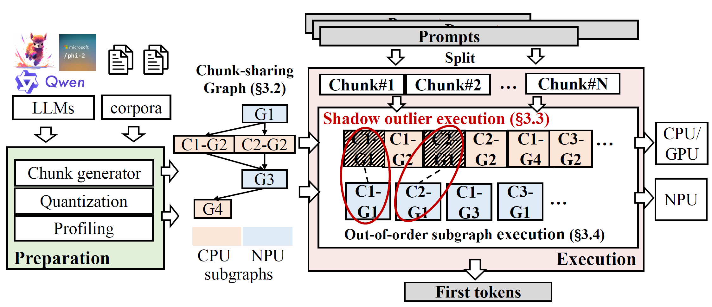{fig-align=center}

## Chunk-sharing Graphs

*   **Step 1 Chunking: Split variable-length prompt into multiple *fixed-size* chunks**
    *   Process chunks sequentially, respecting dependency.
    *   Use pre-compiled NPU graphs for fixed-size chunks -> avoids recompilation.
*   **Step 2 Graph Sharing:**
    *   *Observation:* Some LLM ops depend only on chunk size (e.g., FFN), others depend on sequence position (e.g., Attention K/V size).
    *   *Solution:* Share the computation graphs for *static* operators across all chunks. Create separate graphs only for *dynamic* operators (like Attention).
*   **Benefits:**
    *   reduce overhead for compiling and storing different compute graphs

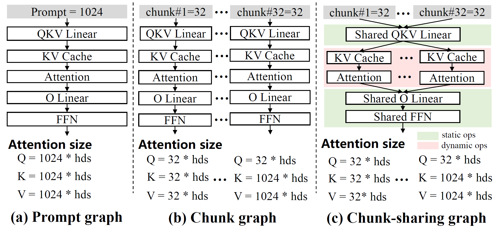{fig-align=center}

## Shadow Outlier Execution

*   **Hybrid Computation:**
    1.  **NPU (Main Path):** Perform standard per-tensor INT8 MatMul (fast).
    2.  **CPU/GPU (Shadow Path):**
        *   Identify activation values *outside* the INT8 range (outliers).
        *   Extract these sparse outliers into a compact tensor.
        *   Perform float MatMul for *only the outliers* on CPU/GPU (accurate).
    3.  **Merge:** Add results from NPU and CPU/GPU.
*   **Benefits:** High accuracy (float for outliers) + High NPU efficiency (per-tensor INT8).

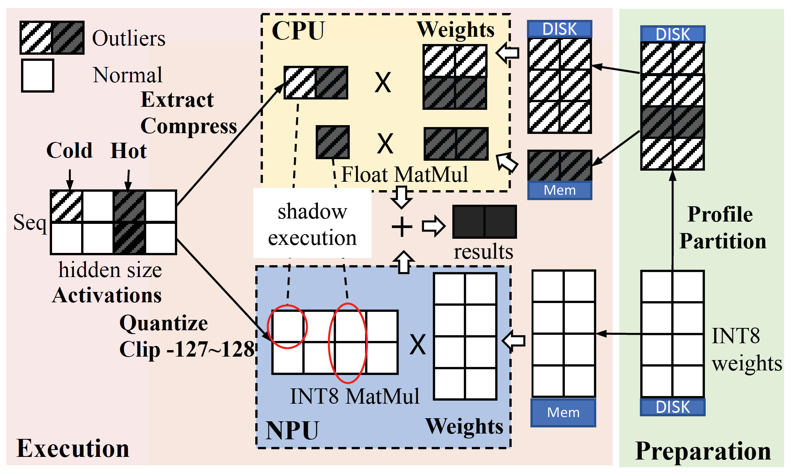{fig-align=center}

## Shadow Outlier Execution - Optimizations

*   **Challenge 1: Memory Overhead:** Need weights on both NPU (INT8) and CPU/GPU (float for outliers)
    *   *Observation:* Outliers occur frequently at specific "hot channels" (<3% channels responsible for >80% outliers).
    *   *Optimization:* Keep only *hot channel* outliers on CPU/GPU memory. Load cold outliers from disk on demand.

{fig-align=center}

## Shadow Outlier Execution - Optimizations

*   **Challenge 2: Synchronization Overhead:** CPU/GPU computation + merging adds latency.
    *   *Observation:* Outliers in many layers have minimal impact on final accuracy.
    *   *Optimization:* Profile outlier "importance" per layer offline. *Prune* (ignore) outliers in less important layers (e.g., 85% least important). -> Reduces CPU/GPU work & sync cost.

{fig-align=center}

## Out-of-order Subgraph Execution

*   **Dynamic Scheduling:**
    *   Maintain pools of ready-to-run subgraphs for NPU and CPU/GPU.
    *   Use an online heuristic scheduler.
    *   **Priority:** Choose the next subgraph to execute (on either NPU or CPU/GPU) that maximally *reduces NPU idle time* (critical path).
*   **Benefit:** Improves parallelism, minimizes NPU stalls, boosts overall throughput.

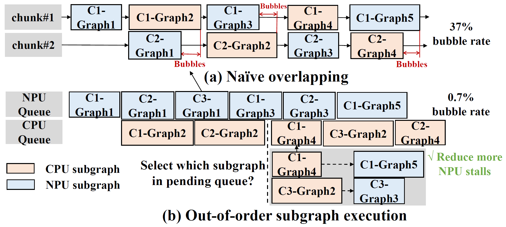{fig-align=center}

# Evaluation

## Experiment Setup

*   **Mobile devices:** Xiaomi 14 (Snapdragon 8 Gen 3), Redmi K60 Pro (Snapdragon 8 Gen 2).
*   **Baselines:**
    *   CPU: llama.cpp, MNN
    *   GPU: TFLite, MLC-LLM
    *   NPU: PowerInfer-v2 (Reported data)
*   **Tasks/Datasets:**
    *   LongBench (Context QA)
    *   DroidTask (UI Automation)
    *   PersonaChat (Summaries)
    *   Standard LLM benchmarks (LAMBADA, HellaSwag, MMLU etc.).

## Prefill Performance

*   **Key Result:** `llm.npu` significantly outperforms all baselines in prefill speed.
*   **Speed:**
    *   Achieves **>1000 tokens/sec** prefill for billion-param models (first on mobile).
    *   Avg **22.4x** faster prefill than baselines

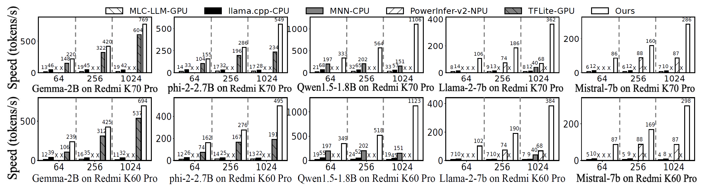{fig-align=center}

## End-to-End Performance

*   Up to **32.8x** speedup on UI Automation tasks.
*   Up to **46.2x** speedup on Context-Aware QA.

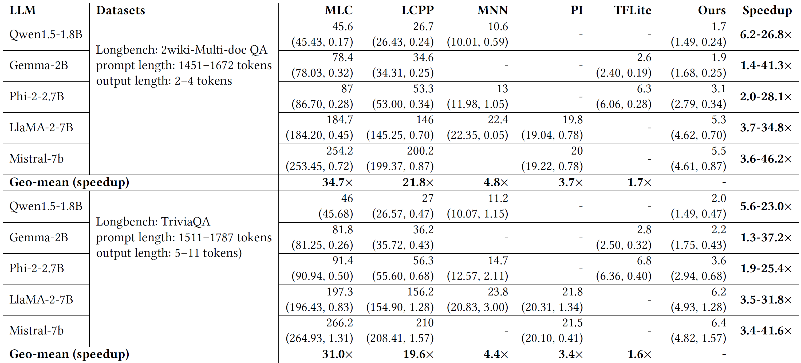{fig-align=center}

## End-to-End Performance

*   Up to **32.8x** speedup on UI Automation tasks.
*   Up to **46.2x** speedup on Context-Aware QA.

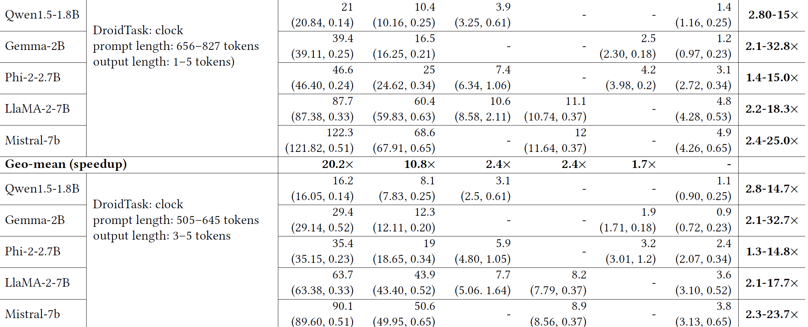{fig-align=center}

## Accuracy

*   `llm.npu` achieves negligible accuracy loss (<1% avg compared to FP16).

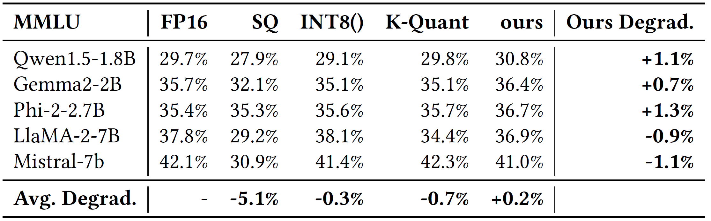{fig-align=center}
