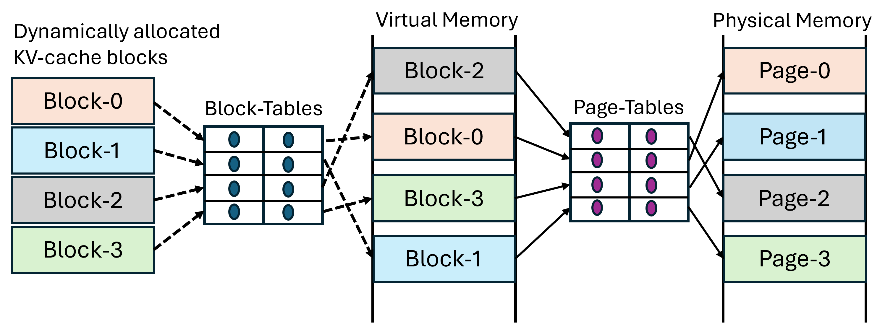
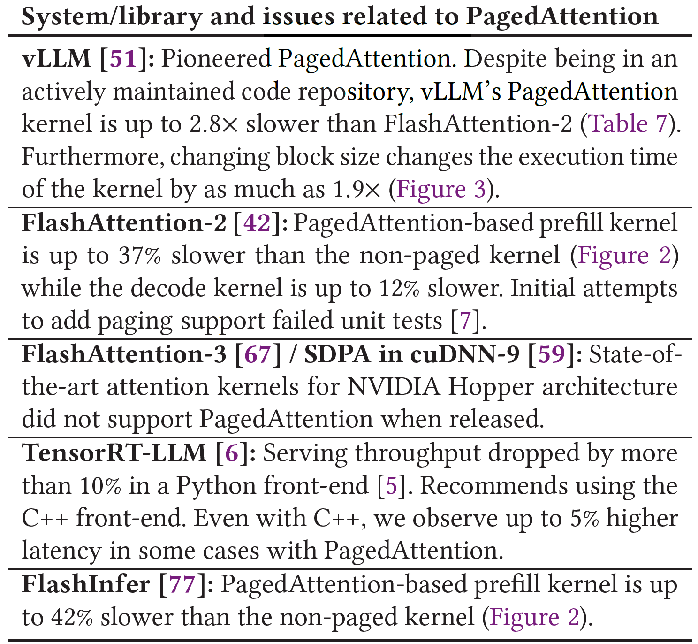
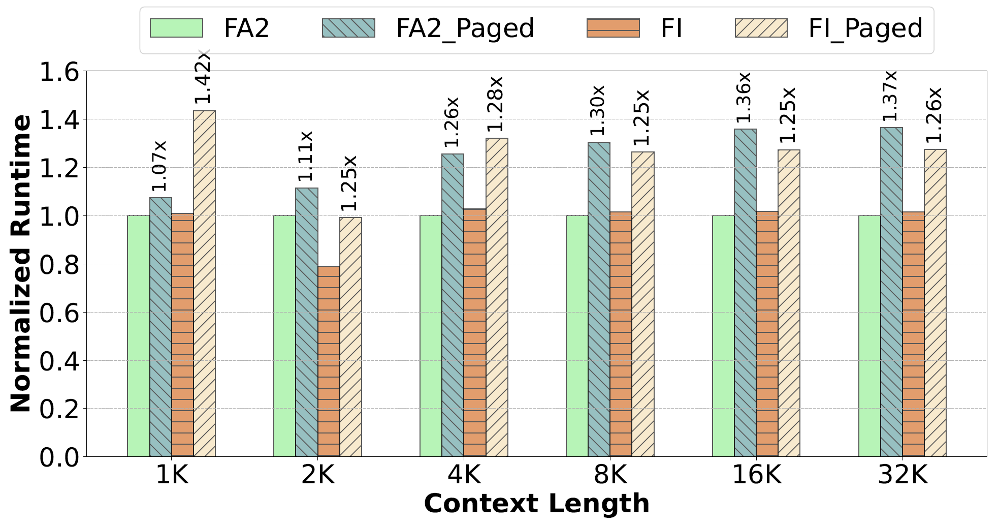
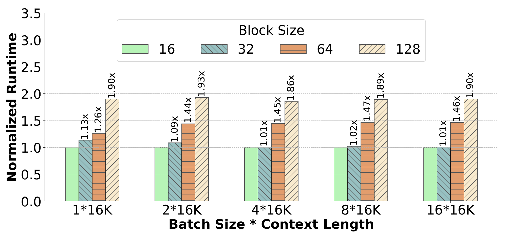
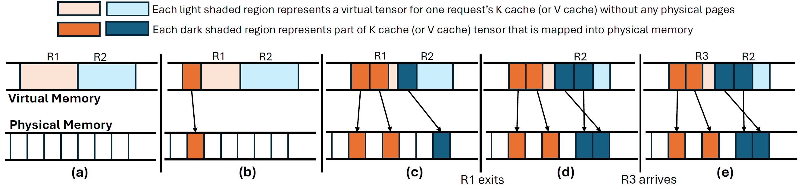
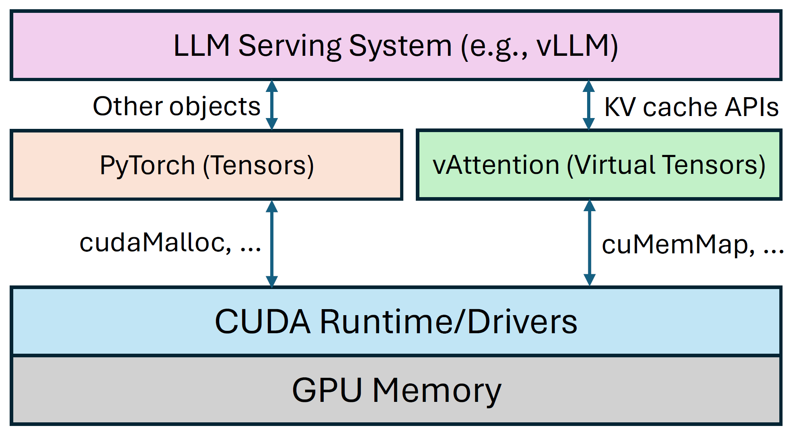
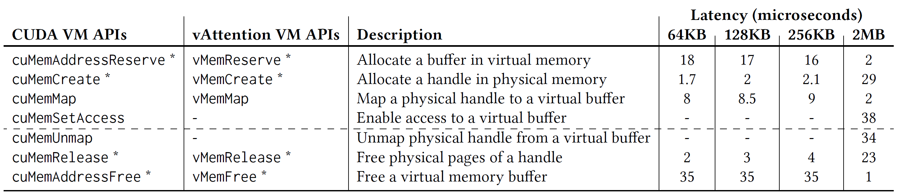
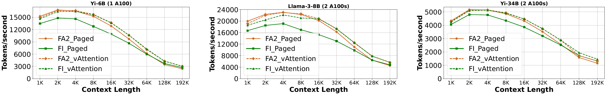
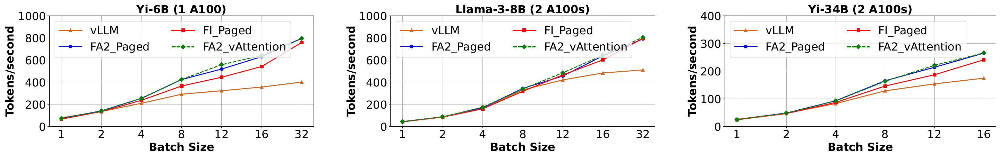

# Background & Motivation

## LLM Inference & KV Cache

- Large Language Models (LLMs) generate text token-by-token.
- **KV Cache**: Append-only tensors stored in GPU memory, reused across generation steps.
- Consumes the majority of GPU memory.

## The Memory Fragmentation Problem

- KV cache size grows dynamically (one token per step).
- Final size is unknown beforehand.
- **Static Allocation**: Pre-allocating for max length leads to massive internal fragmentation.
- Wasted memory limits batch size and throughput.

## PagedAttention: The Prior Solution

{fig-align=center}

- Inspired by OS demand paging.
- Allocates KV cache in small, fixed-size *physical* blocks on demand.
- Greatly reduces fragmentation, increases memory utilization.
- Became the de facto standard (vLLM, TensorRT-LLM, etc.).

## Problem 1: Scattered Virtual Blocks

{fig-align=center}

- PagedAttention manages *physical* memory dynamically.
- **Side Effect**: Breaks the *virtual* memory contiguity of the KV cache.
- A request's KV cache is scattered across non-contiguous virtual blocks.

## Problem 2: Requires Kernel Rewriting

{fig-align=center}

- Standard attention kernels (FlashAttention, etc.) assume *contiguous* K and V tensors.
- PagedAttention requires kernels to be modified to handle non-contiguous blocks (pointer chasing).
- Complex, error-prone, creates maintenance burden.
- Porting new kernel optimizations is slow, often lags behind.

## Problem 3: Performance Overhead (GPU kernel)

{fig-align=center}

- Extra instructions in the critical path for block lookups.
- Paged kernels can be significantly slower than non-paged versions (up to 42% in prefill).

## Problem 3: Performance Overhead (GPU kernel)

{fig-align=center}

- Increased register pressure, potential cache misses.
- Large block size decreases L1 cache efficiency
  - Cache pollution & lower hit rate
- Small block size increases CPU management overhead

## Problem 4: Performance Overhead (CPU) & Redundancy

- **CPU Overhead**: Serving framework needs to manage block tables and pass them to the GPU kernel on every iteration. Can be >10% overhead.
- **Redundancy**: User-space memory manager duplicates virtual-to-physical mapping logic already present in the OS/driver.

## Motivation

- **Goal**: Achieve dynamic *physical* memory allocation (like PagedAttention) to avoid fragmentation while maintaining *virtual* memory contiguity for the KV cache.
- **Benefits**:
  - Use standard, unmodified, highly-optimized attention kernels.
  - Eliminate kernel maintenance burden.
  - Reduce CPU/GPU overheads.
  - Simplify the serving system design.

# System Design

## vAttention: Core Idea

- Leverage **CUDA Virtual Memory Management (VMM) APIs**.
- These APIs allow **decoupling** virtual address space reservation from physical memory allocation and mapping.
- Similar to how modern OSes manage memory (mmap/mprotect).

## vAttention: Mechanism

{fig-align=center}

1.  **Reserve Contiguous Virtual Buffer**: Pre-reserve a large, contiguous virtual address space for the max batch's KV cache.
2.  **Allocate Physical Pages On-Demand**: Use `cuMemMap` etc. to allocate physical GPU pages on demand as a request generates tokens.
3.  **Map Physical to Virtual**: Map the allocated physical pages into the correct offset within the contiguous virtual buffer.
4.  **Result**: Kernels see a contiguous virtual tensor; physical memory is committed dynamically.

## vAttention: Integration

{fig-align=center}

- vAttention library provides simple APIs (`init`, `alloc_reqid`, `step`, `free_reqid`).
- Serving framework (e.g., vLLM) calls `step` before each iteration.
- vAttention ensures physical pages are mapped for active requests.
- Uses standard PyTorch allocator for other tensors (activations, weights).

## Optimization 1: Hiding VMM API Latency

- CUDA VMM APIs (`cuMemMap`) can be slow (~tens of µs per call).
- **Decode Overlap**: Predict next step's memory need (1 token/req) and map pages in a background thread during current step's computation.
- **Prefill Optimization**:
    - **Deferred Reclamation**: Don't immediately free pages of completed requests.
    - **Eager Allocation**: Reuse freed pages for new requests, map extra pages ahead-of-time in background.

## Optimization 2: Mitigating Fragmentation (Page Size)

{fig-align=center}

- Default CUDA VMM page size is often large (2MB), causing internal fragmentation.
- **Problem**: CUDA VMM APIs are in closed-source driver.
- **Solution**: Modify *open-source* UVM driver components to add new APIs (`vMemMap`, etc.) supporting smaller physical page sizes (64KB, 128KB, 256KB).
- Provides fine-grained physical allocation similar to PagedAttention block sizes.

# Evaluation

## Setup

- **Models**: Yi-6B, Llama-3-8B, Yi-34B
- **Hardware**: 1-2 NVIDIA A100 80GB GPUs (NVLink connected)
- **Framework**: Modified vLLM
- **Baselines**:
  - PagedAttention kernels (`FA2_Paged`, `FI_Paged`, vLLM)
  - Non-paged kernels with vAttention (`FA2_vAttention`, `FI_vAttention`)

## Prefill Throughput

<!-- Figure 7. Prefill throughput. vAttention backed systems outperform... -->
<!-- Table 6. Prefill completion and attention (in parenthesis) time... -->

{fig-align=center}

- non-paged kernels with vAttention achieves comparable or better results.

## Decode Throughput

{fig-align=center}
