# Background & Motivation

## LLM Inference & Context Prefixes

- LLMs use context-rich prefixes (history, documents) for better quality.
- Prefixes significantly increase input length.
- **Problem:** Longer inputs lead to high computation and **Time To First Token (TTFT)** latency.

## Prefix KV Reuse

- Many requests share common prefixes.
- Recomputing Key/Value (KV) tensors for prefixes is wasteful.
- **Solution:** Store and reuse prefix KVs.
- Existing systems cache KVs in GPU/CPU memory.

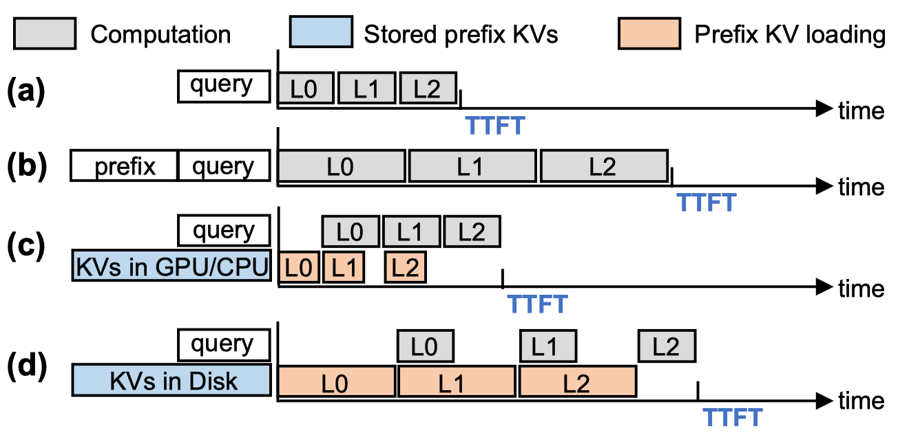

## The Disk I/O Bottleneck

- GPU/CPU memory is limited.
- Prefixes can be large (e.g., 3.4GB for OPT-30B, 2.6k tokens).
- Offloading KVs to disk is necessary but slow.
- **Problem:** Disk I/O latency can exceed recomputation time, negating reuse benefits.

## The Disk I/O Bottleneck

- GPU/CPU memory is limited.
- Prefixes can be large (e.g., 3.4GB for OPT-30B, 2.6k tokens).
- Offloading KVs to disk is necessary but slow.
- **Problem:** Disk I/O latency can exceed recomputation time, negating reuse benefits.

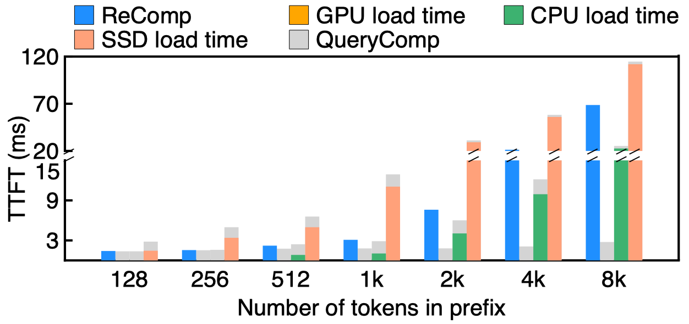

## Insight: Not All KVs Are Equally Important

- Research shows LLM inference quality is robust to discarding less important KVs.
- Most impact comes from a subset of "important" tokens/KVs.
- **Opportunity:** Can we leverage importance to optimize prefix KV reuse from slower storage?

## Motivation

- Reduce the TTFT bottleneck caused by loading prefix KVs from disk.
- **Idea:** Selectively load *only the important* prefix KVs.
- Goal: Minimize I/O data transfer while maintaining inference quality.

## Challenge 1: Identifying Important KVs Efficiently

- Standard methods need *all* prefix KVs loaded into GPU to calculate attention scores.
  - Defeats the purpose of reducing I/O.
- **Importance is query-dependent**: Statically pre-identifying important tokens for a prefix doesn't work well (poor recall).

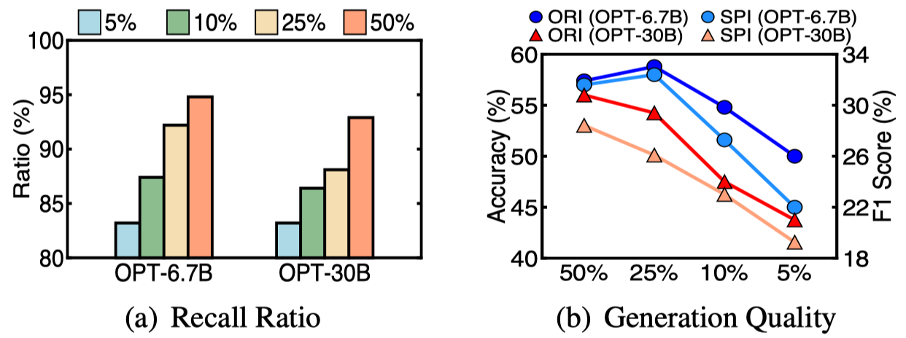

## Challenge 2: Suboptimal Storage & Caching

- Existing systems chunk KVs sequentially.
  - Loading important KVs forces loading unimportant ones in the same IO chunk (read amplification).
- Standard caching (LRU/LFU) ignores KV importance.
  - Importance-rich chunks might be evicted prematurely.

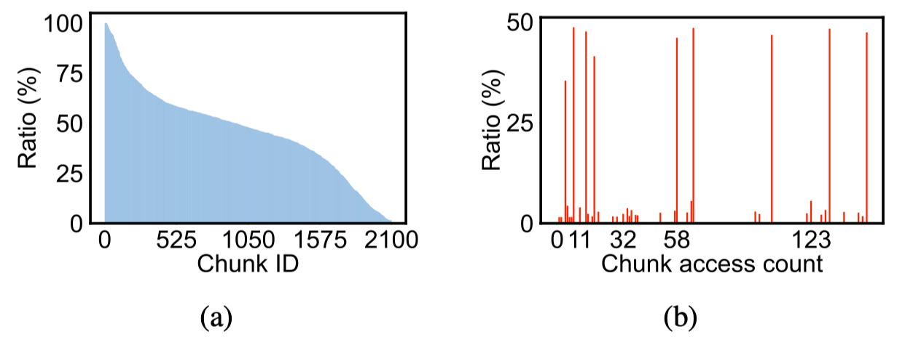

# System Design

## IMPRESS Overview

- An importance-informed, multi-tier (GPU, CPU, Disk) prefix KV storage system.
- Key Components:
  - **ITF:** Important Token Identification
  - **PKM:** Importance-Informed Prefix KV Management (Reordering & Caching)

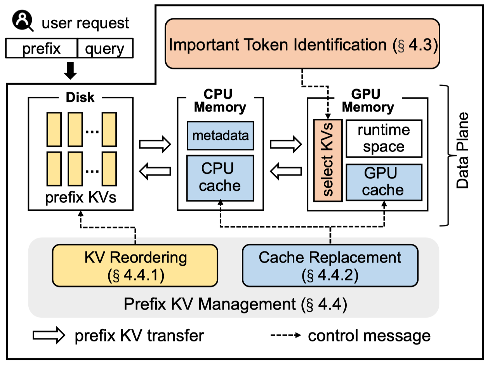{width=60%}

## IMPRESS Dataflow

1.  Request arrives (prefix + query).
2.  Find longest reusable prefix ($R$) in radix tree.
3.  **ITF:** Identify important KVs in $R$ ($R_{important}$) with minimal I/O.
4.  Load $R_{important}$ (from disk/CPU if needed) to GPU.
5.  Compute remaining prefill using $R_{important}$ + non-reused prefix ($NR$) + query.
6.  **PKM:** Store new KVs ($NR$) and manage caches/disk layout.

## ITF Insight 1: Intra-Layer Similarity

- **Observation:** The set of important token indices is highly similar *across different attention heads within the same layer*.
- Intuition: Heads derive k/v from the same large K/V tensors.

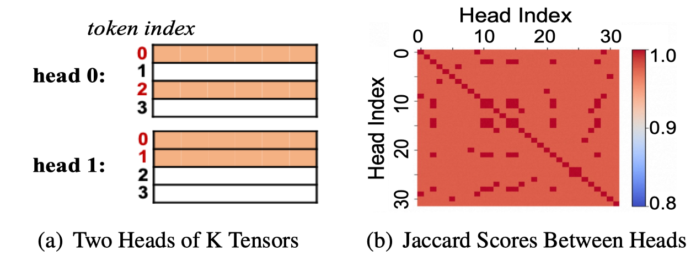

## ITF Insight 2: Similarity Across Scales

- **Observation:** Similarity persists across different importance sampling ratios and LLM model sizes/depths.
- Similarity tends to be lower for smaller ratios, smaller models, and deeper layers, but still significant.

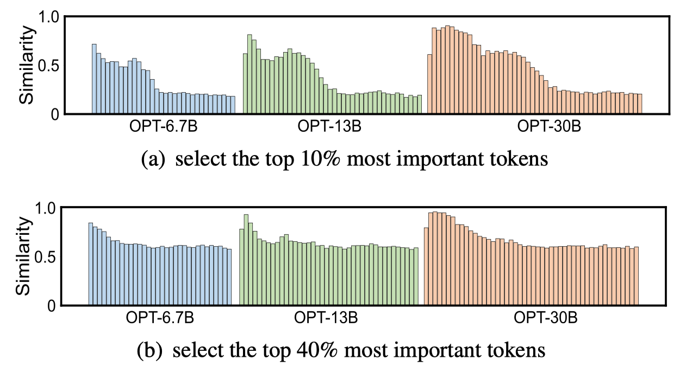{width=80%}

## Similarity-Guided Important Token Identification (ITF)

- **Idea:** Use similarity to approximate global importance using only a few heads ("probe heads").

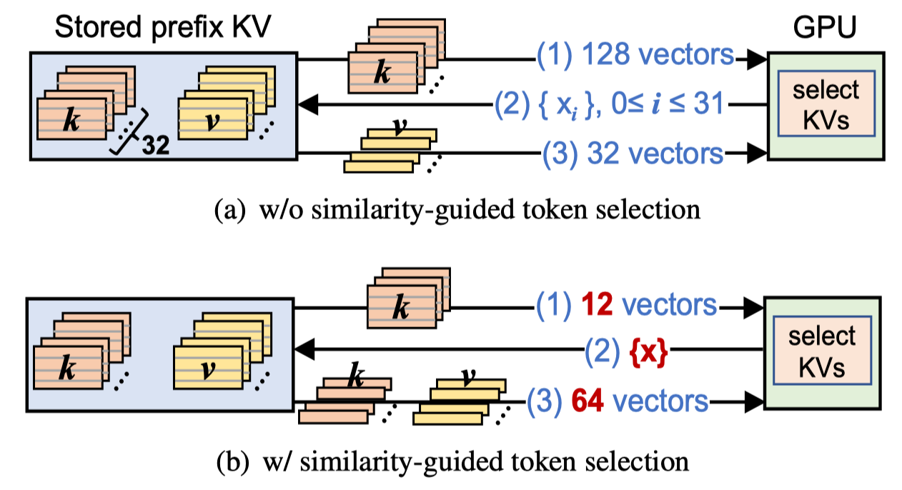

## Similarity-Guided Important Token Identification (ITF)

- **Idea:** Use similarity to approximate global importance using only a few heads ("probe heads").

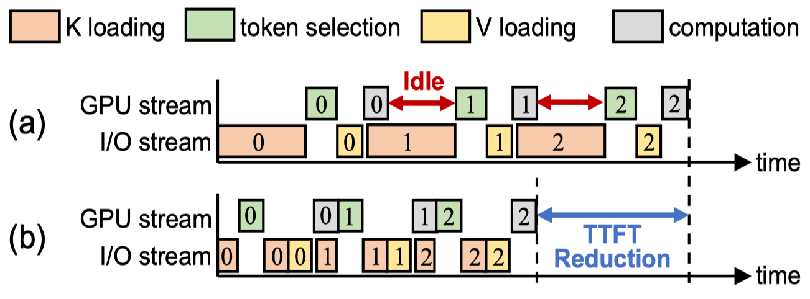

## Importance-Informed KV Management (PKM)

- Addresses Challenge 2 (suboptimal storage/caching).
- Two parts:
  1. KV Reordering (Storage Layout)
  2. Score-Based Cache Management

## PKM: KV Reordering

- **Problem:** Sequential KV layout leads to read amplification.
- **Solution:** Periodically (offline) reorder tokens within prefix segments based on average importance.
- Repack KVs: Group important KVs together into denser IO chunks.
- **Result:** Reduces number of chunks read for important KVs.

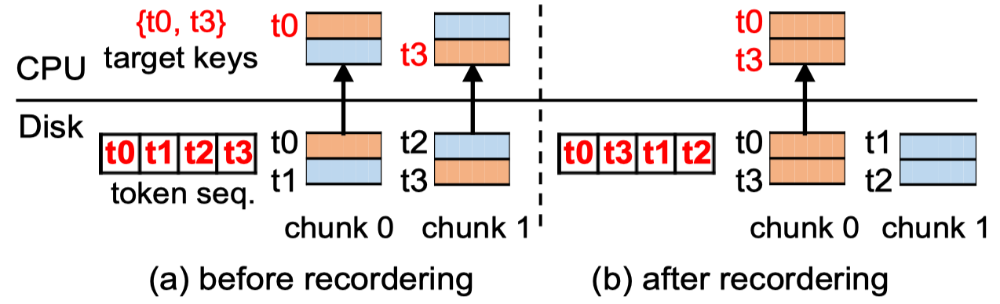

## PKM: Score-Based Cache Management

- **Problem:** Standard LRU/LFU ignores KV importance, leading to poor GPU cache hit rates for important data.
- **Solution:** Assign a score to each chunk:
  - `Score = AccessFrequency * ImportanceRatio`
- ImportanceRatio = (% of important KVs in the chunk, updated dynamically).
- Prioritize chunks with higher scores for GPU cache admission/retention.

## Score-Based Caching: Dual-Cache Policy

- Manages GPU and CPU caches (exclusive).
- Uses two min-heaps (one per cache) storing chunk scores.
- On access/load:
  - Update chunk score.
  - Promote chunk to GPU cache if score > lowest score in GPU heap.
  - Evict lowest-scored chunk from GPU/CPU heap if cache is full.
- Ensures non-redundancy; replicas always exist on disk.

# Evaluation

## Setup

- **Models:** OPT-{6.7B, 13B, 30B}, Llama2-{7B, 13B}
- **Hardware:** AMD EPYC CPU, 128GB DRAM, NVIDIA A100 GPU (80GB), Intel NVMe SSD
- **Datasets:** PIQA, RTE, COPA, OpenBookQA (Few-shot setup)
- **Baselines:**
  - `ReComp`: No reuse.
  - `AS-like`: AttentionStore baseline (reuse all KVs, LRU GPU cache).
  - `AS+H2O+LRU`: AS-like + H2O importance (load important V only, LRU).
  - `AS+H2O+LFU`: AS-like + H2O importance (load important V only, LFU).
- **IMPRESS:** Uses ITF + KV Reordering + Score-based Caching.

## Model Generation Quality

- Negligible accuracy drop (<0.2%)

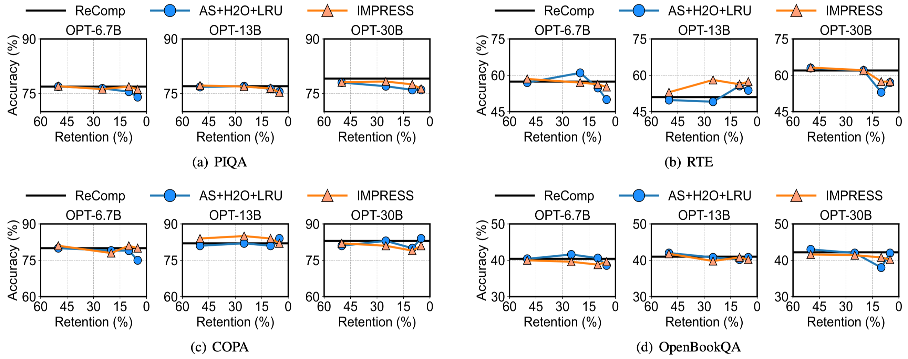

## Average TTFT Performance

- 1.2x - 2.8x TTFT reduction over the prior SOTA

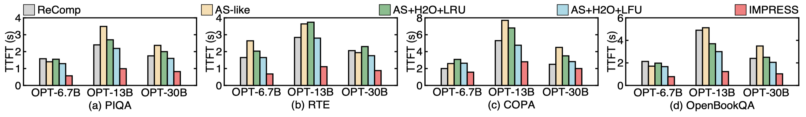

## I/O Time Reduction

- 1.5x - 3.8x reduction in I/O time for loading prefix KVs compared to prior SOTA

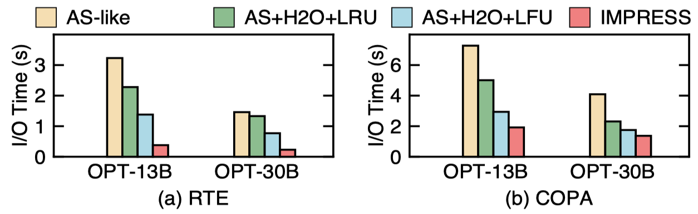

## Breakdown

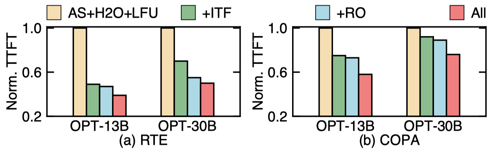
