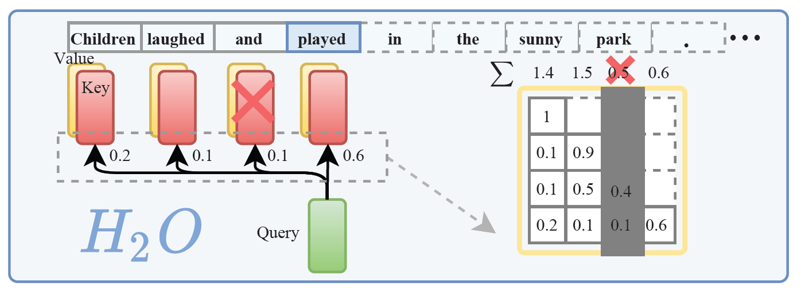
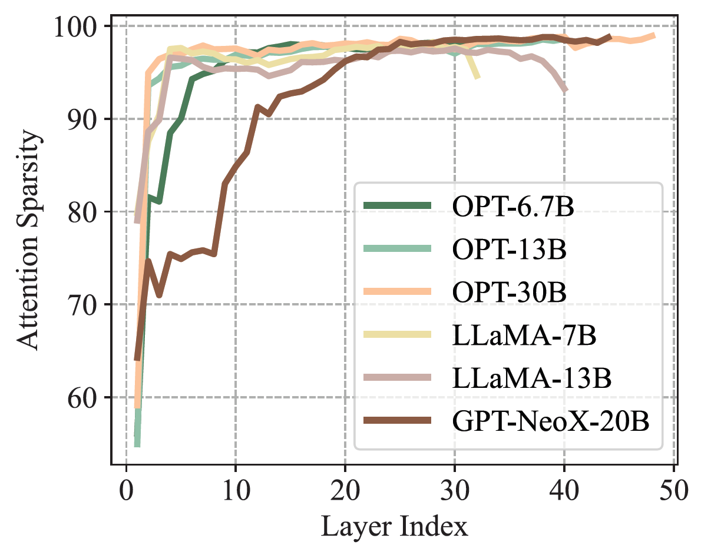
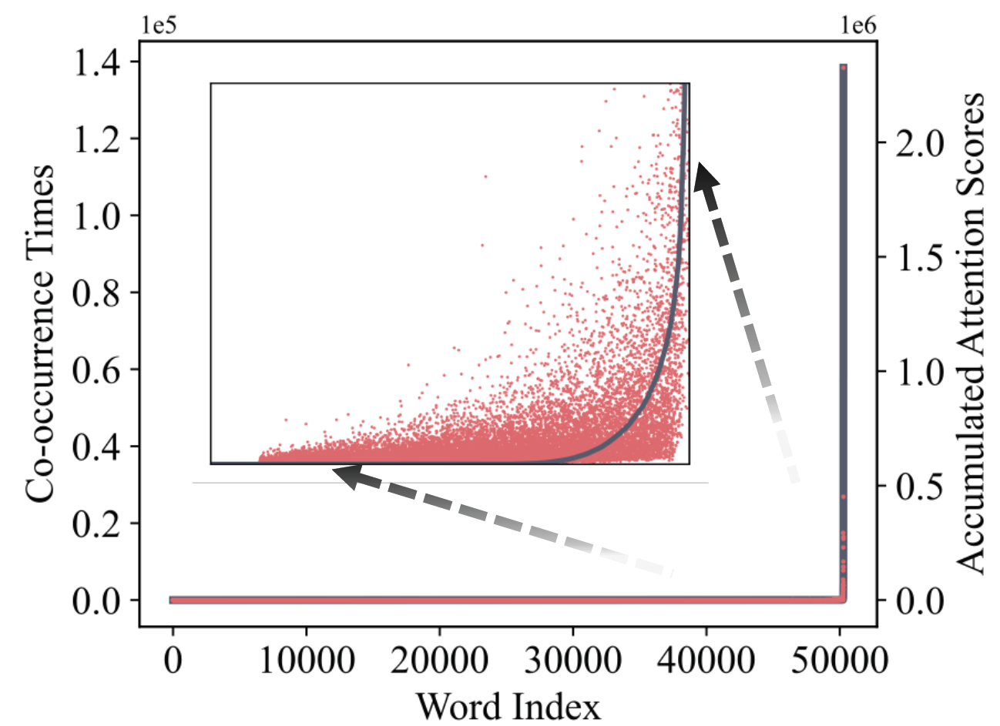
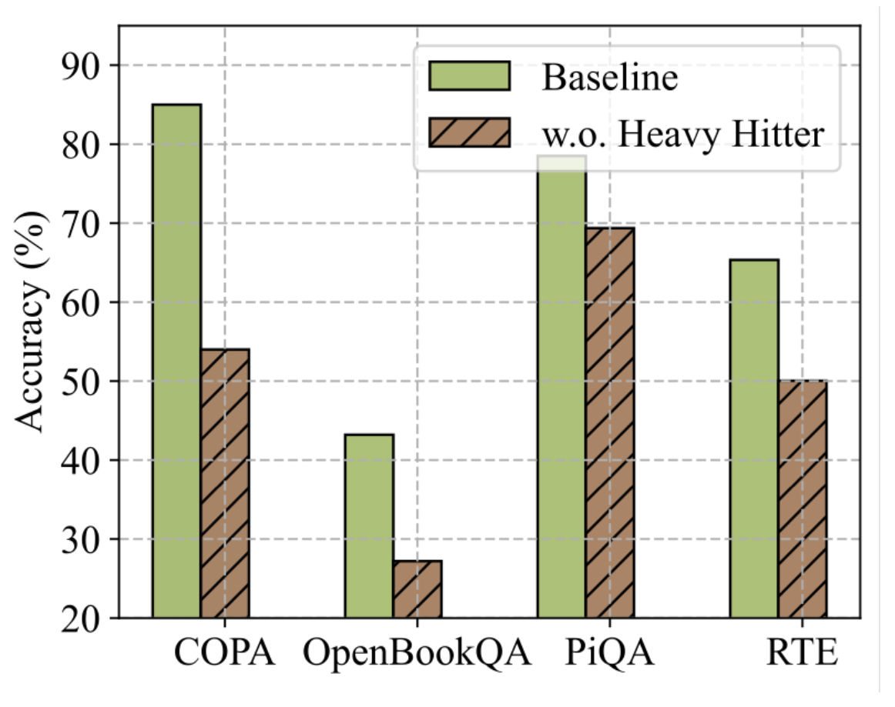
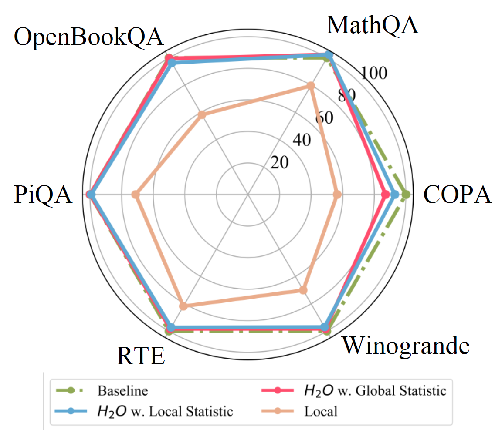
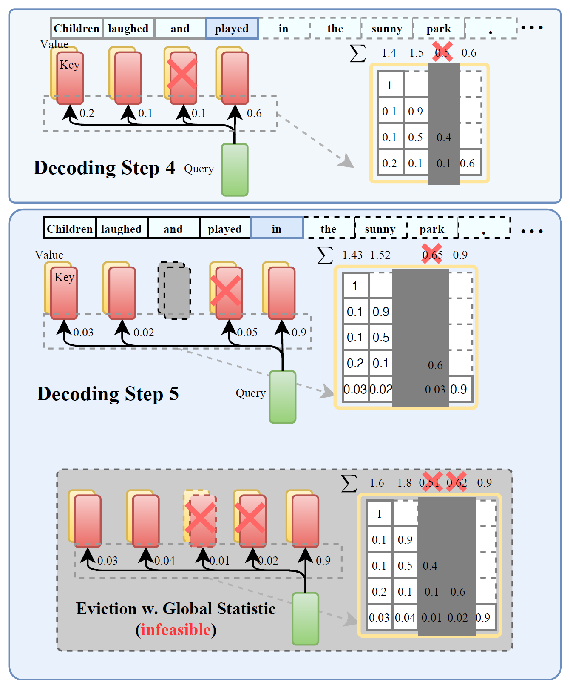
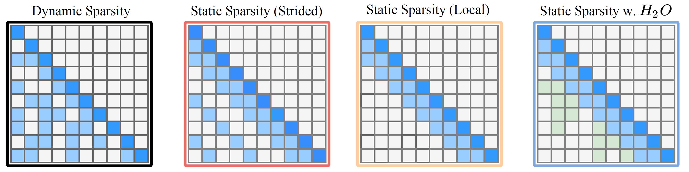
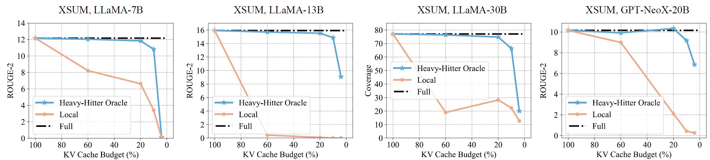
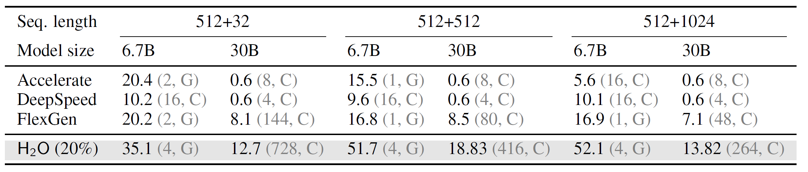
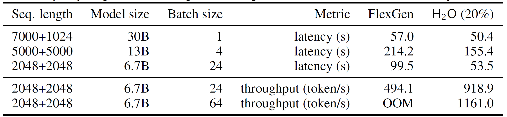

# Background & Motivation

## LLMs & Generative Inference

- LLMs excel at tasks like dialogue, summarization, content creation.
- Generation is typically autoregressive: predict next token based on previous ones.

## The KV Cache Memory Bottleneck

{width=70%}

- **KV Cache size scales linearly with sequence length and batch size.**
- Can exceed GPU memory, even more than model parameters.
  - Memory ∝ (batch × seq len); OPT-30B @ 128×1024 needs ≈ 180 GB KV alone
- Major bottleneck for long content generation and high throughput deployment.

## Limitations of Prior Work

- Simple cache size limits hurt accuracy significantly.
- Existing sparse attention methods often require large caches or degrade pre-trained model performance.
- Learned compression methods can be complex and add inference overhead.

## Key Observation: Attention Sparsity

{width=50%}

- LLM attention matrices are highly sparse (>95%) during inference.
  - only 5% of the KV cache is sufficient for decoding the same output token
- Suggests **not all past tokens are needed**.

## Key Observation: Heavy Hitters (H₂)

{width=70%}

- Accumulated attention scores follow a power-law distribution.
- A small subset of tokens ("Heavy Hitters" - H₂) contributes most value.
- H₂ correlate strongly with frequent co-occurring tokens.

## Key Observation: Importance of H₂

{width=70%}

- Removing H₂ tokens drastically drops performance.
- Retaining H₂ + recent tokens maintains accuracy effectively.

## Key Observation: Local Calculation is Sufficient

{width=50%}

- Calculating H₂ importance using only *local* statistics (past attention) is as effective as using global (future) information.
- Makes a practical, low-cost eviction policy feasible.

# System Design

## H₂O: Heavy-Hitter Oracle

- A novel, low-cost KV cache eviction policy.
- Goal: Reduce memory footprint significantly while maintaining accuracy.

## H₂O: Core Idea

- Maintain a fixed-size KV cache by dynamically balancing:
    1.  **Recent Tokens:** Always keep the last `N` tokens (temporal locality).
    2.  **Heavy Hitter (H₂) Tokens:** Keep the `M` tokens with the highest *accumulated attention scores*.

## H₂O: Eviction Policy

{width=35%}

- **Score Calculation:** At each step, update accumulated attention score for cached tokens based on current attention `oᵢ`.
- **Eviction:** If cache is full, evict the token (excluding recent ones) with the *lowest* accumulated score.
- **New Token:** Add the newly generated token to the recent set.

<!-- ## Theoretical Formulation

- KV cache eviction is formulated as a dynamic submodular maximization problem.
- The greedy H₂O policy (evicting lowest score) is provably near-optimal under mild assumptions. -->

## Implementation Details

- Implemented on top of FlexGen inference engine.
- Efficient management:
    - Pre-allocated memory buffers.
    - Circular queue for recent tokens.
    - Avoids expensive memory swaps or data movement.

# Evaluation

## Experimental Setup

- **Models:** OPT (6.7B, 30B, 66B), LLaMA (7B, 13B, 30B), GPT-NeoX (20B).
- **Tasks:** Summarization (XSUM, CNN/DM), QA (OpenBookQA), Reasoning (COPA, PiQA, RTE, WinoGrande), Math (MathQA). From HELM & lm-eval-harness.
- **Hardware:** NVIDIA A100 80GB GPU.
- **Baselines:** Full Cache, "Local" (only recent tokens), Sparse Transformers (Strided, Fixed).

## Accuracy

- H₂O (with 20% cache budget, i.e., 5x reduction) achieves comparable accuracy to the full cache model across tasks and models.
- Significantly outperforms the "Local" baseline, which collapses at low budgets.
- H₂O sometimes acts as a regularizer, slightly improving performance.

## Throughput Improvements

- H₂O enables much larger batch sizes or avoids CPU offloading due to reduced memory.
- **Up to 29x** throughput improvement over DeepSpeed & Accelerate.
- **Up to 3x** throughput improvement over FlexGen (state-of-the-art).

## Latency Reduction

- With the *same* batch size, H₂O reduces generation latency.
- **Up to 1.9x** lower latency compared to FlexGen for long sequences.

