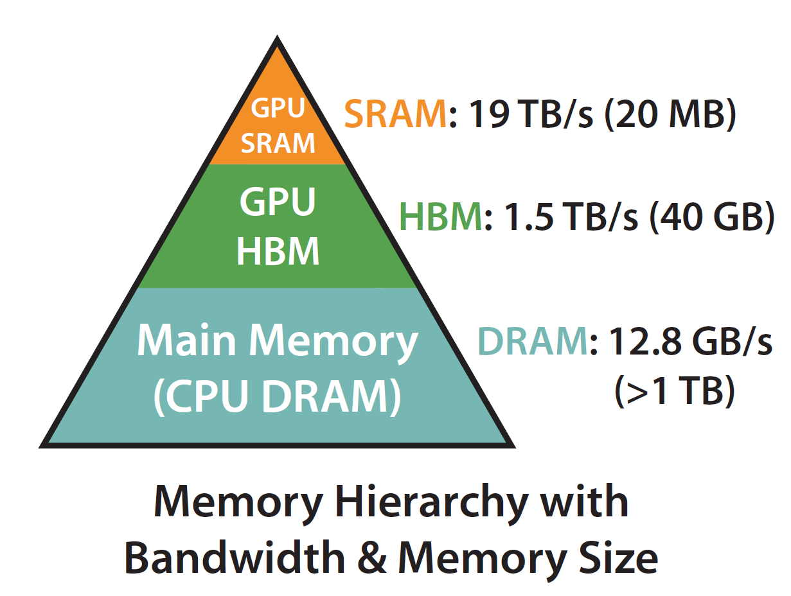
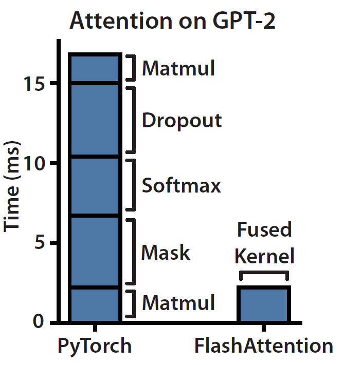
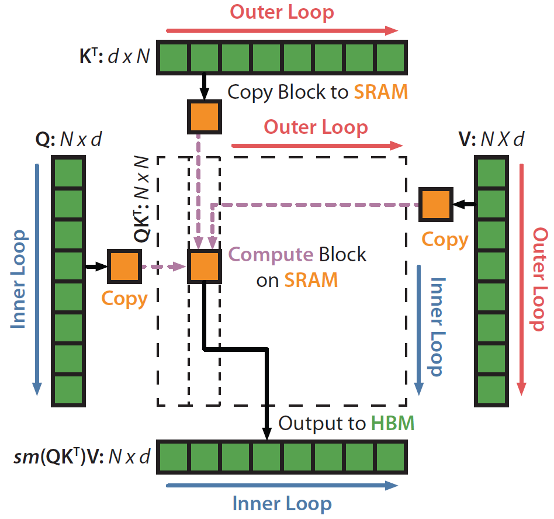
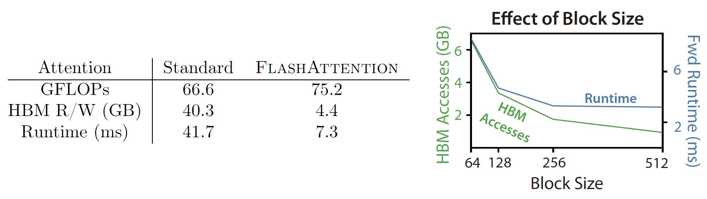
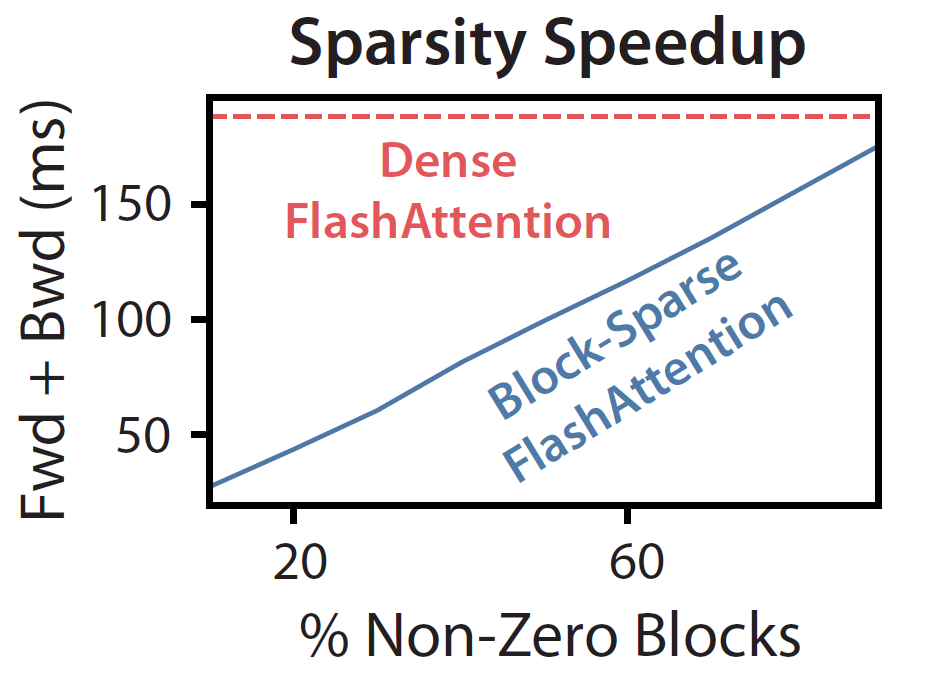
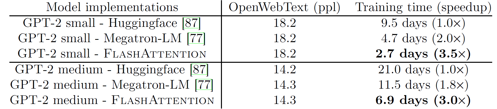
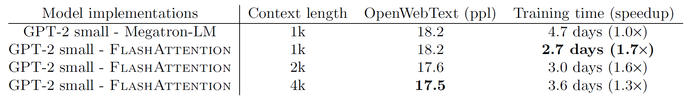
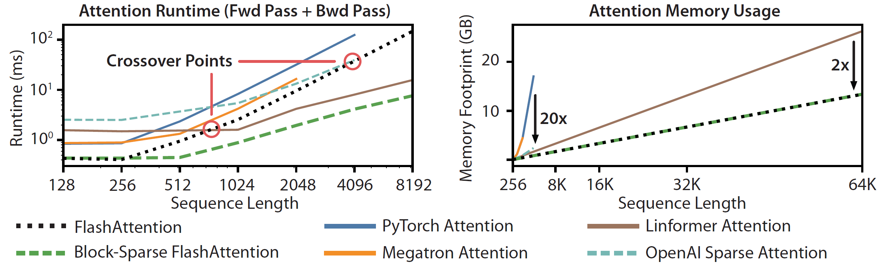

# Background & Motivation

## Transformers: Powerful but Costly

- Self-attention mechanism is quadratic in sequence length $N$:
    - O($N^2$) time complexity
    - O($N^2$) memory complexity
- This limits their ability to process long sequences.

## Approximate Attention: A Common Approach

- Methods like sparse or low-rank attention aim to reduce complexity to linear/near-linear.
- **Focus primarily on reducing FLOPs (computation).**
- **Problem**: Often don't achieve significant wall-clock speedup and haven't seen wide adoption.

## The Missing Principle: IO-Awareness

- Existing methods often ignore memory access (IO) overheads.
- **GPU Memory Hierarchy**:
    - Small, very fast on-chip SRAM.
    - Large, but much slower HBM.
- Many deep learning operations are **memory-bound**: speed is limited by HBM bandwidth, not compute TOPS.

{fig-align=center}

## Standard Attention: High IO Cost

- Standard attention materializes the large N×N attention matrix (S) and probability matrix (P) in slow HBM.
- Involves many reads/writes between HBM and SRAM.
- This IO is a major bottleneck.

{fig-align=center}

## Motivation

- **IO-awareness is crucial** for speeding up attention.
- **Goal**: Develop an *exact* attention algorithm that is:
    - Faster in wall-clock time.
    - More memory-efficient.
    - **Achieved by minimizing HBM reads/writes**, without sacrificing model quality.

# System Design of FlashAttention

## Core Idea

- Compute exact attention with far fewer memory accesses.
- Avoid reading/writing the full $N \times N$ attention matrix to/from HBM.
- Leverage fast on-chip SRAM for intermediate computations.

{fig-align=center}

## Tiling (Forward Pass)

$$
\mathbf{S}=\mathbf{Q} \mathbf{K}^{\top} \in \mathbb{R}^{N \times N}, \quad \mathbf{P}=\operatorname{softmax}(\mathbf{S}) \in \mathbb{R}^{N \times N}, \quad \mathbf{O}=\mathbf{P V} \in \mathbb{R}^{N \times d},
$$

- Split Q, K, V inputs into blocks.
- Load blocks of K and V from HBM to fast SRAM.
- For each (K, V) block, loop through blocks of Q (loaded to SRAM).
- Compute attention output for these blocks *within SRAM*.
- **Online Softmax**:
    - Compute softmax incrementally using running statistics (max, sum of exponentials).
    - Avoids materializing the full S matrix.
    - Correctly combines results from different blocks.
- Write final output O back to HBM.

{fig-align=center}

## Recomputation (Backward Propogation)

- **Problem**: Backward pass typically needs the $N \times N$ attention matrix P.
- **Solution**: Don't store P from the forward pass.
    - Store only the output O and softmax normalization statistics (m, l) (O(N) memory).
    - Recompute necessary blocks of S and P on-the-fly in SRAM during backward pass.
- **Benefit**:
    - Increases FLOPs slightly.
    - Massively reduces HBM access (reading P).
    - Results in a faster backward pass and linear memory usage.

## Kernel Fusion

- All attention operations (matrix multiply, softmax, optional masking, dropout) are fused into a single CUDA kernel.
- This loads inputs from HBM once, performs all computations in SRAM, and writes results to HBM once per block.
- Minimizes repeated HBM reads/writes of intermediate data.

## IO Complexity Analysis

- **Standard Attention**: Ω(Nd + N²) HBM accesses.
- **FlashAttention**: O(N²d²M⁻¹) HBM accesses.
    - (d = head dimension, M = SRAM size)
- FlashAttention requires significantly fewer HBM accesses (e.g., up to 9x fewer).
- Proven optimal for a range of SRAM sizes.

{fig-align=center}

## Extension: Block-Sparse FlashAttention

- Apply tiling and recomputation principles to block-sparse attention.
- Only compute attention for pre-defined non-zero blocks.
- Further reduces HBM accesses and computation.
- Enables scaling to even longer sequences (e.g., 64k).

{fig-align=center}

# Evaluation

## Faster Model Training

{fig-align=center}

- **GPT-2 (Context Length 1K)**: 3x speedup vs. HuggingFace, 1.8x vs. Megatron-LM.

## Higher Quality Models with Longer Context

{fig-align=center}

## Benchmarking Attention: Runtime

-   FlashAttention up to 3x faster than standard PyTorch exact attention.
-   Faster than many approximate attention methods for common sequence lengths.
-   Block-sparse FlashAttention is faster than all existing approximate attention methods.

{fig-align=center}

## Benchmarking Attention: Memory Footprint

-   FlashAttention memory scales linearly with sequence length O($N$).
-   Up to 20x more memory-efficient than exact attention baselines.
-   More memory-efficient than most approximate attention baselines.

{fig-align=center}
