# Background & Motivation

## Growing Memory Pressure on Mobile

- Apps demand more memory while users switch >100 times/day
- Systems preserve "anonymous data" (stacks/heaps) for fast relaunch
- Limited DRAM (1-8GB) forces compression of unused data

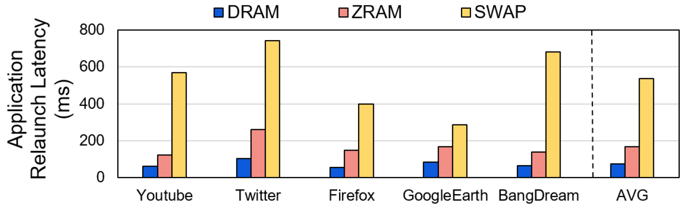{fig-align=center}

## Current Solution: ZRAM

- Compresses unused data into DRAM region (`zpool`)
- Avoids slow flash swaps but has limitations:
  - Treats all data equally (hot vs. cold)
  - Uses fixed 4KB compression chunks
  - No locality exploitation

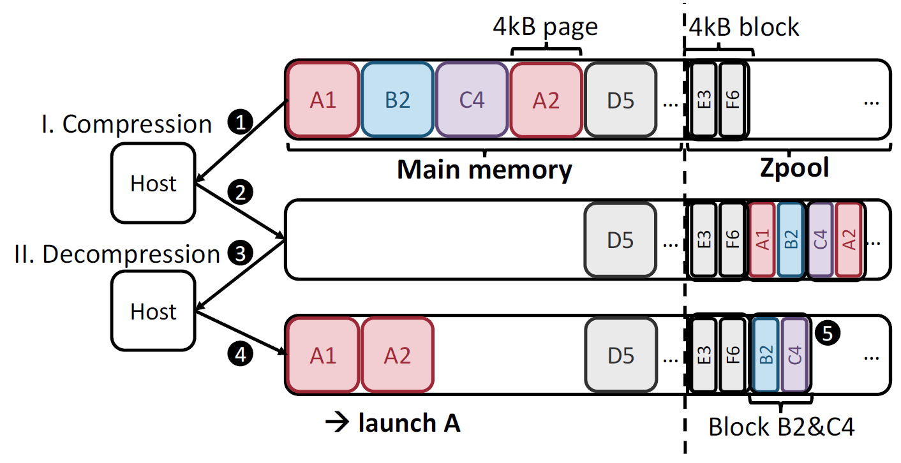{fig-align=center}

## Key Observations from Mobile Workloads: Hot data similarity

1. **Hot data similarity**: 70% overlap between relaunches  

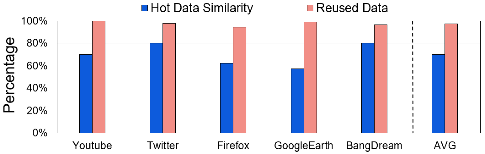{fig-align=center}

## Key Observations from Mobile Workloads

1. **Hot data similarity**: 70% overlap between relaunches  
2. **Compression tradeoffs**:  
   - Small chunks → fast compression (59× faster)  
   - Large chunks → better ratios (2.3× improvement)  

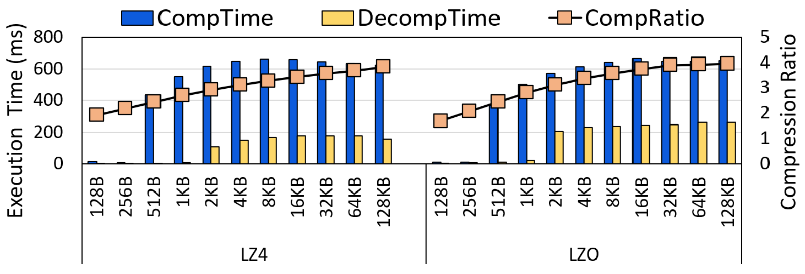{fig-align=center}

## Key Observations from Mobile Workloads

1. **Hot data similarity**: 70% overlap between relaunches  
2. **Compression tradeoffs**:  
   - Small chunks → fast compression (59× faster)  
   - Large chunks → better ratios (2.3× improvement)  
3. **Strong locality**: 86% chance next page accessed  

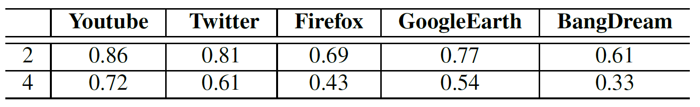{fig-align=center}

## Problems with ZRAM

- **Long relaunch latency**: 2.1× slower than DRAM-only  
- **High CPU overhead**: 2.6× more than DRAM  
- **Inefficient compression**: Hot data compressed unnecessarily

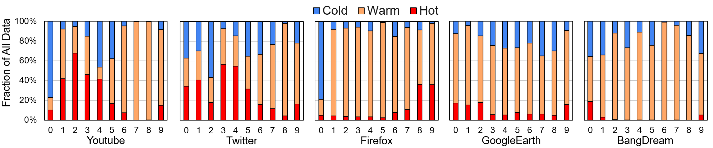{fig-align=center}

# System Design

## Ariadne Architecture Overview

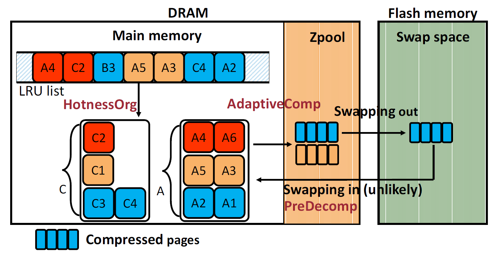{fig-align=center}

- **Hotness-Aware Data Organization**
- **Size-Adaptive Compression**
- **Proactive Decompression**

## Hotness-Aware Data Organization

- **HotnessOrg** dynamically classifies data:  
  - Hot (relaunch-critical)  
  - Warm (post-relaunch)  
  - Cold (rarely used)  
- Maintains separate LRU lists per app  
- Prioritizes keeping hot data uncompressed  

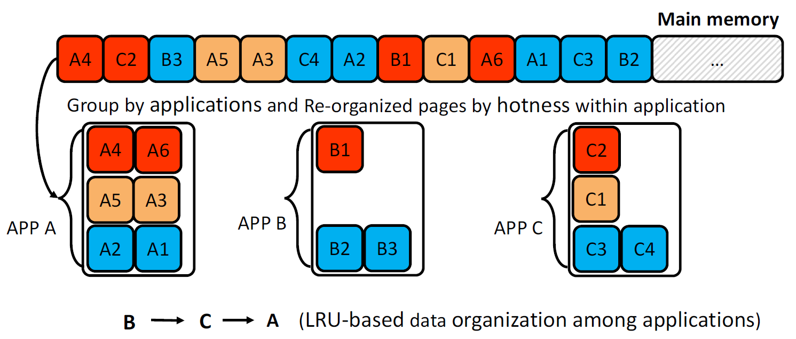{fig-align=center}

## Size-Adaptive Compression

- **AdaptiveComp** uses optimal chunk sizes:
  - Hot/Warm: Small chunks (256B-4KB) → fast decompression
  - Cold: Large chunks (16KB-32KB) → high compression ratio
- Avoids one-size-fits-all compromise

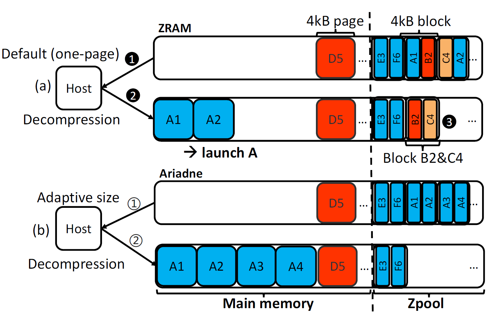{fig-align=center}

## Proactive Decompression

- **PreDecomp** predicts next needed pages:
  - Leverages 86% spatial locality in `zpool`
  - Pre-decompresses 1 subsequent page
  - Uses small buffer for prefetched data
- Hides swap-in latency during relaunch

# Evaluation

## Experimental Setup

- **Device**: Google Pixel 7 (Android 14)
- **Workloads**: 10 popular apps (YouTube, Twitter, etc.)
- **Metrics**: Relaunch latency, CPU usage, compression stats

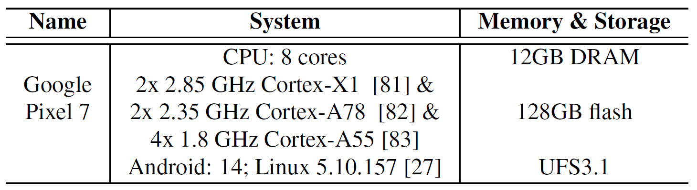{fig-align=center}

## Experimental Setup

- **Device**: Google Pixel 7 (Android 14)
- **Workloads**: 10 popular apps (YouTube, Twitter, etc.)
- **Metrics**: Relaunch latency, CPU usage, compression stats
- **Evaluated Methods**:
  - **ZRAM**: Android's default mechanism. Single page size (4KB) + LRU + On-demanding decompression
  - **DRAM**: Ideal
  - **Ariadne**:

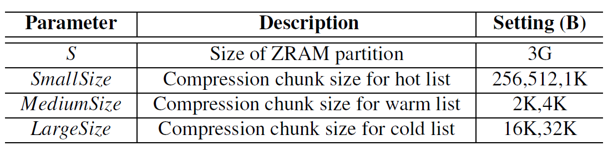{fig-align=center}

## Relaunch Latency Reduction

- 50% faster relaunches vs. ZRAM
- Near-DRAM performance (within 10%)

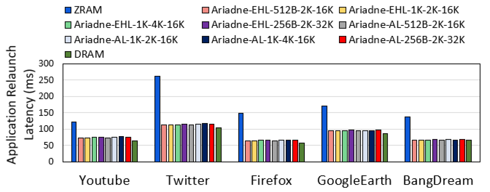{fig-align=center}

## CPU Usage Improvement

- 15% lower CPU for compression/decompression
- Hot-data exclusion reduces CPU by 25-30%

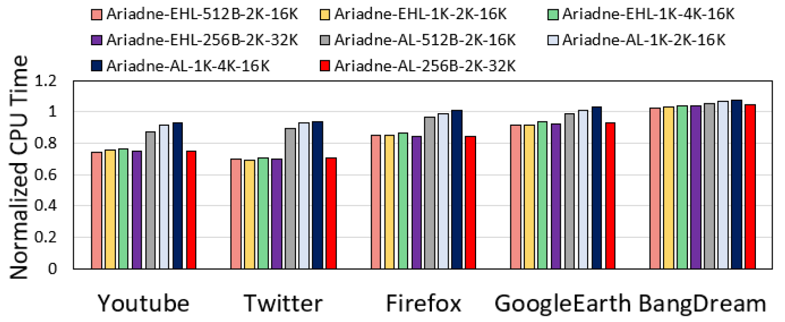{fig-align=center}

## Compression Efficiency

- 60-90% lower decompression latency
- Better compression ratios than ZRAM

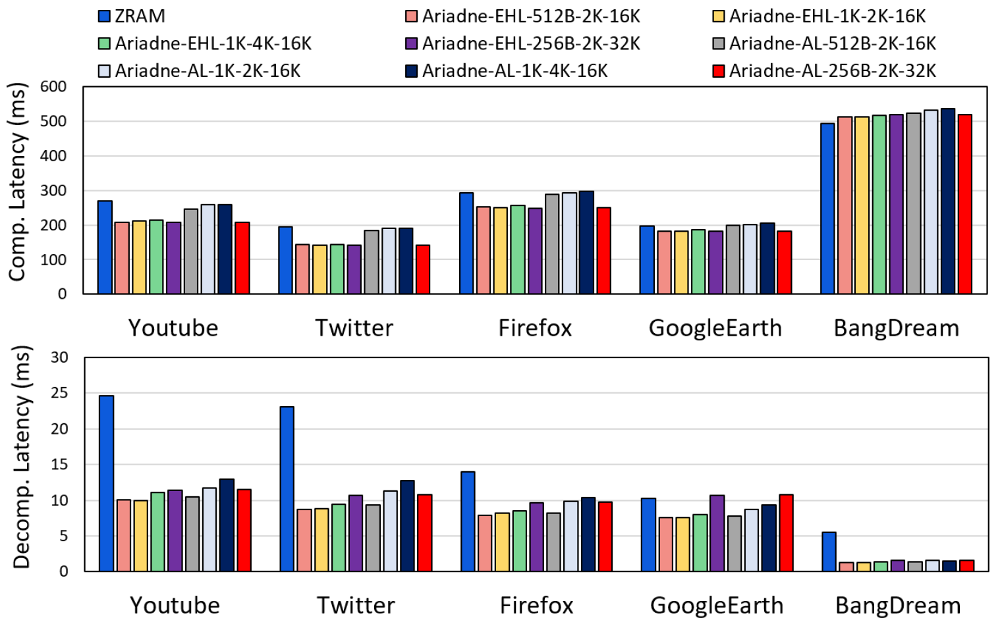{fig-align=center}

## Compression Efficiency

- 60-90% lower decompression latency
- Better compression ratios than ZRAM

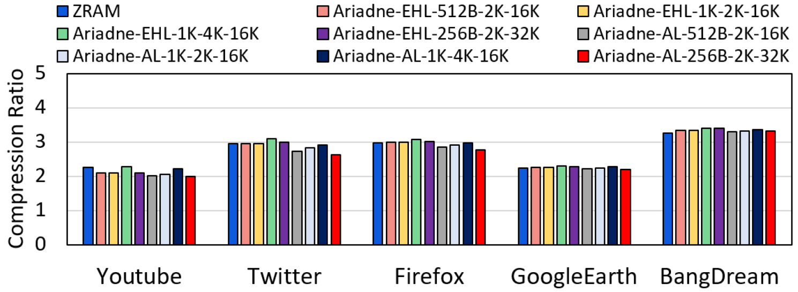{fig-align=center}

## Hotness Identification Accuracy

- 92% accuracy in hot data prediction
- 70% coverage of relaunch-critical data

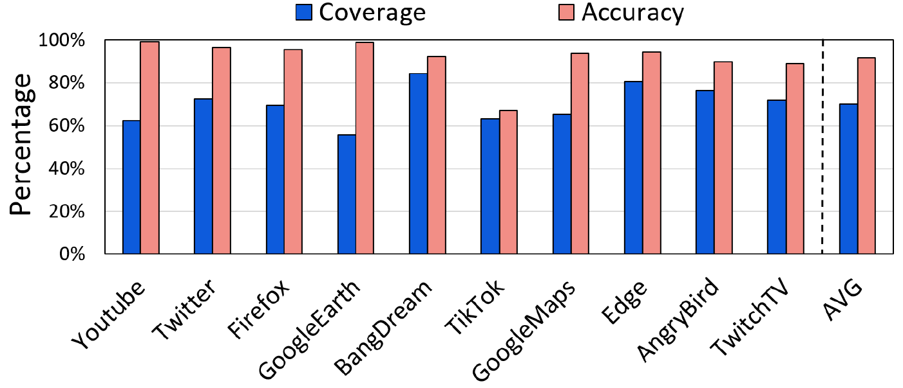{fig-align=center}
