# Background & Motivation

## App Launching is Critical for User Experience

- **Hot-launch**: Switching to a cached background app. (Fast)
- **Cold-launch**: Starting an app from scratch. (Slow)
- Goal: Maximize the number of fast hot-launches.

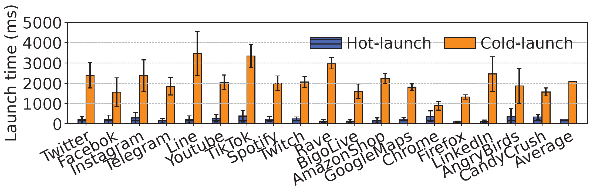{fig-align=center}

## Limited Memory

- Caching more apps requires more memory than available in DRAM.
- **Solution**: Use **swap** to offload memory pages to slower flash storage.

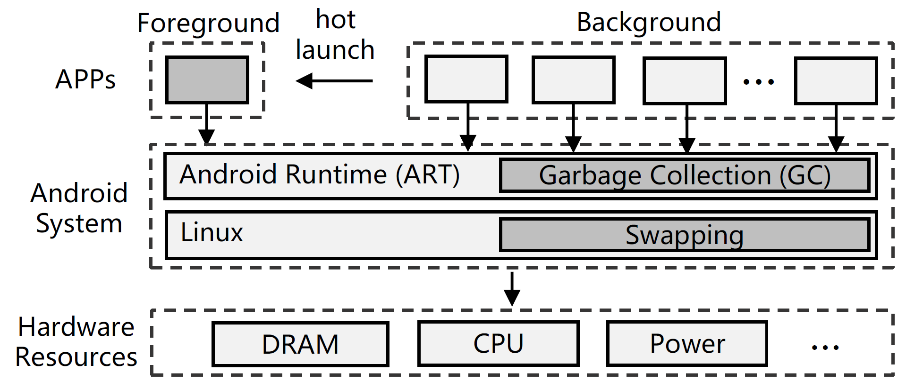{fig-align=center}

## Two-Layer Memory Management

- **Android Runtime (ART)**: A Java Virtual Machine
  - **GC**: trace-based concurrent-copying GC.
    - The GC performs liveness analysis of objects by traversing the object reference graph and copies live objects to a new memory location.
    - *Regions*: a segment of continuous memory containing allocated objects
    - *Mutator threads*: all threads except GC threads.
    - *Roots*: root objects that directly/indirectly reference all objects
    - *Card table*: mapping objects to regions
- **Linux Swap**: extends memory using LRU-based swap

{fig-align=center}

## The Problem: Swap Degrades Hot-Launch Performance

- Enabling swap allows more apps to be cached, but it makes hot-launches much slower, especially tail latency.
- Existing methods like Linux Swap and Marvin suffer from this.

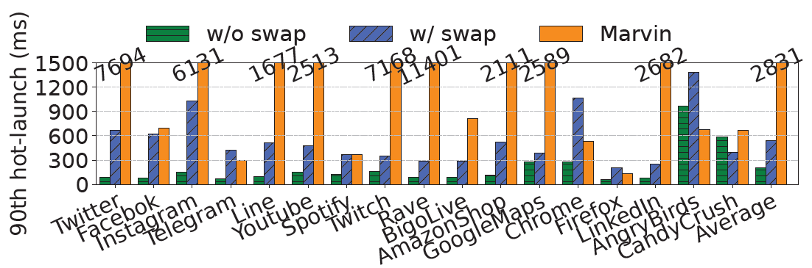{fig-align=center}

## Root Cause 1: GC-Swap Conflict

- When an app is in the background, its Garbage Collector (GC) still runs.
- The GC traces all live objects, forcing pages that were swapped out to be read back into DRAM.
- This causes high I/O and negates the benefit of swap.

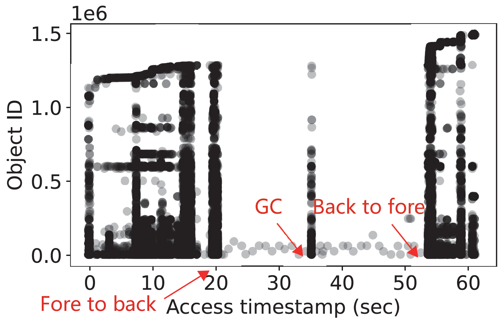{fig-align=center}

## Prior Work: Marvin

- **Goal**: Solve the GC-Swap conflict.
- **Mechanism**:
  - **Decouples an object's references from its data.**
  - *Creates a small "stub" in DRAM containing the references.*
  - Swaps out the object's data to flash.
  - The GC can then trace using the stubs in DRAM, avoiding swap-ins.
- **Limitations**:
  - **Inefficient**: Object-level stubs don't match page-level swap.
  - **Long Pauses**: Requires long "stop-the-world" (STW) pauses.
  - **Launch-Agnostic**: Still uses a generic swap policy, leading to slow hot-launches.

## Root Cause 2: Launch-Agnostic Swapping

- The standard Linux swap mechanism uses a generic LRU policy.
- It is **unaware of hot-launch-critial pages**.
- As a result, it may swap out essential pages, causing major delays when the app is relaunched.

{fig-align=center}

## Observation 1: Fore/Background Object Characteristics

- **Foreground Objects (FGO)**: Allocated when app is in foreground. They are numerous and long-lived.
- **Background Objects (BGO)**: Allocated when app is in background. They are few and short-lived.
- **Insight**: GC should focus on BGOs, leaving FGOs untouched in the background.

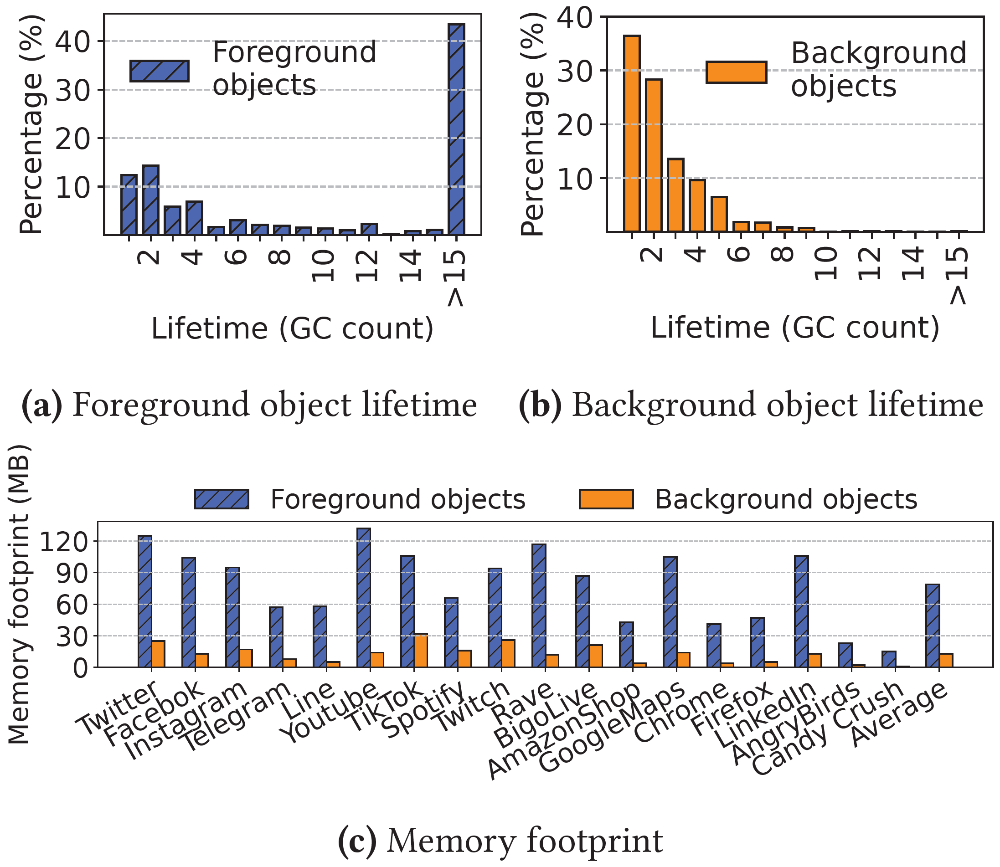{fig-align=center}

## Observation 2: Hot-Launch Access Patterns

- A small, predictable subset of objects are re-accessed during a hot-launch.
  - **Near Root Objects (NRO)**: objects near the roots of the GC reference graph
  - **Foreground Young Objects (FYO)**: objects allocated just before the app is switched to background
- These objects account for ~68% of re-accesses but only ~15% of heap memory.
- **Insight**: We can selectively keep these critical objects in memory.

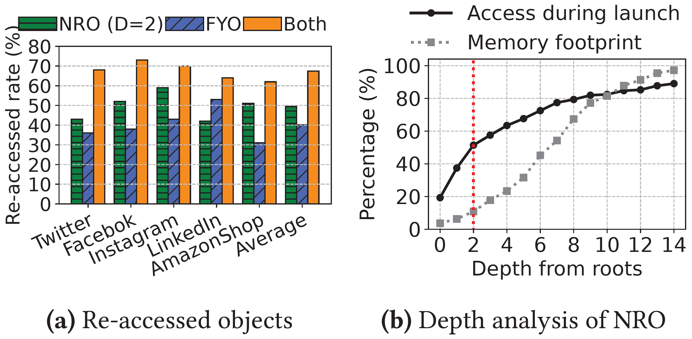{fig-align=center}

# System Design

## Fleet: A GC-Swap Co-design Framework

- **Key Idea**: Use runtime information to make both GC and Swap aware of the app's foreground/background state and hot-launch needs.
- **Two Components**:
  1.  **Background-object GC (BGC)**: A GC that only traces background objects.
  2.  **Runtime-Guided Swap (RGS)**: A swap scheme guided by hot-launch access patterns.

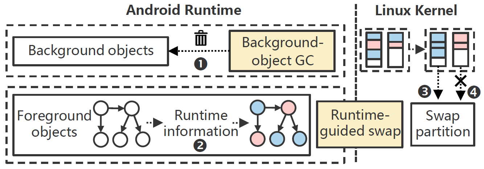{fig-align=center}

## Background-object GC (BGC)

- **Goal**: Solve the GC-Swap conflict.
- **Mechanism**:
  - Divides objects into FGO and BGO.
  - When an app is in the background, BGC restricts its tracing range **only to BGOs**.
  - Uses a card table to track references from FGOs to BGOs.
- **Result**: Avoids touching swapped-out FGOs, preventing unnecessary swap-ins.

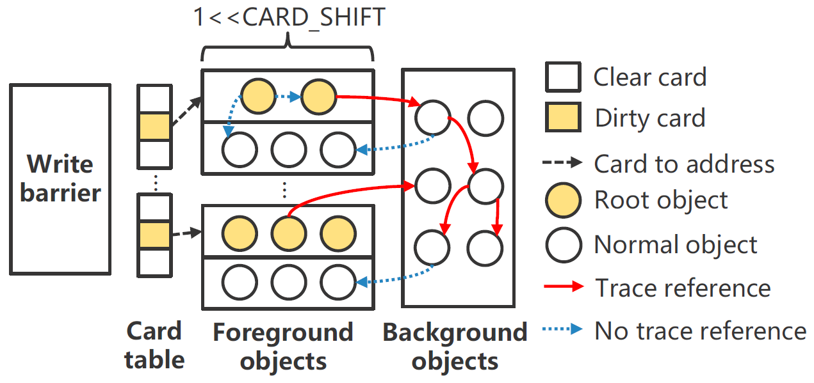{fig-align=center}

## Runtime-Guided Swap (RGS)

- **Goal**: Make swapping launch-aware.
- **Mechanism**:
  1.  **Object Grouping**: After an app is backgrounded, a one-time GC classifies objects into three types:
      - `Launch` (NRO, FYO)
      - `Working Set` (currently used)
      - `Cold` (all others)
  2.  **Page Swapping**: RGS informs the OS kernel of this classification.
      - Kernel actively swaps out `Cold` pages.
      - Kernel keeps `Launch` pages in DRAM.

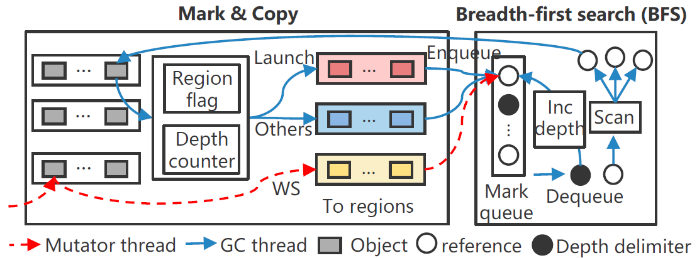{fig-align=center}

# Evaluation

## Experiment Setup

- **Environment**
  - Google Pixel 3
    - 4GB LPDDR4X RAM, Snapdragon 845
    - 2GB Flash-based Swap Partition
  - Android 10 (AOSP)
    - Linux Kernel 4.9
- **Workloads**
  - **Commercial Apps**
    - 18 popular apps from 4 categories (Communication, Multimedia, Tools, Games).
  - **Manually Created Apps**
    - Used to test caching capacity without app-specific bias.
    - Small object apps (512B) & Large object apps (2048B).

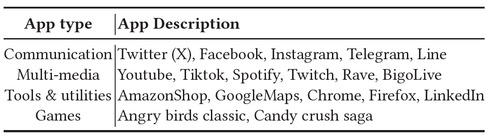{fig-align=center}

## App Caching Capacity

- Fleet caches more apps than Android.
- For commercial apps, Fleet caches a maximum of 17 apps, a **1.21x improvement** over Android with swap.

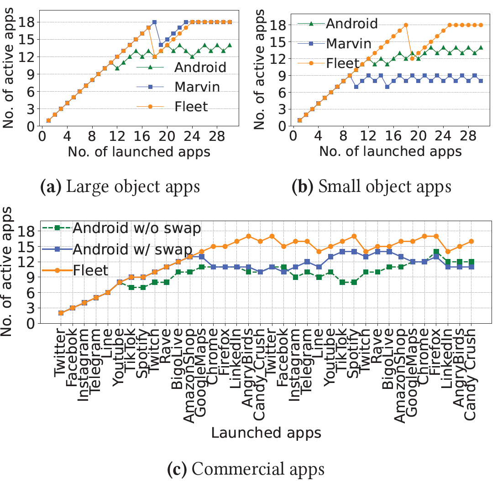{fig-align=center}

## GC Working Set Reduction

- BGC significantly reduces the GC's memory footprint in the background.
- On average, Fleet's GC accesses **7x fewer objects** than Android's GC when an app is in the background.

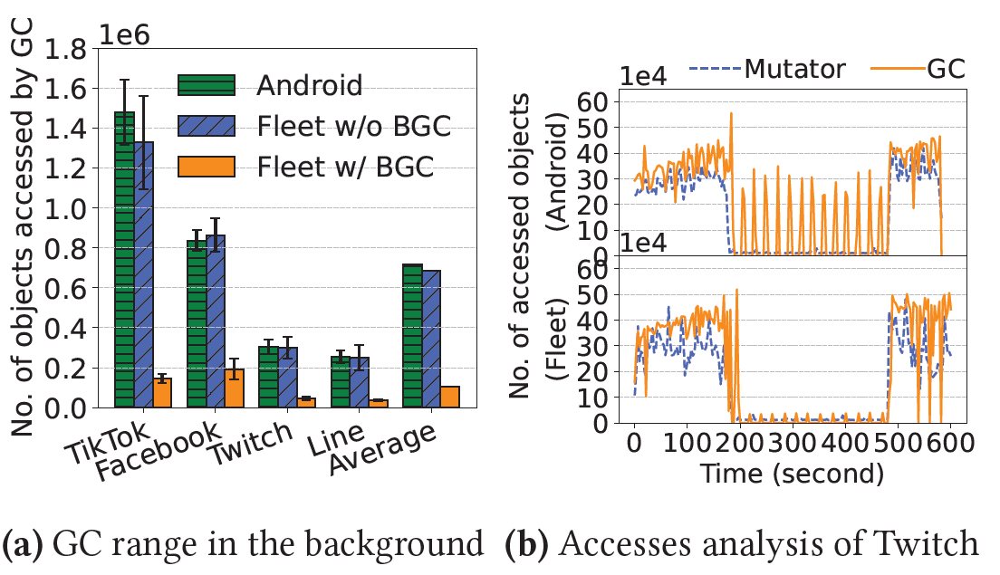{fig-align=center}

## Hot-Launch Performance under high memory pressure

- Fleet provides significantly faster hot-launches under memory pressure.
- On average, Fleet's median hot-launch time is **1.59x faster** than Android and **2.62x faster** than Marvin.

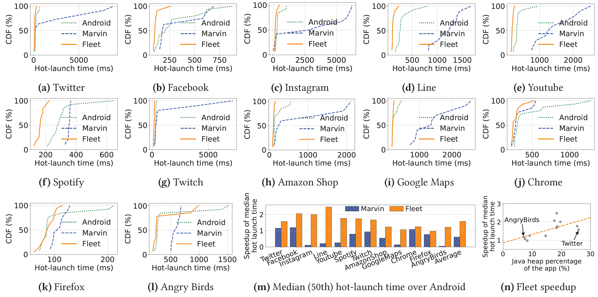{fig-align=center}

## Runtime Overhead

- Fleet's impact on runtime performance is minimal.
- Frame rendering (Jank ratio, FPS) is comparable to the original Android system.
- CPU, memory, and power overhead are negligible.

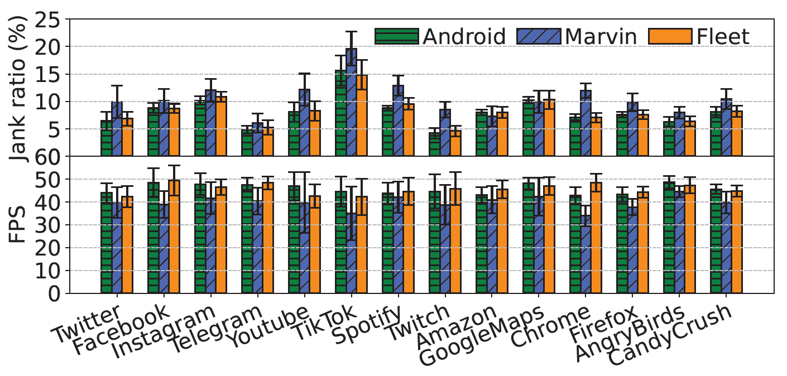{fig-align=center}
