# Background & Motivation

## DNNs are Moving to Mobile

- Modern DNNs (Transformers, LLMs) are enabling powerful AI on mobile devices.
- On-device inference is crucial for:
  - **Privacy**: User data stays on the device.
  - **Low latency**: No network round-trip.
  - **Offline functionality**: Works without an internet connection.

## Data Representation: Tensors and Layouts

- A tensor's layout defines how its multi-dimensional data is stored in linear memory.
- Common layouts in DNNs:
  - **NCHW**: (Batch, **Channels**, Height, Width)
  - **NHWC**: (Batch, Height, Width, **Channels**)
- Different operators have different optimal layouts.
  - CPUs often prefer NCHW.
  - GPUs often prefer NHWC for better memory access patterns.

## The Bottleneck: Layout Transformations

- When a producer operator outputs in one layout (e.g., NCHW) and a consumer operator prefers another (e.g., NHWC), a **layout transformation** is required.
- DNN operators (e.g., Convolution, Attention) have different input data layout preferences.
- This forces frequent, expensive data reorganization (`Transpose`, `Reshape`) between operators.

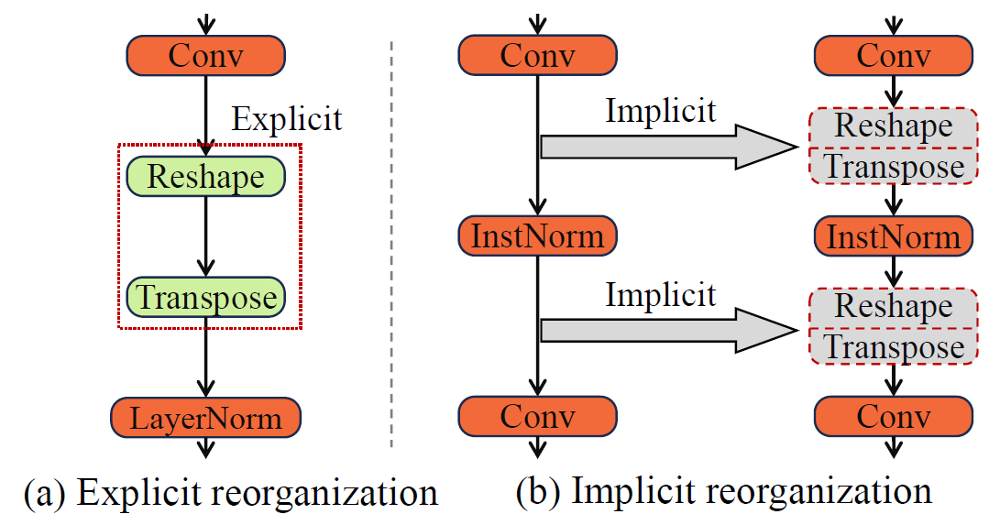{fig-align=center}

## Mobile GPU Texture Memory

- Mobile GPUs have specialized **2.5D Texture Memory**.
- It is optimized for 2D spatial locality, offering huge advantages over standard 1D buffer memory for certain computations.
- However, operations like `Reshape` are non-trivial and expensive on 2.5D memory because they break spatial relationships.

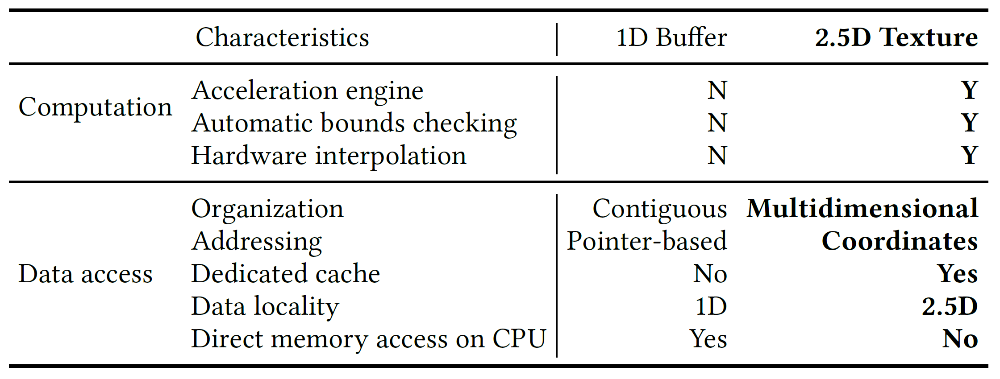{fig-align=center}

## Mobile GPU Texture Memory

- Mobile GPUs have specialized **2.5D Texture Memory**.
- It is optimized for 2D spatial locality, offering huge advantages over standard 1D buffer memory for certain computations.
- However, operations like `Reshape` are non-trivial and expensive on 2.5D memory because they break spatial relationships.

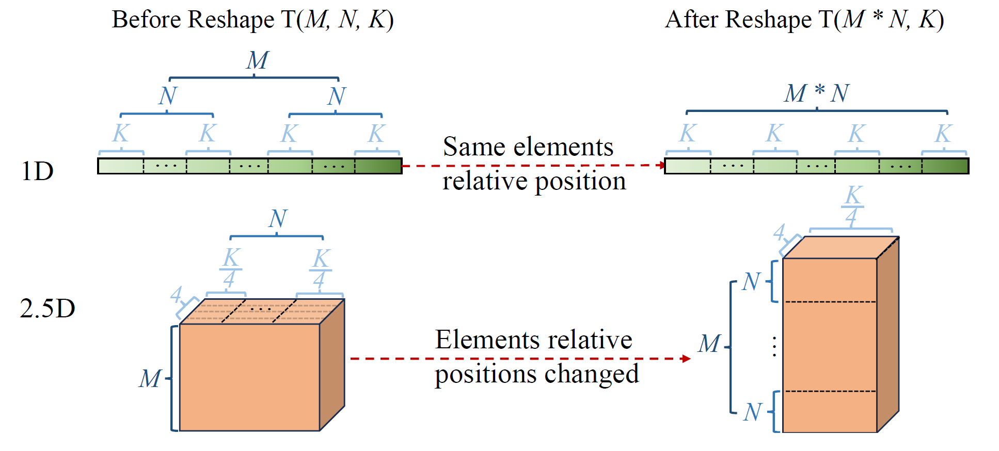{fig-align=center}

## The Cost of Transformations is High

- Modern Transformer models are filled with layout transformations.
- This results in a massive performance bottleneck.

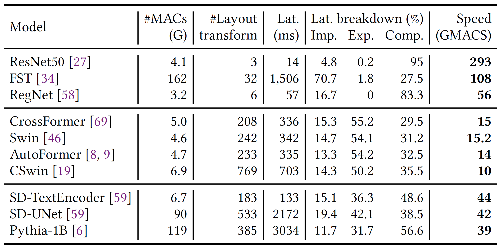{fig-align=center}

- **43% to 70%** of the total execution time are spent on layout transformations.

## Observation

- Most layout transformations are artifacts of rigid framework design and are **unnecessary**.
- **Key Idea**: We can eliminate transformations by designing a single, efficient layout that serves multiple, consecutive operators.

- The goal is to create a framework that can:
  1.  Systematically identify and eliminate layout transformations.
  2.  Select optimal data layouts for remaining operators.
  3.  Adapt these layouts to the specifics of mobile GPU hardware.

# System Design

## SmartMem Overview

- A comprehensive framework with three key components:
  1.  **Operator Classification**
    -   Categorize operators based on their layout sensitivity and flexibility.
  2.  **Layout Transformation Elimination & Selection**
    -   Eliminate unnecessary operators and select optimal layouts for the rest.
  3.  **2.5D Memory Mapping**
    -   Adapt the chosen logical layouts to the physical 2.5D texture memory on mobile GPUs.

## Operator Classification

- Operators are classified along two axes:
  - **Input Layout Dependency (ILD/ILI)**: Is performance sensitive to input layout?
  - **Output Layout Flexibility (Variable/Fixed)**: Can the output layout be customized?
- This creates four categories that guide optimization decisions.

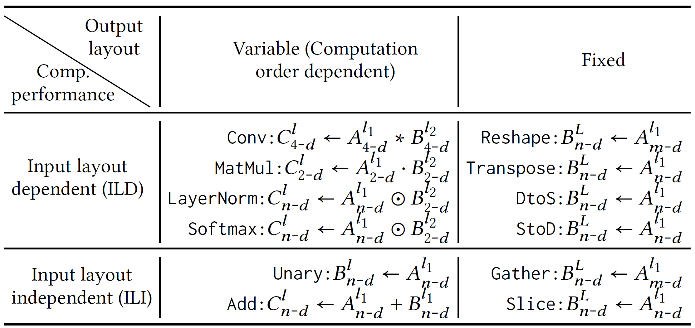{fig-align=center}

## Layout Transformation Elimination

- Pairs of producer-consumer operators are analyzed based on their types.
- Operators with `Fixed` output (like `Reshape`, `Transpose`) are prime candidates for elimination.
- Their functionality is fused into the consumer operator.

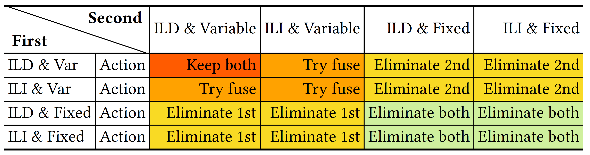{fig-align=center}

## How Elimination Works: Index Transformation

- Instead of physically moving data, memory access indices are transformed.
- A sequence of layout operations is compiled into a simple mathematical formula for calculating addresses.

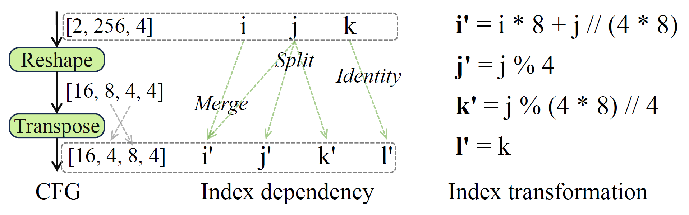{fig-align=center}

## How Layouts are Chosen: Reduction Dimension Heuristic

- **Goal**: Find the best layout for an edge between two operators.
- **Heuristic**: The producer generates data in the layout preferred by the consumer.
- This preferred layout is determined by the consumer's **reduction dimension**—the dimension where most computation occurs (e.g., the K dimension in MatMul).

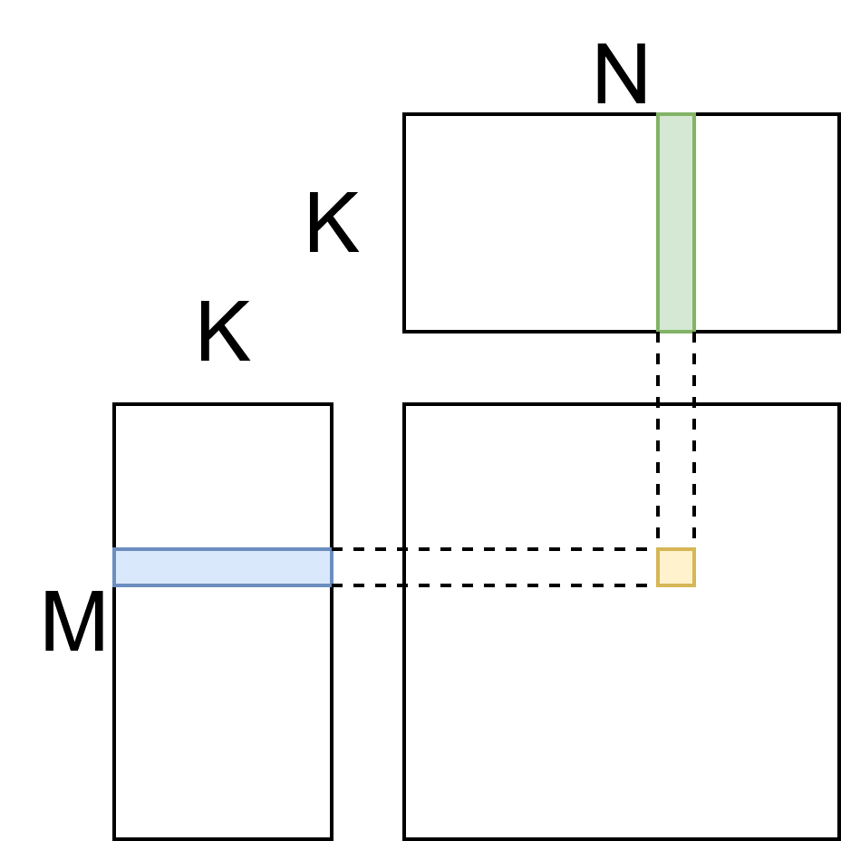{fig-align=center}

## How Layouts are Chosen: Reduction Dimension Heuristic

- **Goal**: Find the best layout for an edge between two operators.
- **Heuristic**: The producer generates data in the layout preferred by the consumer.
- This preferred layout is determined by the consumer's **reduction dimension**—the dimension where most computation occurs (e.g., the K dimension in MatMul).

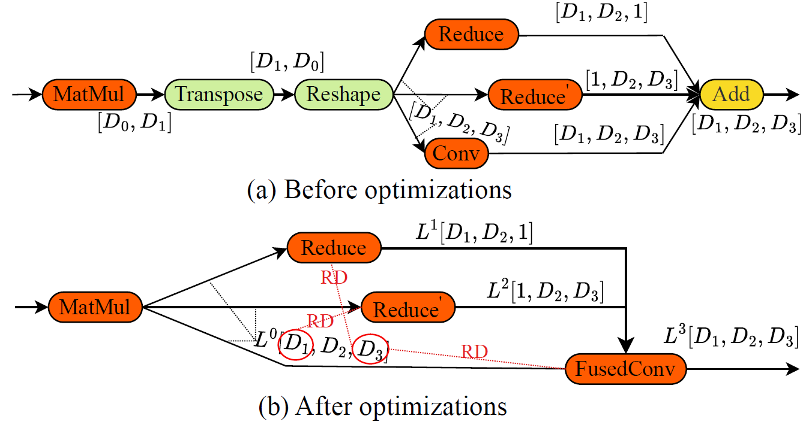{fig-align=center}

## Mapping to 2.5D Texture Memory

- Mobile GPUs have specialized 2.5D texture memory that excels at 2D spatial locality.
- SmartMem intelligently maps a tensor's logical layout to this physical memory.
- Reduction dimensions are mapped to ensure contiguous access, maximizing hardware efficiency.

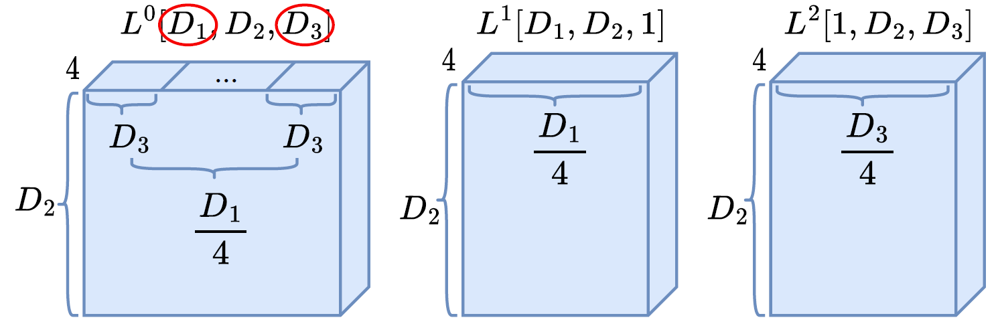{fig-align=center}

## Optimized Data Access

- **Before**: Fragmented memory access, poor locality.
- **After**: Coalesced, stride-1 access along key dimensions.
- This dramatically improves cache performance and SIMD efficiency.

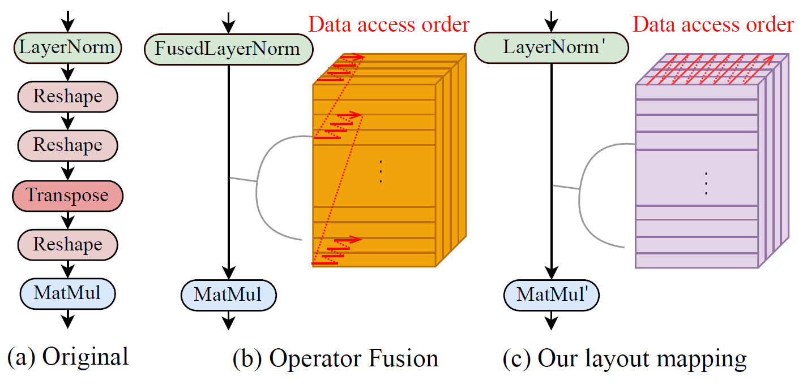{fig-align=center}

# Evaluation

## Experimental Setup

- **Device**: OnePlus phone equipped with Snapdragon 8 Gen 2 SoC with Adreno 740 GPU
- **Workloads**: 18 diverse and modern DNNs
  - Transformers (Swin, ViT), Hybrids (CSwin), CNNs (ConvNext), LLMs (Pythia)
- **Baselines**:
  - MNN, NCNN, TFLite, TVM
  - **DNNFusion**: SOTA fusion framework

## End-to-End Latency

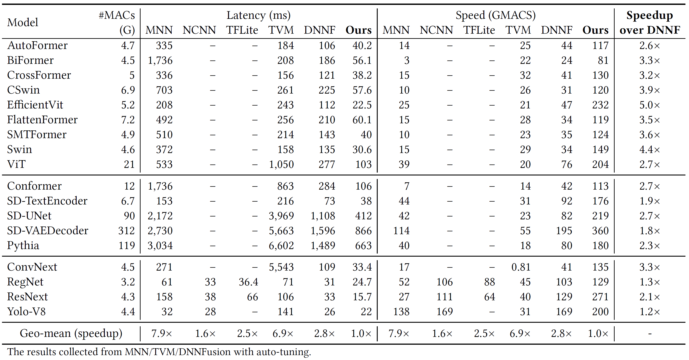{fig-align=center}

- SmartMem significantly outperforms all baselines.
- **2.8x** average speedup over DNNFusion.
- **6.9x** over TVM and **7.9x** over MNN.

## Performance Breakdown

- Layout Transformation Elimination (LTE) provides the largest benefit, especially for Transformers.
- Layout Selection further improves performance by enhancing data locality.

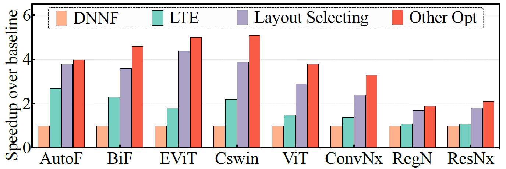{fig-align=center}

## Memory Access

- SmartMem's design directly translates to better hardware utilization.
- It reduces memory accesses and cache misses.

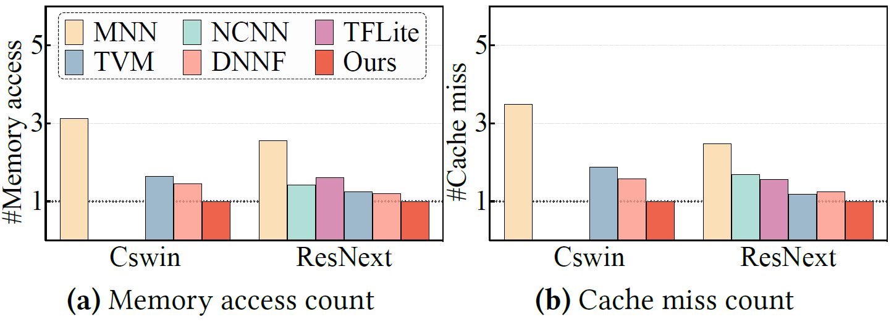{fig-align=center}

- **1.8x** fewer memory accesses & **2.0x** fewer cache misses on average.

## Portability and Scalability

- The performance benefits hold across different hardware and larger problem sizes.

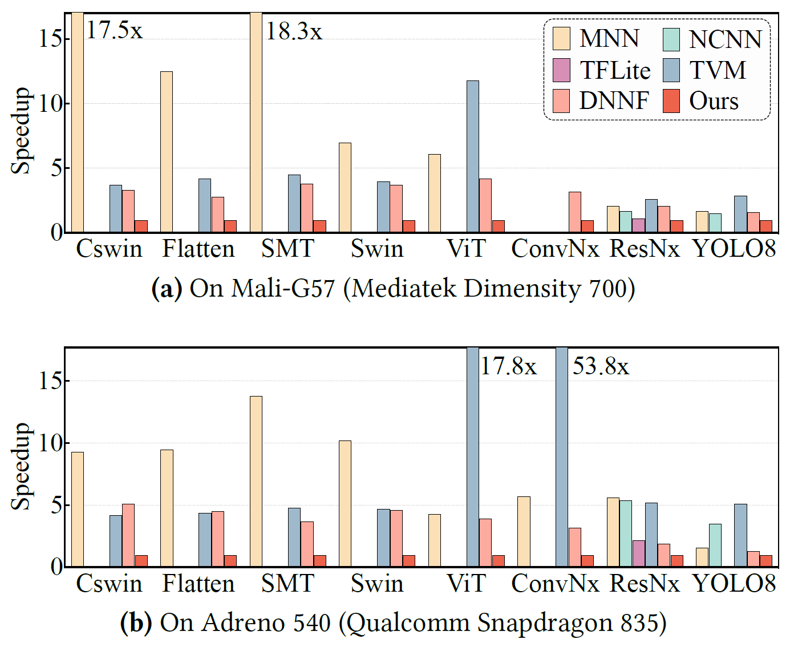{fig-align=center}

- SmartMem also shows benefits on older mobile platforms and desktop-class GPUs.

## Roofline Analysis

- SmartMem effectively utilizes the mobile GPU's computational power.
- Achieves **24% - 35%** of the theoretical peak performance, pushing the limits of the hardware for complex models.

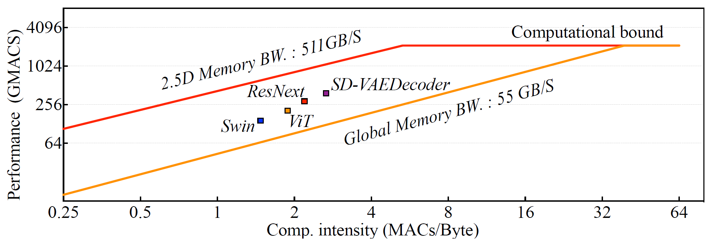{fig-align=center}
