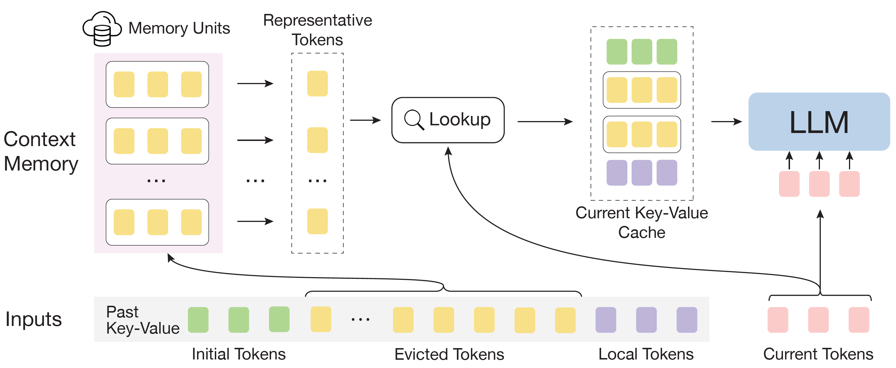
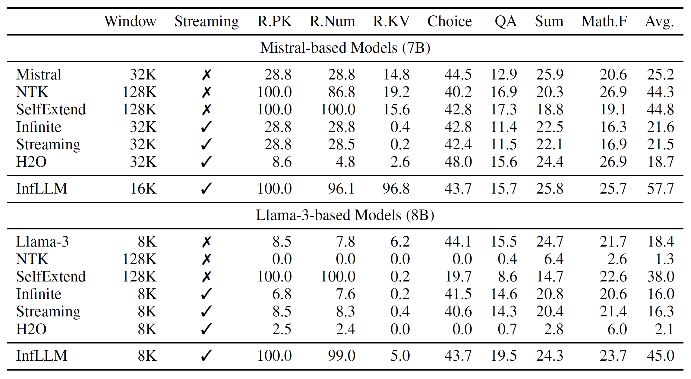
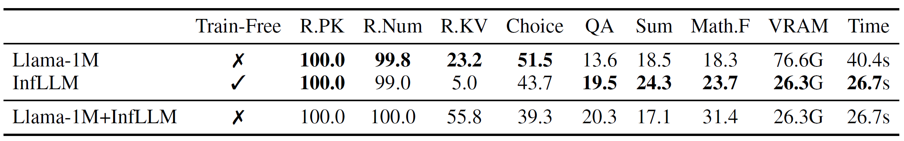
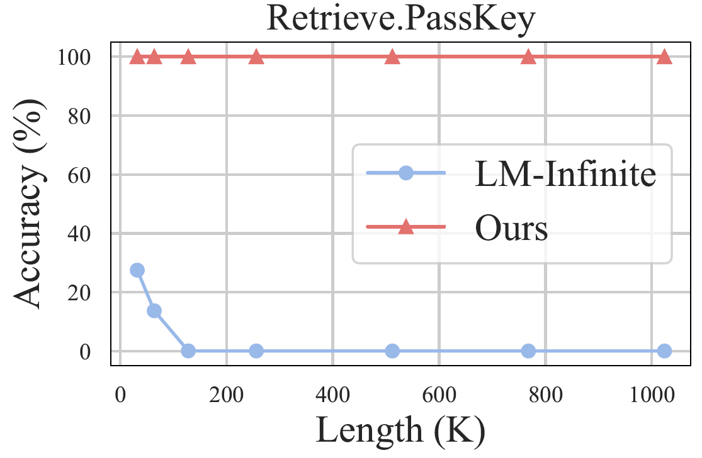
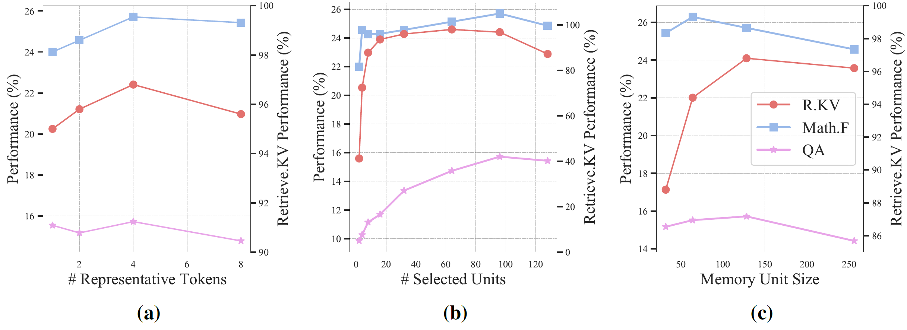

# Background & Motivation

## The Long-Context Problem

- LLMs are a cornerstone for applications with streaming inputs (e.g., LLM-driven agents).
- However, **existing LLMs are pre-trained on sequences with a restricted maximum length.**
- They cannot process longer sequences due to **out-of-domain** and **distraction** issues.

## Common Solutions & Their Drawbacks

- **Continual Pre-training:**
  - Involves training LLMs on longer sequences.
  - Introduces expensive computational overhead.
  - Requires large-scale, high-quality long-sequence datasets.
  - Can uncontrollably change model capabilities.

- **Sliding Window Attention:**
  - Discards distant contexts to process streaming inputs.
  - Fails to capture long-distance dependencies, leading to information loss.

## Motivation

- Can we unveil the **intrinsic capacity** of LLMs to understand extremely long sequences **without any fine-tuning**?
- The goal is to develop a training-free method that allows LLMs to:
  - Efficiently process long sequences with a limited context window.
  - Effectively capture long-distance dependencies.

# System Design

## InfLLM: Overall Framework

- InfLLM combines a **sliding window** with an efficient **context memory**.
- For each step, the model attends to:
  - **Initial tokens** (e.g., system prompts).
  - **Local tokens** (the sliding window).
  - **Relevant memory units** retrieved from the distant context.

{fig-align=center}

## Context Memory: Block-Level Units

- To avoid massive computation, InfLLM does not store every past token individually.
- Past key-value (KV) vectors are grouped into **blocks**, which serve as memory units.
- This leverages the local semantic coherence of long sequences.

## Context Memory: Efficient Lookup

- **Representative Tokens:**
  - Within each block, a few semantically important tokens are selected as "representative tokens".
  - These tokens act as a summary for the entire block.
  - Representative score of token $m$ within a KV block.
    $$
      r_m \;=\; \frac{1}{L} \sum_{j=1}^{L} q_{m+j}\!\cdot\!k_m
    $$
  - The relavance between token $m$ and future query vectors ($m+j$) 
- **Relevance Computation:**
  - To find relevant context, the model computes relevance scores between the current query and the representative tokens of each block.
  - Only the most relevant blocks are loaded for attention computation.
  - $$
       \mathrm{sim}(X,B) \;=\; \sum_{i=1}^{l_X}\;\sum_{j=1}^{r_k}  
       q_{i+\!l_P}\!\cdot\!k^B_{b_j}
     $$

## Cache Management & Offloading

- To handle extremely long sequences with limited GPU memory, InfLLM employs an offloading mechanism.
- Most memory units are stored in CPU memory.
- A LRU cache is maintained on the GPU to keep frequently needed units readily available.
- This enables processing of >100K token sequences with just 26G of VRAM.

# Evaluation

## Experiment Setup

- **Base Models:**
  - Mistral-7B-Instruct-v0.2 (32K context)
  - Llama-3-8B-Instruct (8K context)
- **Benchmarks:**
  - **$\infty$-Bench:** Average sequence length of 145.1K tokens.
  - **LongBench:** 95% quantile for sequence lengths is 31K.
- **Baselines:**
  - Original models, NTK, SelfExtend, LM-Infinite, StreamingLLM, H2O.

## $\infty$-Bench

- InfLLM significantly outperforms baseline models, especially those using only a sliding window.
- It successfully generalizes Llama-3 from an 8K context to over 16 times its length.
- This demonstrates that the context memory effectively supplements the model with relevant long-range information.

{fig-align=center}

## Comparison with Continual Training

- InfLLM is compared against Llama-3-8B-Instruct-Gradient-1048k (Llama-1M), a model fine-tuned on long sequences.
- InfLLM achieves comparable or superior results **without any training**.
- It uses only **34%** of the GPU memory and achieves a **34%** decrease in time consumption.

{fig-align=center}

## Scaling to 1,024K Context

- On the Retrieve.PassKey task, InfLLM is tested on sequences up to 1,024K tokens.
- InfLLM maintains nearly 100% accuracy, effectively locating the key information.
- The baseline (LM-Infinite) fails as sequence length increases because the key is outside its local window.

{fig-align=center}

## Impact of Memory Settings

- The performance of InfLLM is influenced by the configuration of its context memory.
- Ablation studies show the impact of:
  - (a) Number of representative tokens per unit.
  - (b) Number of memory units selected per step.
  - (c) The size of each memory unit.
- These results help in finding an optimal balance between performance and computational cost.

{fig-align=center}
