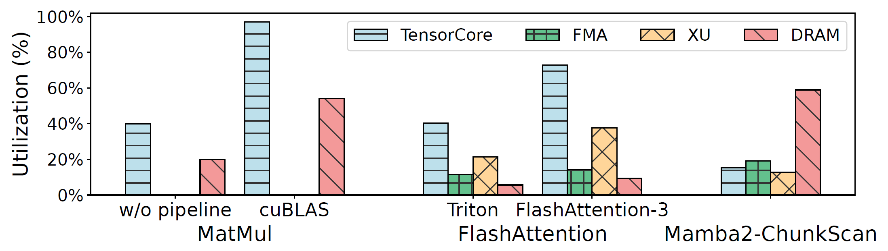
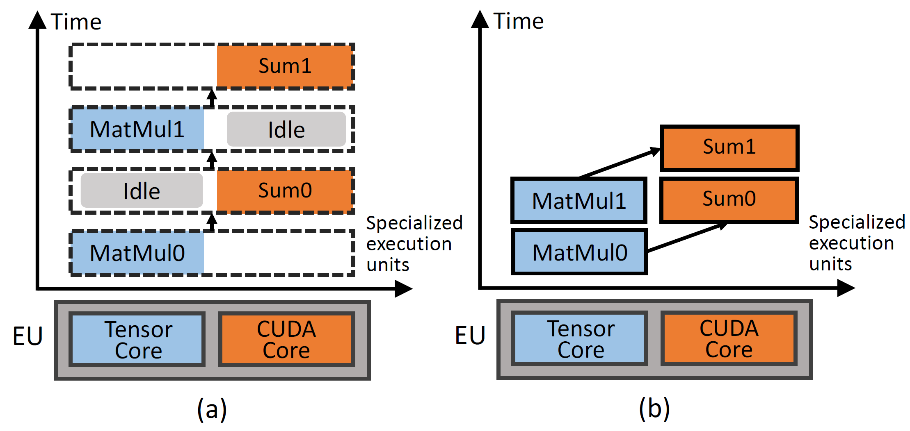
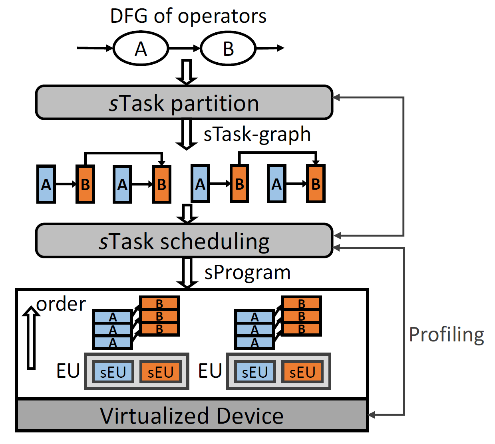
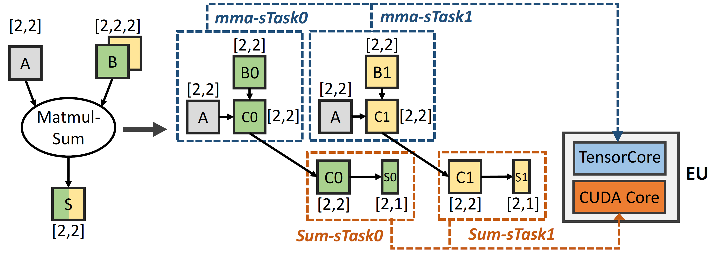
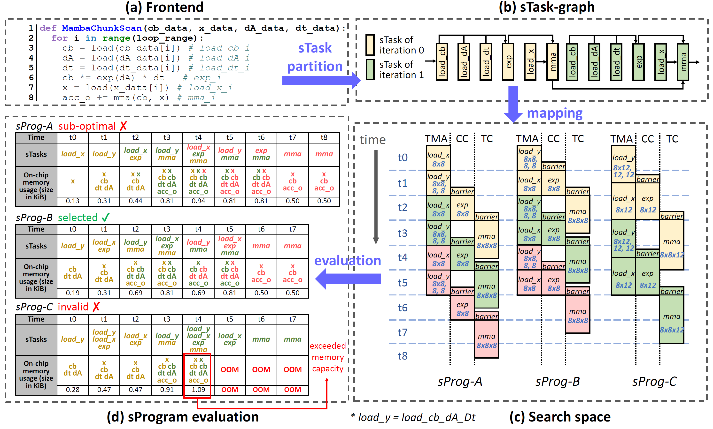
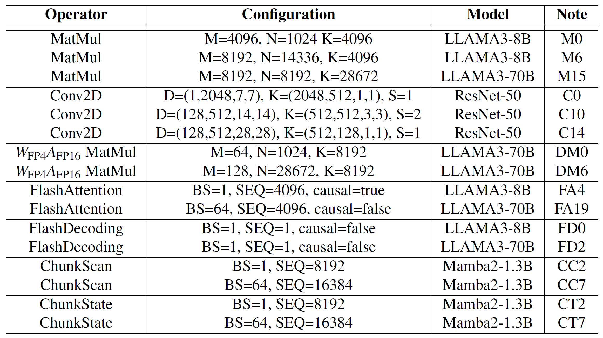
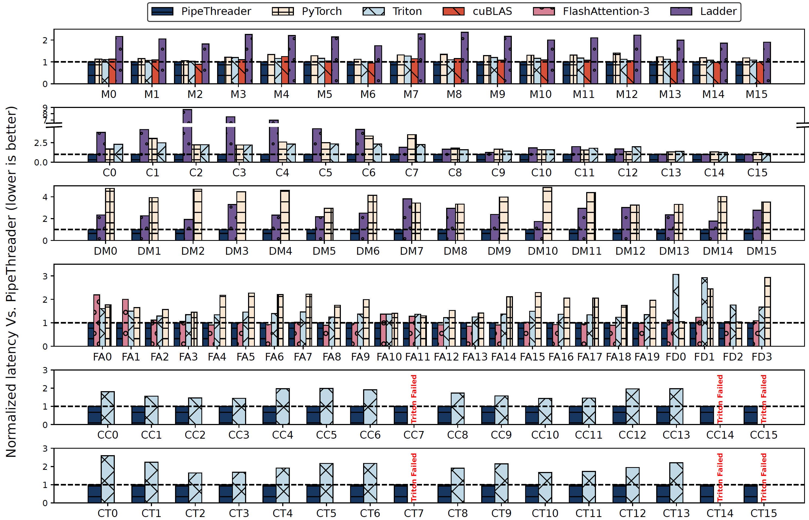
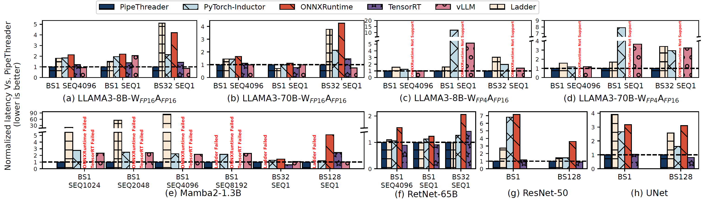
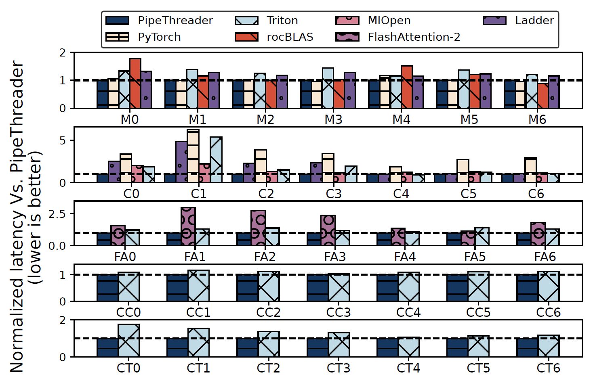

# Background & Motivation

## The Challenge: Increasing Complexity

- **Hardware Evolution**: Modern GPUs feature heterogeneous specialized units like **TensorCores** and **Tensor Memory Accelerators (TMA)** to meet the demands of large DNNs.
- **Software Evolution**: Developers fuse operators (e.g., FlashAttention) into single kernels to maximize data reuse and reduce memory pressure.

## The Problem: Hardware Under-utilization

- Traditional GPU programming models treat SMs as uniform units, **ignoring their internal heterogeneity**.
- This leads to **inefficient scheduling**, where specialized units like tensor cores are often idle, waiting for other operations to complete.
- Expert-tuned kernels like FlashAttention-3 are required to **improve utilization**, but this process **is difficult and time-consuming**.

{fig-align=center}

## The Bottleneck: Manual Optimization

- Hand-crafting efficient pipeline schedules is difficult, error-prone, and sensitive to hardware architecture and model specifics.
- This approach is hard to generalize and not portable across different GPU types (e.g., NVIDIA vs. AMD) or for new models archs.

{fig-align=center}

## The Opportunity: Software-Defined Pipelining

- Since **specialized hardware processes data at a large granularity (tensor tiles)**, scheduling can be effectively managed by software.
- **Motivation**: Shift pipeline scheduling from implicit, limited hardware control to explicit, powerful **software control**.
- This allows for the automatic discovery of sophisticated pipelines that fully exploit heterogeneous hardware.

# System Design

## System Overview

- PipeThreader takes a DNN operator graph and transforms it into an optimized, executable program.
- It introduces two key abstractions: **specialized tasks (sTasks)** and **specialized execution units (sEUs)** to enable fine-grained, pipeline-aware scheduling.

{fig-align=center}

## Core Abstractions: sTask & sEU

- **sTask (Specialized Task)**: The basic unit of computation designed to run on a specific type of hardware unit.
    - For example, a fused operation is broken into `mma-sTasks` for tensor cores and `Sum-sTasks` for CUDA cores, enabling them to run in parallel.
- **sEU (Specialized Execution Unit)**: A hardware abstraction that exposes the heterogeneous units within each GPU SM (e.g., tensor core, TMA, CUDA core) to the compiler.

{fig-align=center}

## From sTask-Graph to sProgram

- **sTask-Graph**: The input operator graph is partitioned into an `sTask-graph`, which represents the computation and its fine-grained data dependencies at the tile level.
    - PipeThreader supports both **spatial** and **reduction** partitioning to unlock more pipelining opportunities.
- **sProgram**: The scheduler maps the `sTask-graph` to the hardware's sEUs, generating an `sProgram`. This is a concrete execution plan specifying which sTask runs on which sEU and in what order.

## From sTask-Graph to sProgram

{fig-align=center}

## Two-Level Scheduling Policy

- PipeThreader's scheduler finds an optimal `sProgram` by balancing tiling and pipeline parallelism.
- **Inter-EU Scheduling**: Partitions the workload (`sTask-graph`) across the GPU's main execution units (EUs/SMs) for SPMD-style data parallelism.
- **Intra-EU Scheduling**: Within each EU, a greedy algorithm schedules sTasks onto the heterogeneous sEUs to create an efficient pipeline.
    - Guided by a **profiler** to ensure schedules are valid and respect on-chip memory constraints.

# Evaluation

## Experimental Setup

- **Hardware**:
    - NVIDIA H100 (80GB)
    - AMD Instinct MI300X (192GB)
- **Workloads**:
    - LLMs (LLAMA3, RetNet)
    - State Space Models (Mamba2)
    - CNNs (ResNet-50, UNet).
- **Baselines**:
    - SOTA compilers: OpenAI Triton, Ladder, PyTorch-Inductor
    - Vendor libraries: cuBLAS, TensorRT
    - Expert-tuned kernels: FlashAttention-3

{fig-align=center}

## Operator Performance

- **FA:** 1.07x average speedup over the expert-tuned FlashAttention-3.
- **Mamba:** Up to 1.99x speedup for ChunkScan and 2.59x for ChunkState over the Triton.
- **MM:** Matches cuBLAS performance, much better than other compilers.

{fig-align=center}

## End-to-End Performance

- The benefits at the operator level translate to significant end-to-end gains.
- **LLAMA3 (FP16)**: Outperforms PyTorch-Inductor by 1.79x, TensorRT by 1.28x, and vLLM by 1.10x on average.
- **Mamba2**: Achieves up to 2.76x speedup over PyTorch-Inductor.
- **ResNet-50 & UNet**: Shows speedups of 2.54x over PyTorch-Inductor and is comparable to TensorRT.

{fig-align=center}

## Portability: Performance on AMD MI300X

- PipeThreader's abstractions generalize well to different hardware architectures.

{fig-align=center}
