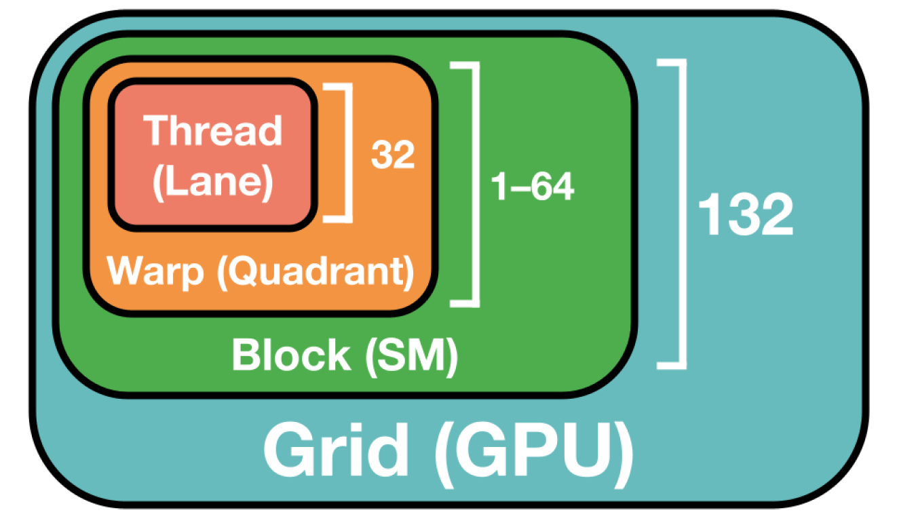
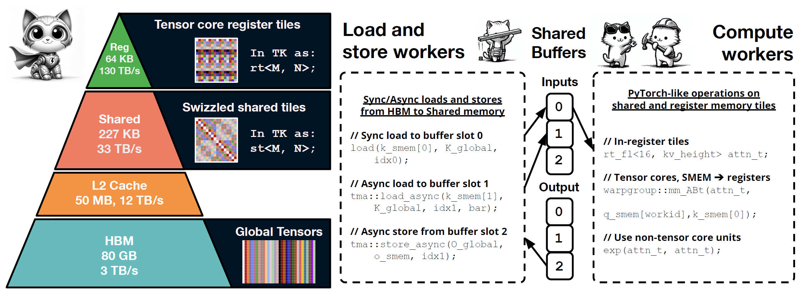
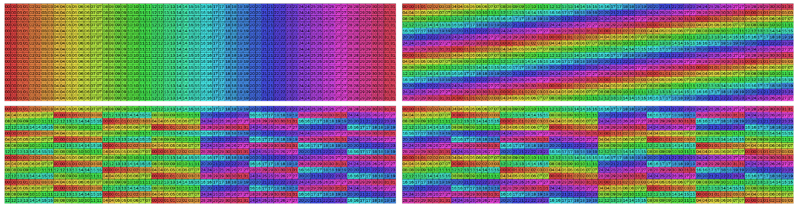
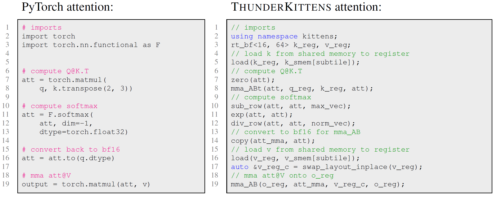
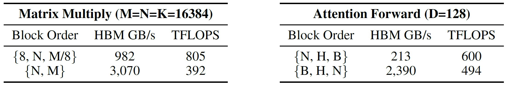
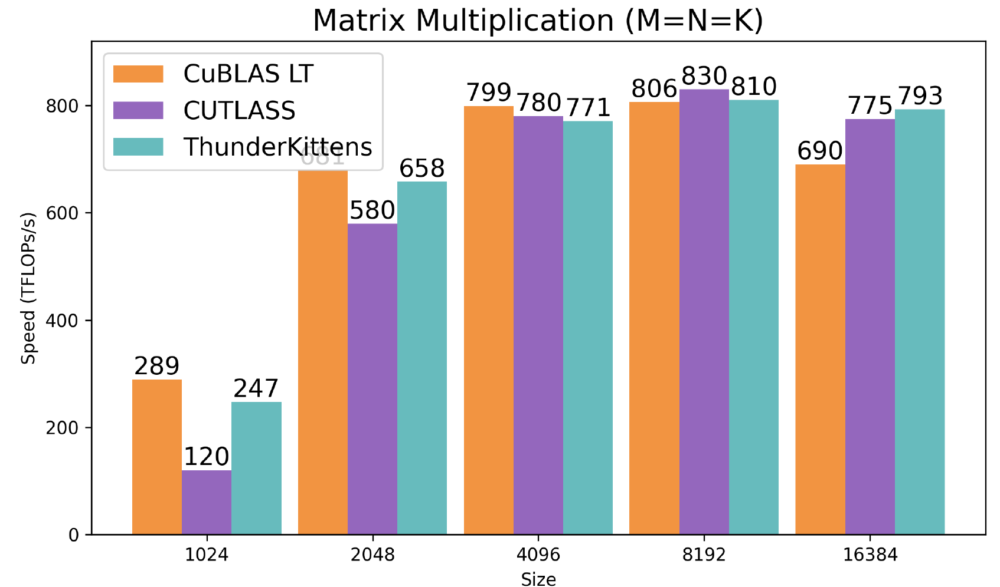
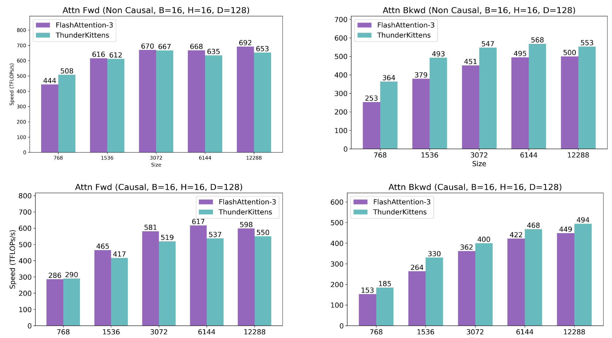
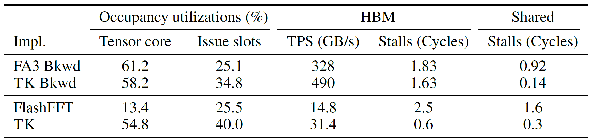

# Background & Motivation

## The AI Kernel Bottleneck

- Efficiently mapping AI architectures to GPUs is a critical bottleneck in AI progress.
- Hand-written custom kernels are complex to write and often fail to reach theoretical performance limits.
- Even well-established operations like attention suffer from poor kernel support.
  - *Example*: FlashAttention-2 had a 47% performance degradation on the H100 GPU, and it took over two years to develop FlashAttention-3.

## The GPU Parallelism Hierarchy

Modern GPUs have three levels of parallelism that kernels must effectively manage.

{fig-align=center}

- **Warp-level**: Groups of threads executing instructions. Performance is sensitive to memory layouts and bank conflicts.
- **Block-level**: Groups of warps that share data on a physical core. Higher occupancy can hide latency.
- **Grid-level**: Many thread blocks executing a kernel. Communication via slow global memory.

## The Framework Trade-off

- **High-Performance Libraries (e.g., CUTLASS)**
  - Extremely powerful and flexible (C++ embedded).
  - Very complex, with a steep learning curve due to nested templates.

- **Compiler-Based Approaches (e.g., Triton)**
  - Simpler, high-level interfaces.
  - Fewer optimization options and challenging to use specialized hardware instructions.

## Goal

How far can we go by choosing a **small and opinionated set of abstractions**?

Can we build a framework that is:

- **Easy to use**, learn from, and maintain?
- **High-performance** for a broad range of AI primitives?
- **Simple**, without sacrificing the ability to achieve peak performance?

# System Design of ThunderKittens (TK)

TK is a framework for writing performant AI kernels, built on abstractions that map to the GPU hierarchy.

1.  **Warp-level**: Tile data structures with managed layouts.
2.  **Block-level**: A program template for asynchronous work.
3.  **Grid-level**: Scheduling for pipelining thread-blocks.

{fig-align=center}

## Warp Level: Tiles & Managed Layouts

- **Tile Data Structures**: The basic data structure is a 16x16 matrix tile, maximizing compatibility with tensor cores.
- **Managed Layouts**: TK automatically picks optimal memory layouts to minimize bank conflicts, a common performance killer.

{fig-align=center}

*Top Left: A naive layout with 8-way bank conflicts. Bottom: TK's layouts with 2-way and no bank conflicts.*

## A Familiar, PyTorch-like Interface

TK provides a concise set of parallel operations on tiles, making kernel code look similar to high-level PyTorch code.

{fig-align=center}

*This simplified interface makes complex GPU programming more accessible.*

## Block Level: Generalized Asynchronous Template

- TK provides a **Load-Compute-Store-Finish (LCSF)** template based on the producer-consumer paradigm.
- The developer only needs to populate a few boilerplate functions.
- The template hides memory latency through pipelining and manages synchronization, drastically simplifying asynchronous programming.

## Grid Level: Pipelining & L2 Reuse

- TK makes it easy to coordinate thread block launches to reduce overheads and improve memory reuse.
- **Persistent Grid**: Launch a full set of blocks upfront and feed them tasks, minimizing launch costs and pipeline bubbles.
- **Block Launch Order**: Optimizing the order in which blocks are launched significantly improves L2 cache reuse and reduces slow HBM accesses.

{fig-align=center}

*Changing the block order for Matrix Multiply reduces HBM bandwidth from 3,070 GB/s to 982 GB/s and more than doubles performance.*

# Evaluation

## GEMM kernel

- A single TK matrix multiply kernel (40 lines of code) is competitive with the strongest, highly-tuned baselines like CuBLAS and CUTLASS.

{fig-align=center}

## Attention kernel

- TK matches FlashAttention-3 on forward pass performance.
- TK **outperforms FlashAttention-3 by 10-40%** on the backward pass.

{fig-align=center}

## Why is TK Faster?

NCU profiles reveal TK's efficiency gains. For the attention backward pass, compared to FlashAttention-3, TK:

- Achieves higher HBM memory throughput (490 vs 328 GB/s).
- Incurs **85% fewer stalled cycles** on shared memory.
- TK has **no bank conflicts**, while the profiler reports up to 9.6-way bank conflicts in FA-3.

{fig-align=center}
