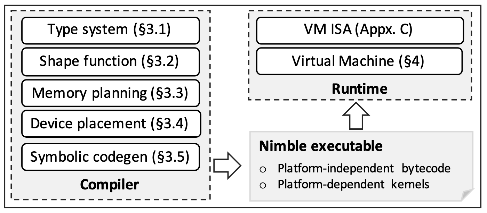

# Background & Motivation

## Static-first stacks meet dynamic models

- Modern DNNs increasingly use dynamic features:
  - Control Flow (e.g., LSTMs)
  - Dynamic Data Structures (e.g., Tree-LSTMs)
  - Dynamic Tensor Shapes (e.g., BERT)
- Static compilers/runtimes stumble (shape unknowns, path-dependent work)
- Need: IR + codegen + runtime that treat **dynamism** as a first-class concern

## Gaps in prior systems

- No IR that safely **tracks `Any`/unknown dims**
- Lack of **shape functions** to compute output shapes at runtime
- Missing **symbolic-shape codegen** & **shape-based dispatch**
- Runtimes aren’t **lightweight or cross-platform**

- Compilers offer a portable and lightweight alternative, but current ones lack support for dynamism.
- **Key Missing Features:**
  - An Intermediate Representation (IR) for dynamism.
  - Optimizations for dynamic behavior (e.g., memory planning).
  - A code generator for kernels with symbolic (dynamic) shapes.
  - A flexible runtime to handle dynamic execution paths.

## Goal

- A **high-performance** and **flexible** system to optimize, compile, and execute dynamic neural networks on multiple platforms.
- **Design Goals:**
  - Support all types of model dynamism.
  - Be portable and lightweight for cloud and edge devices.
  - Achieve high performance across different hardware.

# Design

## System Architecture

{fig-align=center}

- **Compiler**: Handles dynamic models through a series of specialized optimizations.
- **Runtime**: A lightweight VM that executes the compiled model.
- **Flow**: A model is converted to a unified IR, optimized, and compiled into an executable containing platform-agnostic bytecode and platform-dependent kernels.

## Compiler: Handling Dynamism

- **Dynamic Type System**: Introduces a special `Any` dimension to represent statically unknown tensor dimensions.
- **Shape Functions**: Computes output shapes at runtime, enabling dynamic memory allocation.
- **Dynamic Memory Planning**: Makes memory allocations explicit in the IR, allowing for static optimization of dynamic allocations.

## Compiler: Heterogeneous Device Placement

<!-- Figure 2: Some heterogeneous device placement rules. -->

{fig-align=center}

- A unification-based analysis places computations on the most suitable device (CPU or GPU).
- Minimizes expensive cross-device data transfers and synchronization.
- For example, shape functions are always placed on the CPU.

## Compiler: Symbolic Codegen

- **Challenge**: Generating high-performance kernels for operators with dynamic shapes.
- **Solution**:
  - Generate multiple specialized kernels based on the residues of a tiling factor.
  - At runtime, a dispatch function invokes the correct kernel based on the actual input shape.
  - Achieves performance nearly identical to statically compiled kernels.

## A Lightweight VM-based Runtime

- A simple graph-traversing runtime is insufficient for dynamic models.
- Nimble uses a VM-based runtime that:
  - Executes platform-independent bytecode to handle control flow and orchestration.
  - Dispatches highly optimized, platform-dependent operator kernels.
  - Uses coarse-grained instructions to minimize dispatch overhead.

# Evaluation

## Setup & baselines

- **HW (EC2)**: Intel Skylake CPU, Nvidia T4 GPU, ARM Cortex-A72
- **Models**: LSTM (control flow), Tree-LSTM (data structure), BERT (dynamic shapes)
- **Baselines**: TensorFlow, MXNet, PyTorch, DyNet, TensorFlow Fold

## Overall performance (headline)

- **BERT latency**: Nimble beats best alternative by **1.5× (Intel)**, **1.3× (Nvidia)**, **1.05× (ARM)**
- Gains from **library interop** + **deeper fusion** via compiler

## Microbenchmarks (what pays off)

{fig-align=center}

- **VM overhead** small; often overlapped on GPU
- **Memory planning**: fewer allocs, much lower alloc latency
- **Symbolic codegen** with full dispatch ≈ static-shape kernels
