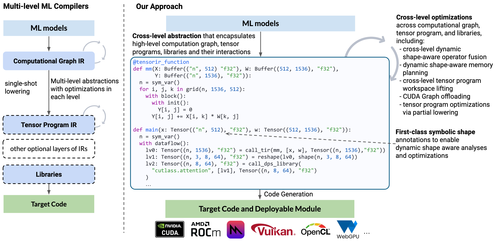
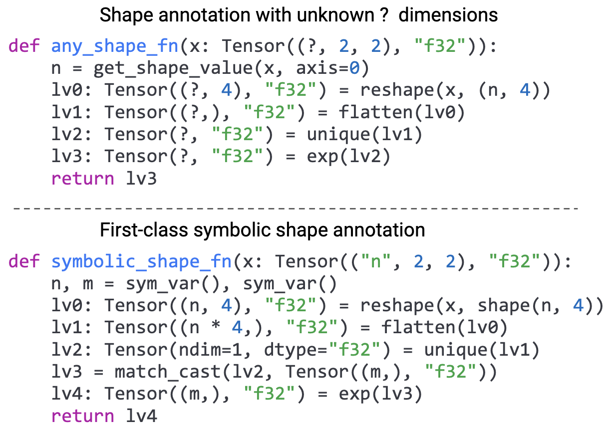
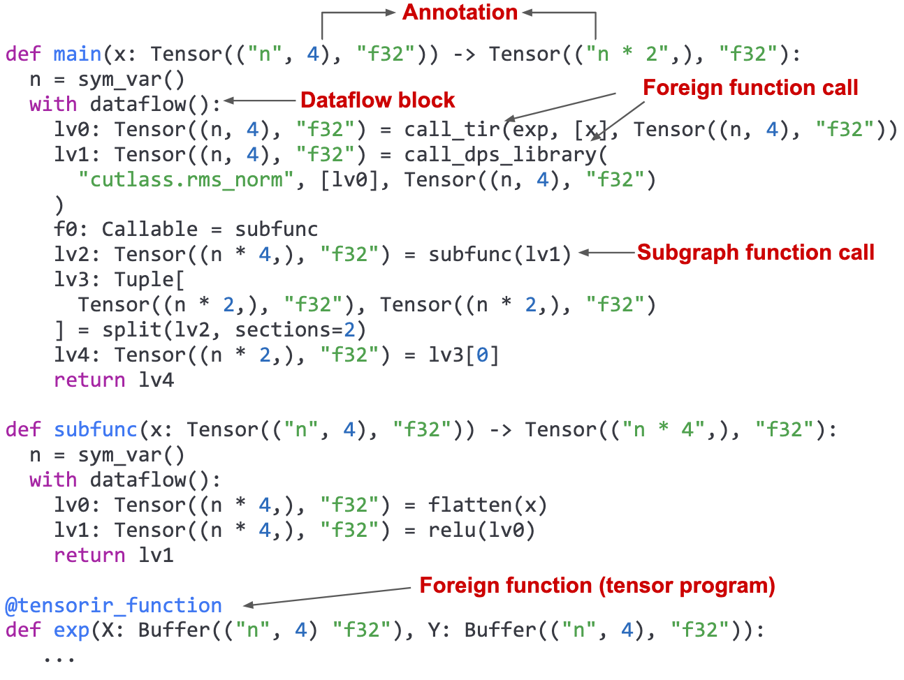
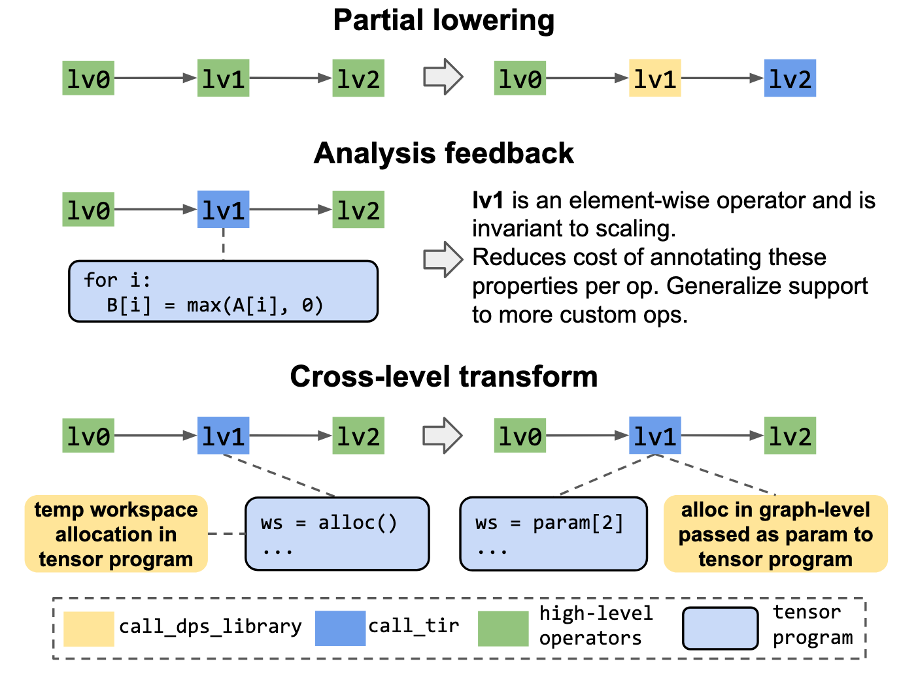
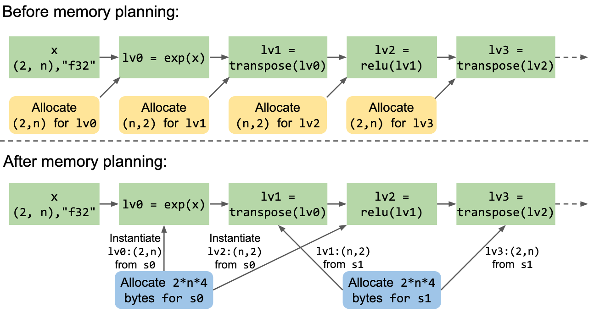
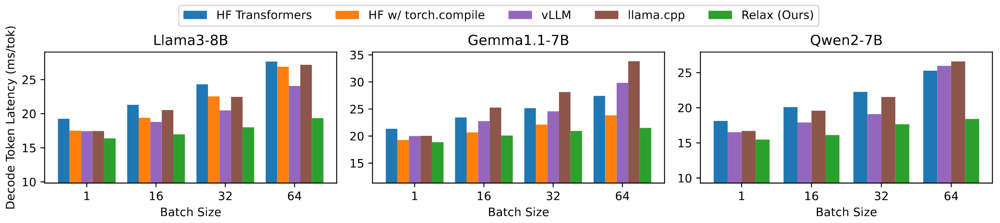
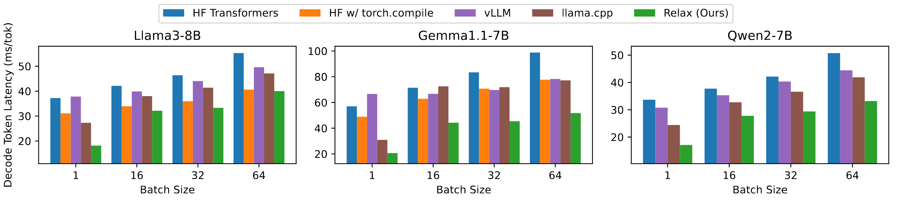
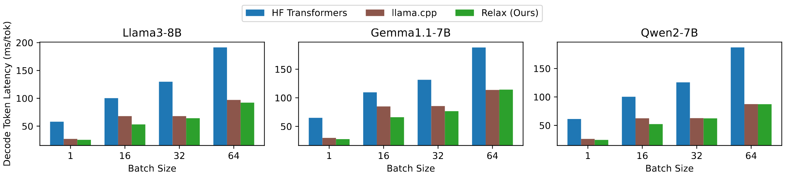
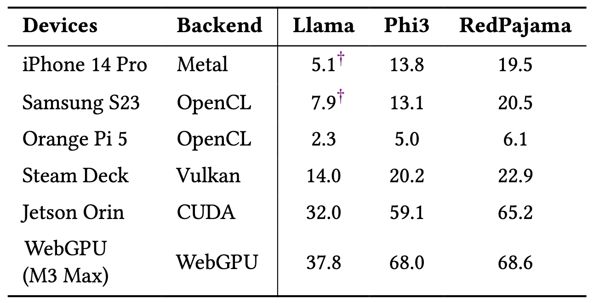

# Background & Motivation

## The Rise of Dynamic Shapes

- Modern ML, especially LLMs, rely heavily on dynamic shapes.
  - Variable input lengths
  - Dynamic batch sizes
  - KV-cache context length
- Demand for universal deployment across diverse hardware: servers, mobile, web browsers.

## The Problem with Typical ML Compilers

{fig-align=center}

- **Multiple, separate levels of abstraction:** Computational Graph, Tensor Program IR, etc.
- **Single-shot lowering:** A one-way process from high-level to low-level, preventing feedback.
- **Limited cross-level optimization.**

## Handling Dynamic Shapes is Hard

{fig-align=center}

- **"Unknown" dimensions:** Most compilers treat dynamic dimensions as `?`, losing critical relational information.
- **Lost Information:** If one dimension is `n`, another might be `4*n`. Marking both as `?` prevents optimizations.
- **Consequence:** Inefficient memory planning, missed operator fusion opportunities.

## Motivation: A Holistic Compiler Abstraction

- We need an abstraction that can:
  1.  **Unify** computational graphs, tensor programs, and external libraries.
  2.  **Preserve** symbolic relations between dynamic shapes throughout the entire compilation process.
  3.  Enable **Ahead-of-Time (AOT)** compilation for broad deployment on emerging platforms.

# System Design of Relax

## Relax: Core Principles

1.  **Cross-Level Abstraction**
    - A single, unified representation for graphs, low-level loops, and library calls.
    - Enables incremental lowering and analysis feedback across levels.

2.  **First-Class Symbolic Shapes**
    - Symbolic variables (`n`, `m`) track dynamic dimensions and their relationships.
    - Enables powerful, dynamic shape-aware optimizations.

## The Relax Abstraction

{fig-align=center}

- **Annotations:** Carry type, shape (`Tensor(("n", 4), "f32")`), and other structural information.
- **Dataflow Blocks:** Demarcate side-effect-free regions for easier transformation.
- **Unified Function Calls:** Seamlessly call subgraph functions, low-level tensor programs (`call_tir`), and external libraries (`call_dps_library`).

## Cross-Level Optimization Patterns

{fig-align=center}

- **Partial Lowering:** Make dispatch decisions for just a part of the computation, leaving the rest for later passes.
- **Analysis Feedback:** Analyze low-level tensor programs to automatically annotate properties on high-level operators.
- **Cross-level Transforms:** Jointly transform the graph and tensor programs, e.g., lifting a workspace allocation from a kernel to the main graph for global memory planning.

## Optimization: Cross-Level Workspace Lifting

- Sometimes a tensor program may allocate intermediate memory inside kernel.
- Moving the allocation outside to the graph-level caller
- Benefits:
  - Enables more chance of memory optimization

## Optimization: Dynamic Shape-Aware Fusion

1.  **Pattern Analysis:** Analyze and classify custom tensor programs (e.g., `decode_q4`) based on their properties.
2.  **FuseOps:** A graph pass groups tensor program calls into new subgraph functions based on pattern matching.
3.  **FuseTensorIR:** A cross-level pass merges the tensor programs within the new subgraph into a single, efficient kernel.

## Optimization: Dynamic Shape-Aware Memory Planning

{fig-align=center}

- Symbolic shape analysis allows comparing dynamic tensor sizes (e.g., `(2, n)` and `(n, 2)`).
- This enables static memory planning even for dynamic models.
- **Benefits:**
  - Reduces runtime memory allocation overhead.
  - Crucial for memory-constrained devices.
  - Enables CUDA Graph offloading, which requires pre-allocated memory.

# Evaluation

## Environment Setup

- Models: Llama3-8B, Gemma1.1-7B and Qwen2-7B
- GPUs: NVIDIA RTX 4090, AMD Radeon 7900XTX and Apple M2 Ultra
- Baselines:
  - HuggingFace Transformers (PyTorch)
  - vLLM
  - llama.cpp
  - Relax (TVM)

## LLM Inference Performance: NVIDIA RTX 4090

{fig-align=center}

- Relax delivers performance competitive with state-of-the-art, specialized systems like vLLM.
- Achieves up to 27% lower decode token latency.
- Compiles models once for arbitrary batch sizes and sequence lengths.

## Cross-Platform LLM Performance

{fig-align=center}

{fig-align=center}

- Consistently competitive performance across AMD and Apple GPUs.
- Outperforms hand-optimized `llama.cpp` baseline on AMD GPUs, especially at batch size 1.
- Demonstrates the portability and effectiveness of the compilation approach.

## Emerging Platforms

{fig-align=center}

- Deploys 4-bit quantized LLMs to mobile phones, embedded devices, and WebGPU.
- Achieves up to 55% more throughput than `llama.cpp` on a Samsung S23 by generating optimized GPU code.
- Enables GPU-accelerated LLM inference on platforms unsupported by most frameworks.
