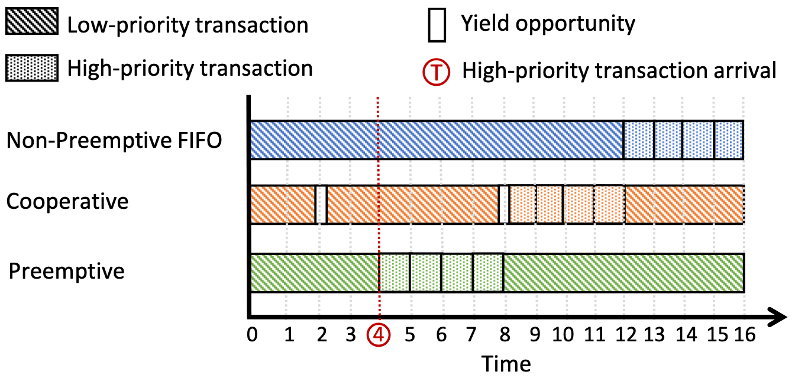
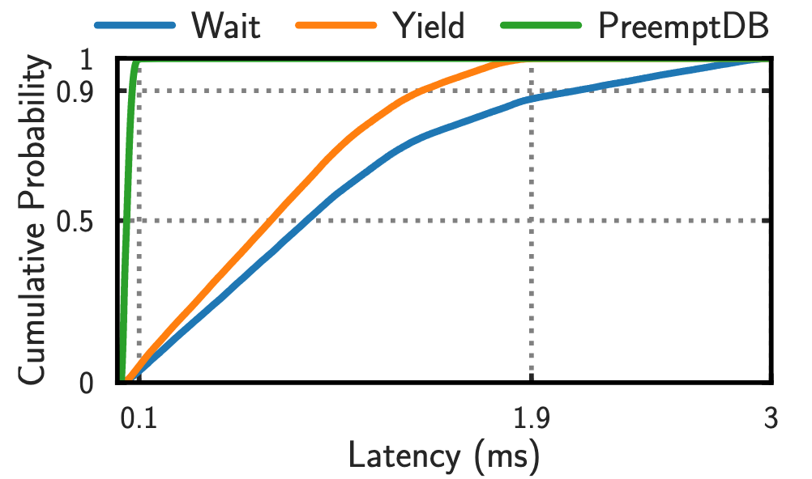
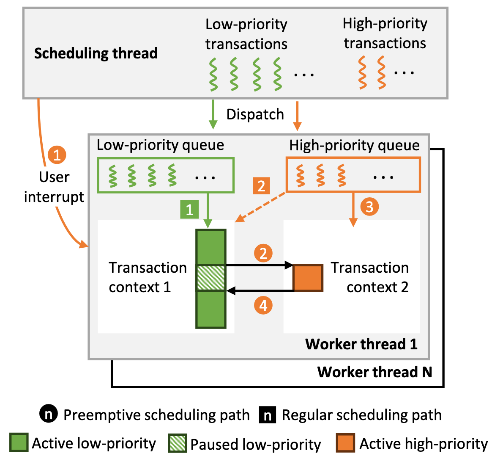
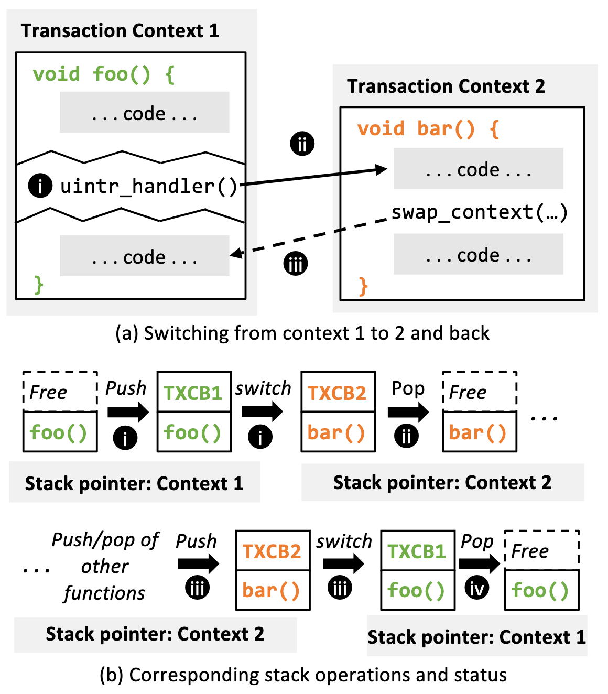
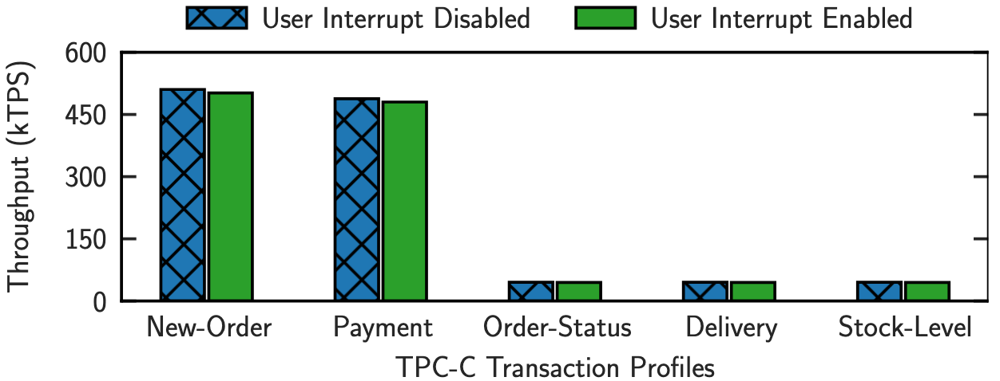
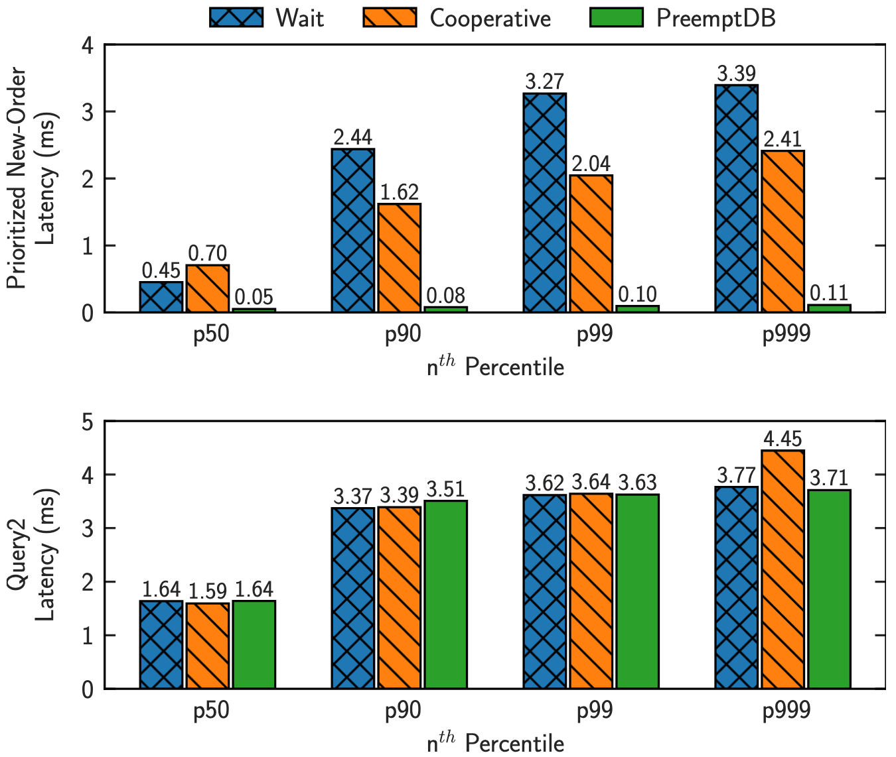
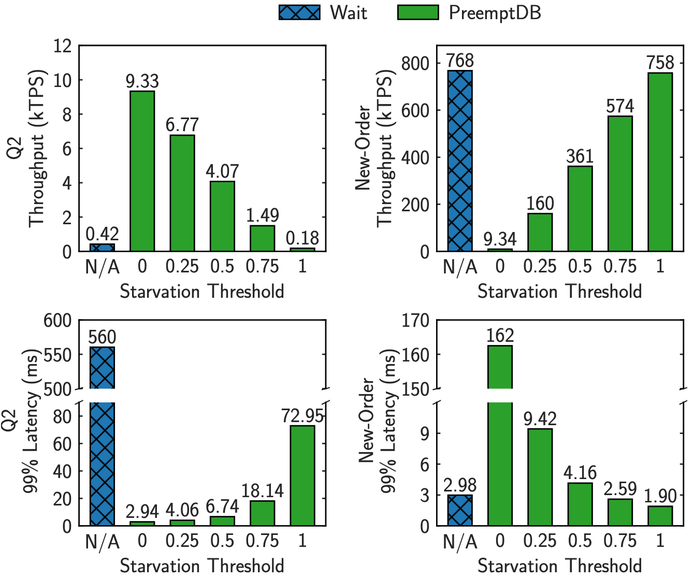

# Background & Motivation

## The Mixed Workload Problem

- Modern applications mix:
  - Long-running, low-priority analytical queries (e.g., TPC-H)
  - Short, high-priority OLTP transactions (e.g., New-Order)
- **Long transactions monopolize CPU cores**
- High-priority transactions suffer **extreme scheduling delays**

## Limitations of Existing Scheduling

**Wait (Non-preemptive FIFO):**

- High-priority transactions stuck behind long jobs
- Tail latency up to 30× worse than ideal

**Yield (Cooperative):**

- Requires **manual yield points in engine code**
- Difficult to tune: wrong intervals → high latency or overhead
- Unrealistic to handcraft for diverse workloads

{fig-align=center}

## Limitations of Existing Scheduling

{fig-align=center}

## Why Preemption Was Avoided

**Conventional wisdom discouraged preemption in DBMSs due to:**

1. High software interrupt latency (kernel crossing overhead)
2. Wasted work from lock conflicts under pessimistic concurrency control

**New Opportunities:**

1. **User interrupts (uintr):** <1us latency, direct userspace delivery in x86 CPUs
2. **Modern MVCC engines:** Readers don't block writers; preempting reads doesn't waste work

## Design Goals

- **Low latency** for high-priority transactions
- **High throughput** preservation
- **Lightweight switching** between transactions
- **Flexible policies** without manual tuning
- **Practical deployment** in userspace

# System Design

## PreemptDB Overview

{fig-align=center}

- **Scheduling thread:** Dispatches transactions, sends user interrupts
- **Worker threads:** Each maintains two transaction contexts
- **Regular path:** Execute low-priority transactions sequentially
- **Preemptive path:** Interrupt → switch contexts → execute high-priority batch

## Lightweight Context Switching

**Passive Switch (Interrupt-driven):**

1. User interrupt triggers handler
2. Save current transaction state to TXCB
3. Switch stack pointer to second context
4. Restore registers and resume high-priority work

**Active Switch (Voluntary):**

- Uses `swap_context()` primitive
- Atomically switches back after high-priority completion
- Instruction pointer check + temporary interrupt disable for atomicity

## Lightweight Context Switching

{fig-align=center}

## Key Mechanisms

**Transparent Context-Local Storage (CLS):**

- Each context needs independent TLS (thread-local storage)
- "Steal" TLS from redundant shadow pthreads
- Automatic swap during context switch
- Unmodified runtime libraries (glibc, boost) work correctly

**Non-Preemptible Regions:**

- Prevent deadlock from preempting latch holders
- Per-context lock counter tracks nested regions
- If counter > 0, interrupts return without switching

## Scheduling Policies

**Batched On-Demand Preemption:**

- Batch high-priority transactions to amortize interrupt cost
- Fill worker queues, then send single interrupt
- Execute entire batch before returning

**Starvation Prevention:**

- Monitor starvation level `L = CPU cycles on high-priority / total elapsed time`
- If L exceeds tunable threshold `L_max`:
  - Scheduler stops admitting new high-priority transactions
  - Worker switches back to preempted low-priority transaction early
- Tunable threshold enables latency/throughput tradeoff

# Evaluation

## Experimental Setup

- **Hardware:** 32-core Intel Xeon Gold 6448H, 512GB DRAM
- **Kernel:** uintr-patched Linux 6.2.0
- **Baseline:** ERMIA with Wait and Cooperative policies
- **Workload:**
  - TPC-C New-Order: a short, high-priority OLTP transaction
  - TPC-H Q2: a long-running, low-priority analytical query
- **Metrics:** 50, 90, 99, 99.9 percentile latency & throughput

**In-memory**: "We place all the data in memory to stress the system without storage I/O."

## Microbenchmark: Userspace Interrupt Overhead

All transactions being sent as low-priority transactions, meanwhile the scheduler 
send periodic interrupt to workers.

{fig-align=center}

- Overhead: **~1.7% throughput reduction**
- User interrupts are extremely lightweight
- Minimal impact when no preemption needed

## Latency Reduction

{fig-align=center}

**New-Order:**

- PreemptDB: 88-96% latency reduction vs. Wait
- Cooperative: Worse at p50 due to infrequent yields

**Q2:**

- PreemptDB: Similar latency to Wait
- Cooperative: Higher p99.9 due to yield overhead

## Starvation Prevention Effectiveness

{fig-align=center}

- **L_max = 1.0:** No starvation prevention → Q2 throughput drops 95%
- **L_max = 0.75:** Balanced tradeoff maintained
- **L_max = 0:** No preemption → Q2 optimal, but high-priority suffers
