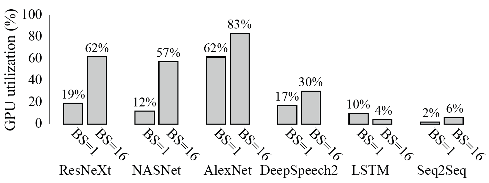
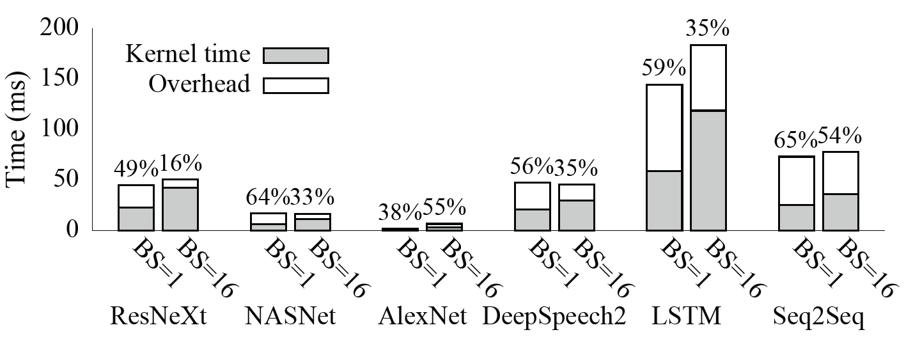
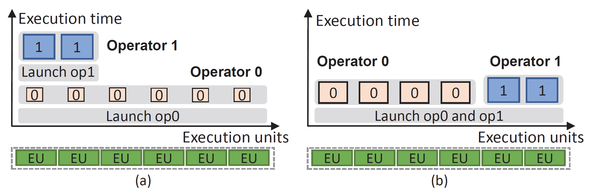
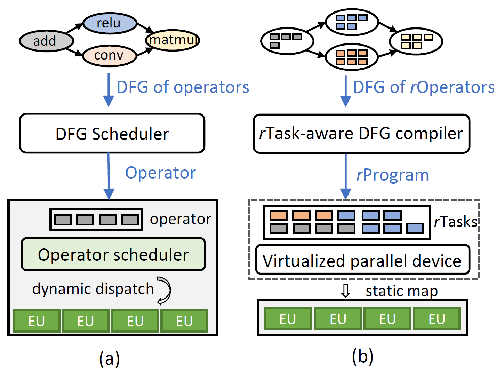
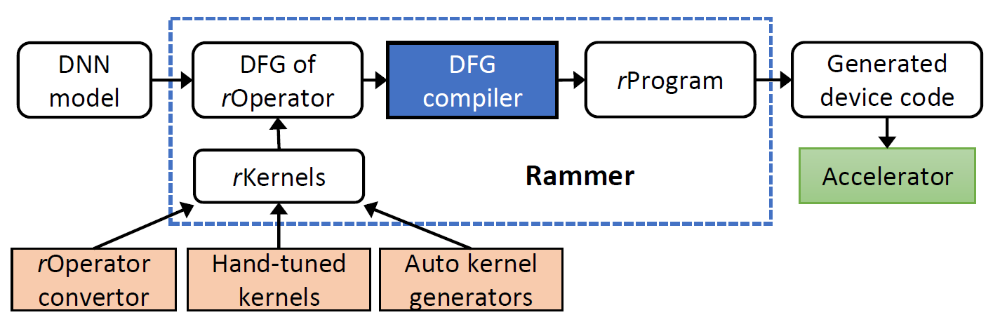
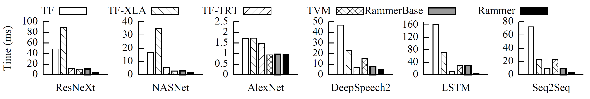
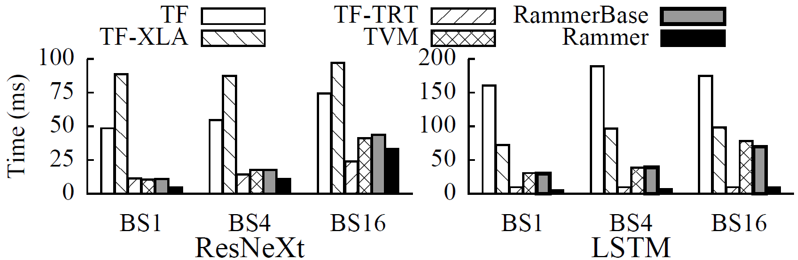
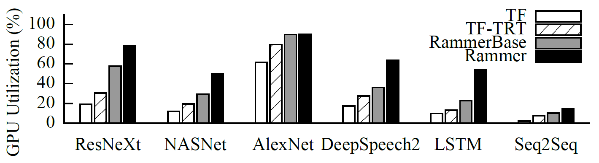
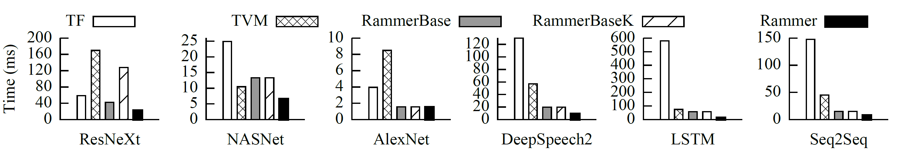

# Background & Motivation

## DNN Computation Model

- DNNs are modeled as Data Flow Graphs (DFG).
- **Two levels of parallelism:**
  - **Inter-operator:** Independent nodes in the DFG can run in parallel.
  - **Intra-operator:** A single operator (e.g., MatMul) has internal data parallelism.

## The Two-Layered Scheduling Gap

- **Layer 1: Inter-operator (Software)**
  - Frameworks (TensorFlow, PyTorch) schedule operators based on dependencies.
- **Layer 2: Intra-operator (Hardware)**
  - Opaque libraries (cuDNN) or hardware schedulers map operator kernels to execution units.
- **Problem:** The two layers are decoupled. The framework treats operators as "black boxes."

## Inefficiency 1: Low Hardware Utilization

{fig-align=center}

- Accelerators (GPUs) are massive parallel devices.
- Even with BS=16, a single operator still cannot saturate the device.

## Inefficiency 2: High Scheduling Overhead

{fig-align=center}

- Launching kernels involves significant CPU-side overhead (driver, context creation, PCIe).
- For small operators, the **overhead exceeds the actual computation time**.

## Inefficiency 3: Suboptimal Co-scheduling

{fig-align=center}

- (a) **Existing:** Operators run sequentially or rely on hardware multi-streaming (often inefficient).
- (b) **Ideal:** Co-schedule independent operators to fill the device.
- Current frameworks lack the interplay between inter- and intra-operator scheduling.

## Rammer's Goal

- **Holistic Optimization:** Manage inter- and intra-operator parallelism together.
- **Compile-time Scheduling:** Move scheduling decisions off the critical path.
- **White-box Approach:** Expose hardware execution units to the compiler.

# System Design

## Overview: Rammer vs. Existing Frameworks

{fig-align=center}

- **Existing:** Dynamic dispatch of opaque operators.
- **Rammer:** Static mapping of fine-grained tasks (`rTasks`) to virtualized hardware (`vDevice`).

## Abstraction: rOperator and rTask

- **rTask:** The minimum schedulable unit of computation (**e.g., a tile of MatMul**).
- **rOperator:** A group of independent, homogeneous `rTasks` (**e.g. a whole MatMul**).
- Breaks the "black box" boundary of traditional operators.

## Abstraction: Virtualized Parallel Device (vDevice)

- **vDevice:** Abstracts the accelerator hardware.
- **vEU (Virtual Execution Unit):**
  - Represents a physical CU (e.g., GPU SM).
  - Executes a sequence of `rTasks`.
- **Mechanism:**
  - Allows the compiler to assign specific `rTasks` to specific `vEUs` explicitly.
  - Bypasses the non-deterministic hardware scheduler.

## The rTask-aware DFG Compiler

{fig-align=center}

- **Input:** DFG of `rOperators`.
- **Profiling:** Measures execution time of individual `rTasks`.
- **Scheduling:** Generates a static execution plan (`rProgram`).
- **Output:** A single fused kernel (or few kernels) containing the entire schedule.

## Scheduling Policy

- **Wavefront Scheduling:**
  - Identifies independent operators (wavefront).
  - Packs `rTasks` from these operators onto available `vEUs`.
- **Holistic Decision:**
  - Can choose a "slower" kernel implementation if it uses fewer resources, allowing other operators to run in parallel.
  - The optimization goal is to achieve lowest end-to-end latency.

## Runtime: Persistent Thread Blocks

- **Persistent Thread Blocks (PTBs):**
  - Rammer launches long-running thread blocks that stay resident on the GPU.
  - These PTBs act as `vEUs`.
- **Logic:**
  - They fetch `rTasks` from the pre-compiled static plan.
  - Eliminates repeated kernel launch overhead.

## Fine-grained Synchronization

- **Barrier-rTask:**
  - A lightweight synchronization primitive based on counter.
  - Ensures dependencies are met between `rTasks` on different `vEUs`.
  - Avoids global device synchronization (like `cudaDeviceSynchronize`).

# Evaluation

## Environment Setup

- **Hardware:**
  - NVIDIA Tesla V100
  - AMD Radeon Instinct MI50
  - Graphcore IPU
- **Baselines:**
  - TensorFlow (TF)
  - TensorFlow-XLA (Compiler)
  - Apache TVM (Compiler)
  - TensorRT (Vendor Optimized Library)
  - RammerBase (Still 2-layered scheduling)
  - Rammer

## End-to-End Performance (Batch Size = 1)

{fig-align=center}

- **Rammer vs. TF:** Up to 33.9x speedup.
- **Rammer vs. TVM:** Up to 6.4x speedup.
- **Rammer vs. TensorRT:** Outperforms vendor-optimized library on all benchmarks.

## Performance with Larger Batch Sizes

{fig-align=center}

- Even with larger batches (BS=16), Rammer maintains advantage.
- Outperforms TF by 2.25x on ResNeXt.
- Outperforms TVM by 1.25x on ResNeXt.

## GPU Utilization

{fig-align=center}

- Rammer significantly improves hardware utilization compared to TF and TensorRT.
- Achieved by effectively packing `rTasks` from different operators onto the GPU simultaneously.

## Cross-Platform Generality: AMD GPUs

{fig-align=center}

- Rammer abstractions work on AMD ROCm platform.
- Up to **41x** speedup over TensorFlow on LSTM-TC.
