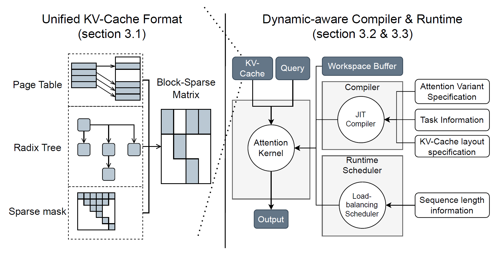
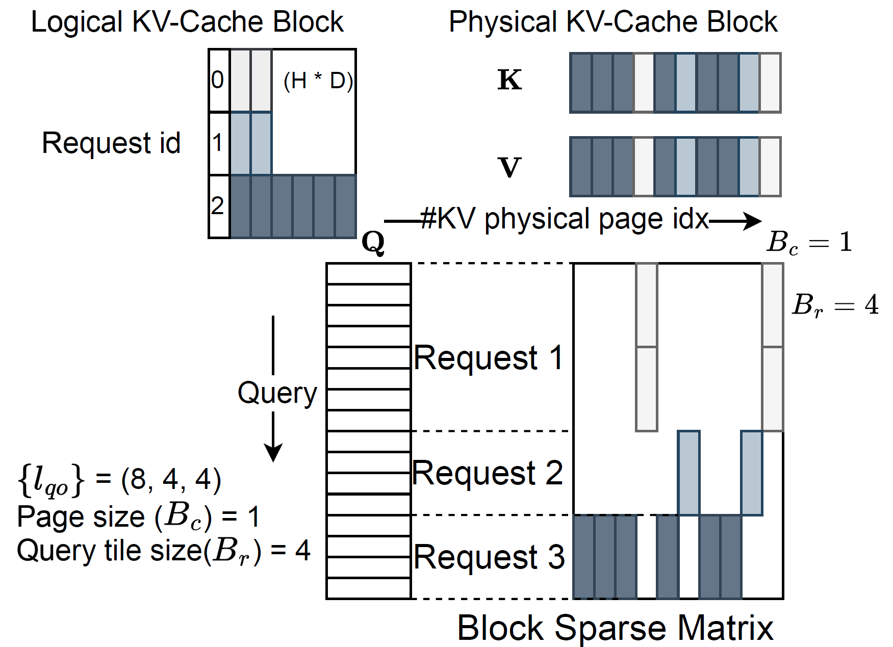
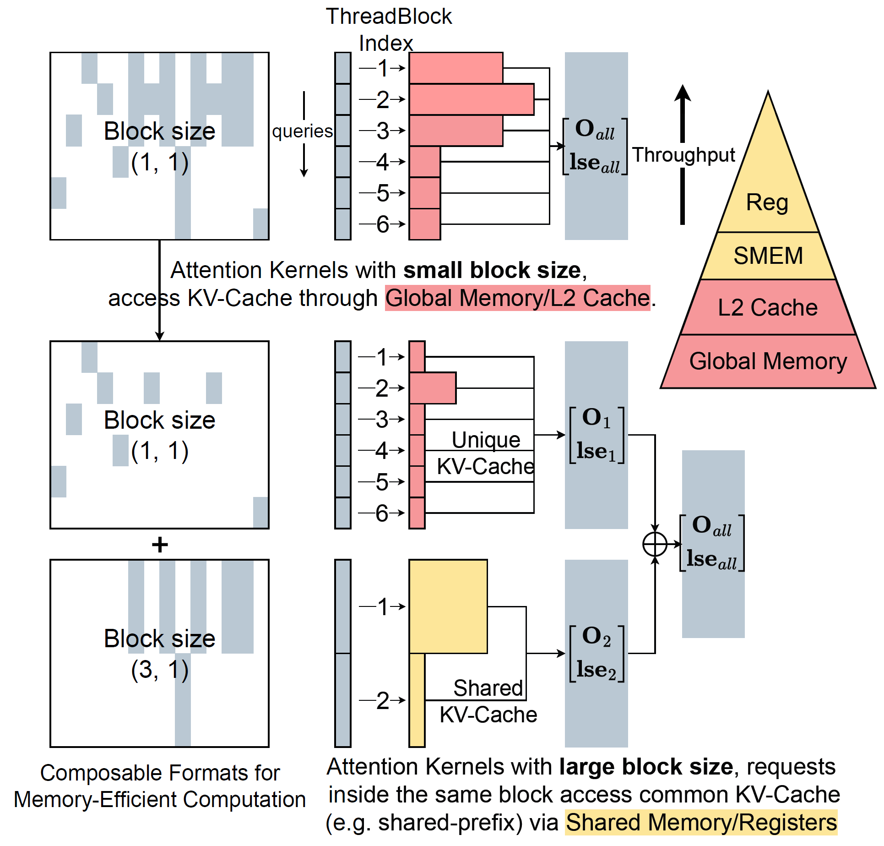
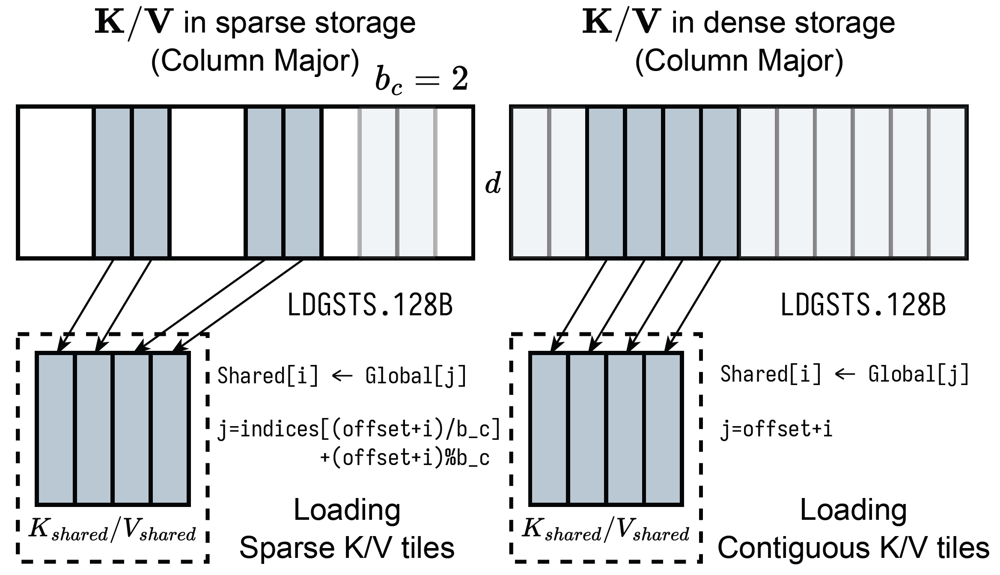
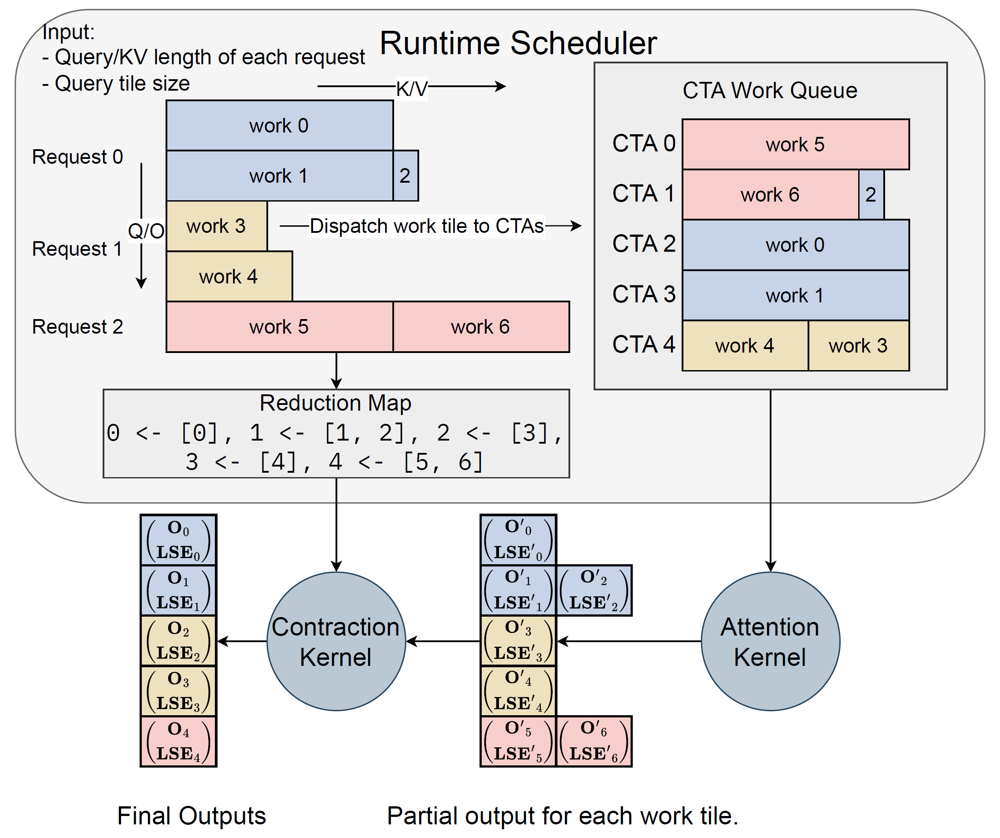
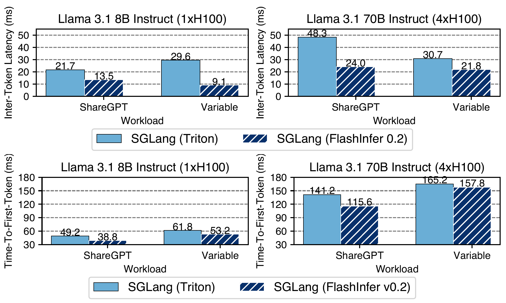
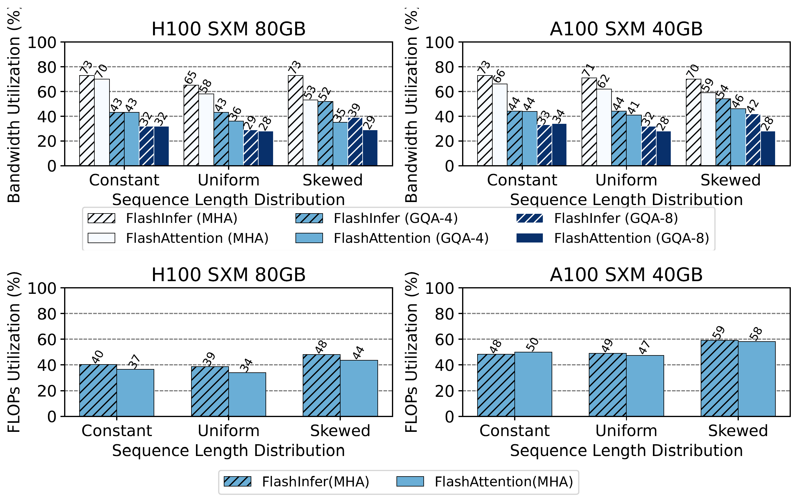
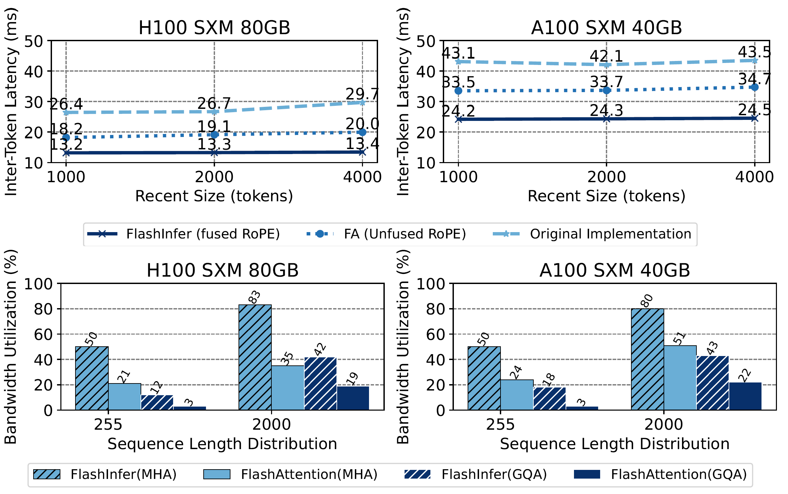

# Background & Motivation

## Attention is Critical for LLM Inference

- Transformer architecture dominates LLMs
- Attention mechanism reads from KV-cache and computes outputs based on queries
- Efficiency of attention operator is paramount to LLM inference performance

## Challenge 1: Diverse Workload Patterns

- Various attention computation patterns
  - Prefill computation for context processing
  - Batched decoding during serving
- Prefix-reuse opportunities across requests
- Tree decoding in speculative scenarios
- Query lengths and KV-cache sizes vary within batches and over time

## Challenge 2: Hardware Customization Requirements

- Efficient memory layouts needed for growing KV-cache
  - Paged attention, radix trees
- Hardware-specific pipelines required for each GPU architecture
- Diverse attention mechanisms in modern LLMs (variants)
  - Grouped Query Attention (GQA)
  - Specialized masks, sliding window
  - Custom attention scores (logits soft-cap, FlashSigmoid)

## Current Limitations

- Each system implements specialized attention solutions for specific subsets
- Results in:
  - High maintenance overhead
  - Potential inefficiencies
  - Lack of flexibility for new attention variants

# Design

## Overview

{width=80% fig-align=center}

- **Block-sparse format** for unified KV-cache storage
- **Customizable attention template** with JIT compilation
- **Dynamic load-balanced scheduling** compatible with CUDAGraph

## KV-Cache Storage: Block-Sparse Matrix as Unified Format

{width=70% fig-align=center}

- Page tables, radix trees, and sparse masks unified under **Block Sparse Row (BSR) format**
  - Each block is either zeros or non-zeros.
- Flexible block sizes (Br, Bc) allow fine-grained sparsity

## Two Meanings of "Block"

- Block in Block-Sparse Matrix (BSR format)
  - Br (number of rows) is aligned with queries
  - Bc (number of cols) is aligned with tokens
- Thread Block (CTA - Cooperative Thread Array)
- Queries grouped in the same matrix block are processed by the same thread block.

## Composable Formats for Memory Efficiency

{width=55% fig-align=center}

- Multiple block-sparse formats instead of single format
- Shared prefixes: larger block sizes for shared memory access
- Unique suffixes: smaller block sizes

## Data Transfer: Global to Shared Memory

{width=80% fig-align=center}

- Tiles transferred from scattered global memory to contiguous shared memory
- Asynchronous copy instructions (LDGSTS) with 128B width
- Supports arbitrary block sizes not aligned with tensor core shapes

## Flexible Tile Size Selection

- Tile sizes: (1, 16, 32, 64, 128) × (32, 64, 128)
- Automatic selection heuristics:
  1. Determine minimal query tile size based on average query length
  2. Maximize SM resource occupancy given register/shared memory constraints
- CUDA cores for tile size 1, tensor cores otherwise

## Load-Balanced Runtime Scheduler

{width=70% fig-align=center}

- Splits each query tile's KV into chunks
- Priority queue assigns chunks to CTAs balancing by cost
- Cost function: $cost(l_q, l_{kv}) = \alpha\cdot l_q  + \beta\cdot l_{kv}$
- Produces deterministic aggregation order

## CUDAGraph Compatibility

- Persistent kernels with fixed grid size
- Fixed workspace buffer offsets for consistent pointers
- Attention and contraction stages merged into one persistent kernel
- Plan phase runs on CPU, run phase captured in CUDAGraph

# Evaluation

## Environment Setup

- **Hardware**
  - NVIDIA A100 40GB SXM
  - NVIDIA H100 80GB SXM
- **Software**
  - CUDA 12.4, PyTorch 2.4.0
  - FP16 precision for storage and computation
- **Baselines**
  - SGLang with Triton backend
  - FlashAttention library

## End-to-End LLM Serving Performance

{width=70% fig-align=center}

- FlashInfer shows consistent ITL and TTFT improvements over Triton backend

## Input Dynamism

{width=80% fig-align=center}

- Batch size 16, three sequence length distributions
  - Constant (1024), Uniform (512 to 1024), Skewed (Zipf, avg 1024)
- FlashInfer significantly outperforms FlashAttention on uniform and skewed distributions
- Load-balanced scheduler addresses variable-length workloads

## Customizability: Long-Context Inference

{width=70% fig-align=center}

- Streaming-LLM with fused RoPE + attention kernel
- **28-30% latency reduction** across different settings
- Fused kernel achieves 1.6-3.7× higher bandwidth utilization
