# Background & Motivation

## Rise of Mixture-of-Experts (MoE)

- Models like DeepSeek-V3/R1 and Mixtral achieve state-of-the-art performance.
- **Sparsity**: Only a subset of experts activate per token.
- **Challenge**: Massive total parameter count makes local deployment difficult due to VRAM limits.

## The Memory Wall in Local Deployment

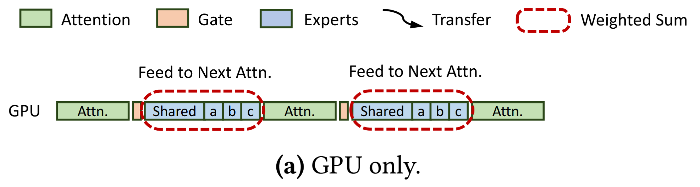{fig-align=center}

- Storing the entire model in VRAM is often impossible for consumer/edge hardware.
- **Hybrid Inference**: A promising solution.
  - **GPU**: Handles Attention and Shared Experts (compute-dense).
  - **CPU**: Handles Routed Experts (capacity-dense, sparse access).

## Workflow of Hybrid Inference

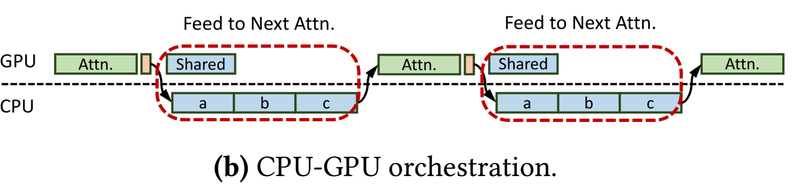{fig-align=center}

- **Fiddler-style offloading**:
  - Hot layers (Attention) stay on GPU.
  - Cold/Massive layers (Routed Experts) reside in host RAM.
  - Data transfers over PCIe.

## Bottleneck 1: Underutilized CPU Compute (Prefill)

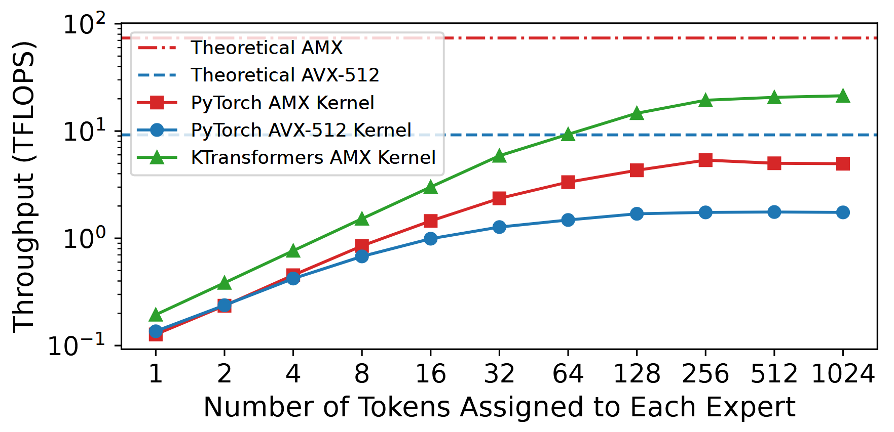{fig-align=center}

- Prefill phase processes thousands of tokens.
- Existing generic SIMD (AVX-512) is insufficient.
- **Intel AMX** exists but is poorly utilized (only 7% of peak) by current frameworks due to suboptimal memory layouts.

## Bottleneck 2: Inefficient Coordination (Decode)

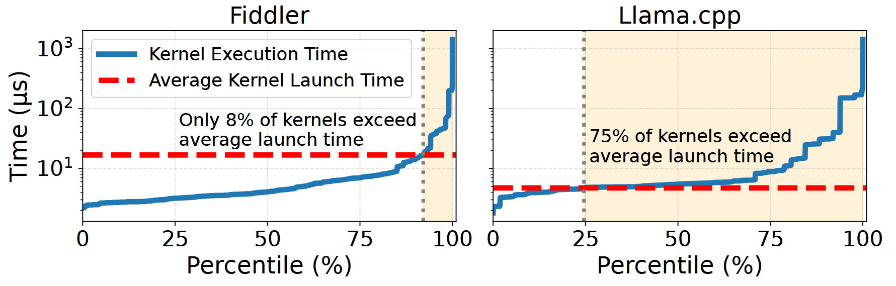{fig-align=center}

- Decode phase: Batch size is small (often 1).
- **Overhead**: 
  - Massive kernel launch overhead (73% of time in Fiddler).
  - Frequent CPU-GPU synchronization.
  - Strict sequential dependency prevents overlap.

## Motivation Summary

- **Compute**: Need specialized kernels to unlock AMX potential on CPUs.
- **Scheduling**: Need asynchronous coordination to hide PCIe latency and launch overhead.
- **Architecture**: Need to break rigid dependencies to overlap CPU and GPU work.

# System Design

## KTransformers Overview

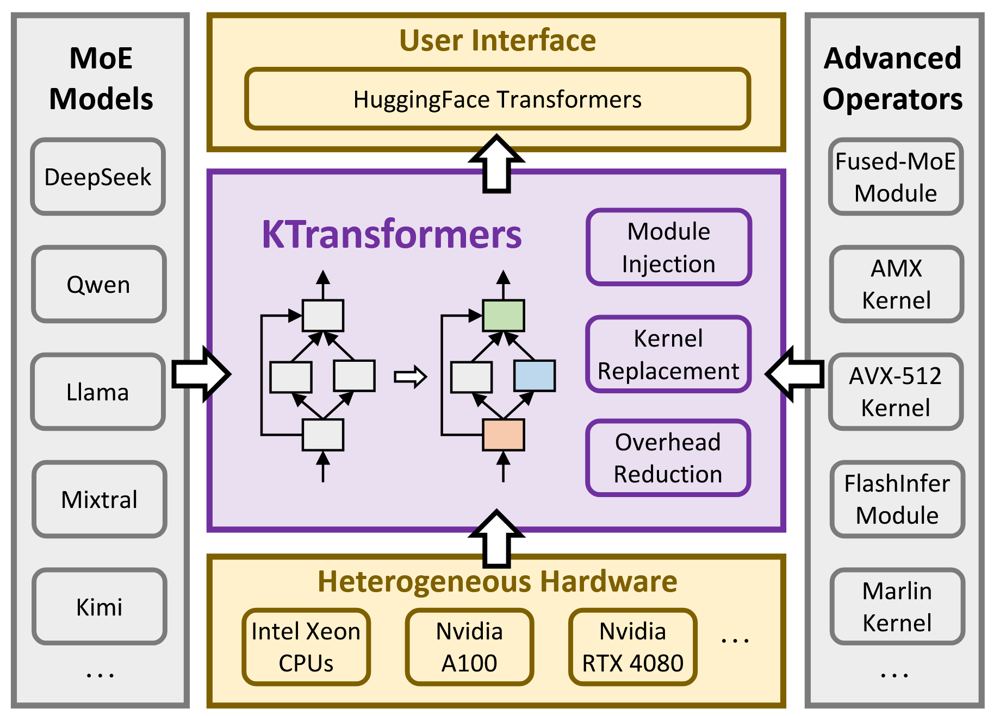{fig-align=center}

- Drop-in replacement for HuggingFace Transformers.
- **Key Modules**:
  - Optimized AMX/AVX-512 Kernels.
  - Asynchronous CPU-GPU Scheduler.
  - Expert Deferral Mechanism.

## Unleashing CPU Potential: AMX Kernels

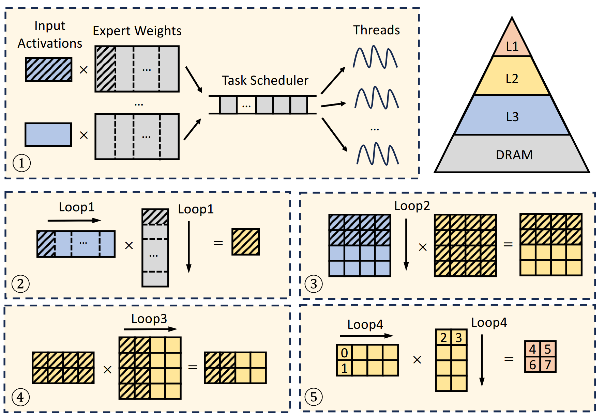{fig-align=center}

- **Tiling-Aware Memory Layout**: 
  - Pre-processes weights to align with AMX tile registers.
  - Eliminates runtime transposition.
- **Block-wise Quantization**: 64-byte aligned for cache efficiency.

## Adaptive Kernel Selection

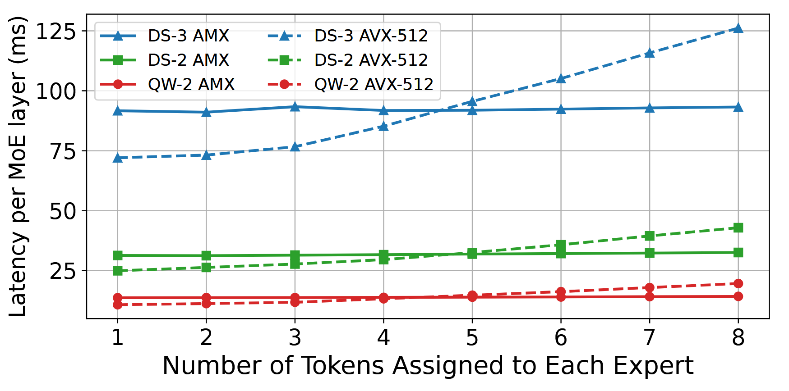{fig-align=center}

- **AMX** is powerful but has high startup overhead for small tasks.
- **Strategy**:
  - **Prefill (High Arithmetic Intensity)**: Use AMX.
  - **Decode (Low Arithmetic Intensity)**: Switch to lightweight AVX-512.

## CPU-GPU Coordination

- **Problem**: Synchronization breaks CUDA Graphs.
- **Solution**: 
  - Encapsulate the entire decode phase in a **single CUDA Graph**.
  - Use `cudaLaunchHostFunc` to trigger CPU work from within the stream.
  - Eliminates kernel launch overhead.

## NUMA-Aware Tensor Parallelism

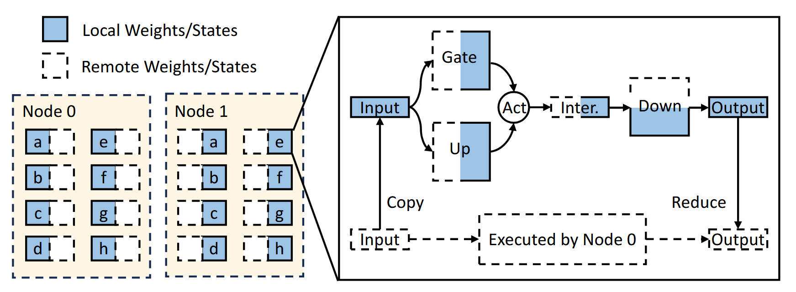{fig-align=center}

- Cross-socket memory access (NUMA) drastically reduces bandwidth.
- **Strategy**: Partition expert weights across sockets.
  - Each CPU core accesses only local memory.
  - Lightweight reduce-scatter combines results.

## Innovation: Expert Deferral

- **Observation**: GPU is idle while waiting for CPU experts.
- **Idea**: Relax the strict dependency chain.
  - **Immediate Experts**: Computed now, sent to next layer.
  - **Deferred Experts**: Computation delayed to overlap with *next layer's* attention.

## Expert Deferral Workflow

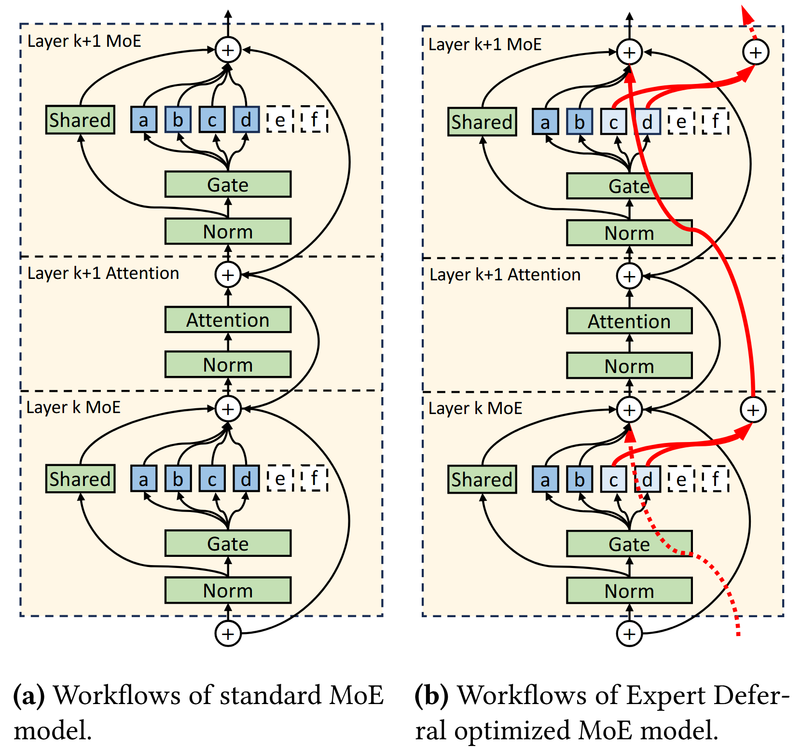{fig-align=center}

- **(a) Standard**: Serial execution.
- **(b) Expert Deferral**: Some experts ($c, d$) bypass the immediate attention layer and are injected later via residual connections.

## Timeline Analysis with Deferral

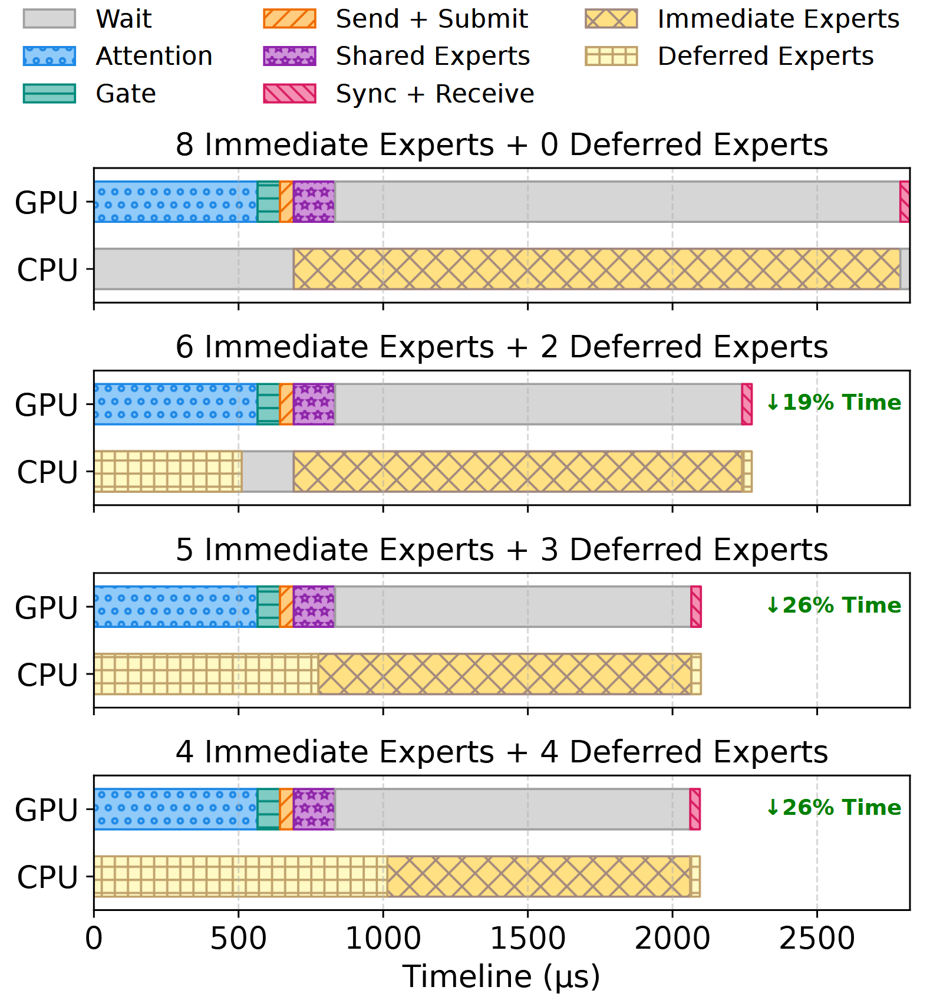{fig-align=center}

- Without deferral: Large CPU idle gaps.
- With deferral: CPU and GPU execution overlaps significantly.
- Increases CPU utilization from ~75% to **~100%**.

# Evaluation

## Experimental Setup

- **Hardware**: 
  - Dual-socket Intel Xeon Platinum 8452Y.
  - GPUs: NVIDIA A100 (40GB) & RTX 4080 (16GB).
- **Models**: DeepSeek-V2.5, DeepSeek-V3 (671B), Qwen2-57B.
- **Baselines**: Fiddler, Llama.cpp.

## Prefill Performance

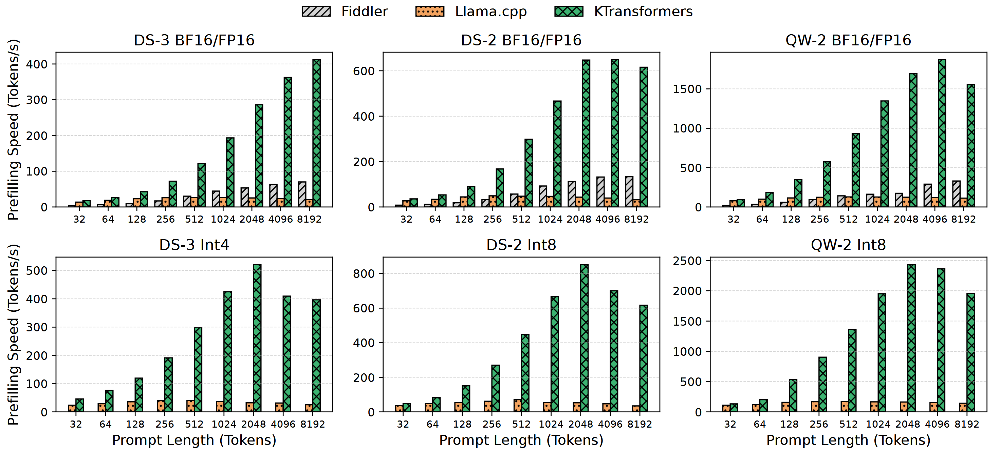{fig-align=center}

- **4.62x – 19.74x speedup** over baselines.
- Dominance due to AMX-optimized kernels and better memory layout.

## Decode Performance

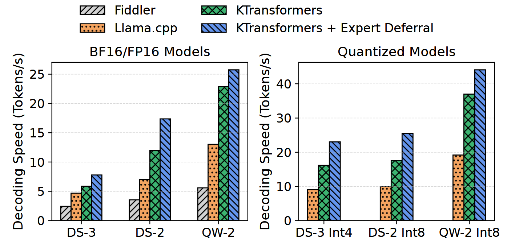{fig-align=center}

- **1.25x – 4.09x speedup** over baselines.
- Driven by CUDA Graph optimizations and Expert Deferral.
- Capable of running DeepSeek-V3 on local hardware.

## Impact of Expert Deferral on Accuracy

**Table 2: Accuracy on various benchmarks**

| Model | Setting | HumanEval | MBPP | GSM8K |
| :--- | :--- | :---: | :---: | :---: |
| **DS-3** | Base (8+0) | **83.0** | **71.2** | 94.8 |
| **DS-3** | Deferral (2+6) | **83.0** | 70.2 | **95.2** |

- Minimal accuracy variation (< 0.5% drop on average).
- Robustness due to residual connections in Transformers.
