# Background & Motivation

## The Rise of On-Device LLM Inference

- **Privacy & Latency**: Running LLMs locally on mobile devices enhances data privacy and reduces response latency.
- **Hardware Evolution**: Modern Mobile SoCs (e.g., Snapdragon 8 Gen 3) are highly heterogeneous.
  - Powerful NPUs
  - Versatile GPUs
  - Unified Memory Architecture (UMA)

## Limitations of Existing Mobile Engines

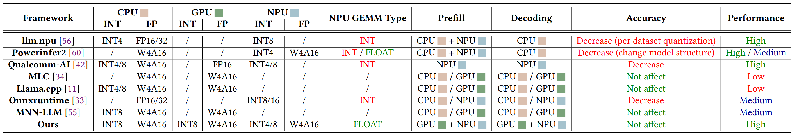{fig-align=center}

- **Single-Accelerator Focus**: Existing frameworks (MLC, MNN, PowerInfer) typically utilize only one accelerator (GPU *or* NPU).
- **Suboptimal Resource Usage**:
  - **Compute**: Fails to exploit the massive throughput of NPUs (up to 10 TFLOPS vs 1 TFLOPS on GPU).
  - **Bandwidth**: A single processor cannot saturate the SoC's memory bandwidth.

## Characterizing Mobile NPUs: Stage Performance

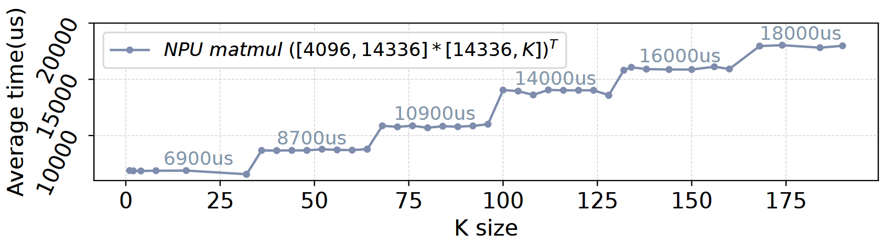{fig-align=center}

- **Fixed Systolic Arrays**: NPUs use fixed-size hardware units (e.g., 32x32).
- **Misalignment Penalty**: Tensors smaller than the hardware unit or not divisible by it require padding.
- **Result**: Significant performance degradation when tensor shapes do not align with hardware "stages".

## Characterizing Mobile NPUs: Sensitivity

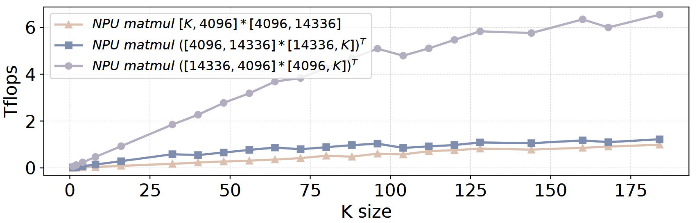{fig-align=center}

- **Order-Sensitive**: Performance varies drastically based on tensor order ($[M, N]$ vs $[N, M]$) due to weight-stall mechanisms.
- **Shape-Sensitive**: Efficiency depends on the ratio between row and column sizes.
- **Implication**: Blindly offloading to NPU does not guarantee speedups.

## The Memory Bandwidth Bottleneck

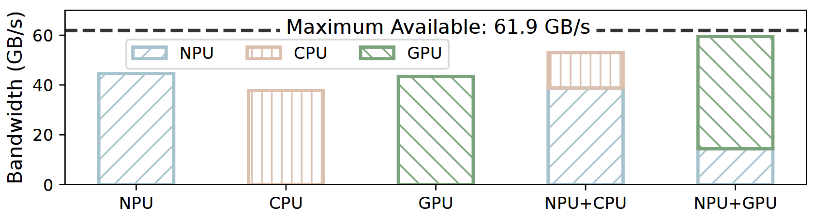{fig-align=center}

- **Underutilized Bandwidth**: During decoding (memory-bound), a single CPU, GPU, or NPU only utilizes ~45 GB/s.
- **System Potential**: The SoC supports ~60 GB/s.
- **Opportunity**: Concurrent GPU-NPU execution is required to saturate memory bandwidth.

## The Synchronization Challenge

- **High Overhead**: Standard synchronization (e.g., `clFinish`) takes ~400 $\mu$s.
- **Impact**: This overhead is comparable to the execution time of individual kernels in LLM inference.
- **Result**: Naive heterogeneity can degrade performance.

# System Design

## HeteroInfer Architecture

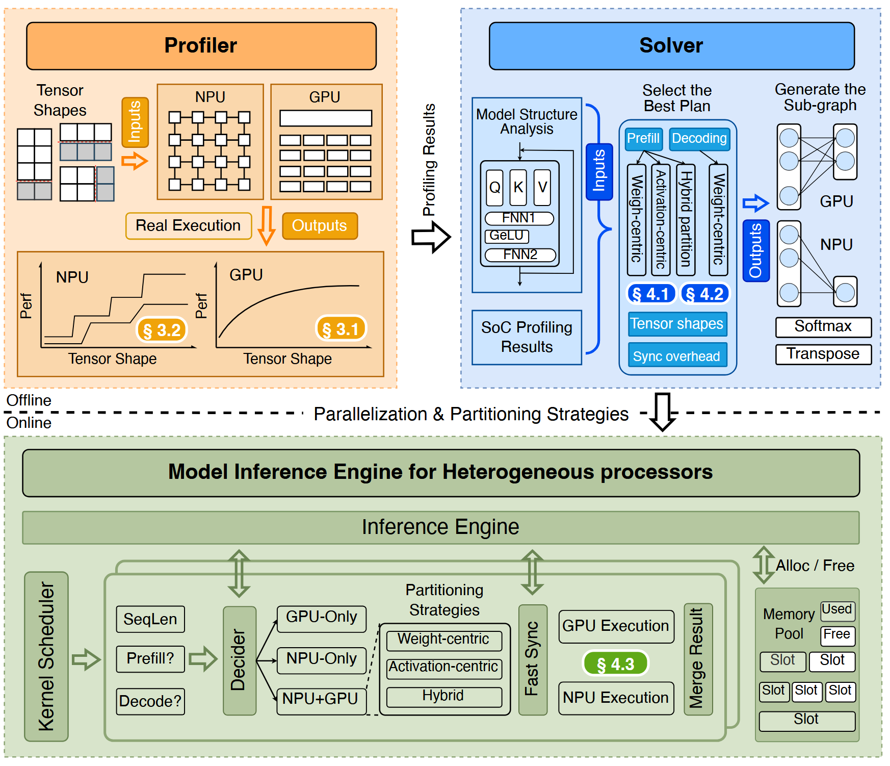{fig-align=center}

- **Offline Phase**: Profiler characterizes hardware; Solver determines optimal partitioning.
- **Online Phase**:
  - **CPU**: Control plane & fast synchronization.
  - **NPU**: Primary compute unit (bulk computation).
  - **GPU**: Secondary compute unit (dynamic shapes & bandwidth booster).

## Layer-Level Parallelism

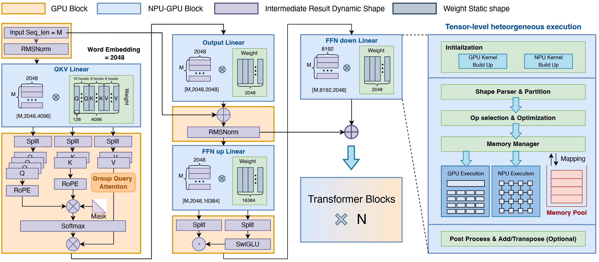{fig-align=center}

- **Affinity-Based Scheduling**:
  - **NPU**: Handles heavy Matrix Multiplications (Matmul).
  - **GPU**: Handles non-linear operators (Softmax, RMSNorm) and specific shapes where NPU is inefficient.
- **Pipeline**: Operators are dispatched to the most suitable backend.

## Tensor-Level: Weight-Centric Partition (Decoding)

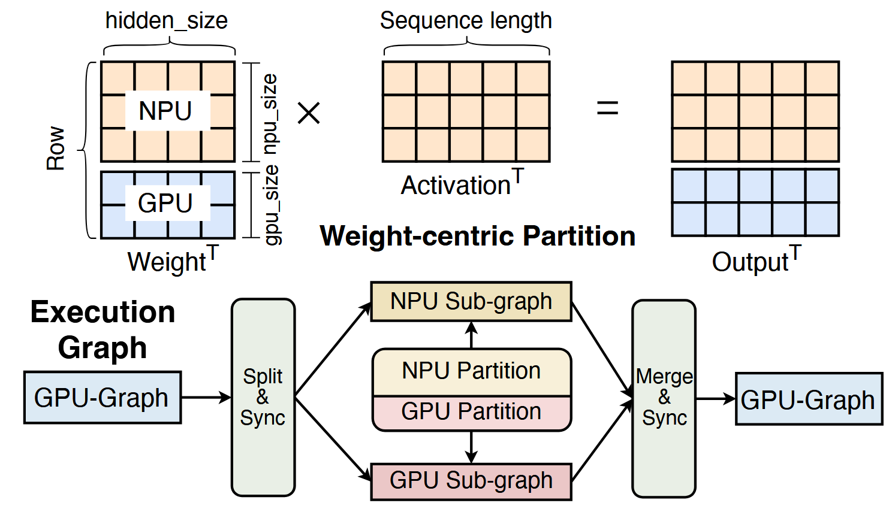{fig-align=center}

- **Goal**: Maximize memory bandwidth during the decoding phase.
- **Strategy**: Partition the **weight tensor** along the row dimension.
- **Execution**: GPU and NPU compute partial results on sub-tensors simultaneously.
- **Result**: Saturates SoC memory bandwidth.

## Tensor-Level: Activation-Centric Partition (Prefill)

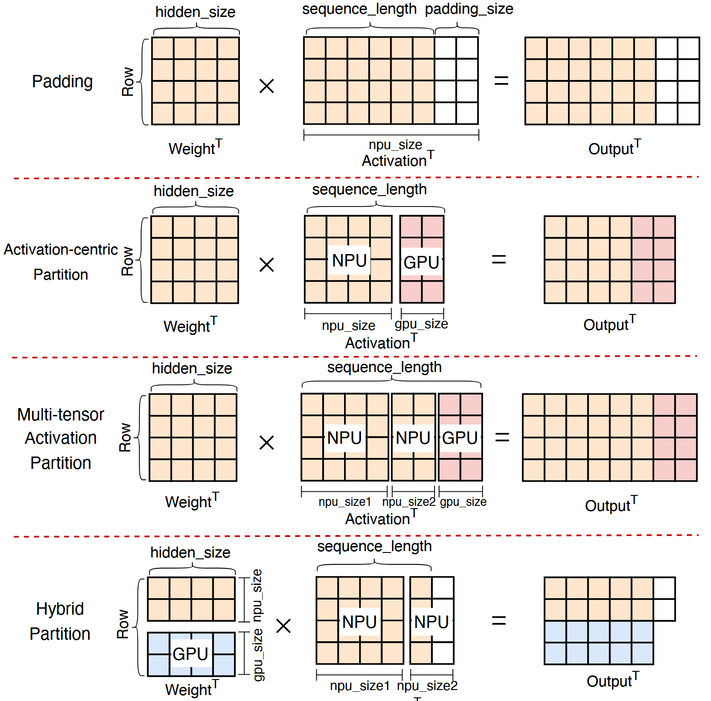{fig-align=center}

- **Problem**: Mobile NPUs require static computation graphs. Dynamic input lengths require expensive padding or recompilation.
- **Strategy**:
  - Split input into a **fixed standard size** (for NPU) and a **dynamic remainder** (for GPU).
  - GPU handles the "odd" shapes efficiently via linear scaling.

## Fast Synchronization Mechanism

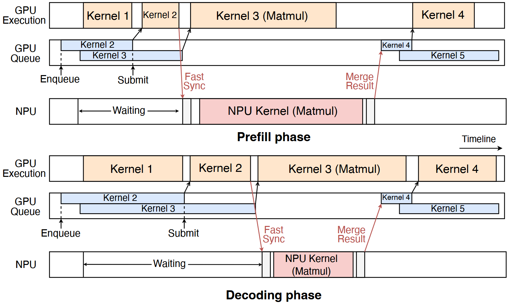{fig-align=center}

- **Leveraging UMA**: Zero-copy data sharing via unified memory.
- **Predictable Latency**:
  - Thread sleeps for predicted kernel duration.
  - Wakes up and **polls** a flag bit in shared memory.
- **Performance**: Reduces synchronization cost from ~400 $\mu$s to microseconds.

# Evaluation

## Experimental Setup

- **Platform**: Qualcomm Snapdragon 8 Gen 3 & 8 Elite.
- **Models**: Llama-2/3 (7B/8B), InternLM, etc.
- **Baselines**:
  - **CPU**: llama.cpp
  - **GPU**: MLC, MNN-OpenCL
  - **NPU**: llm.npu, PowerInfer-2

## End-to-End Performance

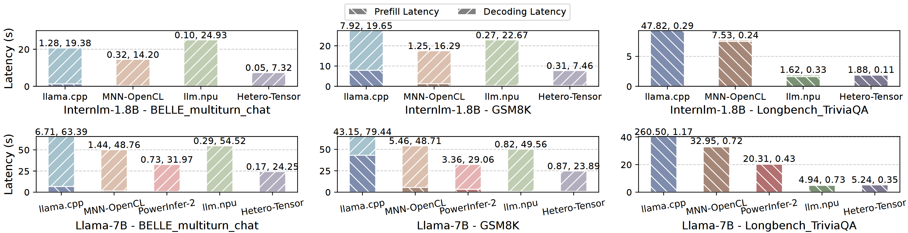{fig-align=center}

- **Speedup**: 1.34$\times$ to 6.02$\times$ improvement over SOTA frameworks.
- **Consistency**: Outperforms both GPU-only and NPU-only engines across varying sequence lengths.

## Prefill Performance (Compute Bound)

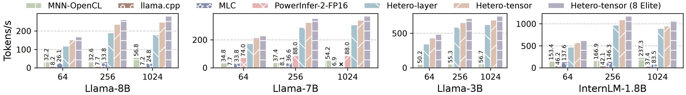{fig-align=center}

- **Dynamic Shapes**: HeteroInfer efficiently handles dynamic sequences via activation-centric partitioning.
- **Comparison**: Up to 24.9$\times$ faster than CPU and significantly faster than GPU baselines.

## Decoding Performance (Memory Bound)

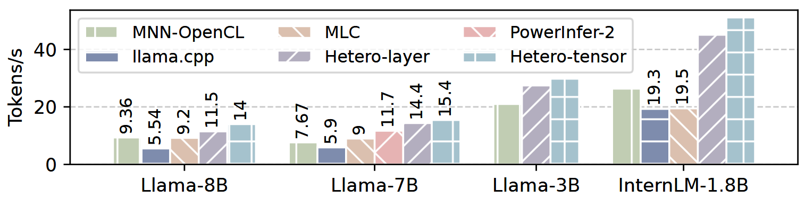{fig-align=center}

- **Bandwidth Saturation**: By using GPU and NPU together, HeteroInfer achieves much higher token generation rates.
- **Results**: >50 tokens/s on InternLM-1.8B; ~14 tokens/s on Llama-8B.

## Impact of Fast Synchronization

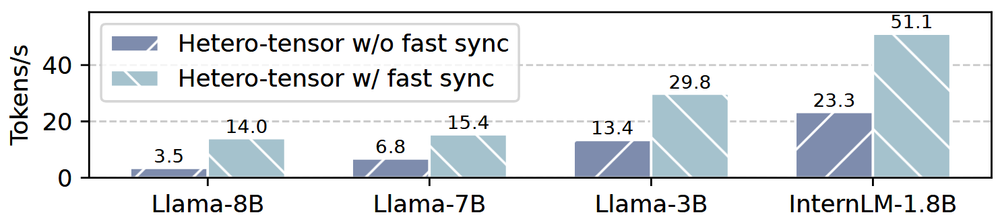{fig-align=center}

- **Criticality**: Without fast sync, the overhead negates the benefits of parallelism in the decoding phase.
- **Gain**: Fast sync enables up to 4.01$\times$ speedup by tightly coupling GPU and NPU execution.

## System Interference

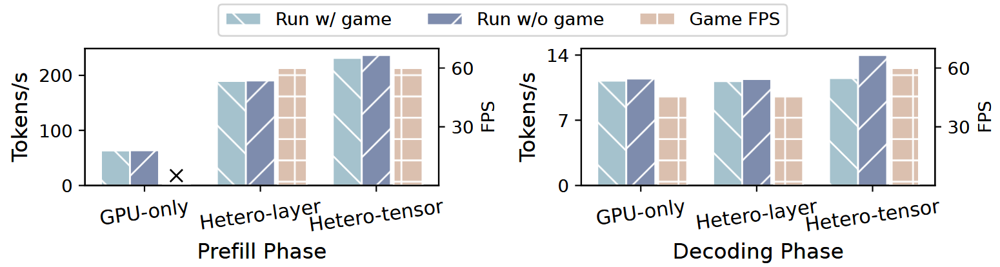{fig-align=center}

- **Scenario**: Running LLM inference alongside a heavy mobile game (Wild Rift).
- **Result**:
  - **GPU-only engines**: Cause severe FPS drops (resource contention).
  - **HeteroInfer**: Maintains stable 60 FPS while delivering high inference speed (offloads bulk to NPU).
