# Background & Motivation

## Serverless Inference Workflows

- DNN inference is moving to serverless computing for **high elasticity and pay-as-you-go cost efficiency.**
- Modern AI applications are usually implemented as workflows **consisting of multiple DNN models.**
- Example: Traffic monitoring (Object detection $\rightarrow$ Face recognition & Car recognition).

## Existing Serverless GPU Systems

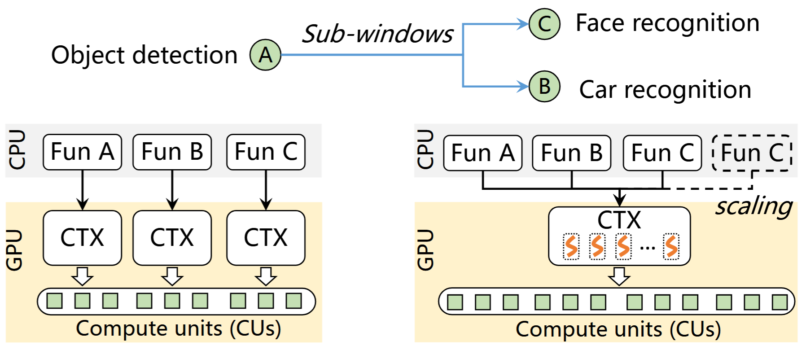{fig-align=center}

- GPUs are spatially partitioned (e.g., via NVIDIA MPS) to serve multiple co-located functions.
- **Monolithic Isolation:** Each function (container) is assigned a separate, monolithic GPU runtime (e.g., CUDA context).

## Limitation 1: Excessive Memory Footprint

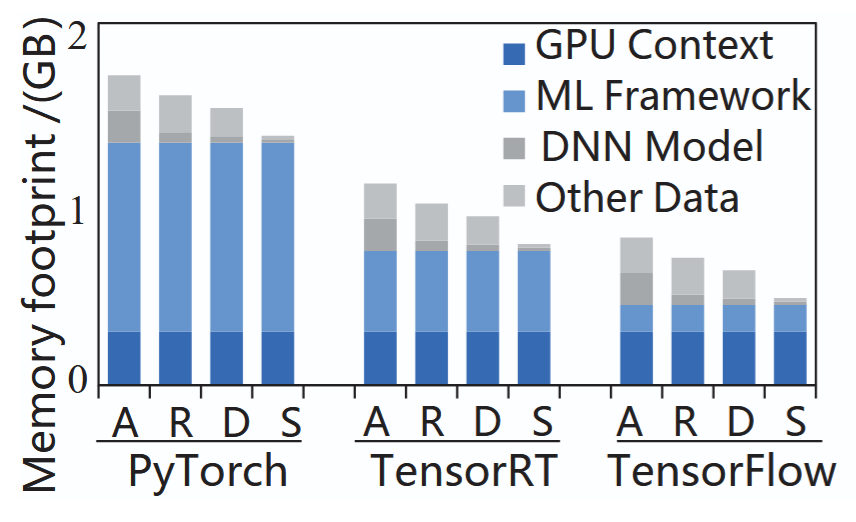{fig-align=center}

- Isolating functions with separate GPU runtimes causes over 90% data redundancy in GPU memory.
- The GPU runtime (context and ML libraries) occupies up to 95% of the memory footprint.
- Results in low deployment density and wasted expensive GPU memory.

## Limitation 2: Unacceptable Cold Start

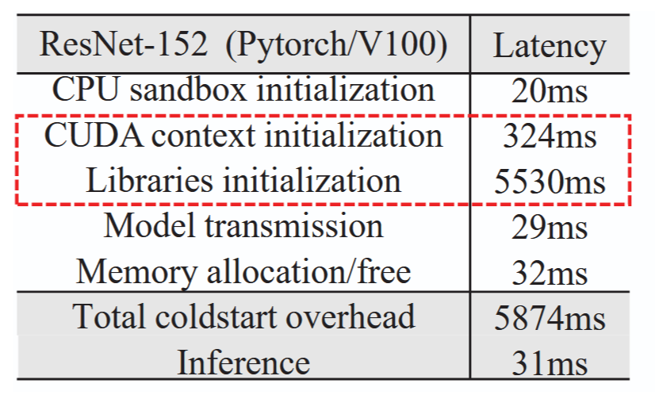{fig-align=center}

- The cold start latency of initializing a new GPU runtime is over 5 seconds.
- Unacceptable for latency-sensitive DNN inference.
- Traditional "warm-up" methods (keeping functions alive) are ineffective on GPUs because they hoard scarce memory resources.

## Limitation 3: Inefficient Communication

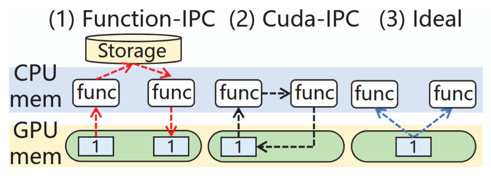{fig-align=center}

- Communication between functions on the same GPU suffers from redundant data copies.
- Data must be copied from the GPU to CPU memory, and then back to the GPU, due to the strict isolation between GPU runtimes.

## The Opportunity: GPU Streams

{fig-align=center}

- **Idea:** Use GPU streams as lightweight sandboxes instead of monolithic runtimes.
- Functions within a workflow share a single GPU runtime.
- **Benefits:**
  - Fast startup (no context initialization)
  - Small memory footprint (eliminates redundancy)
  - Zero-copy data passing (shared address space)

# System Design

## StreamBox Architecture

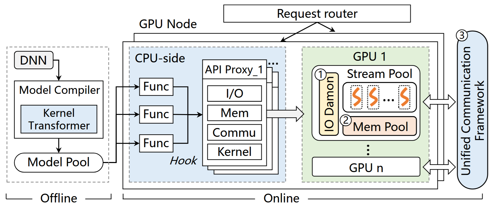{fig-align=center}

- Hooks GPU APIs from containers and forwards them to an API Proxy.
- **Three core components:**
  - Auto-scaling Memory Pool
  - Unified Communication Framework
  - IO Daemon for PCIe sharing

## Auto-scaling Memory Pool

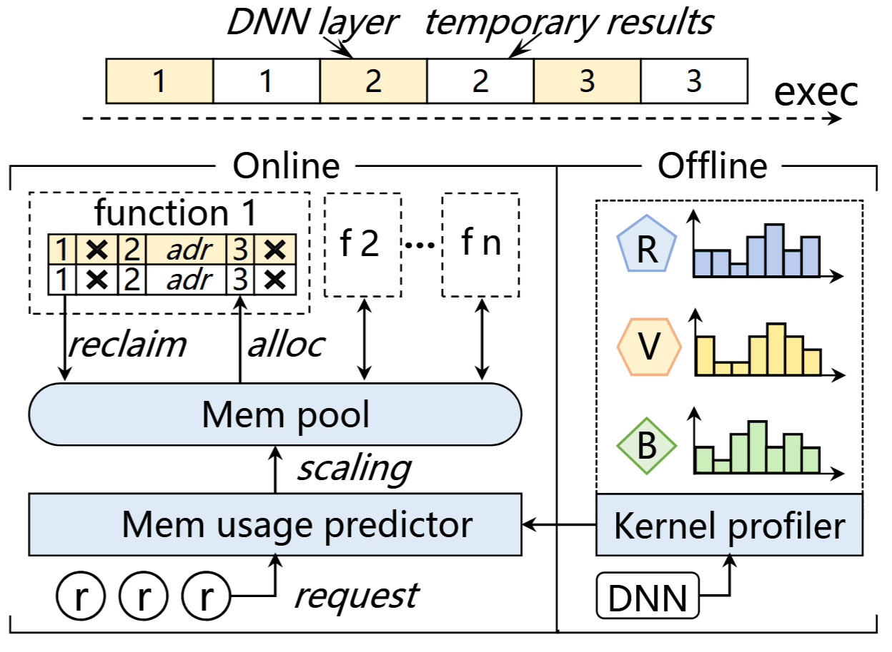{fig-align=center}

- **Fine-grained Management:** Allocates and recycles memory at the DNN *layer* granularity.
- **Lazy Allocation:** Physical addresses are allocated only when a variable is first accessed.
- **Eager Recycling:** Intermediate layer results are freed immediately when the next layer's computation starts.

## Resilient Memory Scaling

- **Offline Profiling:** Pre-runs models to build exact memory usage profiles for different batch sizes.
- **Real-time Scaling:** Periodically adjusts the memory pool size based on predicted future intervals.
- Prevents memory hoarding and aligns with the serverless pay-as-you-go billing model.

## User-transparent Communication Framework

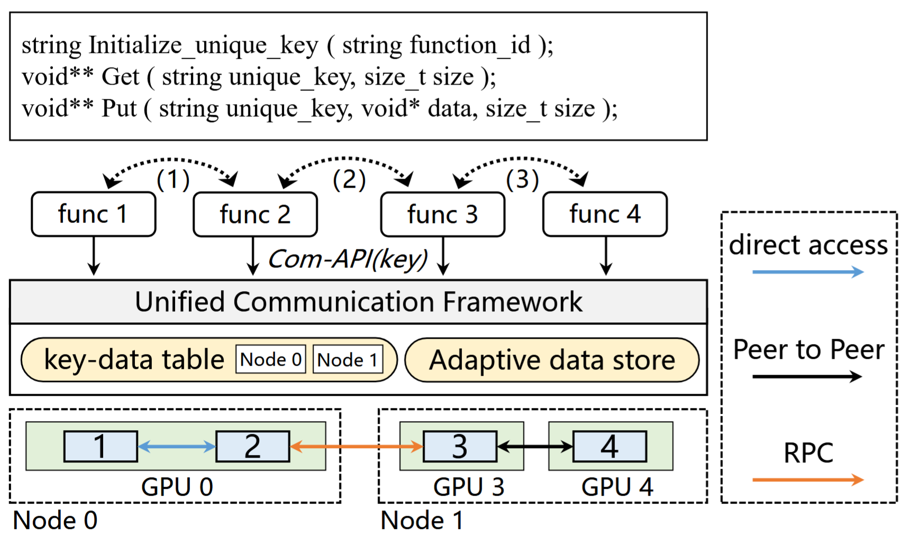{fig-align=center}

- Provides simple `PUT` and `GET` APIs for developers.
- Adaptively switches communication methods (Intra-GPU, NVLink P2P, RPC) based on function placement.
- **Elastic Communication Store:** Caches intermediate data directly in idle GPU memory for zero-copy access.

## Adaptive Inter-GPU Movement

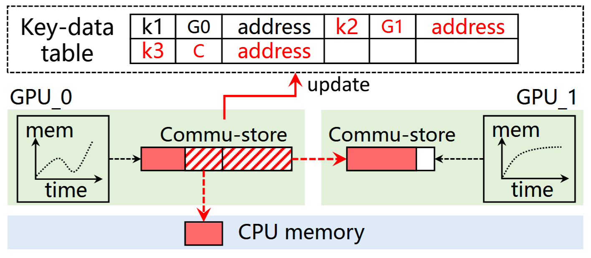{fig-align=center}

- Monitors GPU memory pressure in real-time.
- If idle memory is insufficient, StreamBox preemptively moves intermediate data to neighboring GPUs (via high-speed NVLink) or CPU memory.
- Avoids interfering with currently running inference functions.

## Fine-grained PCIe Bandwidth Sharing

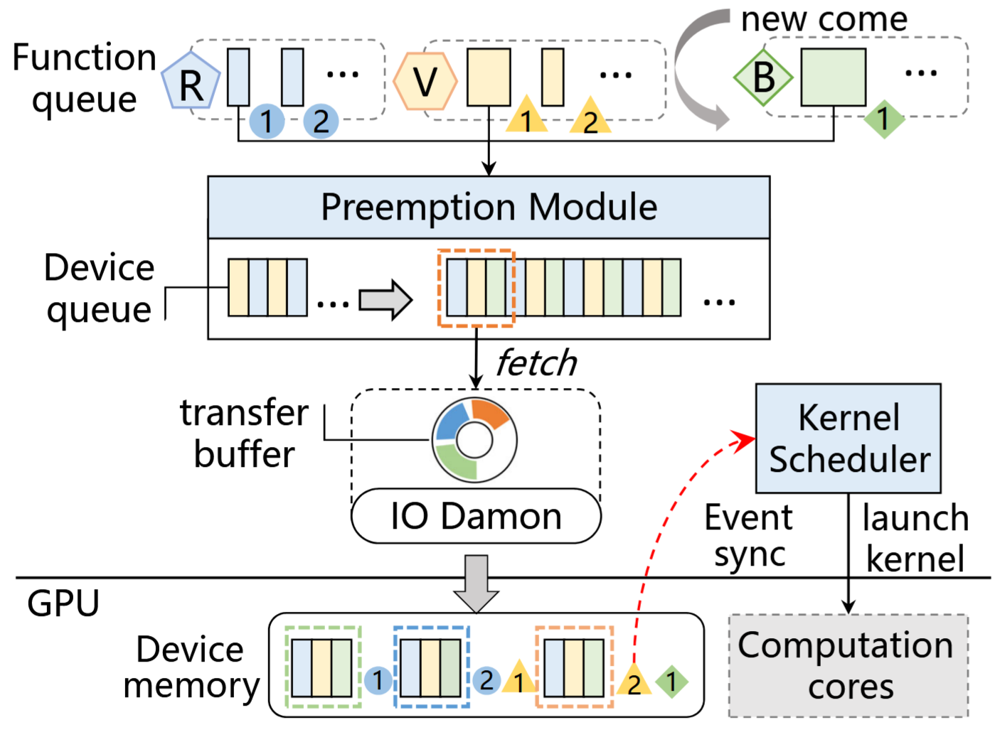{fig-align=center}

- **Challenge:** A single stream monopolizes the PCIe bus, blocking concurrent functions.
- **Data Blocks:** Partitions large data transfers into optimal 2MB blocks.
- **Preemptive Batch Transfer:** An I/O daemon globally schedules and interleaves these blocks across different streams.
- **Rebuilt Synchronization:** Asynchronously injects event synchronizations at the block level to ensure correct execution order.

# Evaluation

## Environment Setup

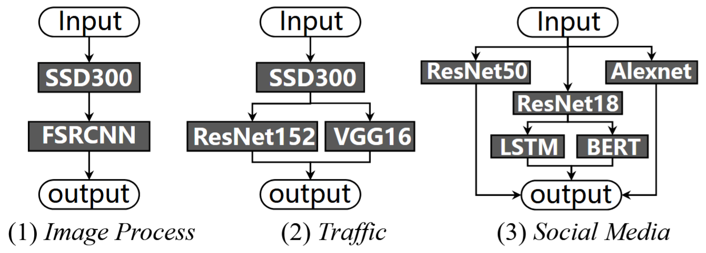{fig-align=center}

- **Hardware:** NVIDIA V100 GPUs (16GB), Intel Xeon CPUs.
- **Workloads:** Azure cloud traces (sporadic, periodic, bursty).
- **Baselines:**
  - **INFless:** State-of-the-art (MPS, CUDA IPC)
  - **Astraea:** QoS-aware system (MPS, CUDA IPC)
  - **Stream-only:** Naive stream implementation without optimizations

## Less Memory Footprint

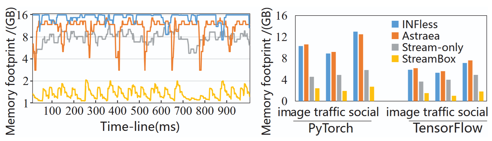{fig-align=center}

- StreamBox reduces GPU memory usage by up to **82%** compared to INFless and Astraea.
- Eliminates redundant GPU runtimes, allowing much higher deployment density.

## High Throughput

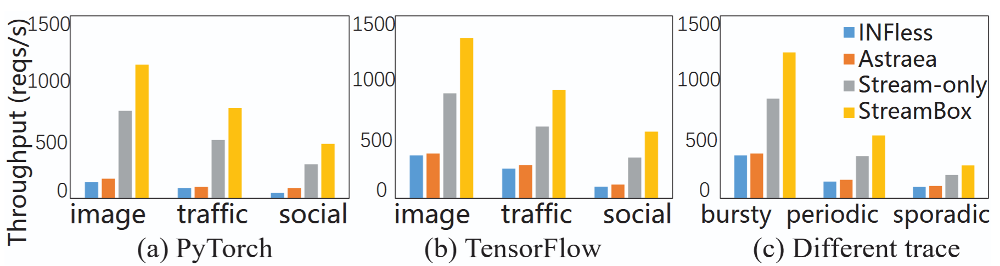{fig-align=center}

- StreamBox improves system throughput by **5.3X to 6.7X** compared to state-of-the-art systems.
- Outperforms Stream-only by 1.46X due to efficient memory management and communication.

## Low Latency & SLO Guarantee

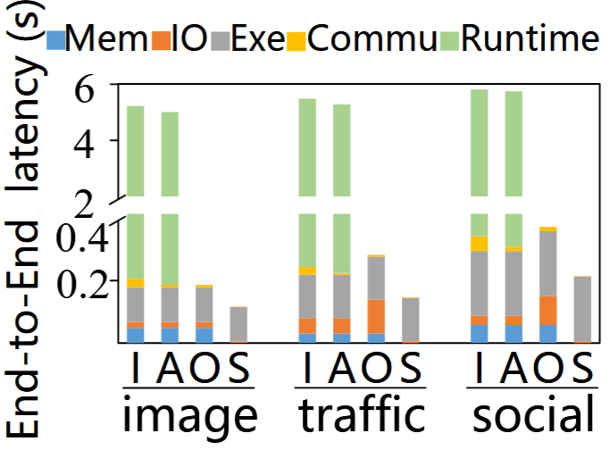{fig-align=center}

- Reduces end-to-end latency by up to **98%**.
- Startup latency is reduced from ~5.8 seconds to just **5 milliseconds**.
- Significantly lowers SLO violations, especially under bursty workloads.

## Communication & I/O Efficiency

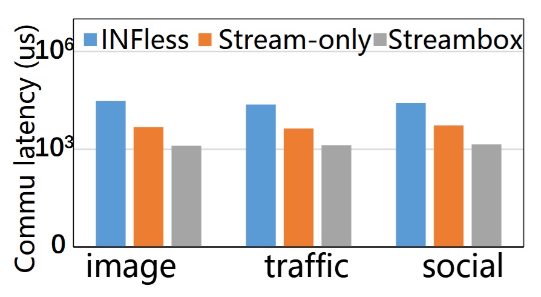{fig-align=center}

- **Communication:** Reduces overhead by 94% compared to INFless (Function-IPC) by keeping data in the GPU elastic store.
- **I/O Scheduling:** Reduces model loading latency by 91% compared to Stream-only by preventing PCIe monopolization.
