# Background & Motivation

## Growing App Demands vs. Limited Hardware

- Mobile applications exhibit increasingly high memory demands (gigabytes required for social, video, browser apps).
- Flagship devices still have limited physical DRAM (e.g., 8 GB to 16 GB).
- Android employs two main mechanisms to manage memory pressure:
  - **Kernel-level Reclaim**: Memory swapping and direct reclaim (preferred, transparent).
  - **Low Memory Killer Daemon (LMKD)**: Kills processes (disruptive, causes long restart latencies).

## Growing App Demands vs. Limited Hardware

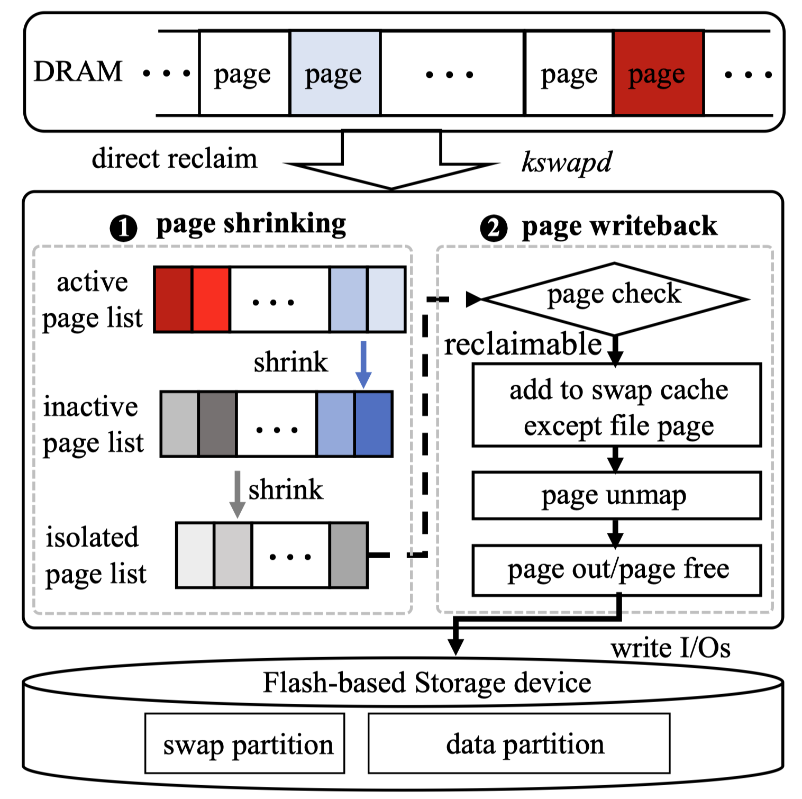{fig-align=center}

## Frequent and Expensive Process Killing

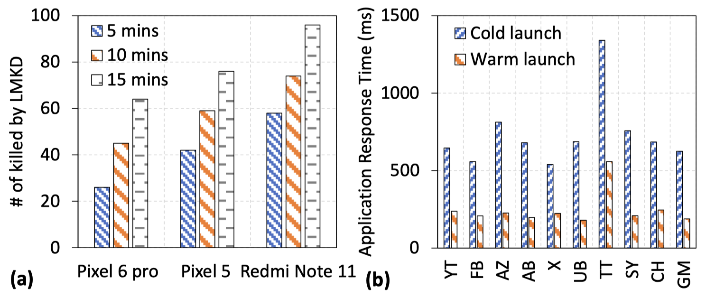{fig-align=center}

- High-end devices still experience dozens of LMKD process killings within minutes.
- Cold launches (restarts) after an LMKD kill are up to 3.1x slower than warm starts.

## Slow Kernel Reclaim

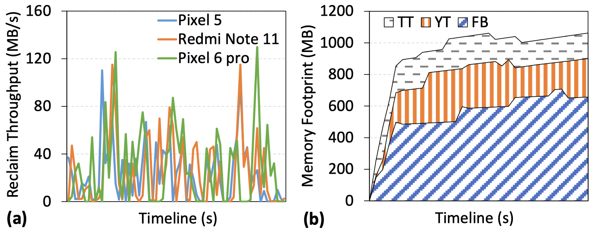{fig-align=center}

- Kernel reclaim throughput stubbornly fluctuates below 80 MB/s.
- Advanced flash storage hardware (UFS 3.1) provides minimal improvement over older hardware (UFS 2.1) for reclaim operations.
- App memory footprints rapidly outpace reclaim speed.

## Hardware is Not the Bottleneck

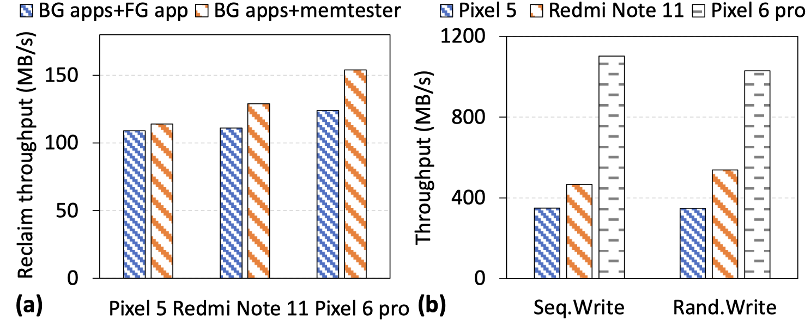{fig-align=center}

- **I/O Conflicts**: Background and foreground reading conflicts have a surprisingly low impact (< 8.3%) on reclaim throughput.
- **Storage Bandwidth**: UFS 3.1 can achieve ~1000 MB/s, proving the hardware is massively under-utilized by the memory reclaim process.

## Bottleneck 1: Sequential Execution

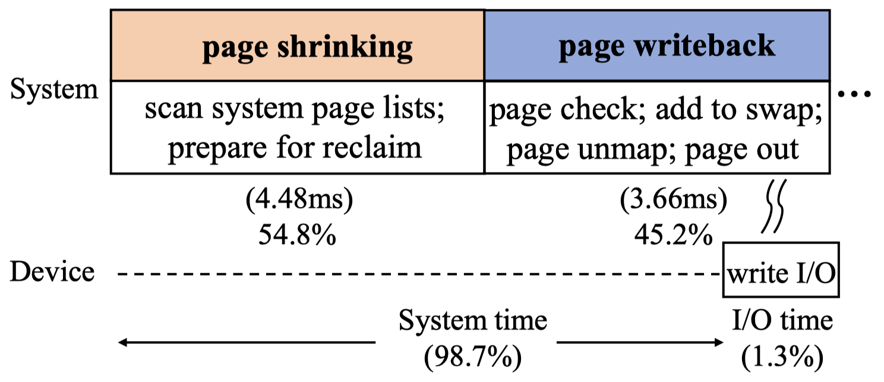{fig-align=center}

- Reclaim path is fundamentally sequential: Page Shrinking $\rightarrow$ Page Writeback.
- Over 50% of memory reclaim time is wasted waiting on Page Shrinking (which involves no I/O).

## Bottleneck 2: Inefficient Page Shrinking

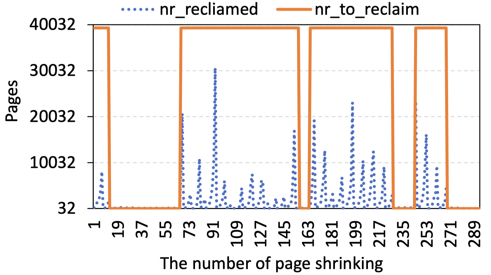{fig-align=center}

- The default kernel scanner frequently rejects pages (e.g., recently referenced, locked).
- The scan process constantly aborts early without hitting the target reclaim amount, requiring repeated, inefficient invocations.

## Bottleneck 3: Internally Blocked Page Writeback

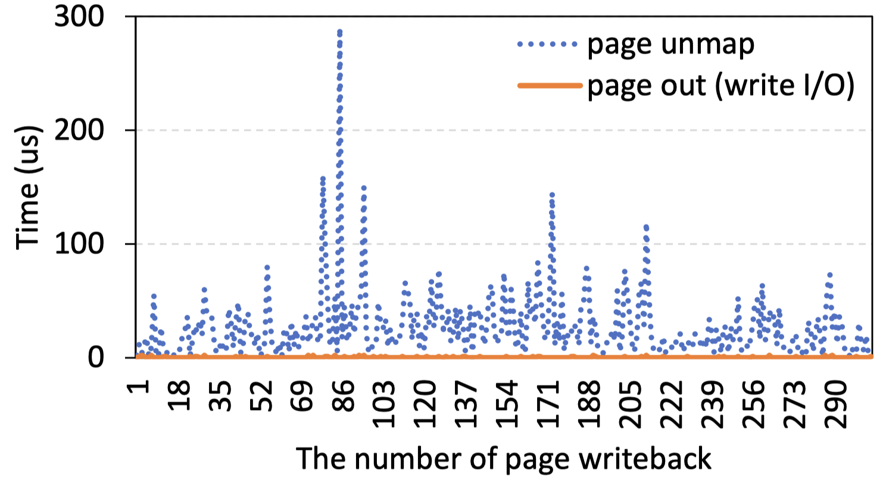{fig-align=center}

- **Page-by-page unmapping:** Unmapping pages from the page table is slow and unstable.
- **Fragmented 4KB writes:** Writing pages individually (4 KB at a time) fails to unleash the internal parallelism of modern flash storage.

# System Design

## PMR Architecture Overview

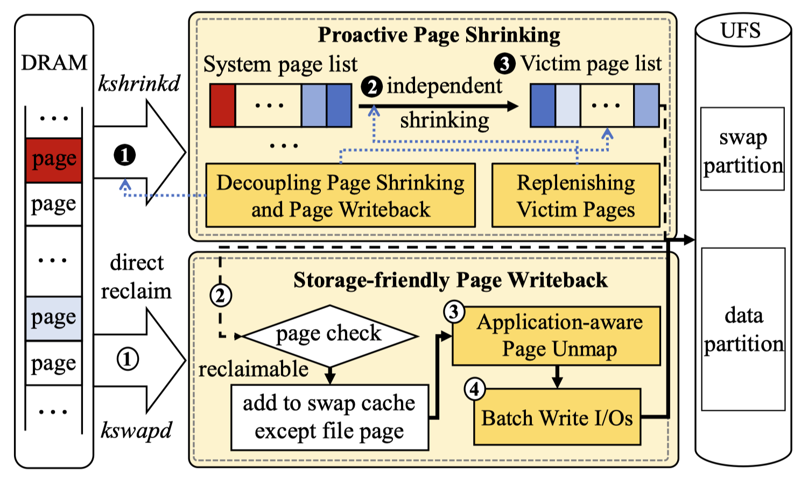{fig-align=center}

- **PMR (Parallel Memory Reclaim)** redesigns the reclaim path into two decoupled components:
  1. **Proactive Page Shrinking (PPS)**
  2. **Storage-friendly Page Writeback (SPW)**

## Proactive Page Shrinking (PPS)

- **Independent `kshrinkd` thread**: Offloads page shrinking from the critical writeback path.
- **Proactive Preparation**: Triggers proactively before memory runs out to build up a "victim page list."
- **Instant Execution**: When memory bursts occur, writeback processes directly consume pre-isolated pages without waiting for the shrinker.
- **Watermark Control**: Maintains an empirical supply of victim pages (e.g., 462 MB) to prevent thrashing.

## Storage-friendly Page Writeback (SPW)

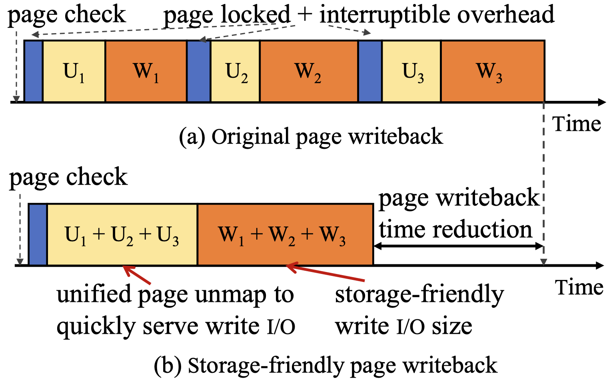{fig-align=center}

- Redesigns the 4KB page-by-page system into a bulk processing pipeline.
- **Application-aware Page Unmap**: Groups victim pages by application to minimize lock contention. The unmap thread is given high priority and pinned to a "big" core to avoid interrupts.

## Batch Write I/Os

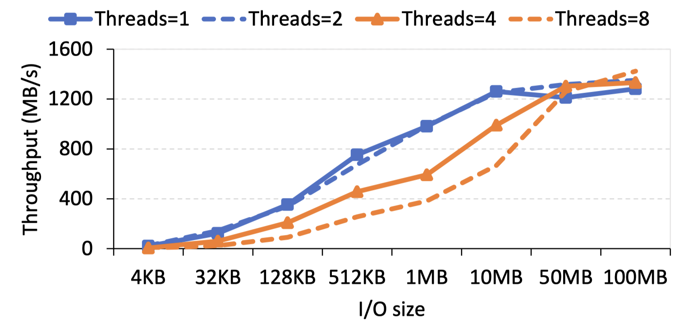{fig-align=center}

- Accumulates unmapped pages and submits them as large bulk write I/Os.
- Sized dynamically (e.g., up to 10 MB on Pixel 6 Pro) to perfectly match the internal parallelism and peak throughput of the underlying UFS storage device.

# Evaluation

## Environment Setup

- **Platforms**: Google Pixel 5 (UFS 2.1), Redmi Note 11 (UFS 2.2), Google Pixel 6 Pro (UFS 3.1).
- **Workloads**: UI Automator simulating user interactions across 10 foreground apps and 26 background apps.
- **Baselines**:
  - OriginalMR (Default Linux)
  - Acclaim (State-of-the-art foreground-aware memory reclaim)
  - Fleet (ART GC & kernel-swap co-design)

## Application Response Time

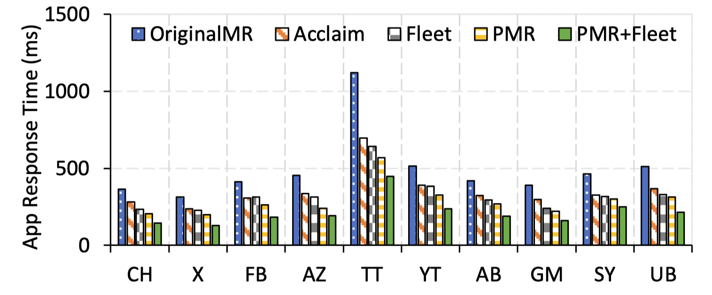{fig-align=center}

- PMR significantly reduces application response times.
- Achieves a **43.6% reduction** in response latency compared to OriginalMR.
- PMR is orthogonal and complementary to previous frameworks (PMR + Fleet yields a 67.4% reduction).

## Memory Reclaim Throughput

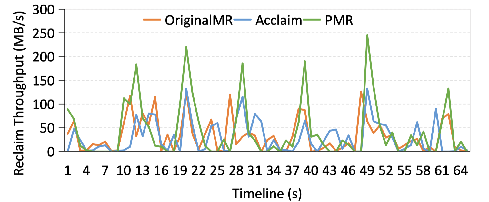{fig-align=center}

- PMR's parallelized architecture completely removes the software bottleneck.
- Peak memory reclaim throughput is increased by **82.8%** and **75.5%** over OriginalMR and Acclaim, respectively.

## System Stability: Reducing LMKD and Page Faults

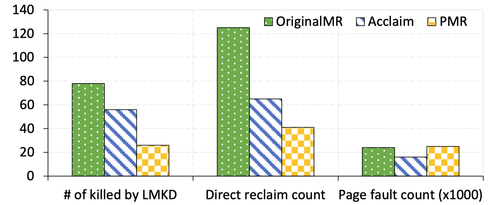{fig-align=center}

- By alleviating memory pressure quickly, PMR rescues the system from fatal memory starvation.
- **LMKD events (app kills) are reduced by 82%** compared to OriginalMR.
- Direct memory reclaims are reduced by 45% compared to Acclaim.

## Storage Scalability

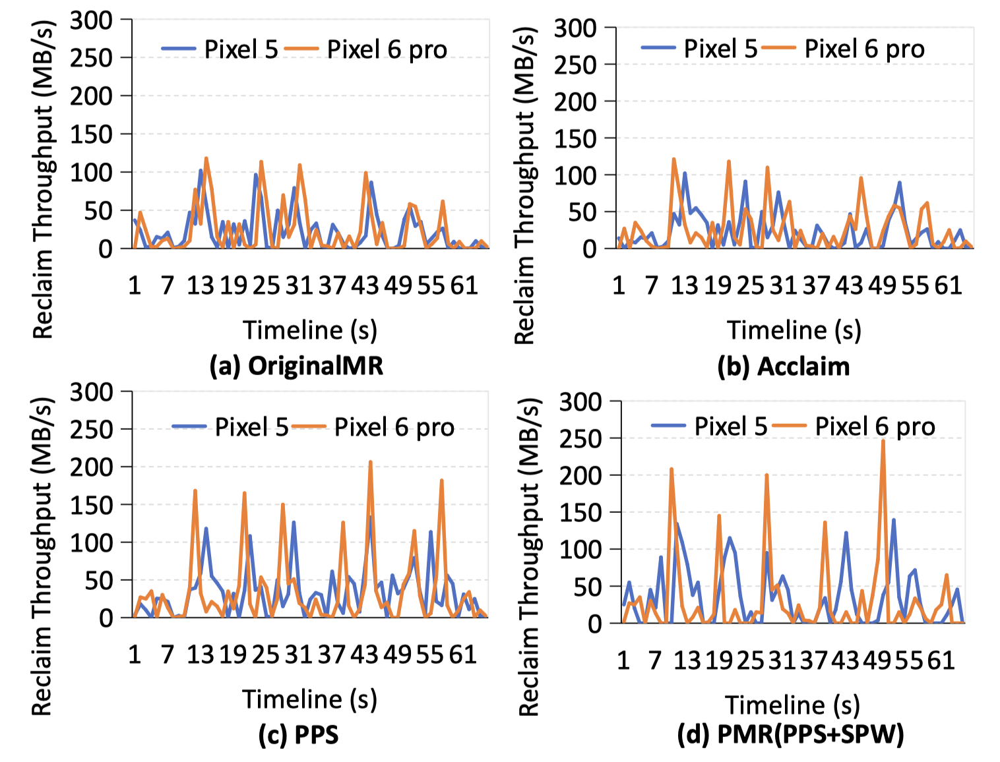{fig-align=center}

- Unlike OriginalMR which bottlenecks on CPU/software regardless of the disk, PMR scales with hardware.
- On Pixel 6 Pro (UFS 3.1), PMR pushes reclaim throughput past 200 MB/s, successfully exploiting the faster flash storage.
