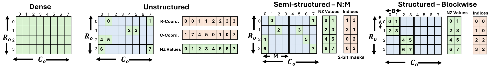
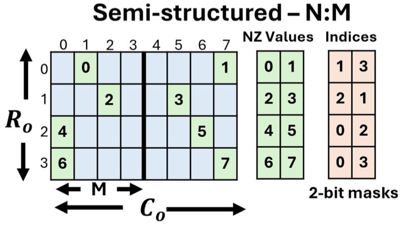
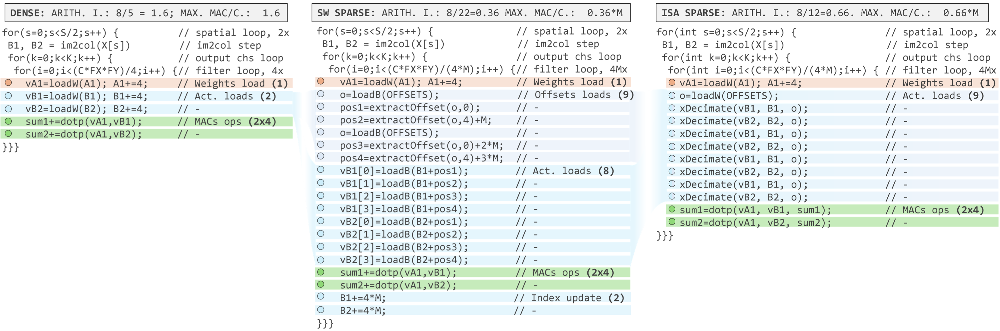
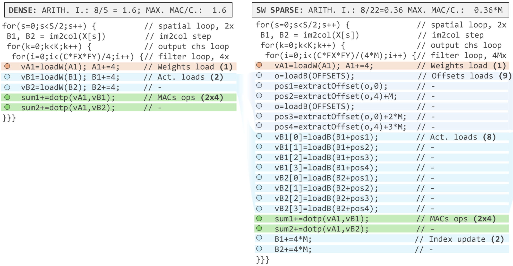
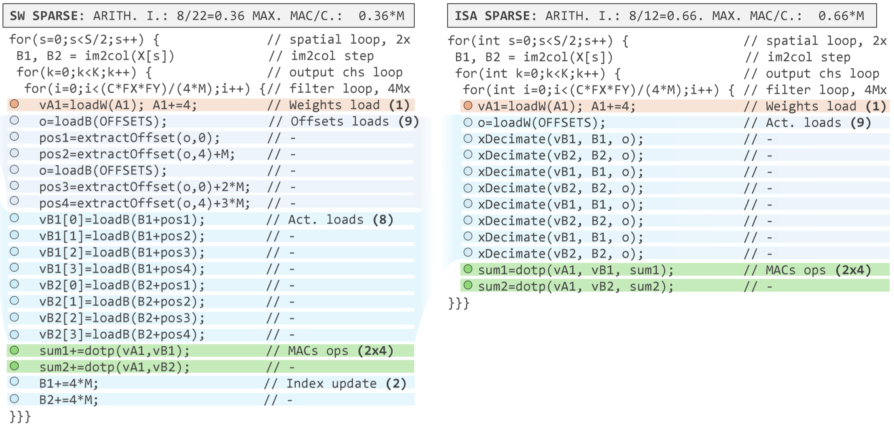
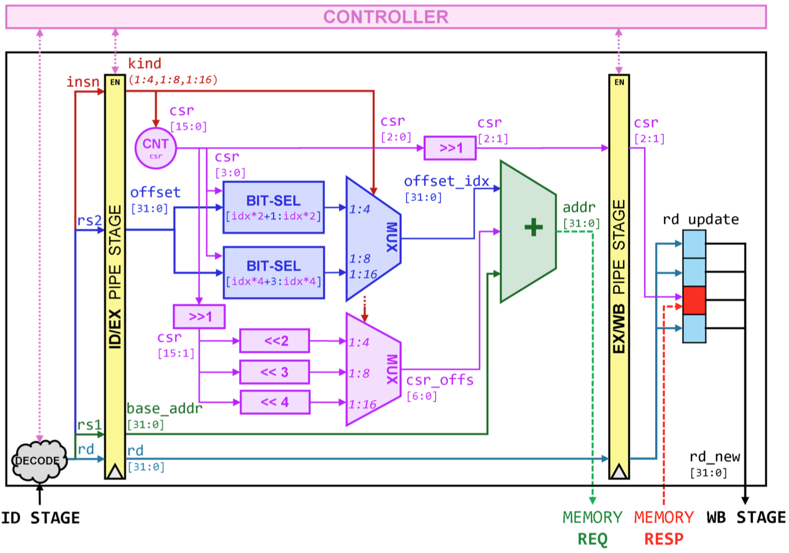
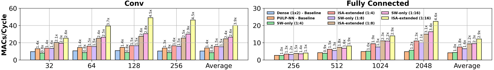
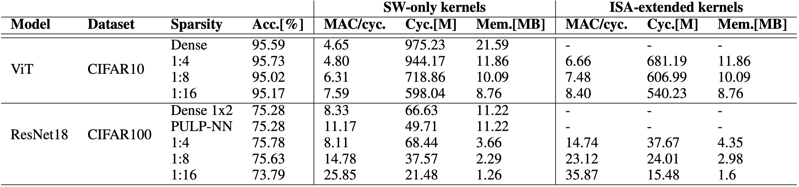
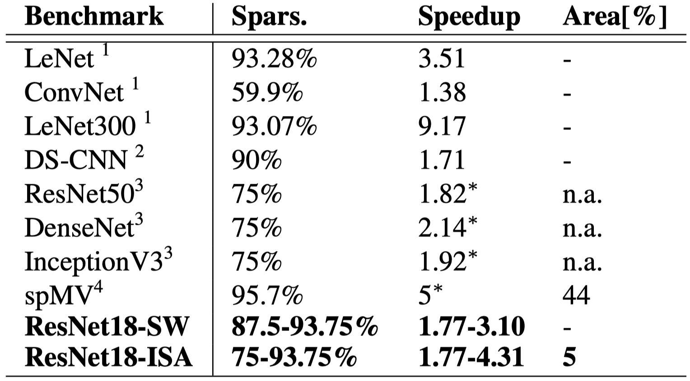

# Background & Motivation

## DNNs on Microcontrollers (MCUs)

- **Extreme Edge Computing:** Deploying DNNs on IoT end-nodes ensures data privacy, predictable latency, and energy efficiency.
- **The Challenge:** MCUs operate under extremely tight memory and power constraints.
- **The Solution:** Extensive optimization techniques like quantization and pruning are mandatory.

## The Pruning Dilemma

- **Unstructured Pruning:** Highest compression, but irregular memory accesses ruin arithmetic density. Often slower than dense networks on MCUs.
- **Structured Pruning (Block/Channel):** Hardware-friendly and regular, but causes massive accuracy drops on complex tasks.
- **Semi-Structured (N:M) Pruning:** A middle ground. Exactly N non-zero (NZ) weights in every block of M. Balances hardware parallelism with model accuracy.

{fig-align=center}

## N:M Sparsity Formats

{fig-align=center}

- Only non-zero values are stored.
- Relative indices are compressed (e.g., 4 bits for 1:8 sparsity).
- Highly memory-efficient even at low sparsity ratios compared to traditional formats like CSR.

## Limitations of Existing Solutions

- **High-End Hardware:** GPUs (e.g., NVIDIA A100) support N:M sparsity, but are entirely out of scope for MCUs.
- **Existing MCU Hardware Extensions:** Solutions like Streaming Semantic Registers (SSRs) target unstructured sparsity but require massive silicon area overheads (up to 44%).
- **Pure Software Solutions:** MCU Instruction Set Architectures (ISAs) are too simple. Unpacking compressed indices in software creates a massive instruction bottleneck.

We need a **lightweight combination** of software kernels and a minimal ISA extension.

## Motivation

- **Goal:** Bridge the gap between dedicated hardware accelerators and RISC-V MCUs.
- **Approach:** Unlock Pareto-optimal trade-offs (accuracy vs. latency vs. area) for N:M sparsity using a lightweight HW/SW co-design.

# System Design

## System Architecture Overview

A three-fold contribution targeting multi-core RISC-V MCUs:

1. **Software Kernels:** Optimized routines for 1:4, 1:8, and 1:16 N:M sparsity.
2. **ISA Extension:** A lightweight custom instruction (`xDecimate`) to eliminate software bottlenecks.
3. **Compiler Integration:** End-to-end network deployment via the MATCH compiler.

## Software Kernels: Decimate Im2col

{fig-align=center}

- **Standard Dense Convolutions:** Use `im2col` to reorganize input patches into 1D arrays for SIMD dot-products.
- **Sparse Convolutions:** Different output channels have different non-zero weight indices.
- **Decimate Im2col:** Keeps the standard `im2col` buffer, but adds an inner-loop step to compute relative offsets and load *only* the activations corresponding to non-zero weights.

## The Software Bottleneck

{fig-align=center}

- In the software-only sparse kernel, **19 out of 22 instructions** in the inner loop are wasted on unpacking indices and packing registers.
- Actual MAC operations are starved.

## Hardware ISA Extension: xDecimate

- **Concept:** Merge index extraction and memory loading into a single instruction.
- **Syntax:** `xdecimate rd, rs1, rs2`
  - `rs1`: Base address of the `im2col` buffer.
  - `rs2`: Packed non-zero offsets.
  - `rd`: Destination register for the loaded activation.
- **Mechanism:** Uses a hardware CSR to auto-increment and point to the correct data block on consecutive calls.

{fig-align=center}

## xDecimate Microarchitecture

{fig-align=center}

- Implemented as an eXtension Functional Unit (XFU) in the RISC-V pipeline (Decode, Execute, Write-Back).
- **Ultra-Lightweight:** Incurs an area overhead of only **5%** (compared to 44% for prior unstructured sparsity extensions).

## Compiler Integration (MATCH)

- **Pattern Recognition:** Automatically identifies 1:4, 1:8, and 1:16 sparsity patterns in the DNN graph.
- **Tiling for Sparse Kernels:** Adjusts memory tiles based on the reduced weight dimensions and the index overhead.
- **Memory Storage:** Interleaves compressed weights and indices in L2 memory so both can be fetched in a single DMA transaction.

# Evaluation

## Environment Setup

- **Platform:** GVSoC virtual platform simulating the Vega PULP SoC (8-core RISC-V cluster, 22nm).
- **Quantization:** 8-bit integers.
- **Benchmarks:**
  - ResNet18 (CIFAR100) - N:M pruning on 3x3 convolutions.
  - ViT-Small (CIFAR10) - N:M pruning on Fully-Connected (FC) layers.
- **Baselines:** Dense 1x2 unrolled kernels and state-of-the-art PULP-NN dense library.

## Single Layer Performance

{fig-align=center}

- **Software-Only:** Up to 2.6x speedup for Convolutions and 3.4x for FC layers (at 1:16 sparsity).
- **ISA-Extended:** `xDecimate` pushes Convolution speedups up to 3.9x, making even 1:4 sparsity highly advantageous.

## End-to-End Performance: ViT-Small

- Sparsifying FC layers accounts for 60% of operations.
- **Accuracy:** Minimal drop (0.42% drop at 1:16 sparsity).
- **Latency:** 1.81x speedup over the dense baseline using the ISA extension.
- **Memory:** 2.34x lower memory footprint.

{fig-align=center}

## End-to-End Performance: ResNet18

- Sparsified convolutions account for 98% of total MACs.
- **Accuracy:** 1:8 sparsity actually achieves *higher* accuracy (+0.35%) than the dense network.
- **Latency:** 2.07x speedup over the best dense baseline (PULP-NN) using the ISA extension.
- **Memory:** 3.77x lower memory footprint.

{fig-align=center}

## Comparison with SOTA

- **Area Efficiency:** Achieves competitive speedups (1.77x - 4.31x) with only a **5% area overhead**.
- **Prior Art:** Existing unstructured sparsity hardware extensions (e.g., SSRs) require up to 44% area overhead on similar FPU-less cores.
- **Conclusion:** N:M sparsity with lightweight hardware support provides a highly practical, Pareto-optimal solution for extreme edge MCUs.

{fig-align=center}
