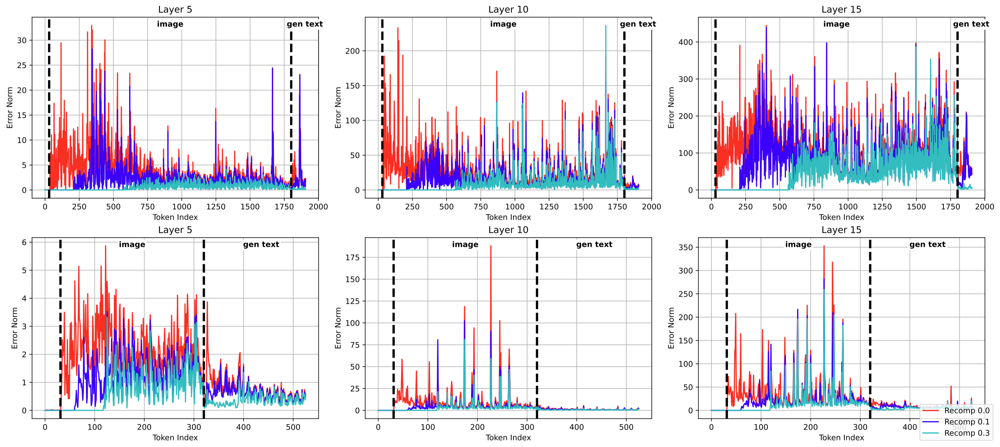
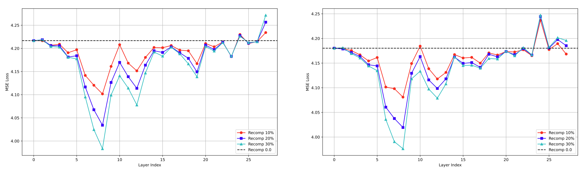
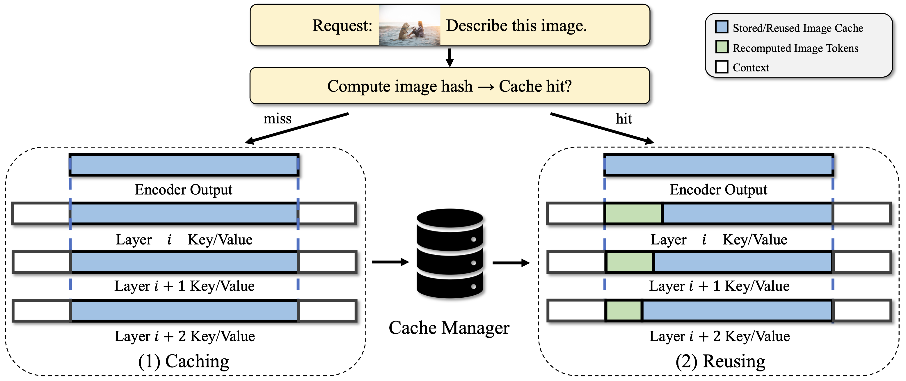
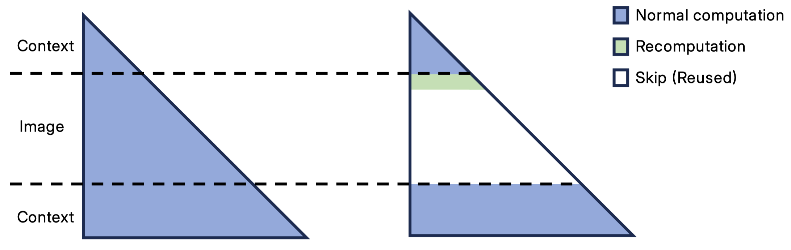
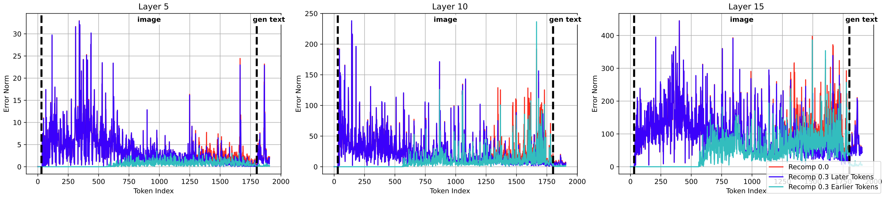

# Background & Motivation

## The Cost of Vision-Language Models (VLMs)

- VLMs achieve remarkable performance in complex multimodal tasks.
- **Bottleneck:** High prefill latency due to long sequences of image tokens processed by Vision Transformers (ViT) and Large Language Models (LLMs).
- **Standard Solution:** Key-Value (KV) caching.
  - Requires an exact "prefix match" to reuse cached context.

## Limitations of Existing KV Cache Reuse

- When the text prompt changes but the image remains the same (prefix mismatch), strict KV caching fails.
- **Position-Independent Reuse (CacheBlend, MPIC, KVShare):**
  - Allows reusing KV cache despite different initial sequences.
  - Relies on partial recomputation of tokens to fix "reuse errors".
- **Problem:** Current methods use heuristic, static metrics (e.g., attention distance) to select which tokens to recompute, missing the structural nuances of the model.

## Observation 1: Cumulative Reuse Error Effect

{fig-align=center}

- Reuse errors are not independent; they propagate and accumulate sequentially to later tokens.
- **Insight:** Prioritizing *earlier* image tokens for recomputation cancels out a large portion of upstream errors and suppresses downstream accumulation.

## Observation 2: Layer-wise Importance Difference

{fig-align=center}

- Different transformer layers have varying sensitivities to cache staleness.
- **Insight:** Applying a uniform, static recomputation rate across all layers is sub-optimal. Some layers require high recomputation, while others can tolerate near 100% reuse.

# System Design

## Overview of VLCache

{fig-align=center}

- An end-to-end vision token KV cache reuse pipeline.
- Bypasses ViT computation via request-level embedding caching.
- Dynamically computes only 2–5% of vision tokens in the LLM while reusing 95–98%.

## Contiguous Partial Attention

{fig-align=center}

- Reuses the stored encoder and KV cache for the vast majority of tokens.
- Evaluates the query tokens and a small, targeted subset of early tokens.
- Attention and MLP computations for reused tokens are skipped entirely.
- Forms contiguous computation regions, making kernel execution hardware-friendly.

## Dynamic Layer-Aware Recomputation

- **Objective:** Allocate a fixed token recomputation budget across layers to maximize accuracy.
- **Method:**
  1. Generate a proxy dataset and inject "mismatched" KV cache.
  2. Measure output text logit deviation (MSE loss) to calculate layer "sensitivity scores".
  3. Use a greedy algorithm to assign higher recomputation rates to highly sensitive layers.

## The Monotonic Constraint

- VLCache enforces that the recomputation rate must be **monotonically non-increasing** across layers (i.e., shallower layers $\ge$ deeper layers).
- **Why?**
  - VLCache reuses hidden states from upper layers. 
  - If a deeper layer recomputes a token that was skipped in a shallower layer, the required hidden state wouldn't exist, breaking the reuse assumption.

## System Integration (SGLang)

- Implemented as a plugin within the **SGLang** framework.
- **Global Hash Matching:** Entirely bypasses ViT by checking global concatenated pixel hashes against a distributed key-value store (Tair KVCache Store).
- **Per-Image Hashing & Masking:** 
  - Assigns hashes to individual images for modular KV cache management.
  - Constructs a binary computation mask at each layer to filter tokens using Block Sparse Attention.

# Evaluation

## Environment Setup

- **Hardware:** NVIDIA H20-3e GPU.
- **Framework:** Custom SGLang implementation.
- **Models Evaluated:** Qwen3-VL-8B, Qwen3-VL-32B, Qwen2.5-VL-7B, Qwen2.5-VL-32B.
- **Workload:** Realistic multimodal queries with varying total input lengths (1K to 20K image tokens).
- **Baselines:** Full recomputation, ViT-skip only, Static Recomputation, CacheBlend, KVShare.

## Acceleration Results: Time-To-First-Token (TTFT)

- Achieves massive TTFT speedups across model scales.
- **Qwen3-VL-8B:** Up to 1.86x speedup at 20K tokens.
- **Qwen3-VL-32B:** Up to 3.18x speedup at 20K tokens.
- **Qwen2.5-VL-7B:** Up to 15.82x speedup at 20K tokens (due to ViT architectural differences).
- High sequence lengths benefit the most due to $O(n^2)$ attention complexity reduction.

## Accuracy Preservation

- Evaluated across diverse benchmarks (MMMU, MathVista, HallusionBench, DocVQA, etc.).
- With an average recomputation rate of only **3.5%** ($\bar{r} = 0.035$):
  - Mean accuracy stays within 0.1-0.5% of the full-recompute baseline.
  - VLCache's dynamic allocation strictly outperforms uniform static recomputation budgets.

## Validating the Cumulative Error Observation

{fig-align=center}

- **Experiment:** Compared allocating the 30% recomputation budget to the *first* tokens vs the *last* tokens.
- **Result:** Recomputing earlier tokens significantly reduces accumulated error, confirming the theoretical foundation of the framework.

## Comparison with SOTA Baselines

- Compared against **CacheBlend** (KV-cache distance matching) and **KVShare** (Attention-map distance matching) on Qwen3-VL-8B.
- **Results:**
  - VLCache consistently outperforms both baselines across 10%, 20%, and 30% budgets.
  - Demonstrates superior robustness without relying on localized heuristic distance metrics.
