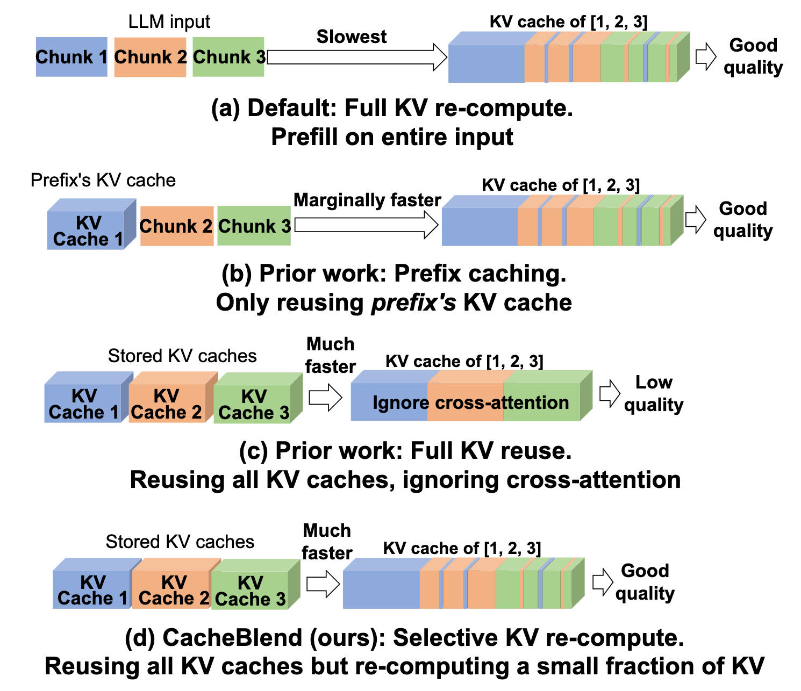
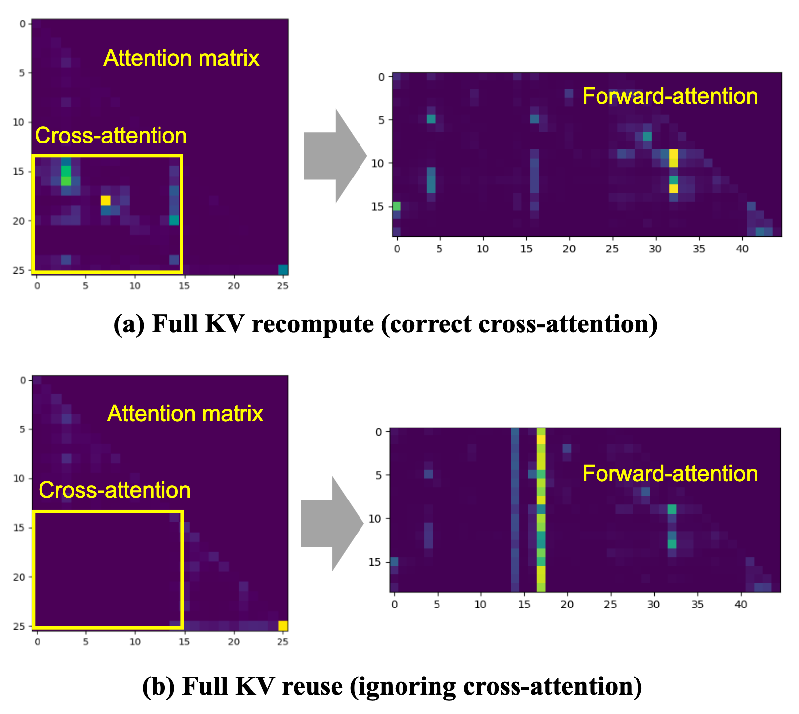
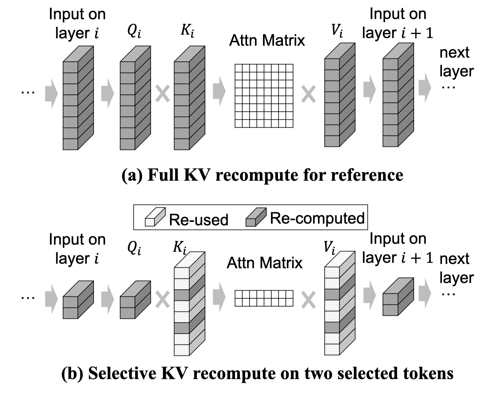
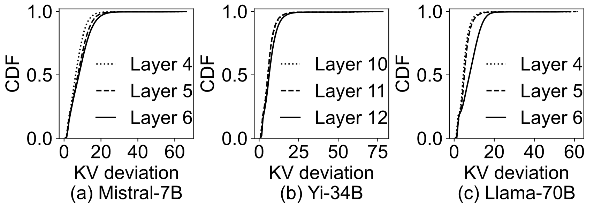
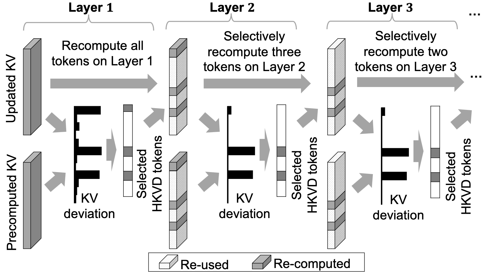
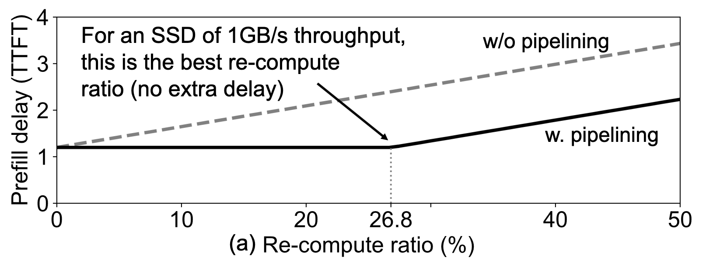
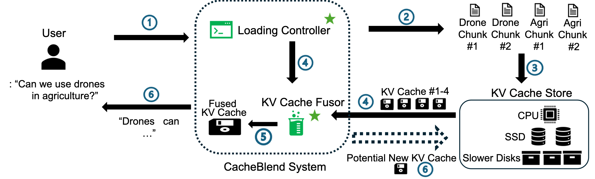
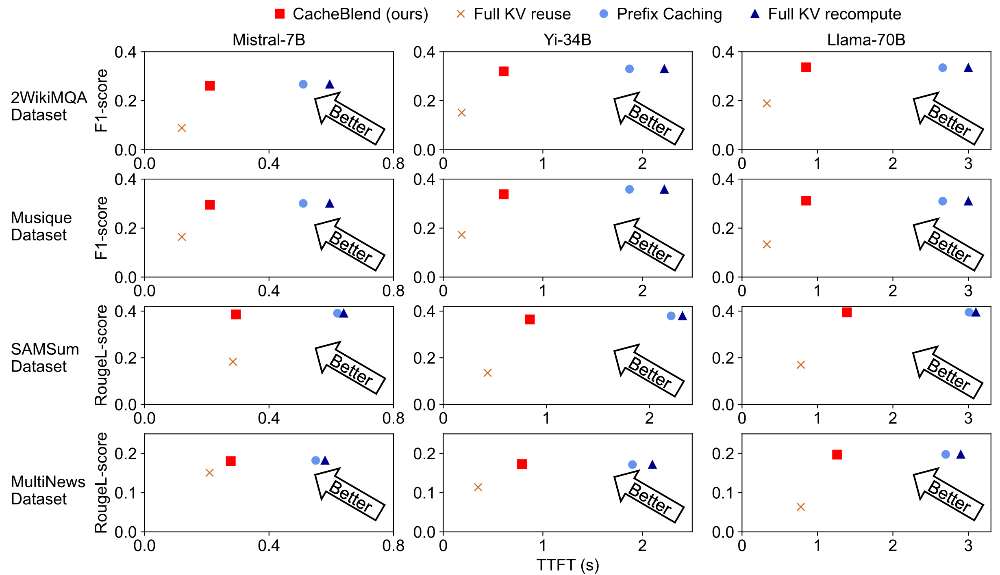
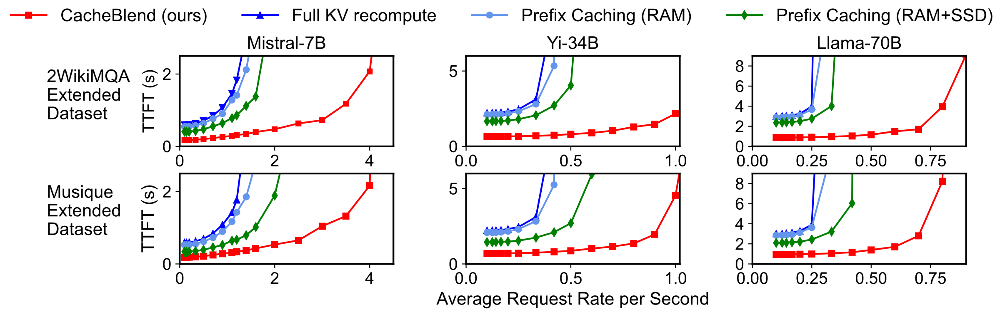
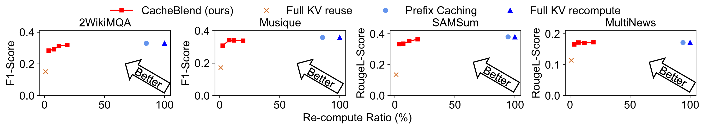

# Background & Motivation

## The Bottleneck of RAG in LLMs

- RAG prepends multiple retrieved text chunks to a user query.
- **The prefill phase** processes all input tokens to compute their KV cache before generating the first token.
- Prefill delay grows super-linearly with input length, severely impacting TTFT.

## Existing Approaches: Prefix Caching

{fig-align=center}

- Reuses the precomputed KV cache of a text chunk only if it is the exact *prefix* of the prompt.
- **Limitation in RAG:** Multiple chunks are used. Only the first chunk is the prefix; subsequent chunks must be completely recomputed.
- Result: Almost as slow as full recompute.

## Existing Approaches: Full KV Reuse (e.g., PromptCache)

{fig-align=center}

- Precomputes KV caches for all chunks independently and concatenates them with adjusted positional embeddings.
- **Limitation:** Ignores **cross-attention** (attention between tokens in one chunk and preceding chunks).
- Result: Severe degradation in generation quality (hallucinations/wrong answers).

## Existing Approaches

{fig-align=center}

## The Missing of Cross-Attention

{fig-align=center}

- Full KV reuse completely misses the cross-attention between chunks.
- This missing information heavily skews the forward-attention matrix, directly corrupting the generated output.

## Goal

- **Speed:** Match the fast TTFT of *Full KV Reuse*.
- **Quality:** Maintain the high generation quality of *Full KV Recompute*.
- **Challenge:** How to quickly combine precomputed KV caches for multiple text chunks without losing cross-attention?

# System Design

## CacheBlend Overview: Selective KV Recompute

{fig-align=center}

- **Core Idea:** Recompute the KV cache for only a small subset of tokens (10-15%) while reusing the precomputed KV cache for the rest.
- Saves massive compute time while recovering critical cross-attention.

## Why it works: Attention Sparsity

{fig-align=center}

- High attention typically only occurs between a very small number of tokens and their preceding tokens.
- We only need to update the KV values for tokens with high cross-attention, termed **High-KV-Deviation (HKVD) tokens**.

## Identifying HKVD Tokens: Gradual Filtering

{fig-align=center}

- Finding true HKVD tokens natively requires a full prefill, defeating the purpose.
- **Insight:** Tokens with the highest KV deviations on one layer are highly likely to have high deviations on the next layer.
- CacheBlend computes deviations on the first layer, selects top % of HKVD tokens, and filters them layer-by-layer.

## Pipelining Loading and Recompute

{fig-align=center}

- **Basic Insight:** If selective KV recomputation is faster than loading the KV cache into GPU memory, the extra compute delay can be hidden.
- CacheBlend parallelizes the selective recompute on layer i with the fetching of KV caches for layer i+1.
- Enables storing KV caches in slower, cheaper devices (e.g., SSDs) without impacting TTFT.

## CacheBlend System Architecture

{fig-align=center}

1. **KV Cache Store:** Splits and hashes LLM input into manageable chunks across storage levels.
2. **Loading Controller:** Dynamically calculates an "idealized recompute ratio" to perfectly match compute delay with I/O loading delay.
3. **KV Cache Fusor:** Merges caches layer-by-layer using selective recompute before passing them to the LLM engine (integrated into vLLM).

# Evaluation

## Environment Setup

- **Hardware:**
  - Runpod instances with 128GB RAM
  - 2x NVIDIA A40 GPUs
  - 1TB NVMe SSD (4.8 GB/s)
- **Models:**
  - Mistral-7B, Yi-34B (8-bit), Llama-70B (8-bit)
- **Datasets (RAG Scenarios):**
  - 2WikiMQA, Musique, SAMSum, MultiNews
- **Baselines:**
  - Full KV Recompute (vLLM baseline)
  - Prefix Caching (e.g., SGLang style)
  - Full KV Reuse (e.g., PromptCache)
  - MapReduce / MapRerank (LangChain RAG)

## Reduced TTFT with Negligible Quality Drop

{fig-align=center}

- **TTFT:** CacheBlend reduces TTFT by 2.2–3.3× compared to Full KV Recompute and Prefix Caching.
- **Quality:** CacheBlend outperforms Full KV Reuse significantly (improving F1 by 0.15–0.35) and stays within 0.02 of Full Recompute's quality.

## Higher Throughput at Lower Delay

{fig-align=center}

- At the same TTFT, CacheBlend increases throughput by up to 5× compared to Full KV Recompute.
- CacheBlend also achieves 3.3× higher throughput than Prefix Caching, as it avoids storing redundant prefixes and saves cache space.

## Sensitivity Analysis: Recompute Ratios

{fig-align=center}

- Recomputing just **5%–18%** of the tokens is the sweet spot.
- Yields a 4.1–6.6× raw compute reduction compared to full prefill.
- Minimal loss in generation quality (max 0.002 F1/Rouge-L drop).
