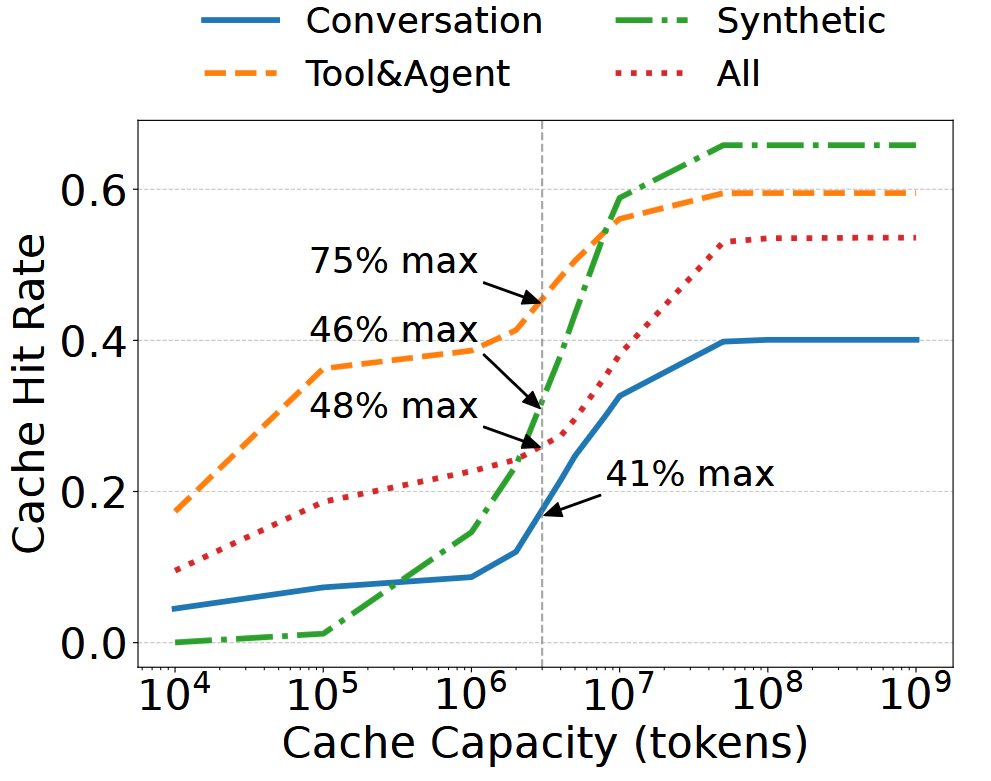
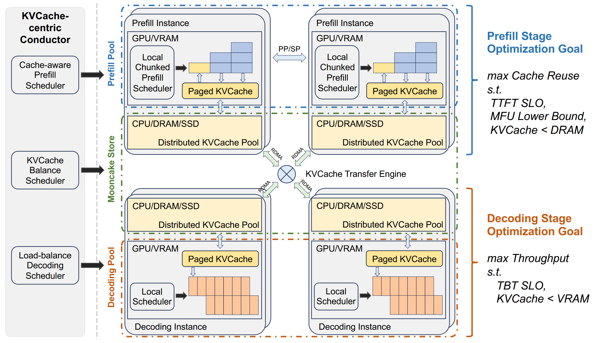
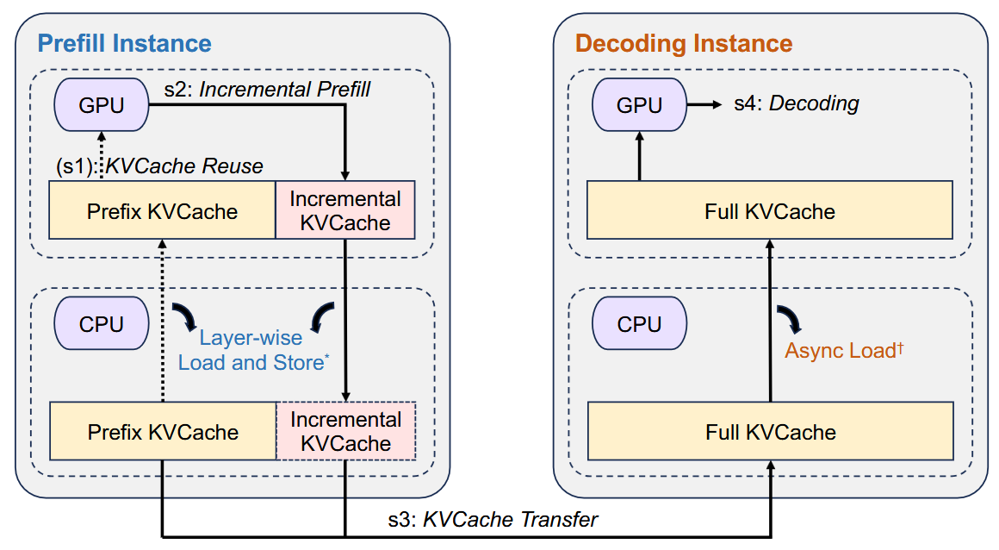
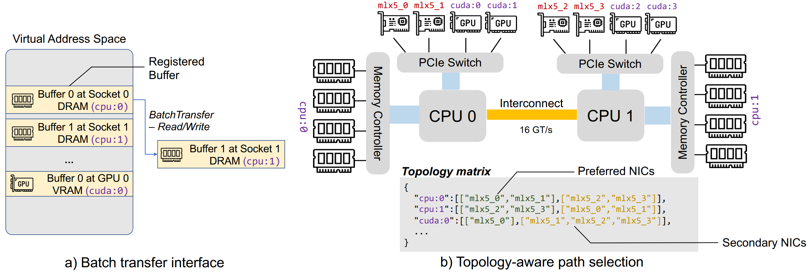
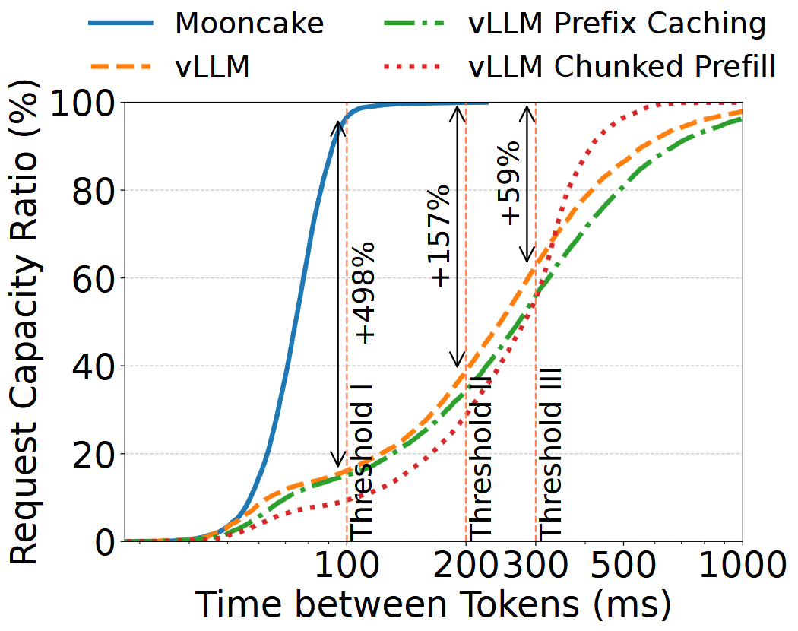
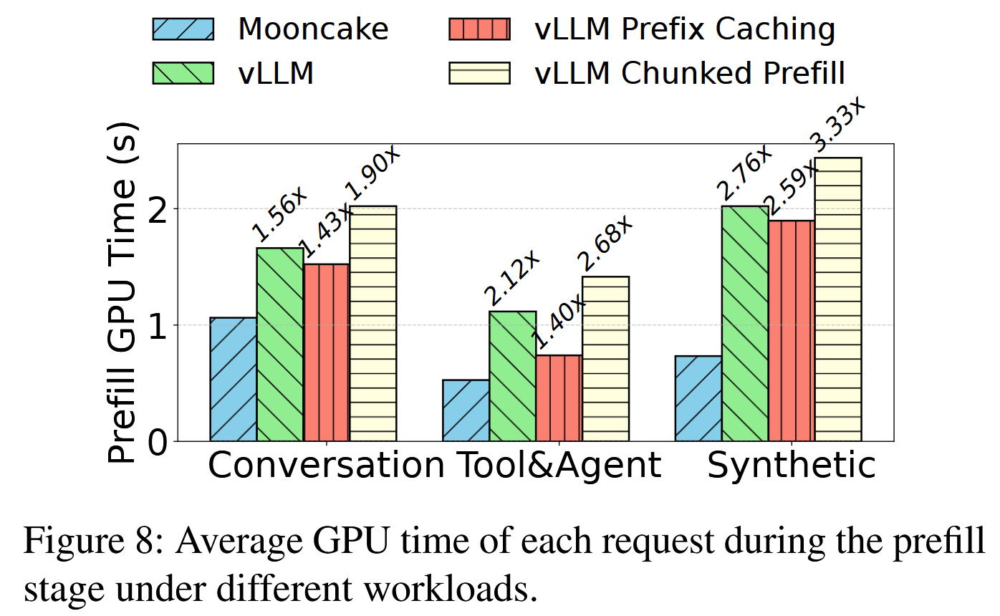
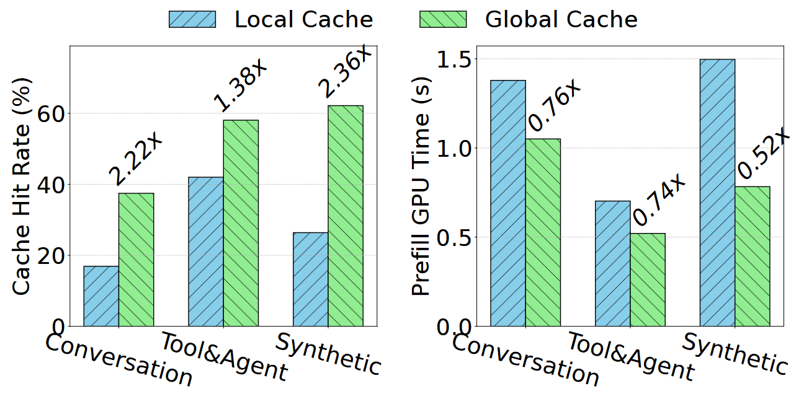
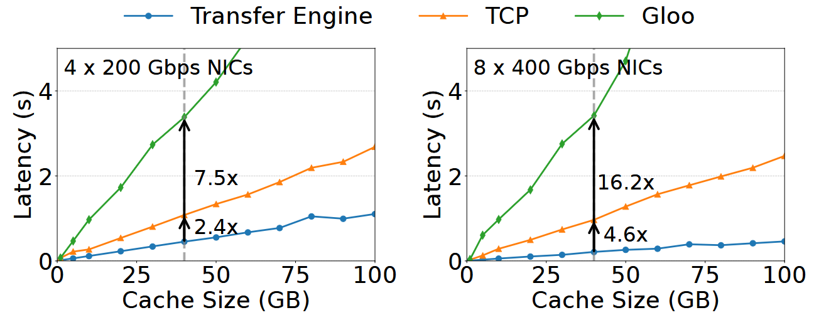

# Background & Motivation

## The Challenge of LLM Serving

- **Goal:** Maximize overall system throughput to reduce costs while strictly adhering to SLOs.
- **Primary SLOs:**
  - **TTFT (Time to First Token):** Latency of the prefill stage.
  - **TBT (Time Between Tokens):** Latency of the decoding stage.

## Conflicting Workloads in LLMs

- **Prefill Stage:** Compute-intensive. Processes all input tokens in parallel.
- **Decoding Stage:** Memory-bandwidth bound. Generates one token at a time sequentially.
- **The Issue:** Running both on the same integrated GPU nodes causes severe interference, making it difficult to meet TTFT and TBT SLOs simultaneously.

## The KVCache Bottleneck

{fig-align=center}

- **Prefix Caching:** Saves compute by reusing intermediate keys/values (KVCache) of previous prompts.
- **Limitation:** Local GPU memory (HBM) and single-node host DRAM are too small to store enough KVCache for high hit rates.
- Context windows are growing rapidly (up to 128k+ tokens), exacerbating storage limits.

## Motivation: Trading Storage for Computation

- Modern GPU clusters have massive amounts of underutilized CPU, DRAM, SSD, and RDMA network resources.
- **Core Idea:** Pool these resources across the entire cluster to create a massive, disaggregated global KVCache.
- Transferring this cache over high-speed networks is significantly faster and cheaper than recomputing tokens from scratch.

# System Design

## MOONCAKE Architecture Overview

{fig-align=center}

- **Disaggregated Architecture:** Separates Prefill and Decoding nodes.
- **MOONCAKE Store:** A petabyte-level distributed global cache.
- **Conductor:** A KVCache-centric global scheduler.

## Disaggregated Prefill and Decoding

{fig-align=center}

- **Prefill Nodes:** Handle compute-heavy prompt processing and generate the KVCache.
- **Decoding Nodes:** Receive streamed KVCache and handle memory-bound continuous batching for token generation.
- **Benefit:** Prevents long-context prefill tasks from disrupting the TBT of ongoing decoding tasks.

## MOONCAKE Store: Distributed Global Cache

{fig-align=center}

- Stores KVCache in paged blocks across the cluster's CPU DRAM and SSDs.
- **High-Speed Transfer Engine:** Utilizes RDMA (up to 8x400 Gbps) for inter-node transfers.
- **Topology-Aware Path Selection:** Intelligently routes data through the most efficient NICs to avoid PCIe or CPU interconnect bottlenecks.

## KVCache-Centric Global Scheduling (Conductor)

- Routes requests based on the physical location of the KVCache, not just node compute load.
- **Cache-Aware Routing:** Calculates predicted TTFT by weighing compute time saved by the cache against the node's current queue time.
- **Cache Load Balancing:** Uses a heuristic-based automated hotspot migration scheme to dynamically replicate "hot" cache blocks and prevent network congestion.

## Chunked Pipeline Parallelism (CPP)

- Designed to handle massive context lengths (e.g., 100k+ tokens) without violating TTFT SLOs.
- Splits long prompts into chunks.
- Chunks are processed sequentially across multiple nodes in a pipeline.
- Avoids the heavy, continuous cross-node communication required by traditional Sequence Parallelism.

# Evaluation

## Environment Setup

- **Hardware:** High-performance computing cluster. Each node has 8x NVIDIA A800 GPUs and 4x 200 Gbps RDMA NICs.
- **Baselines:** 
  - vLLM
  - vLLM with prefix caching
  - vLLM with chunked prefill
- **Workloads:** Real-world Conversation traces, Tool&Agent interactions, and Synthetic long-context datasets.

## Effective Request Capacity

{fig-align=center}

- Measures the maximum throughput that remains within defined TTFT and TBT SLO thresholds.
- MOONCAKE increases effective request capacity by 59% to 498% compared to baseline methods under real-world conversation workloads.

## Prefill GPU Time Reduction

{fig-align=center}

- Global cache maximizes hit rates, drastically reducing the compute time needed for the prefill stage.
- MOONCAKE achieves prefill GPU time reductions of 36%, 53%, and 64% across different workloads compared to standard vLLM.

## Global vs. Local Cache Performance

{fig-align=center}

- Restricting cache to a single node (local cache) leads to suboptimal utilization.
- MOONCAKE's global cache achieves up to a 136% higher cache hit rate than local cache setups.
- Results in up to 48% savings in prefill computation time.

## KVCache Transfer Performance

{fig-align=center}

- MOONCAKE's RDMA transfer engine consistently exhibits significantly lower latency than alternative methods.
- Achieves 2.4x and 4.6x faster transfer speeds compared to standard TCP protocol.
- Fully saturates network bandwidth to hide transfer times behind GPU computation.
