# Background & Motivation

## LLM Serving and the Memory Bottleneck

- **Batching is crucial** for high-throughput LLM serving.
- Batching imposes heavy pressure on GPU memory capacity due to the **KV cache** (intermediate token embeddings).
- **PagedAttention** is the industry standard:
  - Divides memory into fixed-size pages.
  - Relies on two assumptions: **Fixed-size embeddings** and **Full attention** across all layers.

## The Rise of Heterogeneous LLMs

* Modern LLMs invalidate PagedAttention's core assumptions.
* **Traditional LLMs:** Homogeneous layers, uniform memory usage.
* **Heterogeneous LLMs:** Mix of full attention, sliding window, and Mamba layers. Memory usage varies drastically across layers and request lengths.

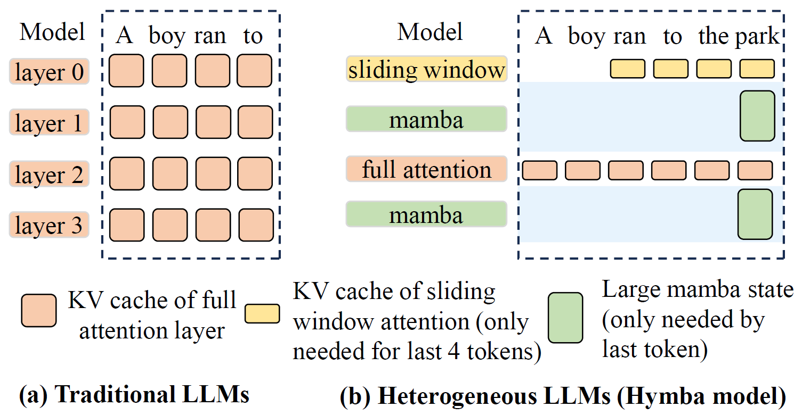{fig-align=center}

## Source of Heterogeneity 1: Embedding Sizes

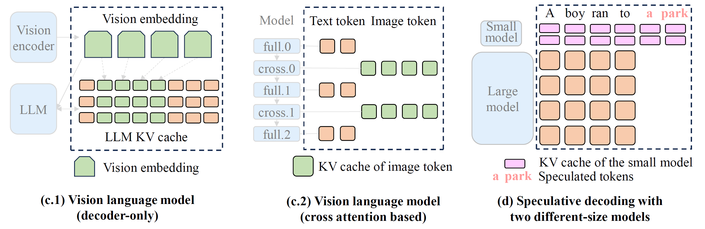{fig-align=center}

- **Vision Language Models (VLMs):** Image tokens and text tokens have naturally different embedding sizes.
- **Speculative Decoding:** Running a small draft model and a large target model concurrently requires managing two vastly different KV cache sizes.

## Source of Heterogeneity 2: Attention Mechanisms

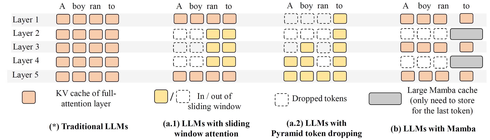{fig-align=center}

- **Sparse/Sliding Window Attention:** Only attends to a subset of recent prefix tokens.
- **State Space Models (Mamba):** Uses a large, fixed-size tensor to capture history, independent of sequence length.
- **Full Attention:** Attends to all previous tokens.

## The Problem: Severe Memory Fragmentation

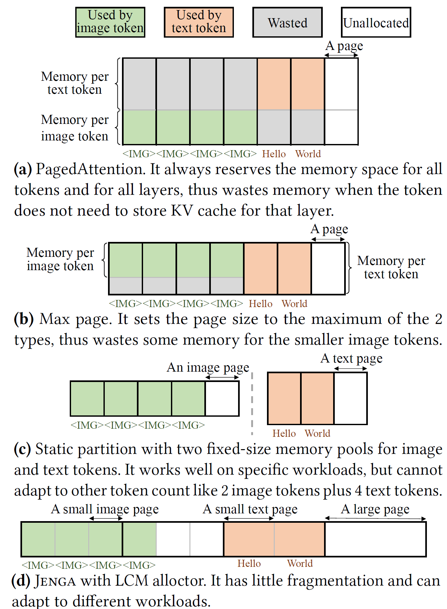{fig-align=center}

- **PagedAttention** forces different-sized embeddings into a single fixed page size.
- **Max Page:** Wastes memory for smaller embeddings.
- **Static Partition:** Cannot adapt to dynamic workload changes (e.g., varying ratios of text vs. image tokens).
- **Result:** Up to 79.6% memory waste in models like Llama 3.2 Vision.

## The Problem: Inefficient Prefix Caching

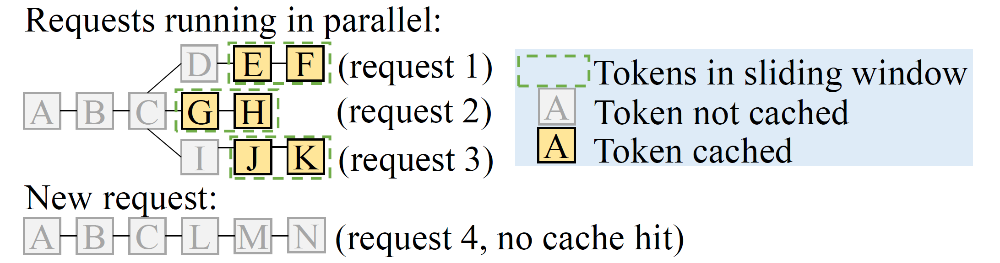{fig-align=center}

- **Cache hit dependency:** Efficient attention layers (like sliding windows) only need a small subset of recent tokens to generate the next token.
- Forcing them to cache the entire sequence wastes memory.
- **Trade-off:** Allocating memory to cache inactive tokens improves cache hit rates but limits the maximum batch size for active requests.

# System Design

## Jenga System Architecture

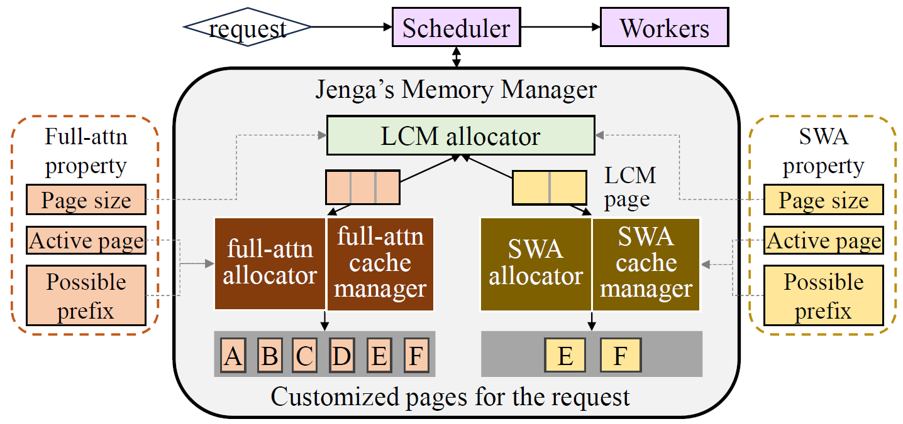{fig-align=center}

- A heterogeneity-aware memory management framework.
- **Layer Property Interface:** Abstracts the behavior of different attention mechanisms.
- **LCM Allocator:** Avoids fragmentation across heterogeneous layers.
- **Customized Cache Managers:** Optimizes prefix caching per attention type.

## Layer Property Interface

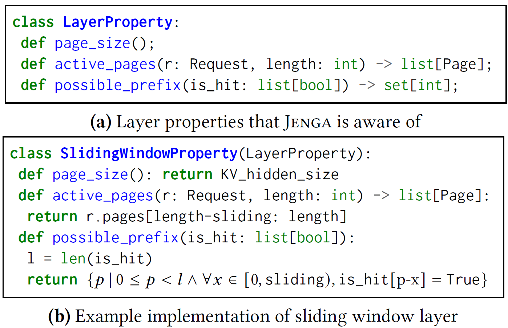{fig-align=center}

- Jenga models attention behaviors through three attributes:
  - `page_size()`: Memory footprint per token.
  - `active_pages()`: Pages needed to compute future tokens (guides eviction).
  - `possible_prefix()`: Valid prefix cache hit lengths.
- Automatically parses model structures without manual configuration.

## LCM-based Two-Level Memory Allocation

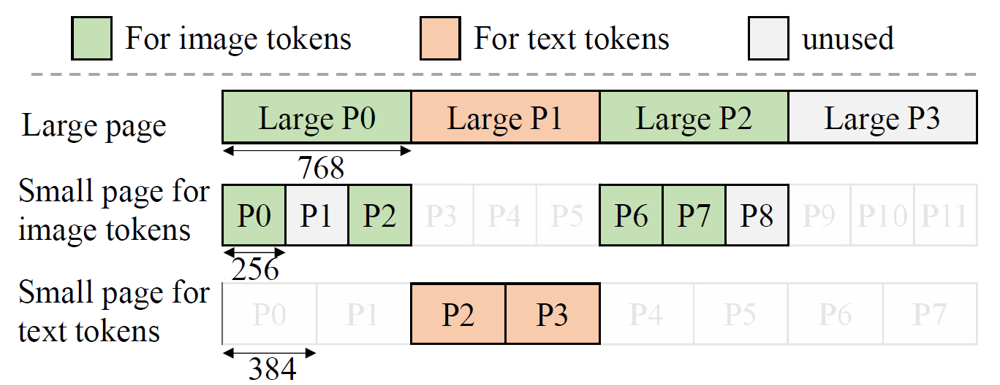{fig-align=center}

- **Large Pages (Global):** Size is the **Least Common Multiple (LCM)** of all layer page sizes (e.g., LCM of 256 and 384 is 768).
- **Small Pages (Layer-Specific):** Customized allocators partition large pages into exact small pages needed for specific layer types.
- Completely eliminates external fragmentation and minimizes internal fragmentation.

## Execution with New Memory Layout

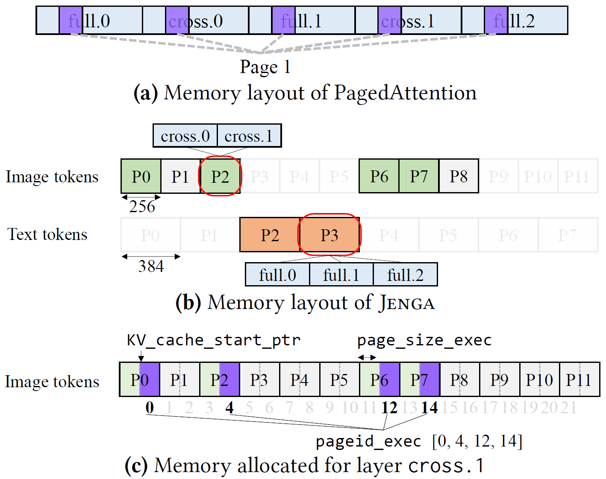{fig-align=center}

- **PagedAttention:** Uses a *layer-page* partition (allocates fixed-size tensors for each layer).
- **Jenga:** Uses a *page-layer* partition.
- Preserves the original PagedAttention worker interfaces with minimal changes to the inference engine.

## Customizable Prefix Caching

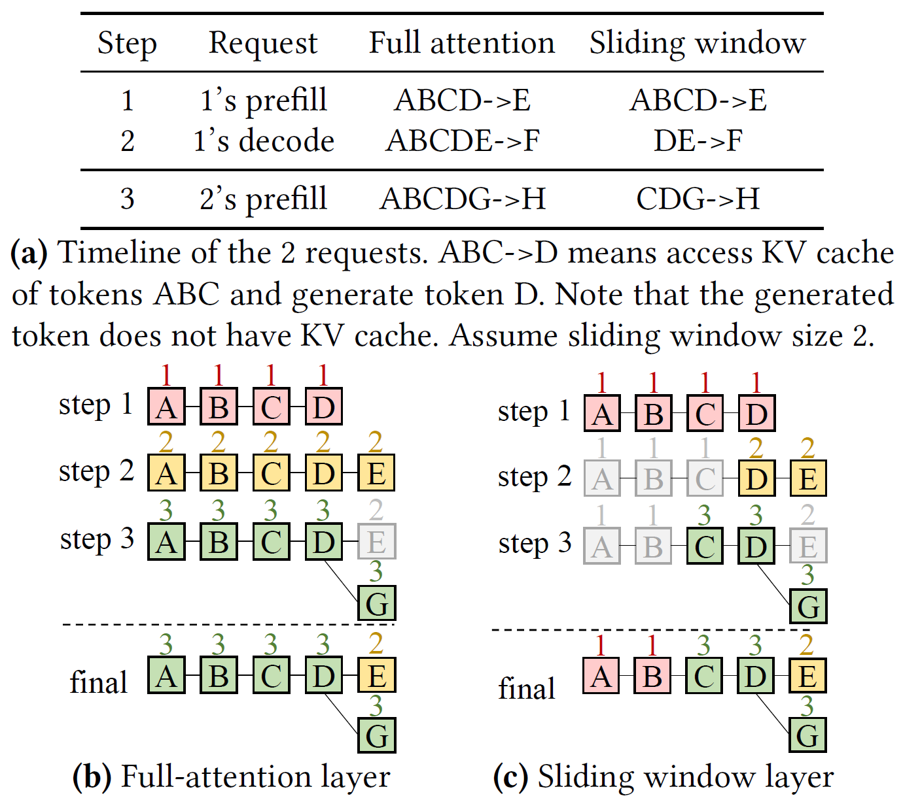{fig-align=center}

- **Smart Eviction:** Jenga overrides the "last access time" based on layer properties.
- For sliding window layers, tokens *outside* the window are not updated, making them a higher priority for LRU eviction.
- Maintains balanced eviction across different layers to prevent bottlenecking the overall cache hit rate.

## Common Page Pool

- **The Trade-off:** Increasing batch size evicts prefix caches, lowering hit rates.
- **Solution:** Jenga introduces a "Common Page Pool" to protect highly reusable pages.
- **Common Prefix Predictor:** Analyzes request arrival intervals and shared prefixes to predict which tokens will be reused (e.g., system prompts).
- High-value pages are kept in the common pool; the rest are aggressively freed to maximize batch size.

# Evaluation

## Environment Setup

- **Implementation:** ~4,000 LoC integrated into vLLM v0.8.3.
- **Hardware:** NVIDIA H100 80GB and NVIDIA L4 24GB GPUs.
- **Models:** Llama 3.2 Vision, Gemma-3, Ministral, Llama 4, Jamba-1.5, Character.ai.
- **Baselines:** 
  - vLLM (PagedAttention)
  - Static Partition
  - Max Page

## End-to-End Throughput

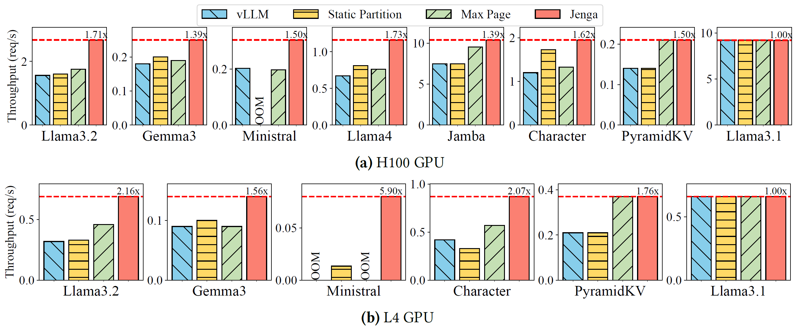{fig-align=center}

- Jenga achieves up to **1.73x speedup** (1.46x average) on H100.
- Jenga achieves up to **2.16x speedup** (1.65x average) on L4.
- Outperforms naive extensions (Static Partition / Max Page) across all heterogeneous models.

## End-to-End Latency

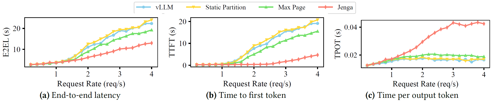{fig-align=center}

- Evaluated on Llama 3.2 Vision Model.
- At low request rates, Jenga matches vLLM latency (no overhead).
- At high request rates, Jenga reduces end-to-end latency by up to **1.90x** and Time-To-First-Token (TTFT) by up to **23.40x** due to larger batch sizes and reduced queuing delay.

## Memory Fragmentation Analysis

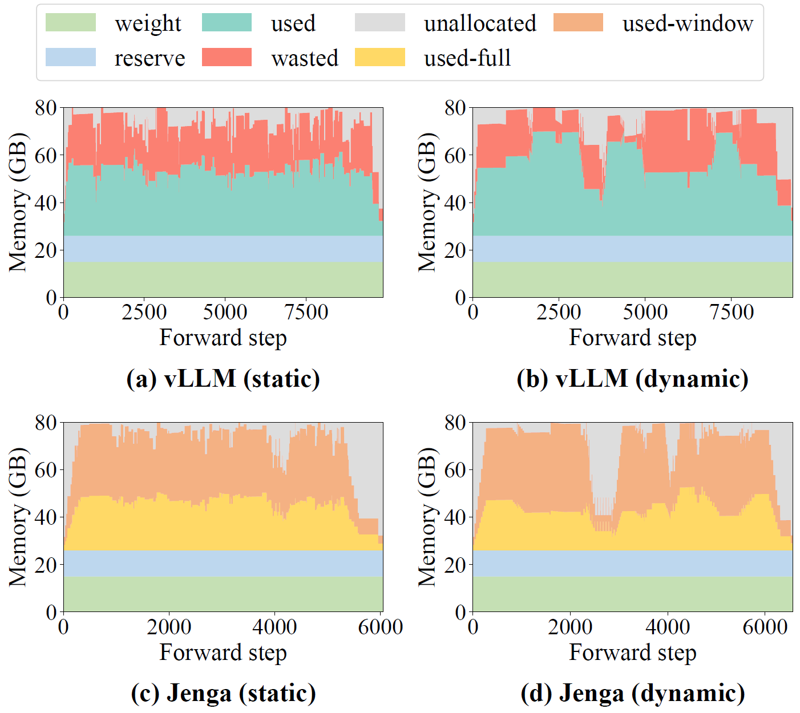{fig-align=center}

- **vLLM:** Wastes 38.2% of KV cache memory on average (fails to free sliding window tokens outside the window).
- **Jenga:** Reduces KV cache memory waste to **0.04%**.
- Dynamically adjusts memory allocation between full-attention and sliding-window layers based on workload.

## Case Study: Speculative Decoding

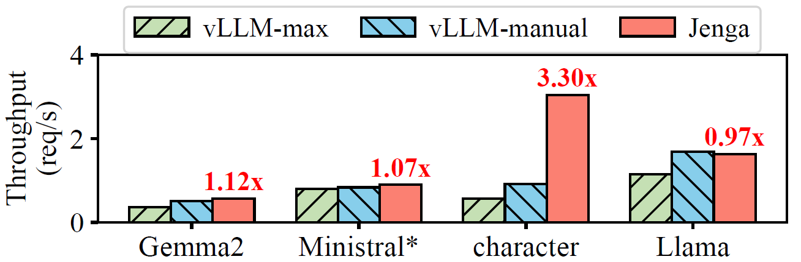{fig-align=center}

- Speculative decoding runs a small draft model and a large target model simultaneously.
- Jenga automatically handles the different KV cache sizes with negligible fragmentation.
- Achieves an average **1.58x throughput improvement** on heterogeneous LLMs compared to manually-designed memory allocation strategies.

## Maximum Context Length

- **Model:** Llama 4 (109B, 10M-context model)
- **Hardware:** Single 8xH200 GPU node.
- **vLLM:** Fails to fit the full context (OOM at 3.7M tokens).
- **Jenga:** Reduces per-request memory usage by 4x by freeing inactive pages.
- **Result:** Successfully supports the full **14.7M context length** on a single node.
