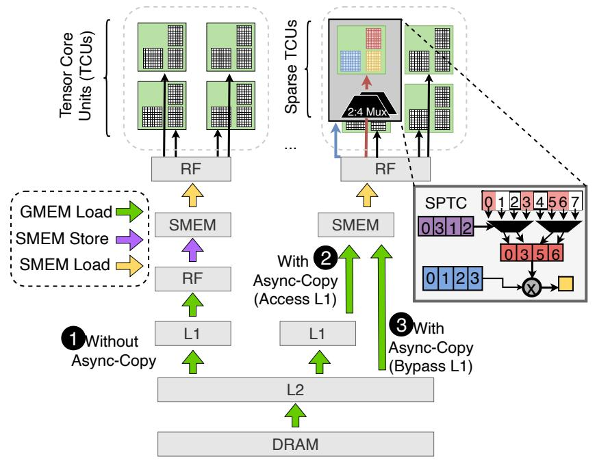
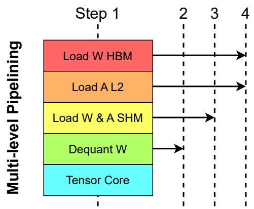
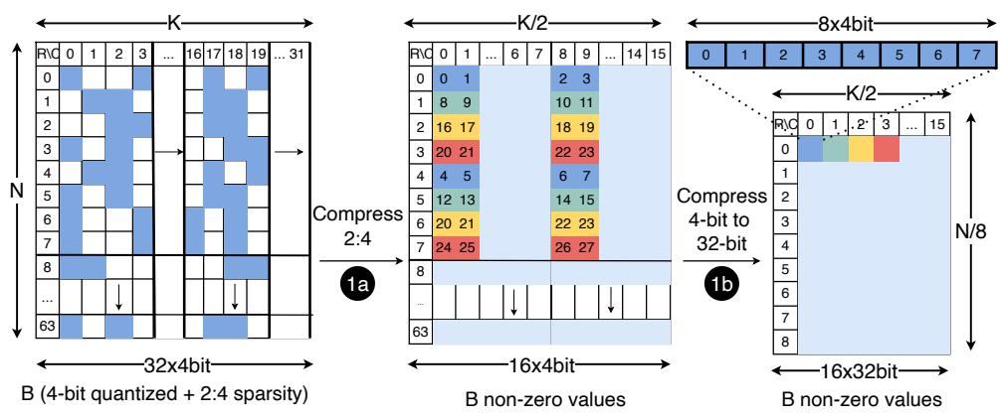
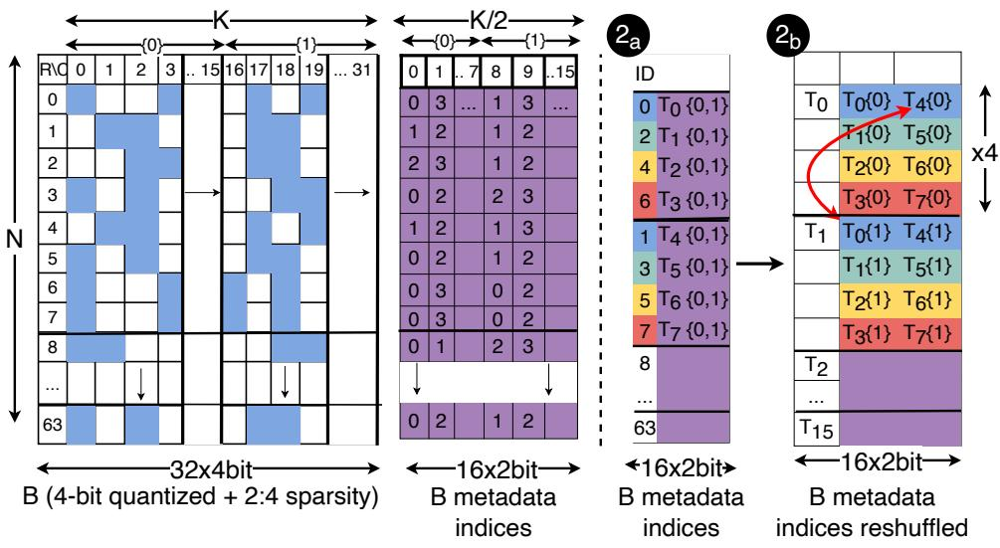

# Background & Motivation

## LLM Inference & Memory Bottleneck

- Generative LLM inference (token-by-token) is heavily memory-bound.
- The cost of reading LLM weights from memory dwarfs the arithmetic operations.
- Modern GPUs (e.g., Ampere) have high FLOP-to-byte ratios (100-200 for FP16).

## Weight-Only Quantization

- Compresses network weights (e.g., to 4-bit INT4) while keeping inputs in FP16.
- Reduces memory movement, yielding substantial practical speedups.
- Weights are dynamically decompressed in registers immediately before multiplication.

## The Batched Inference Challenge

- Existing mixed-precision kernels lose their speedup in batched inference (multiple tokens in parallel).
- Batched scenarios have significantly higher arithmetic intensity.
- It is difficult to fully hide the increased computations behind the reduced memory movement.

## Modern GPU Architecture (Ampere)

- Streaming Multiprocessors (SMs) share Global Memory (GMEM) and an L2 cache.
- Tensor Core Units (TCUs) execute matrix multiply-and-accumulate (MMA) operations efficiently.
- Ampere TCUs support fine-grained 2:4 structured sparsity for additional acceleration.

## Ampere Asynchronous Memory Access

{width=70% fig-align=center}

- Ampere introduces asynchronous copy instructions (`cp.async`).
- Loads data directly from GMEM to Shared Memory (SMEM), bypassing registers.
- Saves SM internal bandwidth and allows L1 cache bypass for better efficiency.

## Motivation for MARLIN

- Even at batch sizes of 16-32, 4-bit quantized inference should theoretically remain memory-bound.
- Goal: Create a kernel that achieves near-optimal 4x speedup for batched inference.
- Requires maximizing both memory loading bandwidth and compute resources simultaneously.

# Design

## MARLIN Core Concept

- MARLIN: Mixed-precision Auto-Regressive LINear kernel.
- Combines advanced task scheduling, partitioning, pipelining, and bespoke quantization support.
- Specifically targeted at maximizing NVIDIA Ampere GPU capabilities.

## Matrix Multiplication Hierarchy

- SM Level: Output matrix is partitioned into blocks and distributed across independent SMs.
- Warp Level: SM blocks are partitioned across warps, using SMEM for fast repeated access.
- Tensor Core Level: Warps sequentially accumulate small matrix chunks in registers.

## Mixed-Precision Challenges

- Must ensure that loading quantized weights remains the primary runtime bottleneck.
- Requires extremely careful overlapping of memory loads and compute operations.
- Partitioning constraints severely limit parallelization options for medium batch sizes.

## Maximizing Memory Bandwidth

- Utilizes the widest possible memory loads (128 bits / 16 bytes per thread).
- Weights are preprocessed offline into contiguous memory layouts for optimal fetching.
- Uses `evict_first` cache hints to prevent one-time weight loads from polluting the L2 cache.

## Memory Load Pipelining

{width=60% fig-align=center}

- Fully overlaps memory loading and Tensor Core math.
- Uses `cp.async` to prefetch blocks multiple steps ahead (pipeline depth P=4).
- Double buffering hides latency and allows smooth loop unrolling without dynamic overhead.

## Shared Memory Layouts

- Requires careful layout to avoid bank conflicts during `ldmatrix` instructions.
- Uses XOR-based index transformations to distribute 16-byte vectors across memory banks.
- Index calculations are precomputed in registers to avoid slow dynamic address generation.

## Warp Layout & Reduction

- Sub-tile width is fixed to 64 to avoid sequential dependency stalls in Tensor Cores.
- Multiple warps accumulate partial results of the same output tile directly in registers.
- Results are eventually combined using a logarithmic parallel reduction in SMEM.

## Efficient Dequantization

- Avoids slow native type-casts from INT4 to FP16.
- Uses binary manipulation (masking, bitwise OR, subtraction) to convert types efficiently.
- Dequantizes two INT4s packed in an INT32 simultaneously for parallel decoding.

## Striped Partitioning

- Standard partitioning causes wave quantization and heavy global reduction overheads.
- MARLIN uses a "striped" scheme where SMs process tiles column-wise.
- Stripes can span multiple columns, ensuring uniform distribution across SMs with minimal sync.

## Sparse-MARLIN: 2:4 Sparsity

- Extends MARLIN to support Ampere's Sparse Tensor Cores (SPTCs).
- Executes 50% sparse matrices for further FLOP/Byte ratio improvements.
- Reformulates matrix multiplication to meet strict `mma.sp` instruction constraints.

## Sparse-MARLIN: Non-Zero Values Layout

{width=80% fig-align=center}

- Compresses the 4-bit quantized matrix by half (N x K/2).
- Packs 8 elements into a 32-bit value for dense memory loading.
- Reshuffles tiles offline to ensure contiguous 128-bit memory accesses per thread.

## Sparse-MARLIN: Metadata Indices Layout

{width=80% fig-align=center}

- Encodes 2:4 sparsity indices (0-3) using 2 bits per element.
- Reorders rows to allow 128-bit loads from GMEM to SMEM.
- Reshuffles data to distribute metadata across threads bank-conflict free via `ldmatrix`.

# Evaluation

## Experimental Setup

- Hardware: NVIDIA A10, RTX 3090, RTX A6000, and A100 GPUs.
- Models: Llama-2 (7B, 13B, 70B), Falcon-180B, Yi-34B.
- Baselines: PyTorch nightly, AWQ, ExLlamaV2, bitsandbytes.

## Kernel Performance vs. Batch Size

- Existing kernels degrade quickly as batch size increases beyond 1.
- MARLIN delivers near-ideal 3.87x speedup up to batch sizes of 16-32.
- Performance gracefully tails off as the regime shifts from memory-bound to compute-bound.

## Performance Across Real Layer Shapes

- Maintains strong speedups (3.4x - 4.2x) on commodity GPUs (A10, RTX 3090).
- Slightly lower relative speedups on A100 due to its massive bandwidth and compute overheads.
- Sustains optimal performance even under reduced GPU clock speeds.

## Roofline Analysis

- Confirms batch sizes < 64 are memory-bound, while larger sizes are compute-bound.
- Achieves strong hardware utilization across all matrix sizes and arithmetic intensities.
- Best hardware utilization is observed on larger matrices.

## Ablation Study

- Removing `evict_first` L2 cache hints degrades performance.
- Reducing pipeline depth (P=2) fails to hide memory latency effectively.
- Removing XOR-based SMEM layouts introduces severe bank conflicts.
- Combined removal of these optimizations degrades performance by up to 1x.

## Sparse-MARLIN Kernel Performance

- Provides significant additional speedups over dense MARLIN.
- Achieves up to 5.2x speedup at small batch sizes (vs. 3.9x for dense).
- Maintains superiority over all open-source kernels across all batch sizes.

## End-to-End Generation Speedup (vLLM)

- Integrated into the vLLM serving engine for full-model benchmarks.
- MARLIN achieves up to 2.8x end-to-end speedup over vLLM's FP16 baseline at batch size 16.
- Sparse-MARLIN provides an additional 1.2x speedup on top of MARLIN.

## End-to-End Serving Latency (TPOT)

- Evaluated Time Per Output Token (TPOT) under varying Queries Per Second (QPS).
- MARLIN reduces latency by ~2.8x compared to the FP16 baseline.
- Sparse-MARLIN reduces latency by ~3.3x, remaining stable across different QPS loads.
