# Background & Motivation

## LLM Generative Inference

- Large Language Models (LLMs) excel at generative tasks, predicting the next token based on a cached context.
- Generative inference is heavily memory-bound on modern GPUs.
- The time required to read LLM weights from memory completely dwarfs the time spent on arithmetic operations.

## Weight Quantization

- Compressing network weights (e.g., from 16-bit floats to 4-bit integers) reduces memory movement.
- Weights are loaded from GPU memory in a quantized format and dynamically decompressed in registers before multiplication.
- This mixed-precision approach yields substantial speedups for single-user (batch size 1) inference.

## The Batched Inference Challenge

- Existing mixed-precision implementations lose their speedup in batched inference (generating multiple tokens in parallel).
- Batched scenarios have significantly higher arithmetic intensity, making it harder to hide computations behind reduced memory movement.
- However, modern GPUs (like NVIDIA Ampere) have massive FLOP-to-byte ratios (100-200 for FP16).
- Theoretically, reducing weight precision to 4 bits should still yield near-optimal 4× speedups for batch sizes up to 16-32.

## Ampere GPU Architecture

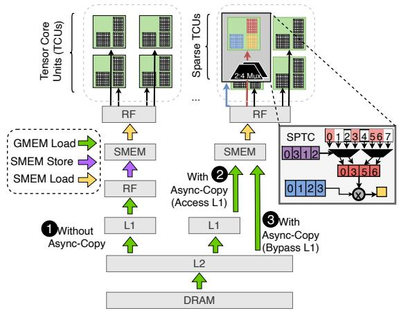{width=70% fig-align=center}

- Tensor Core Units (TCUs) deliver up to 16× more performance on FP16 than standard CUDA cores.
- Ampere introduces Sparse TCUs to handle 2:4 structured sparsity, doubling throughput.
- Ampere also introduces asynchronous copy instructions, allowing data to be loaded directly from global memory to shared memory, bypassing intermediate registers.

## Mixed-Precision Challenges

- Parallelization must be carefully configured so that loading quantized weights remains the bottleneck, not reloading full-precision activations.
- The cost of matrix multiplication computations at medium batch sizes approaches memory loading costs, requiring extreme overlapping.
- Partitioning constraints limit parallelization options, making it difficult to fully utilize all Streaming Multiprocessors (SMs).

# Design

## MARLIN Overview

- MARLIN (Mixed-precision Auto-Regressive LINear) is a highly optimized GPU kernel for batched LLM inference.
- It targets matrix multiplications where activations are in FP16 and weights are symmetrically quantized to INT4.
- Combines asynchronous memory access, complex task scheduling, pipelining, and bespoke quantization support.

## Maximizing Loading Bandwidth

- Utilizes the widest possible memory loads (128 bits = 16 bytes per thread).
- Weights are preprocessed offline and reshuffled into contiguous memory layouts to ensure optimal cache-line reads.
- Uses the `evict_first` cache hint to prevent single-use weights from polluting the L2 cache and evicting reusable activation data.

## Memory Load Pipelining

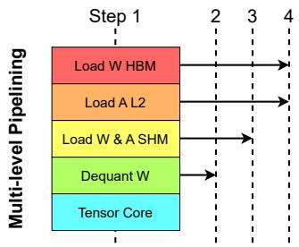{width=70% fig-align=center}

- Fully overlaps memory loading and Tensor Core math using asynchronous copies (`cp.async`).
- Employs a pipeline depth of 4 to completely hide latency while fitting within shared memory limits.
- The even pipeline depth allows for smooth loop unrolling, making all shared memory addressing completely static and avoiding slow dynamic index calculations.

## Shared Memory & Warp Layout

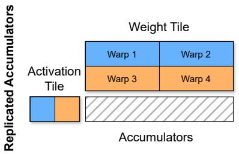{width=70% fig-align=center}

- Uses XOR-based index transformations to store activation tiles in shared memory without bank conflicts.
- Sub-divides computation across 4-8 warps to maximize latency hiding and Tensor Core throughput.
- Multiple warps accumulate partial results of the same output tile in registers, which are later merged via a fast logarithmic parallel reduction in shared memory.

## Efficient Dequantization

- Avoids slow, naive type-casts from INT4 to FP16.
- Uses optimized bitwise manipulations (AND, OR, subtraction) to dequantize two INT4 values simultaneously within a single 32-bit register.
- Weights are stored interleaved (e.g., 64207531) to power parallel decoding directly into the layout required by Tensor Cores.

## Striped Partitioning

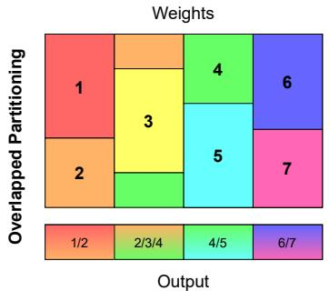{width=70% fig-align=center}

- Standard partitioning across the output dimension often leaves SMs underutilized for real-world matrix shapes (wave quantization).
- MARLIN uses a "striped" partitioning scheme where tiles are assigned column-wise, allowing stripes to span across multiple columns.
- Ensures a uniform distribution of work across all SMs while minimizing the overhead of global reduction steps.

## Sparse-MARLIN Extension

- Integrates 2:4 structured sparsity on top of 4-bit quantization to further improve FLOPS/Byte ratios.
- Reformulates the matrix multiplication $A \times B$ as $(B^T A^T)^T$ to satisfy the hardware constraints of Sparse Tensor Cores (which require the sparse matrix to be the left-hand operand).
- Transposes the activation matrix on-the-fly in shared memory without performance degradation.

## Sparse Data Layouts

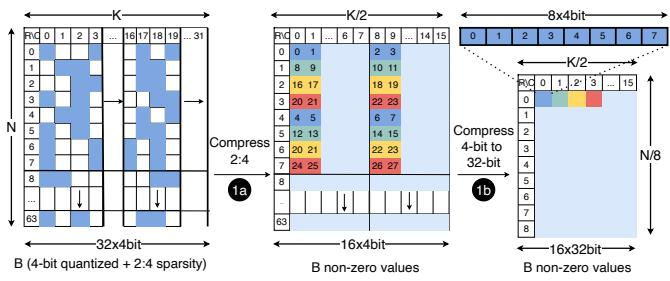{width=70% fig-align=center}

- Compresses 8 non-zero 4-bit elements into a single 32-bit value for maximum memory efficiency.
- Reshuffles 2-bit encoded metadata indices offline to ensure conflict-free 128-bit loads from global memory.

# Evaluation

## Kernel Peak Performance

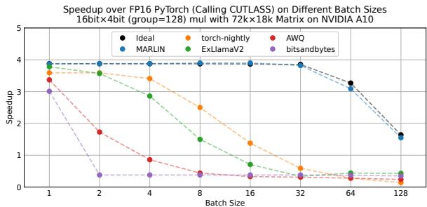{width=70% fig-align=center}

- Evaluated on an NVIDIA A10 GPU using a large $72k \times 18k$ matrix to test peak capabilities.
- MARLIN delivers near-ideal ~3.9× speedups for batch sizes up to 16-32.
- Significantly outperforms existing kernels (PyTorch, AWQ, ExLlamaV2, bitsandbytes), which rapidly degrade as batch size increases beyond 1.

## Performance on Real Layer Shapes

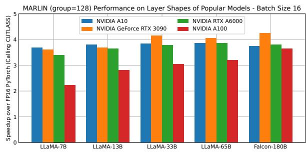{width=70% fig-align=center}

- Maintains strong performance across actual linear layer shapes from LLaMA and Falcon models.
- Commodity GPUs (like the RTX 3090) show higher relative speedups than flagship GPUs (like the A100), as the latter's massive bandwidth makes pipeline overheads relatively larger for small matrices.

## Sustained Performance & Large Inputs

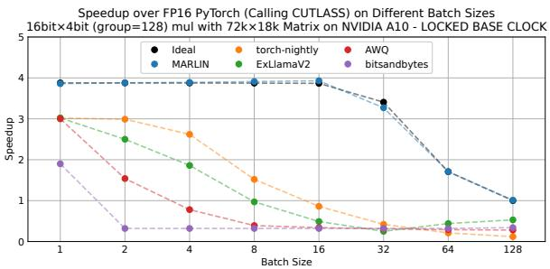{width=70% fig-align=center}

- Under locked base GPU clocks (sustained workloads), MARLIN maintains virtually optimal performance, whereas prior kernels suffer.
- For large prefill inputs (batch sizes up to 1024), MARLIN performs nearly identically to an uncompressed compute-bound matrix multiplication.

## Roofline Analysis

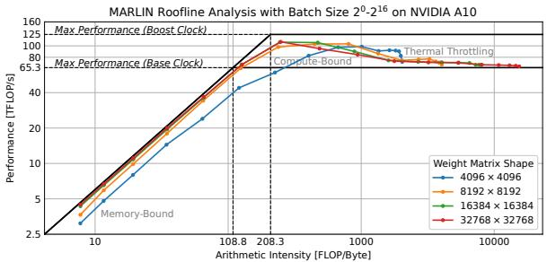{width=70% fig-align=center}

- Confirms that batch sizes smaller than 64 are memory-bound, while larger batch sizes transition to compute-bound.
- MARLIN achieves strong hardware utilization across all matrix sizes and arithmetic intensities.

## Ablation Study

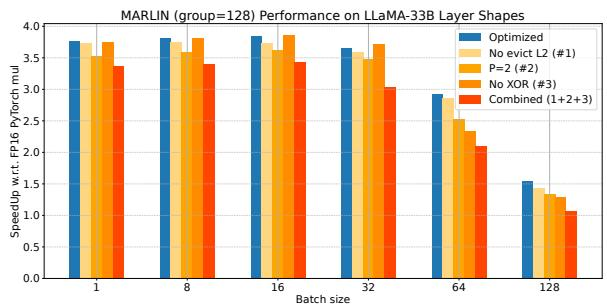{width=70% fig-align=center}

- Removing L2 cache hints, reducing pipeline depth, or disabling XOR conflict resolution degrades performance.
- Neglecting these optimizations combined drops performance by up to 1×, particularly in the compute-bound regime.

## Sparse-MARLIN Peak Performance

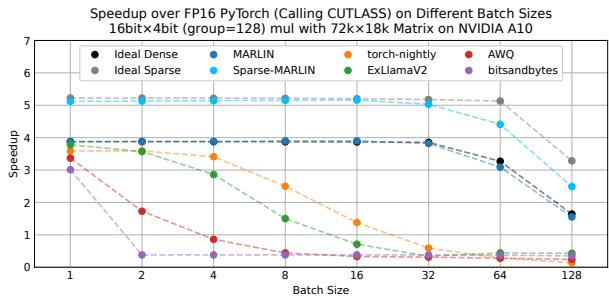{width=70% fig-align=center}

- Sparse-MARLIN provides additional speedups over the dense MARLIN variant, reaching up to ~5.2× speedup at low batch sizes.
- Validates the extensibility of the MARLIN kernel design to other advanced compression formats.

## End-to-End vLLM Integration

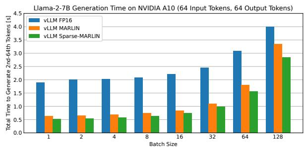{width=70% fig-align=center}

- Integrated into the vLLM serving engine and tested with Llama-2-7B on an NVIDIA A10.
- MARLIN achieves up to a 3× speedup in generation time compared to the FP16 baseline.
- Sparse-MARLIN provides an additional 1.2× end-to-end speedup on top of dense MARLIN.

## Serving Benchmark (TPOT)

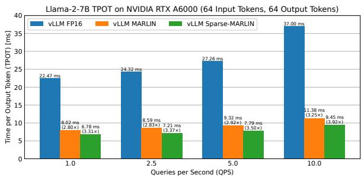{width=70% fig-align=center}

- Evaluated in a simulated server-client setting measuring Time Per Output Token (TPOT).
- MARLIN reduces latency by ~2.8× across various querying intensities (Queries Per Second).
- Sparse-MARLIN reduces latency by ~3.3×, proving highly effective for practical, high-throughput LLM serving.
