# Background & Motivation

## LLM on Edge & Low-Bit Quantization

- Deploying LLMs on edge devices (smartphones, robotics) enhances privacy and reduces latency.
- Memory constraints necessitate low-bit weight quantization (4-bit, 2-bit, 1-bit).
- Activation quantization lags behind due to outliers, leading to asymmetric precision (e.g., W4A16, W1A8).

## The Mixed-Precision GEMM Challenge

- Current hardware lacks native support for mixed-precision matrix multiplication (mpGEMM).
- Existing systems resort to dequantizing low-bit weights to match high-precision activations.

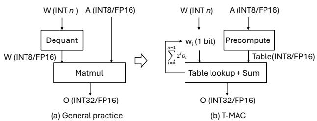{fig-align=center}

- (a) General practice: Dequantize weights, then perform high-precision Matmul.
- (b) T-MAC: Bit-serial decomposition, precompute tables, and perform table lookup + sum.

## Limitations of Dequantization

- Dequantization overhead offsets the gains from bit-width reduction.
- Scaling down from 4-bit to 1-bit can actually *increase* latency in existing systems.
- Fails to fully capitalize on the reduced memory bandwidth requirements of low-bit weights.

## Bit-Width Diversity & Development Cost

- Different deployment scenarios require different bit-widths (1-bit to 4-bit).
- Data layouts and kernels must be redesigned case-by-case for each mixed precision.
- A unified, scalable solution independent of hardware data types is urgently needed.

## LUT-based Computation: GPU vs CPU

- Lookup Table (LUT) methods precompute products to avoid costly multiply-accumulate operations.
- Explored on GPUs but suboptimal due to fixed architecture constraints (inadequate storage or slow access).
- LUT-based mpGEMM on CPUs remains uncharted territory, offering a promising path for edge deployment.

# Design

## T-MAC Overview

- T-MAC transforms data-type-centric multiplication to bit-wise table lookup.
- Provides a unified and scalable mpGEMM solution for any mixed bit-width.

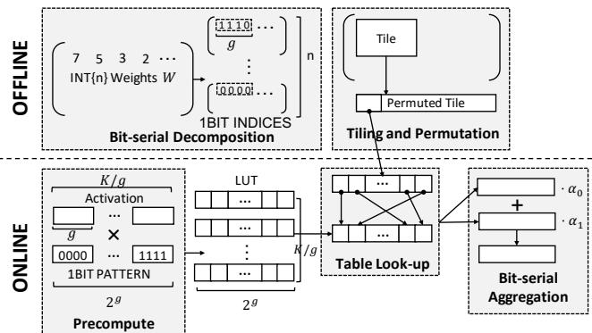{fig-align=center}

- Offline: Bit-serial decomposition of weights, tiling, and permutation.
- Online: Precompute LUT from activations, table look-up, and bit-serial aggregation.

## Bit-Serial Decomposition

- Multiplication is transformed into bit-wise calculation based on linear equivalent transformation.

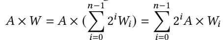{fig-align=center}

- Diverse weight layouts are reduced to a unified one-bit matrix layout.
- Enables linear scale-down of computation cost with bit-width reduction.

## LUT-based mpGEMM Algorithm

- A $b$-bit weight matrix is decomposed into $b$ one-bit matrices.
- For a group of $g$ bits, there are only $2^g$ possible permutations.
- Activations are precomputed with all bit patterns and saved in a table.
- mpGEMM is reduced to table lookup and addition, eliminating multiplications.

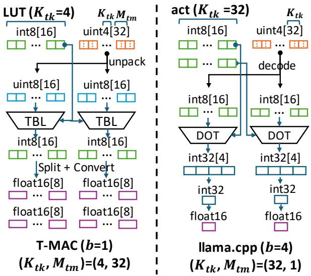{fig-align=center}

- Left: T-MAC unpacks indices, looks up tables, splits/converts, and aggregates.
- Right: General practice decodes weights and performs dot-product.

## Challenges of LUT Implementation

- **Random Data Access:** Tables are randomly accessed, requiring residence in fast on-chip memory (registers).
- **Enlarged On-Chip Memory:** LUT size grows exponentially with group size $g$, and vector outputs require more temporary storage.

## LUT-Centric Data Layout

- Stores lookup tables in registers to accelerate random accesses.
- Leverages hardware-specific instructions (e.g., TBL on ARM, PSHUF on x86).
- Designs axis reordering and tiling to enhance data reuse and reduce memory pressure.

## Axis Reordering & Tiling

- **Axis Reordering:** Swaps loop order to temporal axis ($K$) first, maintaining a small lookup table $[1, 2^g]$ instead of a massive one.
- **Tiling:** Carefully considers tile sizes $N_{tn}, M_{tm}, K_{tk}$ to maximize lookup table reuse across the weight matrix.

## Weight Permutation & Interleaving

- **Weight Permutation:** Permutes weight matrix offline to align tile loads with sequential memory transactions, maximizing DRAM bandwidth.
- **Weight Interleaving:** Reorders packed weights to eliminate backward reordering overhead during little-endian unpacking.

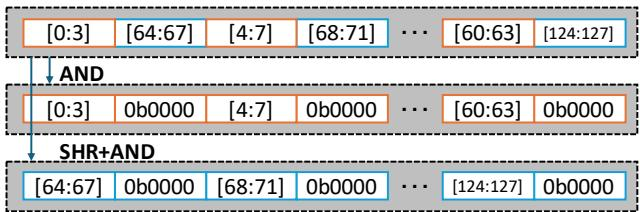{fig-align=center}

- Interleaved weights can be unpacked sequentially using simple AND and SHR+AND operations.

## Reducing LUT Storage: Mirror Consolidation

- Exploits the symmetrical properties of table values (positive/negative pairs).
- Only half of the table values need to be explicitly stored; the rest are reconstructed by negation.
- Lossless compression that halves the table length and accelerates precomputation.

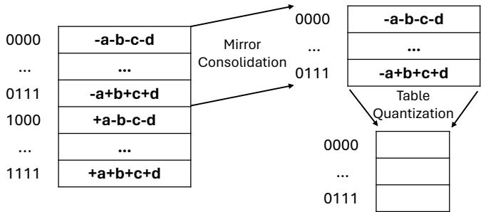{fig-align=center}

- Mirror consolidation halves the table length; table quantization reduces the table width.

## Reducing LUT Storage: Table Quantization

- Quantizes table values (e.g., fp16 to int8) with a scaling factor to reduce table width.
- Uses finer granularity and dynamic quantization to minimize accuracy degradation.
- Combined with mirror consolidation, reduces storage footprint up to a quarter without accuracy loss.

## Hardware Intrinsics for Fast Lookup

- Utilizes 8-bit look-up instructions provided by ARM NEON and Intel AVX2.

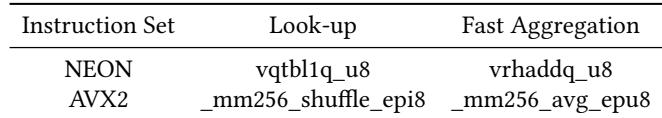{fig-align=center}

- NEON's 128-bit width perfectly accommodates $g=4$ tables.
- AVX2 duplicates tables to fill 256-bit registers for parallel lookups.
- Float16 tables are split into two 8-bit LUTs and recombined.

## Fast 8-bit Aggregation

- Aggregates look-up results in low bit (int8) before converting to higher precision (fp16).
- Uses `avg`/`rhadd` instructions to compute averages and minimize overflow without int16 conversion.
- Doubles throughput compared to int16 aggregation, offered as an optional optimization.

## Bit-Serial Linear Transformation

- Introduces a linear transformation $f(v_i)$ to bit values to speed up precomputation and reduce quantization error.
- Selects $s_0 = -1$ and $s_1 = 1$ to circumvent float-multiply instructions and minimize LUT entry differences.

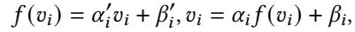{fig-align=center}

- Adjusts the decomposition of $W$ to incorporate the transformed values and bias terms.

# Evaluation

## Experimental Setup

- **Devices:** Apple M2-Ultra, Raspberry Pi 5, Jetson AGX Orin, Surface Book 3.
- **Models:** Llama-2 (1/2/3/4-bit) and BitNet (1-bit, 1.58-bit).
- **Baselines:** State-of-the-art llama.cpp (dequantization-based kernels).

## mpGEMV Kernel Performance

- llama.cpp fails to gain speedup as bits decrease, even slowing down at 3-bit due to decoding overhead.
- T-MAC achieves linear speedup with bit reduction across all devices.

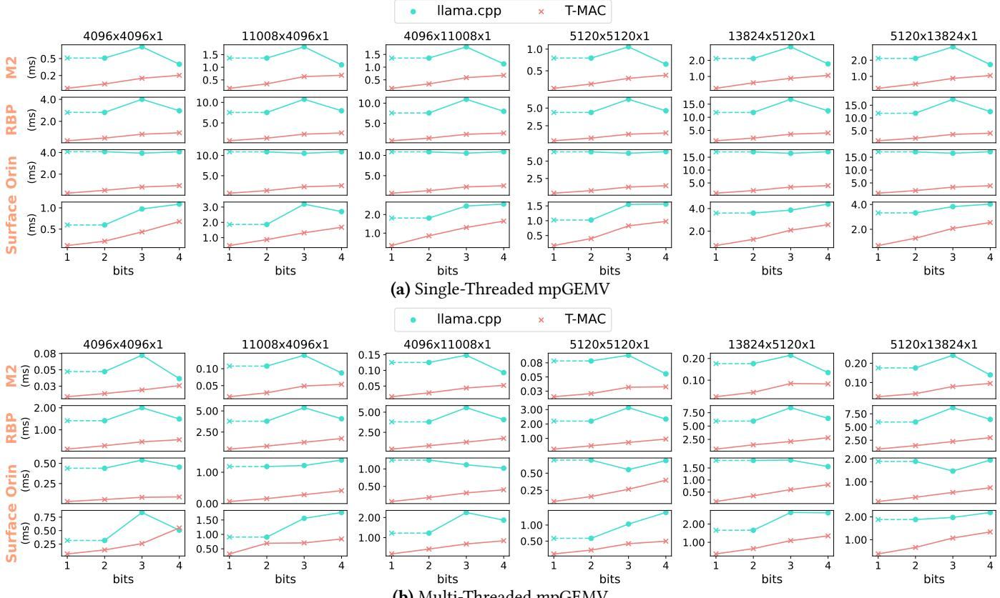{fig-align=center}

- Single-threaded mpGEMV: Up to 11.2x speedup for 1-bit.
- Multi-threaded mpGEMV: Constrained by memory bandwidth but still achieves significant speedup (e.g., 4.0x at 2-bit).

## mpGEMM Kernel Performance

- Evaluated with a sequence length of 256 for multi-threading.
- T-MAC achieves maximum speedups of 4.0x, 5.3x, and 5.3x on RBP, Orin, and Surface for 2-bit.
- M2-Ultra benefits from AMX coprocessor, but T-MAC still achieves 2.0x speedup for 1-bit.

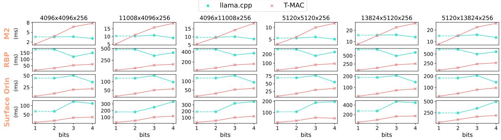{fig-align=center}

## End-to-End Inference Throughput

- Integrated T-MAC kernels into llama.cpp for real-world model evaluation.

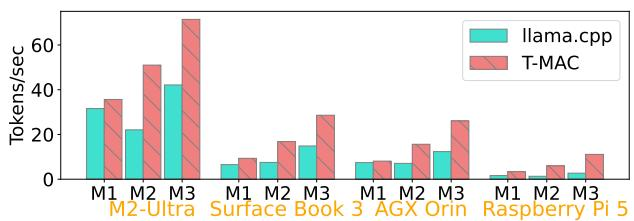{fig-align=center}

- Single-threaded: Up to 6.7x speedup on Raspberry Pi 5.
- Multi-threaded: Peak of 71 tokens/sec on M2-Ultra and 11 tokens/sec on Raspberry Pi 5 for BitNet-3B.

## Power and Energy Consumption

- Measured on M2-Ultra using multi-threaded inference.

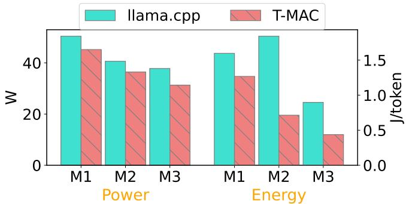{fig-align=center}

- Power consumption reduced by 10.3% to 17.3% across models.
- Total energy consumption reduced by 20.6% to 61.2% due to combined power and latency gains.

## Optimization Breakdown

- Progressive application of optimizations on M2-Ultra multi-threaded GEMV.

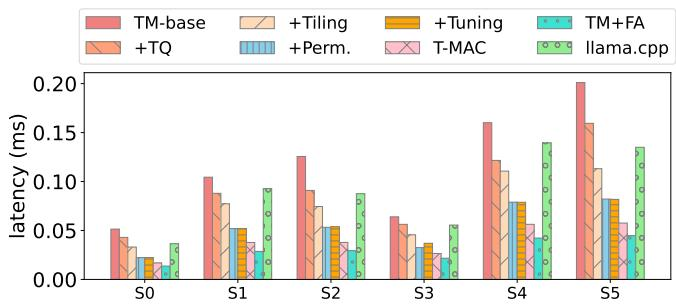{fig-align=center}

- **Table Quantization (TQ):** Makes performance competitive with llama.cpp.
- **Tiling & Permutation:** Yields up to 1.45x and 1.39x speedups respectively.
- **Interleaving:** Eliminates unpacking overhead, achieving 1.42x speedup.

## Error Analysis

- Two error sources: table quantization (algorithmic) and fast aggregation (instruction execution).

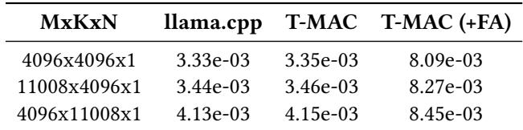{fig-align=center}

- Table quantization introduces negligible NMSE difference compared to llama.cpp.
- Fast aggregation increases NMSE by 2.5x but is optional for latency-critical, accuracy-tolerant scenarios.
- End-to-end model quality (perplexity, accuracy) remains identical to llama.cpp without fast aggregation.

## CPU vs GPU Comparison

- Compared T-MAC (CPU) with llama.cpp (GPU) on NVIDIA Jetson AGX Orin.

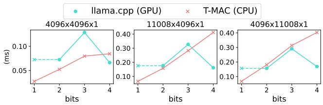{fig-align=center}

- T-MAC significantly outperforms GPU on W1A16 and achieves comparable performance on W2A16/W3A16.
- End-to-end: T-MAC (CPU) achieves 2.3x better energy efficiency than llama.cpp (GPU) despite slightly lower throughput.
