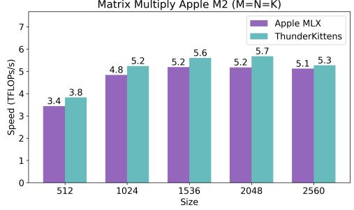
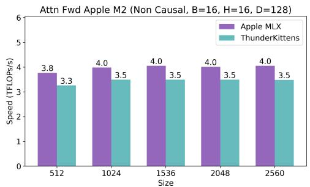
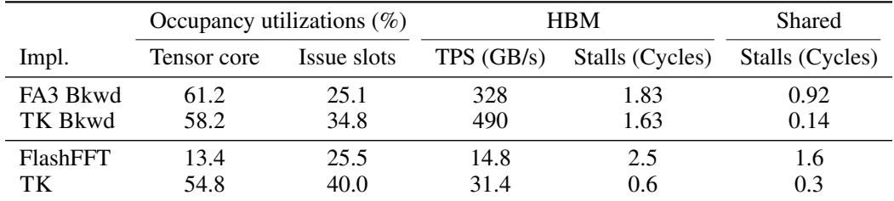
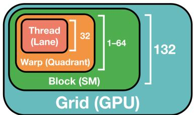
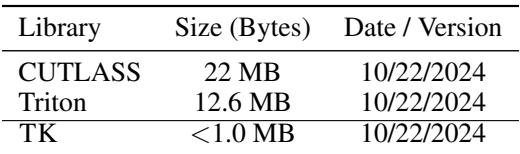
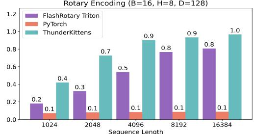
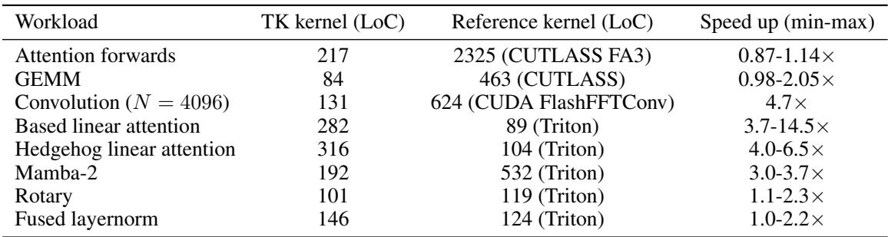
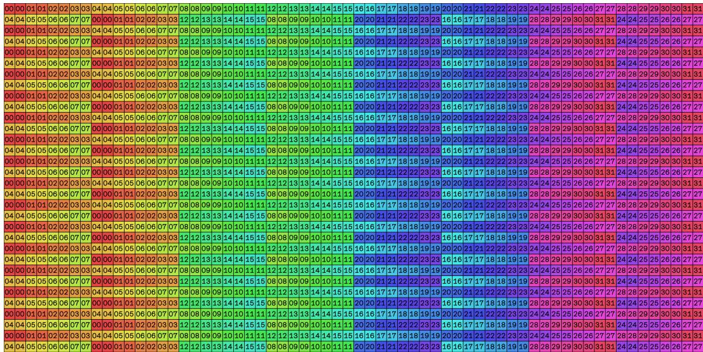

# Background & Motivation

## The GPU Kernel Bottleneck

- AI progress is bottlenecked by mapping architectures to GPU hardware.
- Hand-written custom kernels often fail to meet theoretical performance thresholds.

## The Cambrian Explosion of AI Architectures

- Rapid emergence of new ML architectures (Transformers, SSMs, linear attention).
- Kernel support lags; e.g., FlashAttention-2 took years to optimize for H100.

## Specialized Matrix Multiply Units

- Tensor cores provide 15-16x the FLOPs of general-purpose compute.
- High-performance frameworks must prioritize keeping tensor cores fully utilized.

## GPU Hierarchy: Warps

- Threads execute in groups of 32 (warps) on physical execution units.
- Memory layouts map logical data to physical threads; poor layouts cause bank conflicts.

## GPU Hierarchy: Thread Blocks

- Warps are grouped into blocks, sharing fast shared memory (SMEM).
- Higher occupancy (more warps per block) helps hide latencies but increases resource contention.

## GPU Hierarchy: Grids

- Grids launch multiple thread blocks across Streaming Multiprocessors (SMs).
- Blocks communicate via slow HBM, with L2 cache helping to reduce latency.

## The Cost Model of GPU Parallelism

- Execution time is the max of memory, compute, and overhead costs.
- Ideal performance requires perfect overlapping of memory loads, compute, and tensor core ops.

## Existing Frameworks: CUTLASS & Triton

- CUTLASS offers high performance but relies on myriad nested C++ templates.
- Triton provides simpler interfaces but limits access to specialized hardware instructions.

# Design

## ThunderKittens Overview

- A framework using a small, opinionated set of abstractions for high-performance AI kernels.
- Maps directly to the three levels of the GPU hierarchy: warp, block, and grid.

## Warp Parallelism: Tile Data Structures

- Uses 16x16 matrix tiles as the basic data structure.
- Maximizes compatibility with tensor cores and hardware-accelerated instructions.

## Warp Parallelism: PyTorch-like Operations

- Provides familiar parallel compute primitives (e.g., mma, exp, cumsum).
- Enables static compile-time checking of layouts and operations to prevent bugs.

## Managing Memory Layouts

- Register tiles must match tensor core layouts; shared tiles need specific layouts for bulk copies.
- TK automatically assigns shared tile layouts to minimize bank conflicts based on size and type.

## Shared Memory Bank Conflicts

- Naive row-major layouts suffer severe bank conflicts when loading into tensor cores.
- TK uses swizzled layouts (32B, 64B, 128B) to eliminate conflicts while maintaining hardware support.

{width=70% fig-align=center}

## Block Parallelism: The LCSF Template

- Generalized asynchronous template: Load, Compute, Store, Finish.
- Reduces developer effort to populating boilerplate functions within a producer-consumer model.

## Asynchronous Overlapping

- Load/store workers manage HBM to SRAM movement using TMA.
- Compute workers operate on fast memory, overlapping with asynchronous I/O.

{width=70% fig-align=center}

## Multi-stage Pipeline Buffers

- Maintains N-stage pipelined buffers in shared memory.
- Hides HBM load/store latency by allowing compute to proceed while next tiles load.

## Occupancy vs. Efficiency Tradeoffs

- Higher occupancy increases overlap but causes register contention.
- TK parametrizes worker counts, letting developers easily tune the Pareto frontier.

{width=70% fig-align=center}

## Grid Parallelism: Persistent Block Launch

- Launches thread blocks on all SMs upfront, reusing them for subsequent tasks.
- Eliminates pipeline bubbles and setup/tear-down overheads.

## L2 Cache Reuse & Block Launch Order

- Block launch order heavily influences L2 cache hit rates and HBM bandwidth.
- TK provides optimized 3D strides to maximize data reuse across thread blocks.

# Evaluation

## Workhorse Kernels: GEMM

- A single 40-line TK GEMM kernel matches CuBLAS and CUTLASS performance.
- Avoids the 600MB+ complexity of highly tuned CuBLAS variants.

{width=70% fig-align=center}

## Workhorse Kernels: Attention

- Matches FlashAttention-3 on non-causal forward passes.
- Outperforms FA3 by 10-40% on causal and non-causal backward passes.

{width=70% fig-align=center}

## Emerging Architectures: Linear Attention

- Outperforms Flash Linear Attention (FLA) by 14x on polynomial-based linear attention.
- Achieves 6.5x speedup on learned feature map linear attention.

## Emerging Architectures: State Space Models

- Outperforms FlashFFTConv by up to 7.9x on long convolutions.
- Beats Triton-based Mamba-2 kernels by over 3x through easy operation fusion.

{width=80% fig-align=center}

## Profiling: Long Convolution

- NCU profiles show higher issue slot utilization and fewer memory stalls.
- Tensor core utilization increases by 4.1x compared to FlashFFTConv.

## Profiling: Attention Backwards

- Matches FA3 in tensor core utilization but achieves higher issue slot utilization.
- Incurs 85% fewer shared memory stalled cycles by eliminating bank conflicts.

## Extensibility: FP8 & Padded Tiles

- Supports FP8 precision GEMMs, matching CuBLAS performance.
- Handles unaligned workloads via automatic padding without sacrificing performance.

{width=60% fig-align=center}

## Extensibility: Consumer & Personal Hardware

- Competitive performance on NVIDIA RTX 4090 and Apple M2 Pro.
- Demonstrates cross-platform portability with minimal code changes.

{width=70% fig-align=center}

## Simplicity: Library Size & Lines of Code

- TK library is under 1.0 MB, compared to 22 MB for CUTLASS.
- TK kernels average <200 lines of code, significantly less than SOTA baselines.
