# Background & Motivation

## Deep Learning Compilers & Kernel Fusion

- Machine learning compilers (MLCs) optimize DNN inference by maximizing GPU resource utilization (e.g., SMs, memory bandwidth).
- Kernel fusion is a primary optimization technique that consolidates multiple operators into a single kernel to reduce launch overhead.
- Fusing consecutive operators with data dependencies enhances data locality and reduces off-chip memory access.
- Fusing parallel operators without data dependencies strengthens intra-kernel parallelism.

## Static Data Dependency

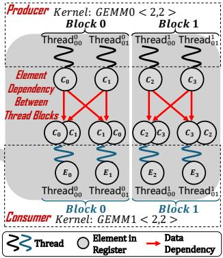{width=60% fig-align=center}

- State-of-the-art MLCs (like TVM, XLA, TensorRT) rely on static data dependency analysis.
- This analysis is based on tensor expressions and computation graphs, operating at the element or operator level.
- Static analysis occurs *before* block scheduling and code generation, missing lower-level hardware execution details.

## Inefficiency 1: Data Access & Redundant Computation

- Current compilers efficiently handle simple one-to-one element dependencies using per-thread registers.
- Complex operators (many-to-many, one-to-many) force compilers into a dilemma: use slow global memory or introduce redundant computation.

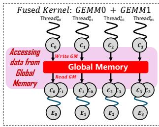{width=50% fig-align=center}

- **Global Memory Sync:** Approaches like AStitch allocate global memory to share intermediate results, underutilizing faster on-chip memory.

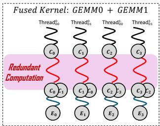{width=50% fig-align=center}

- **Redundant Computation:** Compilers like TVM force each consumer thread to independently recompute existing values, causing significant computational overhead.

## Inefficiency 2: Missed Parallelism Opportunities

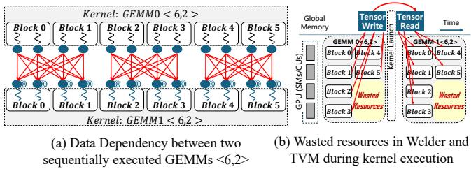{width=70% fig-align=center}

- Optimal GPU performance requires full utilization of execution units via thread blocks.
- Complex dependencies often force sequential kernel execution, leading to a mismatch between the number of blocks and available hardware units.
- This creates a "tail effect" during the final wave of execution, leaving many execution units idle (e.g., 25% wasted block slots in consecutive GEMMs).
- In compute-intensive models like GPT-3, up to 38% of block slots in non-full waves remain unused, dropping SM efficiency to 73%.

## The Need for Block-Level Analysis

- Compilers avoid using much faster shared memory for complex kernels because shared memory is only accessible by threads within the *same* block.
- Kernel fusion with shared memory is only possible if dependencies can be mapped as one-to-one relationships at the *block level*.
- Furthermore, independent blocks within sequentially dependent kernels could theoretically execute in parallel if identified.

## Key Challenges

- **Irregular Dependencies:** Element dependencies in real-world workloads are highly complex. Extracting block-level dependencies requires a new general analysis method.
- **Inter-Block Optimization:** Compilers generate kernels from a unified intermediate representation, lacking support for flexible block-level scheduling, splitting, and composition across different kernels.

# Design

## BlockDepend System Overview

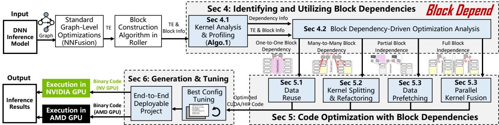{width=80% fig-align=center}

- BlockDepend is a novel optimization framework that analyzes and optimizes block dependencies among different kernels.
- It takes ONNX models, applies graph-level optimizations via NNFusion, and constructs hardware-aligned blocks using Roller.
- The core pipeline consists of identifying block dependencies, classifying inefficiency patterns, and applying targeted code optimizations.

## Determining Block Dependencies

- BlockDepend determines block dependencies in two stages: Kernel Analysis (Producer) and Kernel Source Code Profiling (Consumer).
- This establishes a direct mapping between consumer blocks and the specific producer blocks they depend on.

## Kernel Analysis (Producer)

- BlockDepend constructs hardware-aligned blocks to ensure efficient data processing pipelines.
- It analyzes the producer kernel to generate an element index calculation function.
- This function maps each output data element's index directly to its producer block ID based on tensor shape and tile shape.

## Kernel Source Code Profiling (Consumer)

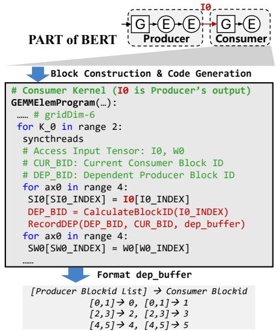{width=60% fig-align=center}

- BlockDepend automatically parses the consumer kernel to identify all locations where input tensor data is read.
- It inserts the producer's block ID calculation function into the consumer's source code.
- By compiling and running this modified code, BlockDepend logs the exact producer block IDs that each consumer block accesses during execution.

## Dependency-Driven Optimization Analysis

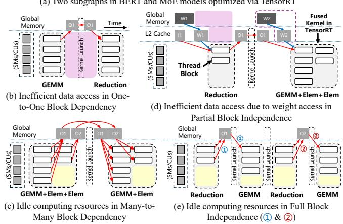{width=80% fig-align=center}

- BlockDepend categorizes the discovered block dependencies into four distinct patterns to uncover hidden optimization opportunities.
- **One-to-One Block Dependency:** Each consumer block depends exclusively on a single producer block (causes redundant global memory access).
- **Many-to-Many Block Dependency:** Consumer blocks depend on multiple producer blocks, but form independent groups (causes idle computing resources).
- **Partial Block Independence:** Blocks do not depend on the previous kernel for certain data (allows prefetching).
- **Full Block Independence:** Blocks have no direct/indirect dependencies on another kernel (allows flexible reorganization).

## Optimization 1: Data Reuse

- Targets **One-to-One Block Dependencies**.
- BlockDepend generates a new fused kernel where the producer is processed only once.
- Threads execute the producer logic, store intermediate results in shared memory, synchronize, and then execute the consumer logic by reading from shared memory.
- This eliminates redundant global memory accesses and reduces kernel launch overhead.

## Optimization 2: Kernel Splitting & Refactoring

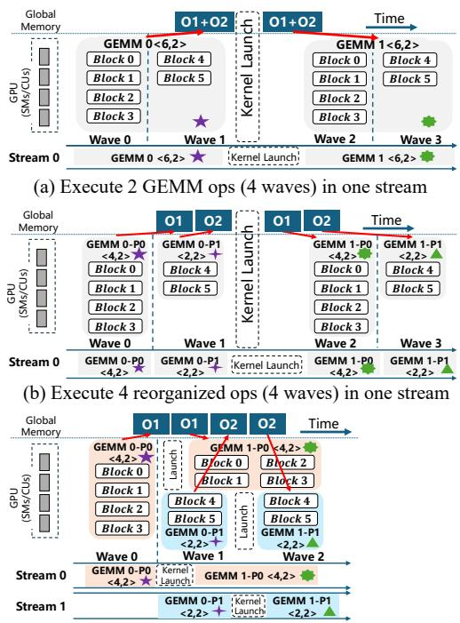{width=70% fig-align=center}

- Targets **Many-to-Many Block Dependencies** to fix the misalignment between blocks and execution units (wasted slots).
- BlockDepend splits the original producer and consumer kernels into smaller, independent sub-kernels.
- It identifies segments of the consumer kernel that do not depend on the tail-end blocks of the producer kernel.
- These split kernels are scheduled onto separate CUDA streams, allowing partial parallel execution and filling idle execution units.

## Optimization 3: Parallel Kernel Fusion

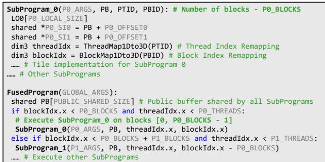{width=70% fig-align=center}

- Targets **Full Block Independence**, commonly found in parallelizable operators like Mixture of Experts (MoE).
- Instead of relying on limited operator libraries for equivalent replacement, BlockDepend fuses independent blocks into a single unified kernel.
- The new kernel dynamically schedules blocks from multiple experts or subprograms for concurrent execution based on their block IDs.

## Optimization 4: Data Prefetching

- Targets **Partial Block Independence** to improve L2 cache utilization.
- BlockDepend inserts prefetch instructions to load weight data for the *next* kernel during the execution of the *current* kernel.
- It leverages instruction-level parallelism (ILP) to overlap global memory fetches with computation.
- **Partition-Aware Prefetching:** On GPUs like A100/H100, BlockDepend ensures that blocks prefetching data and blocks consuming it reside within the same L2 cache partition, avoiding cross-partition latency.

# Evaluation

## Experimental Setup

- **Hardware:** NVIDIA A100 (40GB) and AMD Radeon MI100 GPUs.
- **Workloads:** 12 DNNs including BERT, Swin-Transformer, ViT, Conformer, NAFNet, BSRN, MMoE, MetaHeac, SparseMLP, GPT-3, and LLaMA.
- **Baselines:** ONNX Runtime, PyTorch (JIT), PyTorch XLA, TensorRT, TVM (Ansor), Welder, BladeDISC (AStitch), MIGraphX, CUTLASS, and xFormers.

## End-to-End Inference Performance (NVIDIA A100)

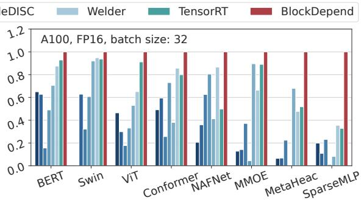{width=80% fig-align=center}

- BlockDepend significantly outperforms all baseline systems across various batch sizes.
- **vs. ONNX Runtime:** Average speedup of 5.71×.
- **vs. PyTorch (JIT):** Average speedup of 6.25×.
- **vs. TVM:** Average speedup of 3.56× (TVM lacks block-level inefficiency identification).
- **vs. TensorRT:** Average speedup of 1.71×.
- **vs. BladeDISC:** Average speedup of 3.73×.

## Applicability to Large Language Models

- Evaluated on GPT-3 and LLaMA core structures (MLP, Attention) using CUTLASS templates.
- Achieves average speedups of 2.48× over PyTorch and 1.41× over xFormers (which uses Flash-Attention).
- Outperforms manually optimized CUTLASS implementations by 1.10× on average by minimizing resource wastage and aligning thread blocks with SMs.

## Performance Breakdown

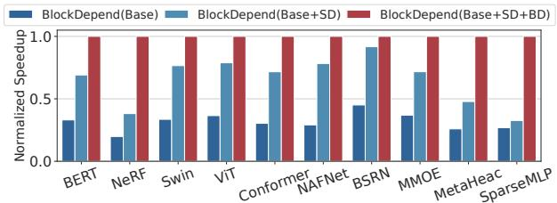{width=70% fig-align=center}

- **BlockDepend(Base):** No inter-operator optimization.
- **BlockDepend(Base+SD):** Adds static data dependency optimizations (element-wise/sibling fusion). Achieves 2.05× speedup over Base.
- **BlockDepend(Base+SD+BD):** Adds full block-level optimizations. Achieves an additional 1.70× speedup over Base+SD.

## Locality & Parallelism Improvements

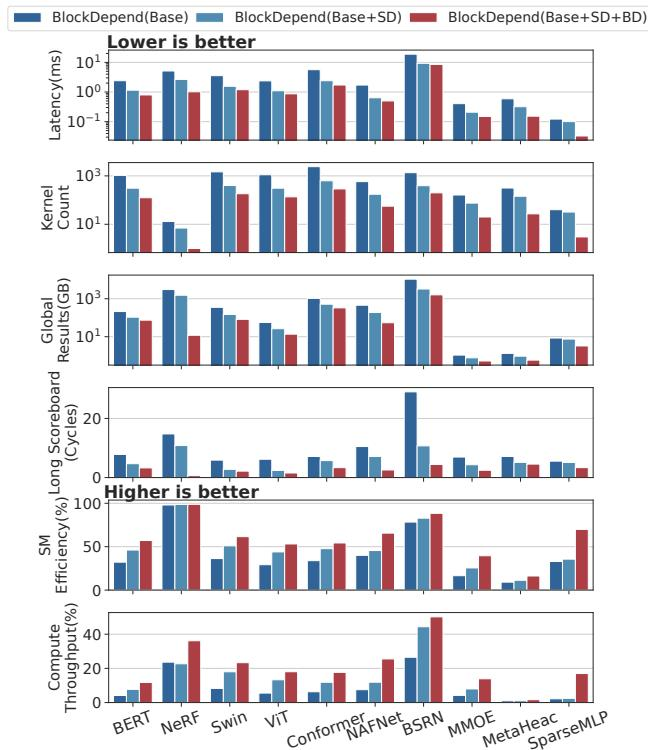{width=70% fig-align=center}

- **Locality:** On BERT, block-level fusion reduces kernel count by 59.68% and global memory output by 30.28% compared to static dependency alone.
- **Stall Reduction:** Weight data prefetching reduces long scoreboard stalls by 30.44% on BERT.
- **Parallelism:** For MoE workloads (MMoE, MetaHeac, SparseMLP), SM efficiency increases by 1.74×. SparseMLP's SM efficiency jumps from 35.62% to 69.91%.

## Reduction of Wasted Block Slots

- Block-level dependency analysis allows BlockDepend to schedule blocks into empty slots via splitting and reorganization.
- Compared to static dependency optimization, BlockDepend reduces the average percentage of wasted block slots from 21.6% down to just 5.9%.
- Total execution waves for GPT-3 MLP (batch 768) drop from 5 to 4, improving SM efficiency from 73% to 84%.

## Performance on AMD ROCm GPUs

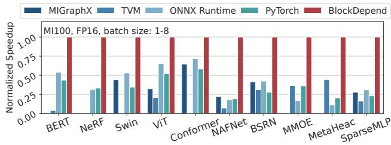{width=70% fig-align=center}

- BlockDepend's optimizations are hardware-agnostic and port effectively to AMD architectures.
- Achieves an average speedup of 2.88× over AMD's MIGraphX engine.
- Achieves speedups of 3.50× over ONNX Runtime, 4.96× over PyTorch, and 8.30× over TVM on the MI100 GPU.

## Compilation Time Overhead

- BlockDepend's block-level optimization phase (BlockOpt) requires only a single analysis pass to extract dependencies.
- BlockOpt achieves compilation times comparable to non-autotuned solutions like TensorRT and BladeDISC (e.g., 36 seconds for BERT).
- The block-level analysis constitutes only about 9% of the total compilation time, proving it can be integrated into other compilers without massive overhead.
