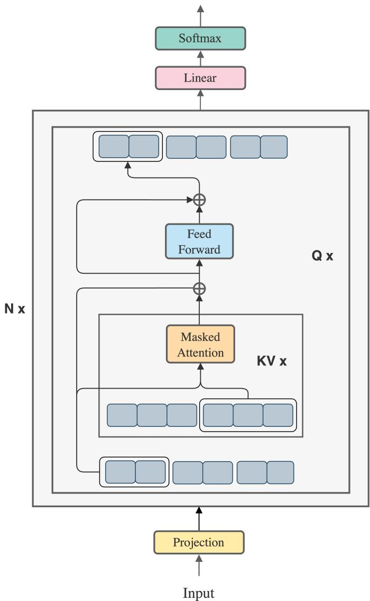
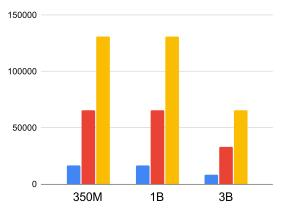
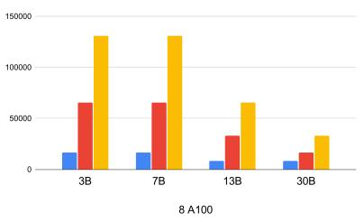
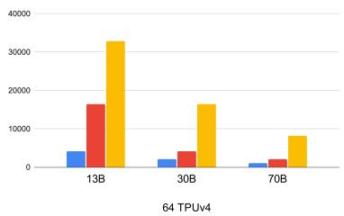

# Background & Motivation

## The Success of Transformers
- Transformers are the backbone of state-of-the-art NLP and AI models.
- They excel at capturing long-range dependencies via self-attention and feedforward mechanisms.
- Scalability in context length and model size is driven by highly parallel computations.

## The Long Context Challenge
- Many AI problems require handling extremely long sequences (high-res images, books, code).
- Standard Transformers struggle to scale to long inputs due to massive memory requirements.
- Memory demands restrict tasks involving multiple long sequences or long-term dependencies.

## Self-Attention Memory Bottleneck
- Standard self-attention materializes the $Q K^T$ and softmax matrices to High Bandwidth Memory (HBM).
- This results in a quadratic $O(s^2)$ space complexity with respect to sequence length $s$.
- Various approximations (sparse, low-rank) have been proposed but often sacrifice exactness.

## Prior Work: Memory-Efficient Attention
- Recent methods compute exact self-attention with linear memory complexity (e.g., FlashAttention).
- They use online softmax and blockwise computation to avoid materializing the full attention matrix.
- This successfully reduces the self-attention memory footprint from $O(s^2)$ to $O(s)$.

## The Overlooked Bottleneck: Feedforward Networks
- While attention memory is optimized, the position-wise Feedforward Network (FFN) is overlooked.
- The FFN contains a massive number of parameters and produces high-dimensional intermediate vectors.
- Once attention is memory-efficient, the FFN becomes the primary memory bottleneck for long contexts.

## Memory Cost of Vanilla FFN
- FFN applies two linear transformations with a ReLU activation across the full sequence.
- With gradient checkpointing, the maximum activation size of the FFN is $8bsh$ bytes.
- For large context sizes, this overwhelming memory demand severely hinders model scaling.

## The Opportunity for Blockwise Computation
- If self-attention is computed blockwise, we do not need to wait for the full sequence to finish.
- We can merge the computation of the FFN directly into the blockwise attention process.
- This eliminates the need to materialize full-sequence intermediate activations for the FFN.

# Design

## Blockwise Parallel Transformer (BPT) Overview
- BPT leverages blockwise computation for both self-attention and the feedforward network.
- It fuses the FFN computation into the attention block loop to minimize memory costs.
- Enables processing significantly longer input sequences while maintaining a low memory budget.

## Blockwise Self-Attention Recap
- Input sequences $Q, K, V$ are split into blocks.
- For each query block, attention is computed by iterating over all key-value blocks.
- Global attention is obtained by tracking normalization statistics and scaling blockwise outputs.

## Fusing Attention and FFN
- BPT applies the FFN immediately after the attention output for a specific query block is ready.
- The model computes the FFN on intermediate blocks rather than the full sequence.
- Output for each block: FFN(Attention($Q_i, K, V$) + $Q_i$) + Attention($Q_i, K, V$) + $Q_i$.

## Nested Loop Architecture
- **Outer Loop:** Iterates over each query block $Q_i$.
- **Inner Loop:** Iterates over each key-value block to compute blockwise attention for $Q_i$.
- **Fusion:** The FFN and residual connection are applied inside the outer loop before moving to the next $Q_i$.

## BPT Architecture Diagram

{width=60% fig-align=center}

- The architecture projects an incoming input block into a query.
- It iterates over the sequence to project keys and values, computing self-attention (yellow box).
- The output is immediately passed to the FFN (cyan box) and residual connection, repeating per block.

## Memory Cost Analysis: Vanilla vs. FlashAttention
- **Vanilla Transformer:** Maximum activation size is $O(s^2)$ due to full attention matrix materialization.
- **FlashAttention:** Attention activation is reduced to $2bsh$, but FFN activation remains $8bsh$.
- FlashAttention layer total memory cost is dominated by the FFN ($8bsh$).

## Memory Cost Analysis: BPT
- **BPT Attention:** Maximum activation size is $2bsh$, matching FlashAttention.
- **BPT FFN:** By iterating FFN over blocks, the maximum FFN activation size is reduced to $2bsh$.
- **Result:** BPT offers a 4x memory saving ($8bsh / 2bsh$) for activations compared to FlashAttention.

## Why Blockwise Parallelization Works
- For large models or extremely long contexts, a single block reaches maximum arithmetic density.
- Executing the full-length sequence in parallel becomes impractical and unnecessary.
- Blockwise parallelization treats long sequences as short ones, effectively enabling massive context sizes.

## Hardware Advantages
- SRAM (on-chip memory) is an order of magnitude faster than HBM (global memory) on GPUs/TPUs.
- BPT taps into the increased speed of SRAM by keeping block computations local.
- Fusing attention and FFN reduces data movement between SRAM and HBM, increasing overall throughput.

## Implementation Details
- Implemented in Jax, optimized for simplicity and large-scale distributed training.
- Uses `scan` operations to iterate over sequence chunks without materializing full matrices.
- Employs the max-score trick for numerically stable blockwise softmax computation.

# Evaluation

## Experimental Setup
- **Models:** GPT architecture ranging from 1B to 70B parameters.
- **Hardware:** NVIDIA 80GB A100 GPUs (1x and 8x) and 64 TPUv4s.
- **Baselines:** Vanilla Transformer and Memory-Efficient Attention (FlashAttention).
- **Datasets:** OpenWebText (Language Modeling) and ExoRL (Reinforcement Learning).

## Maximum Context Length: 1 A100

{width=60% fig-align=center}

- Evaluated on a single A100 GPU for 350M, 1B, and 3B parameter models.
- BPT achieves a maximum sequence length of 131K for 1B parameters.
- This is 2x longer than Memory-Efficient Attention and 8x longer than Vanilla Attention.

## Maximum Context Length: 8 A100s

{width=60% fig-align=center}

- Evaluated using model parallelism across 8 A100 GPUs for 3B to 30B models.
- BPT enables training sequences of 65K for a 30B parameter model.
- Consistently outperforms baselines, doubling the context length of Memory-Efficient Attention.

## Maximum Context Length: 64 TPUv4s

{width=60% fig-align=center}

- Evaluated on 64 TPUv4s for massive models (13B, 30B, 70B).
- BPT allows an 8K context length for a 70B model.
- Achieves up to 4x longer sequences than Memory-Efficient Attention at this scale.

## Memory Usage Comparison
- At a 16K context length (3B model, 1 A100), Vanilla OOMs, FlashAttention uses 47GB, BPT uses 45GB.
- At a 65K context length (13B model, 8 A100s), FlashAttention uses 75GB, BPT uses 68GB.
- BPT consistently consumes the least memory, pushing the boundary before Out-Of-Memory (OOM) occurs.

## Throughput and Training Speed
- Measured in tokens processed per device per second on a 1B model.
- BPT achieves competitive throughput with FlashAttention at shorter contexts (1.17x speedup over Vanilla at 8K).
- At 32K and 64K contexts, BPT maintains high throughput while all other methods run out of memory.

## Application: Reinforcement Learning
- Evaluated on the ExoRL benchmark (unsupervised RL data relabeled with task rewards).
- Agentic Transformer (AT) conditions on multiple trajectories to predict actions.
- Original AT was limited to 4 trajectories due to memory constraints.

## RL Performance Gains
- BPT enables AT to condition on 32 trajectories (sequence length of 32,000 tokens).
- Training 32 trajectories with a 350M model is infeasible for Vanilla and FlashAttention (both OOM).
- AT + BPT consistently outperforms the original AT across all six tasks (average return 155.36 vs 120.65).

## Limitations and Future Work
- Current implementation prioritizes simplicity using high-level Jax operations.
- Low-level optimizations (e.g., porting to CUDA or OpenAI Triton) are needed for absolute peak performance.
- Future work will focus on maximizing speedup and further minimizing hardware-specific memory costs.
