# Background & Motivation

## Tensor Computations in Modern Workloads

- Tensor computations (e.g., matrix multiplication, convolution) are the core of machine learning and data analytics.
- These operations consist of deeply-nested loops and are highly compute-intensive.
- They are ideal candidates for acceleration on heterogeneous hardware like GPUs, CPUs, and FPGAs.

## The Burden of Manual Optimization

- Traditional high-performance libraries (cuDNN, MKL) require manual, low-level kernel optimization.
- Programmers must manually manage compute, memory, interconnects, and data bit-widths.
- This process takes months or years, lagging behind the rapid evolution of new AI algorithms.
- Hand-tuned code is highly hardware-specific and lacks portability across different platforms.

## Limitations of Current Tensor Compilers

- Modern frameworks (TVM, Halide) separate compute definitions from schedule optimizations.
- While they improve productivity, they still require programmers to manually design schedule templates.
- Designing a high-performance schedule template is as difficult as writing low-level code.
- Programmers must manually reason about complex performance trade-offs for millions of primitive combinations.

## Performance Variability Across Schedules

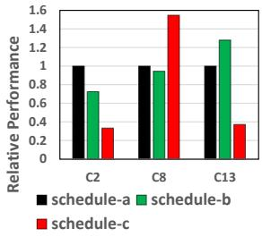{width=50% fig-align=center}

- Different combinations of schedule primitives (split, fuse, reorder) drastically impact performance.
- Even minor changes, such as the order of primitives, can lead to significant speedups or slowdowns.
- The optimal schedule varies heavily depending on the specific input shape and workload size.

## Hardware Heterogeneity Challenges

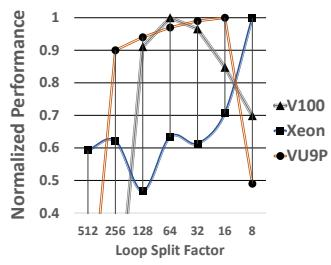{width=50% fig-align=center}

- Hardware platforms (CPU, GPU, FPGA) have vastly different architectures and optimization requirements.
- The performance trend for a single parameter (e.g., loop split factor) varies wildly across devices.
- A schedule that performs optimally on a GPU may perform poorly on a CPU or FPGA.

## FlexTensor Overview

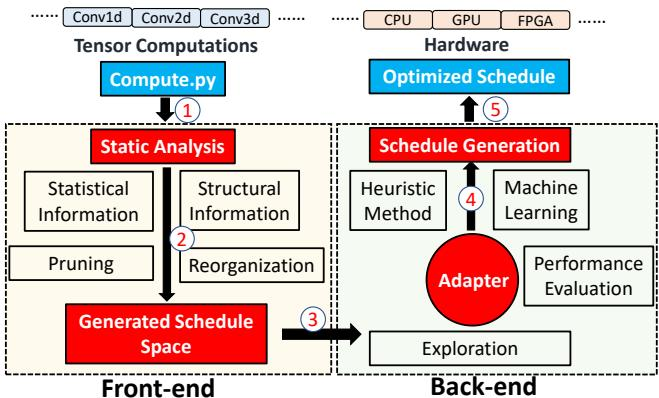{width=80% fig-align=center}

- FlexTensor is a fully automatic, template-free schedule exploration and optimization framework.
- Users only provide high-level mathematical descriptions of tensor computations in Python.
- The **Front-end** statically analyzes the computation to generate and prune a hardware-specific schedule space.
- The **Back-end** uses a hybrid heuristic and machine learning approach to find the optimal schedule.

# Design

## Front-end: Static Analysis

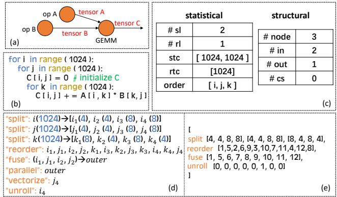{width=80% fig-align=center}

- Represents tensor computations as a mini-graph of nested loops (nodes) and data dependencies (edges).
- Extracts statistical information: number of spatial loops, reduce loops, trip counts, and loop orders.
- Extracts structural information: number of nodes, input/output tensors, and consumer nodes.

## Front-end: Schedule Space Generation

- Enumerates combinations of schedule primitives (split, reorder, fuse, unroll, vectorize, parallelize).
- Encodes each schedule point as a vector, where values represent specific primitive choices or parameters.
- Prioritizes structural primitives (split, reorder, fuse) to group similar configurations together.

## Front-end: Space Pruning & Rearrangement

- The raw schedule space is massive (often > $10^{11}$ configurations).
- **Pruning**: Limits primitive combination depth, restricts split factors to divisible choices, and fixes hardware-specific decisions.
- **Rearrangement**: Converts the 1D list of schedules into a high-dimensional space based on structural similarity.
- Neighboring points in the rearranged space are highly likely to yield similar performance.

## Back-end: Exploration Strategy

- Exhaustive search of the pruned schedule space is still infeasible.
- FlexTensor combines a heuristic method (to select starting points) with a machine learning method (to choose search directions).
- Evaluates points either via real hardware measurement or fast analytical models.

## Heuristic Search: Simulated Annealing

- Maintains a set of evaluated schedule points and tracks the best-performing configuration.
- Uses simulated annealing to probabilistically select the next starting point from the evaluated set.
- Points with performance closer to the current best are more likely to be chosen as starting points.

## Machine Learning Search: Q-Learning

- Formulates the search for the best optimization direction as a reinforcement learning problem.
- Uses a Q-learning algorithm with a four-layer neural network to predict the "Q-value" of each possible direction.
- The reward function is based on the performance improvement achieved by moving to a neighboring schedule point.
- The neural network is trained online during the exploration process using collected performance data.

## Performance Evaluation Methods

- **CPUs & GPUs**: Uses real hardware measurement since compilation and execution overhead is small ($\le 1s$).
- **FPGAs**: Real measurement is impossible due to hours-long synthesis times.
- Uses an analytical performance model for FPGAs based on workload size, parallel processing elements, and pipeline stage delays.

## Hardware-Specific Schedule Generation

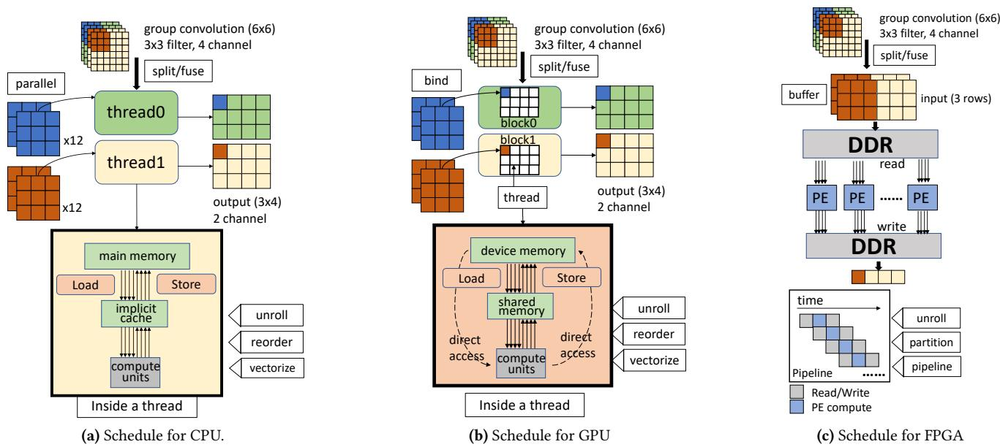{width=90% fig-align=center}

- FlexTensor translates the optimized schedule vector into low-level code using hardware-specific primitives.
- Uses a bottom-up traversal of the computation mini-graph to apply schedules to each node.

## Schedule Implementation: CPU

- Focuses heavily on register blocking and vectorization.
- Uses multi-level tiling to split spatial and reduce loops, ensuring data fits into CPU caches.
- Dynamically fuses outer loops for multi-threading and vectorizes the inner-most loop based on instruction set limits (e.g., AVX2).

## Schedule Implementation: GPU

- Prioritizes block/thread decomposition and shared memory configuration.
- Binds outer loops to thread blocks and inner loops to individual threads.
- Dynamically configures shared memory size based on the trip counts of inner loops tuned during exploration.

## Schedule Implementation: FPGA

- Leverages a three-stage coarse-grained pipeline architecture (data read, compute, data write).
- Configures read/write schedules based on DDR bandwidth and on-chip memory buffer limits.
- Optimizes the compute pipeline based on available DSP resources and BRAM capacities.

# Evaluation

## Experimental Setup

- **Hardware**: NVIDIA V100/P100/Titan X GPUs, Intel Xeon E5 CPU, Xilinx VU9P FPGA.
- **Benchmarks**: 12 diverse tensor operators (GEMM, Bilinear, 1D/2D/3D Convolutions, Group/Depthwise/Dilated Convolutions).
- **Baselines**: PyTorch native, cuDNN, cuBlas, MKL-DNN, OpenCL baselines, and AutoTVM.

## Overall GPU Performance

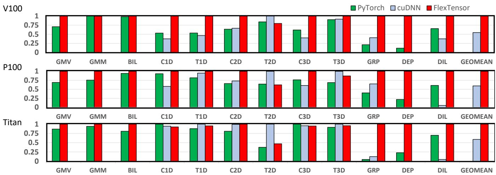{width=90% fig-align=center}

- FlexTensor outperforms both native PyTorch and cuDNN for the majority of operators.
- Achieves average speedups of 1.83x on V100, 1.68x on P100, and 1.71x on Titan X compared to cuDNN.
- Excels particularly on poorly-supported operators like Group and Dilated convolutions (up to 21.35x speedup).

## 2D Convolution on GPUs

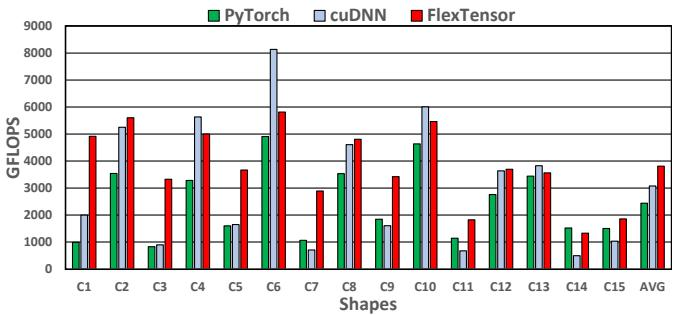{width=70% fig-align=center}

- Evaluated across 15 distinct convolution layers from YOLO-v1.
- FlexTensor achieves a geometric mean speedup of 1.5x over cuDNN.
- Reaches an average throughput of 3519.71 GFLOPS by dynamically balancing inter-thread and intra-thread workloads.

## 2D Convolution on CPUs

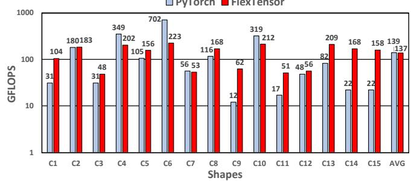{width=70% fig-align=center}

- FlexTensor exceeds PyTorch (MKL-DNN backend) for most YOLO-v1 layers.
- Achieves a 1.72x geometric mean speedup over the hand-tuned library.
- Automatically discovers the optimal vectorization length (8) for the Xeon E5's AVX2 instructions.

## 2D Convolution on FPGAs

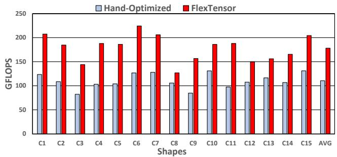{width=70% fig-align=center}

- Compared against hand-optimized OpenCL baselines.
- Achieves a 1.5x geometric mean speedup.
- Provides better scheduling strategies to overlap data communication and computation under strict resource constraints.

## Comparison to State-of-the-Art (AutoTVM)

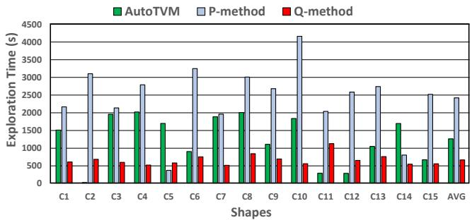{width=70% fig-align=center}

- FlexTensor achieves an average 2.21x speedup over AutoTVM across various operators.
- Explores a schedule space roughly 2027x larger than AutoTVM's template-restricted space.
- The Q-learning method (Q-method) takes only 52.9% of the time AutoTVM requires to reach similar performance.

## Exploration Convergence Over Time

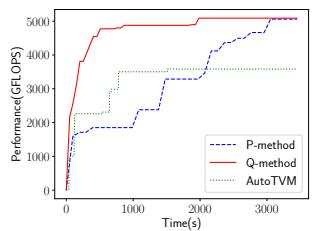{width=45% fig-align=center}

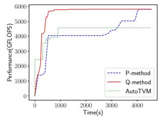{width=45% fig-align=center}

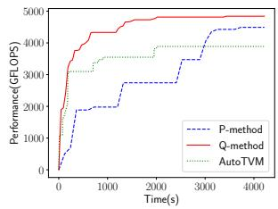{width=45% fig-align=center}

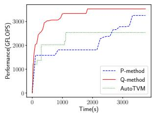{width=45% fig-align=center}

- Q-method consistently converges to high performance significantly faster than exhaustive search (P-method) and AutoTVM.
- Avoids getting stuck in local optima by effectively predicting the most promising optimization directions.
