# Background & Motivation

## The Shift to Low-Precision

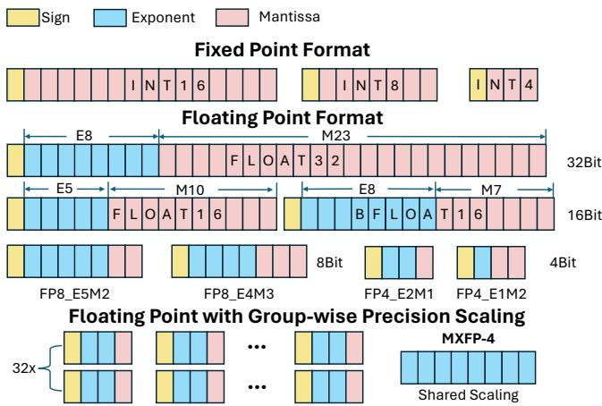{width=70% fig-align=center}

- Deep learning models are increasingly scaling up, demanding massive computing power.
- Neural networks are inherently robust to errors, allowing the use of lower-precision arithmetic.
- The industry is shifting from FP32 to FP16/BF16, and aggressively exploring 8-bit, 4-bit, and even 2-bit or 1-bit formats for weights and activations.

## Group-wise and Mixed Precision

- To maintain accuracy at low bit-widths, models use group-wise precision scaling (e.g., sharing a scaling factor across 32 or 64 elements).
- Mixed-precision operations (e.g., W4A16, W8A16) are common because different tensors (weights vs. activations) have varying sensitivities to quantization.
- These custom data types create a highly fragmented landscape of precision formats.

## Hardware Lags Behind

- Hardware accelerators (GPUs) have limited chip area and cannot natively support every new custom data type.
- Implementing new computing units for evolving formats (like FP8 or NF4) takes hardware generations to deploy.
- When encountering unsupported data types, systems must cast or simulate them using higher-precision supported types, leading to inefficiencies.

## Software Inefficiency

- Existing software libraries struggle to align fine-grained low-bit data accesses with coarse-grained memory systems.
- Loading 8-bit or 4-bit elements directly often wastes memory bandwidth (e.g., unaligned with 32-byte memory banks).
- Even for natively supported low-precision types, hardware utilization remains low (e.g., INT8 matrix multiplication on A100 often achieves <60% utilization).

## Key Insight: Layout Transformation

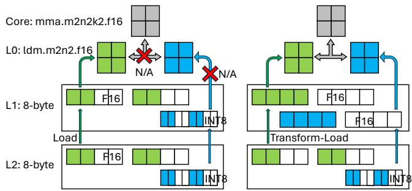{width=70% fig-align=center}

- Unaligned memory access can be fixed by transforming the tensor layout in the memory hierarchy.
- By storing data tiles in contiguous memory spaces that match the memory transaction length and instruction shape, bandwidth utilization is maximized.
- This requires packing and swizzling data specifically tailored to the bit-width and memory layer.

## Key Insight: Type Conversion

- Hardware lacks compute instructions for custom types, but its memory system can store arbitrary data as opaque bit chunks.
- Most custom types can be losslessly converted to a wider, hardware-supported type (e.g., NF4 to FP16).
- By separating data storage (custom low-bit types) and computation (standard types via conversion), models can save memory traffic while still executing on existing hardware.

# Design

## LADDER Architecture

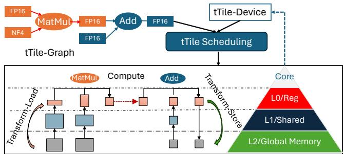{width=70% fig-align=center}

- LADDER is a compiler that treats custom data types as first-class citizens.
- It translates a DNN computation with custom types into an optimized computing pipeline.
- The pipeline handles data storage, memory access, and type conversions across the hardware hierarchy.

## The tType Abstraction

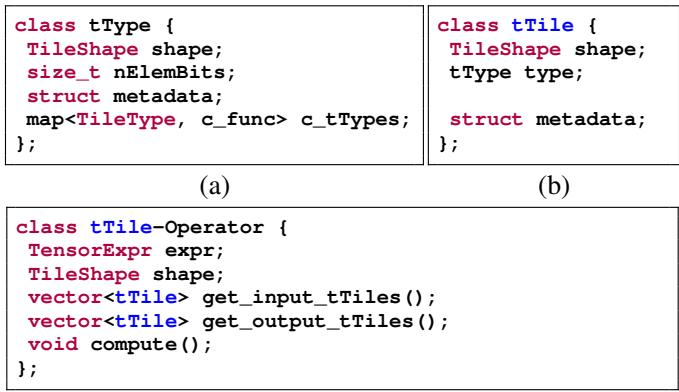{width=60% fig-align=center}

- `tType` represents a data type consisting of a group of homogeneous elements (e.g., a block of 32 elements sharing a scaling factor).
- It explicitly specifies the type width (`nElemBits`), element shape, and metadata.
- It also defines type-converting functions (`c_func`) to cast the custom type into a hardware-supported standard type.

## The tTile Abstraction

- `tTile` represents a tensor of a specific `tType` at a fine-grained tile level.
- It groups homogeneous elements with the same data type and layout shape.
- Elements within a `tTile` share metadata and are stored in row-major order.

## tTile-Operator and Tensor Expression

- A DNN operator is represented as a `tTile-operator`, breaking computation into independent, fine-grained tasks.
- LADDER extends standard tensor expressions by annotating them with `tType`.
- This allows the compiler to explicitly understand mixed-data-type computations (e.g., multiplying FP16 and NF4, accumulating in FP32).

## Hardware Hierarchy Modeling

- Modern accelerators are modeled as a multi-layer hierarchy (DRAM, L2, Shared Memory, Registers, Cores).
- Each layer's access preferences (transaction size, instruction shape) are described as a `tTile-device`.
- Aligning the computation graph's `tTiles` with the `tTile-device` ensures efficient execution.

## Transformation Primitives

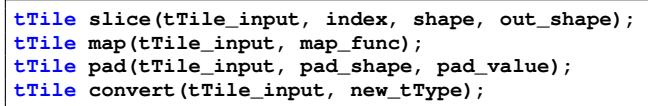{width=50% fig-align=center}

- LADDER introduces four primitives to transform a `tTile` into an equivalent format:
- **Slice:** Extracts a sub-tensor for data tiling.
- **Map:** Modifies the memory layout of elements to align with transaction requirements.
- **Pad:** Pads the tile borders to match hardware instruction shapes.
- **Convert:** Converts the `tType` to a hardware-supported type using its defined conversion function.

## Pipeline Execution Example

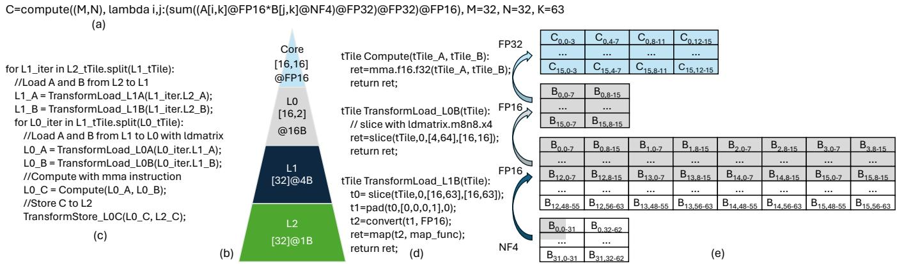{width=80% fig-align=center}

- Example: FP16 tensor multiplying an NF4 tensor.
- Data is loaded from L2 to L1 as packed NF4, saving memory bandwidth.
- During the load from L1 to Registers (L0), the NF4 tile is sliced, padded, converted to FP16, and mapped to the correct layout.
- The core computes using native FP16 instructions, achieving high utilization.

## The Scheduling Challenge

- Tensor transformations open a massive scheduling space.
- Type conversions can happen at different memory layers, creating a trade-off between memory footprint and latency.
- Converting early (e.g., in L2) saves compute instructions later but increases memory traffic; converting late (e.g., in Registers) saves bandwidth but risks register spilling.

## Hint-Based Layer-Wise Policy

- LADDER uses a hardware-aware, layer-wise scheduling policy to minimize end-to-end latency.
- A lower memory layer provides its preferred data access granularity as a "hint".
- The upper layer decides the optimal compute granularity by aligning with this hint via transformations.
- The scheduler works top-down (from core to DRAM), applying tiling and transformations at each layer.

## Implementation Details

- Built on top of TVM, Welder, and Roller.
- Modifies TVM's code generation to use PTX instructions (e.g., MMA for tensor cores, `cp.async` for memory copies).
- Implements custom bitwise operations (e.g., LOP3) for ultra-low-bit integer conversions to minimize overhead.

# Evaluation

## Evaluation Setup

- **Hardware:** NVIDIA A100, V100, RTX A6000, and AMD Instinct MI250.
- **Models:** LLAMA-70B, BLOOM-176B, ResNet-50, ShuffleNet-V2, ViT-Base, Conformer-L.
- **Data Types:** W16A16, W4A16, W8A8, NF4, MXFP8, W1A8, W1A4.
- **Baselines:** Welder, PyTorch-Inductor, ONNXRuntime, TensorRT, vLLM, AMOS, TensorIR.

## End-to-End Latency on A100

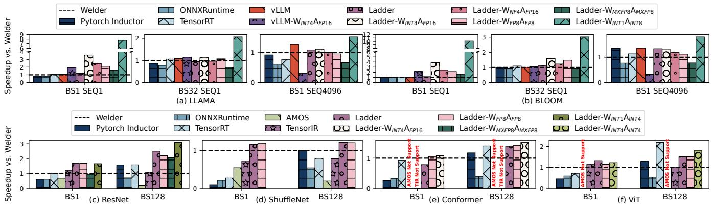{width=80% fig-align=center}

- LADDER outperforms state-of-the-art compilers even on natively supported types (W16A16), achieving up to 2.0x speedup over Welder.
- For W4A16 (common in LLMs), LADDER achieves a 2.3x average speedup over vLLM.
- For unsupported custom types like W1A8, LADDER achieves up to 10x speedup over Welder baselines.

## Performance on V100 and A6000

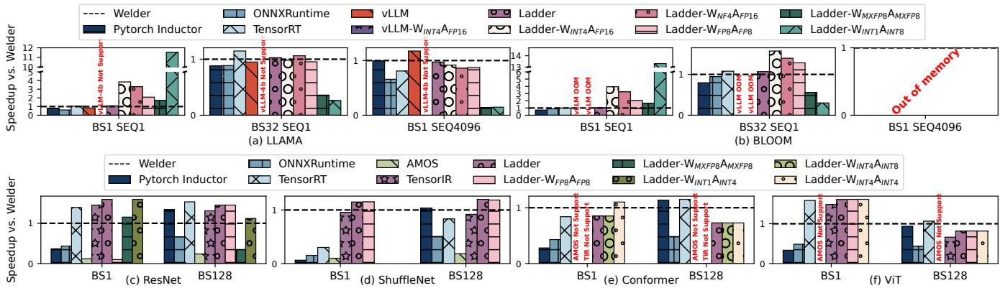{width=80% fig-align=center}

- On V100, LADDER successfully enables W4A16 inference (which vLLM does not support on this architecture).
- On RTX A6000, LADDER achieves up to 14.6x speedup for extreme low-bit configurations (W1A8) compared to Welder.

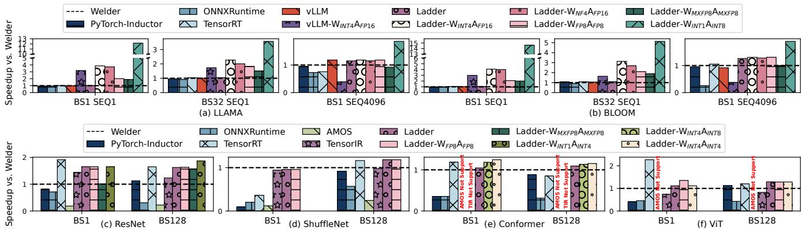{width=80% fig-align=center}

- Consistent performance gains across older and newer GPU architectures demonstrate LADDER's hardware-agnostic transformation benefits.

## Memory Footprint Savings

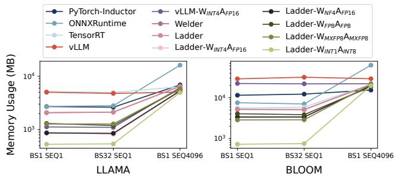{width=70% fig-align=center}

- Memory usage decreases near-linearly with the reduction in bit width.
- In memory-intensive decoding stages (BS=1, SEQ=1), W1A8 reduces the LLAMA model memory footprint by 74% compared to FP16.
- BLOOM model memory footprint is reduced by up to 85%.

## Compilation Time Overhead

- LADDER compiles significantly faster than AMOS (two orders of magnitude) and TensorIR (one order of magnitude).
- It is slightly slower than Welder due to the expanded scheduling space required to explore tensor transformations, but remains highly practical.

## Operator Benchmarks (A100)

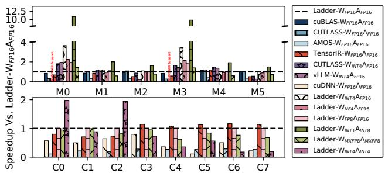{width=70% fig-align=center}

- Evaluated on core MatMul and Conv2d operators.
- LADDER matches or beats highly optimized vendor libraries (cuBLAS, CUTLASS) on standard FP16.
- For W4A16, LADDER averages a 1.8x speedup; for W1A8, it achieves a 4.5x speedup.

## Native FP8 Benchmarks (RTX 4090)

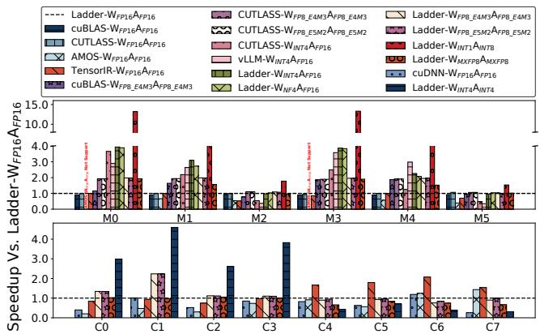{width=70% fig-align=center}

- Tested on Ada Lovelace architecture which natively supports FP8 tensor cores.
- LADDER outperforms cuBLAS and matches CUTLASS for W8A8 (E4M3 and E5M2 formats).
- LADDER achieves even higher speedups for NF4 and W1A8 on the 4090 due to more powerful cores handling the type conversions.

## Step-by-Step Optimization Breakdown

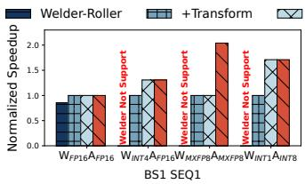{width=50% fig-align=center}

- Tile-aware kernel transformation provides a 2.0x speed boost over the baseline.
- PTX-level optimizations (reducing memory load and layout control) add up to 1.7x speedup.
- The holistic scheduling strategy yields an additional 2.5x speedup, particularly for memory-constrained types like MXFP8.

## Impact of Scaling Bit Widths

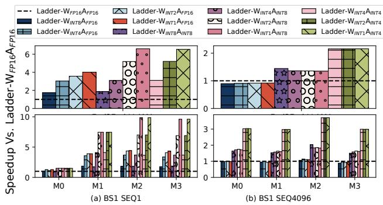{width=70% fig-align=center}

- In memory-bound scenarios (decoding, SEQ=1), scaling down weight bit-widths directly translates to increased speedup.
- In compute-bound scenarios (pre-filling, SEQ=4096), speedup plateaus because the mixed-precision operations still rely on higher-precision compute units.

## Accuracy vs. Efficiency in LLMs

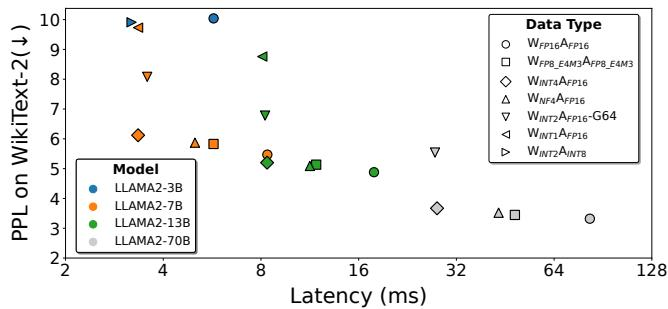{width=70% fig-align=center}

- Evaluated Perplexity (PPL) vs. Latency trade-offs for various quantization methods.
- NF4 and INT4 show minimal impact on PPL while delivering 1.7x to 2.5x speedups.
- Extreme quantization (e.g., BitNet 1.58-bit W2A8) shows massive potential, achieving 4.6x speedup on LLAMA2-70B configurations with competitive accuracy.

## Portability to AMD GPUs

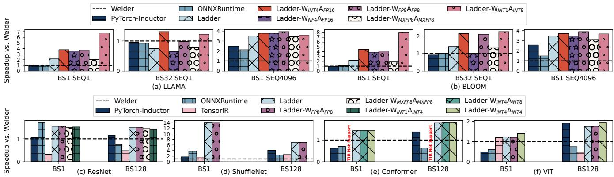{width=80% fig-align=center}

- LADDER's abstraction easily ports to AMD ROCm architectures (MI250).
- Achieves up to 14.1x speedup over Welder on ShuffleNet by enabling better kernel fusion and matrix core utilization.
- Delivers up to 4.5x speedup on BLOOM W4A16 compared to baseline compilers.
