# Background & Motivation

## DNN Execution on GPUs

- High-performance execution of Deep Neural Networks (DNNs) on GPUs is critical for modern ML.
- DNN frameworks specify computation using tensor programs (directed acyclic graphs of tensor algebra operators).
- Existing frameworks (e.g., PyTorch, TensorFlow) rely on manually designed rules to map tensor programs to expert-written GPU kernels.
- Manual optimization requires extensive engineering effort and often misses subtle optimization opportunities.

## Existing Automated Optimizers

- **Schedule-based optimizers** (Halide, TVM, Ansor, Triton): Optimize the execution schedule while fixing the algorithm.
- **Algebraic optimizers** (TASO, PET): Exploit mathematical equivalence to transform algorithms (e.g., fusing operators, converting convolutions to matrix multiplications).
- Both categories require programmers to manually specify a set of pre-defined kernels.

## Limitations of Prior Work

- Advanced optimizations require coordinated transformations across the kernel, thread block, and thread levels.
- Some optimizations require introducing completely new custom kernels (e.g., FlashAttention).
- Existing automated methods cannot discover these cross-level optimizations or generate new custom kernels automatically.
- Implementing these optimizations manually is highly complex (e.g., FlashAttention in Triton is >700 lines of code).

## The GPU Compute Hierarchy

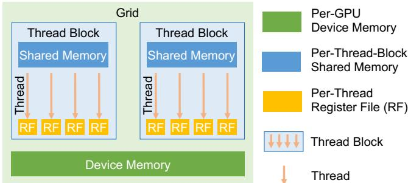{width=60% fig-align=center}

- **Kernels:** Functions executed simultaneously on multiple GPU cores (SPMD). Inputs/outputs stored in Device Memory.
- **Thread Blocks:** Grids of blocks executed on streaming multiprocessors. Threads within a block share Shared Memory.
- **Threads:** Individual execution units with per-thread Register Files.
- Optimizing across all these memory and execution tiers is essential for peak performance.

## Motivation for Mirage

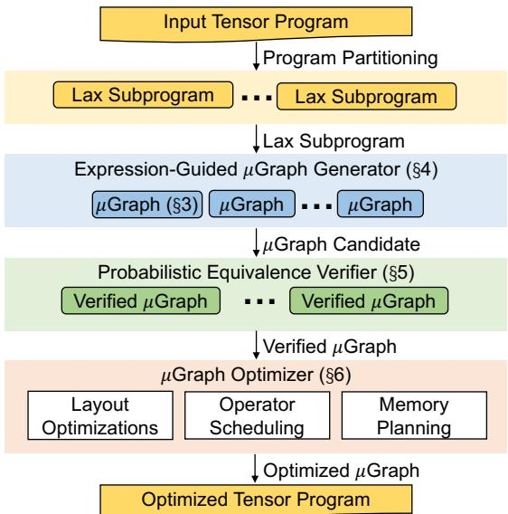{width=70% fig-align=center}

- **Mirage:** The first multi-level superoptimizer for tensor programs.
- Automatically discovers and verifies sophisticated optimizations across the entire GPU compute hierarchy.
- Jointly optimizes algebraic transformations, schedule transformations, and discovers new custom kernels.
- Outperforms heavily optimized, expert-designed kernels for widely used DNNs.

# Design

## Mirage System Overview

- Partitions input tensor programs into subprograms within the restricted "LAX fragment" (multi-linear operators, division, limited exponentiation).
- **Expression-guided µGraph generator:** Exhaustively searches for equivalent hierarchical graphs (µGraphs).
- **Probabilistic equivalence verifier:** Ensures functional equivalence using random tests over finite fields.
- **µGraph optimizer:** Maximizes runtime performance via layout optimization, scheduling, and memory planning.

## µGraphs: Multi-Level Representation

- A uniform, hierarchical graph representation specifying tensor programs across GPU levels.
- **Kernel Graph:** Nodes are kernels (pre-defined or graph-defined), edges are tensors in Device Memory.
- **Block Graph:** Specifies computation within a thread block. Tensors reside in Shared Memory.
- **Thread Graph:** Specifies computation for a single thread. Tensors reside in Register Files.
- Uniformly captures both algebraic and schedule transformations.

## Block Graphs and Scheduling

- Block graphs are associated with grid dimensions (x, y, z) and for-loop dimensions.
- **imap / omap:** Specify how input/output tensors are partitioned or replicated across blocks.
- **fmap:** Specifies how input tensors are loaded across for-loop iterations.
- Enables overlapping data loading from device memory with computation.

## Case Study: RMSNorm Baseline

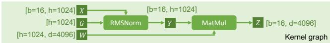{width=70% fig-align=center}

- RMSNorm followed by MatMul is a common pattern in Large Language Models.
- Existing compilers launch two separate kernels because both operations perform reductions across an input dimension.
- Requires storing intermediate results in slow device memory.

## Case Study: RMSNorm Optimized by Mirage

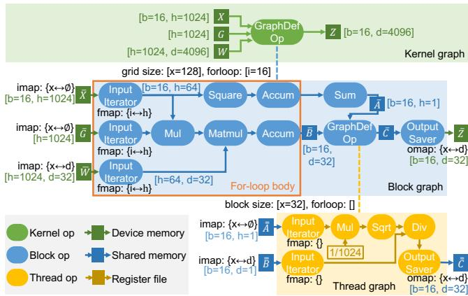{width=80% fig-align=center}

- Mirage discovers a µGraph that fuses RMSNorm and MatMul into a single custom kernel.
- Reorders MatMul and division (algebraic transformation).
- Performs accumulations in parallel (schedule transformation).
- Fuses element-wise operators into a thread graph, keeping intermediate results in register files.
- Outperforms hand-written kernels by up to 1.9×.

## Expression-Guided µGraph Generator

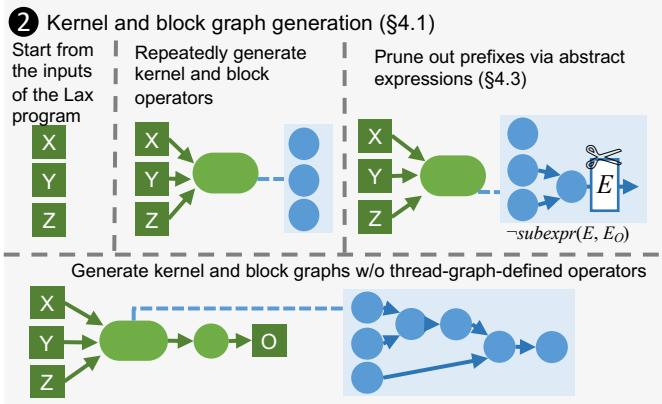{width=70% fig-align=center}

- Exhaustively considers all possible graphs up to a certain size at the kernel and block levels.
- Uses a rule-based strategy (operator fusion) to construct graphs at the thread level.
- Generates graphs incrementally, checking tensor shapes and memory usage to ensure validity.
- Maintains graphs in a canonical form to avoid redundant generation.

## Pruning via Abstract Expressions

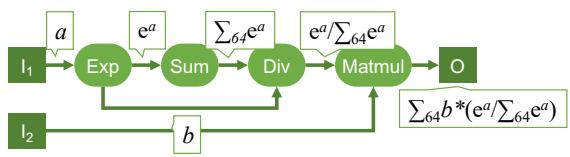{width=70% fig-align=center}

- The search space across kernel, block, and thread levels is massive.
- Mirage uses "abstract expressions" (first-order logic terms) to abstract the function computed at each edge.
- Prunes any µGraph prefix whose abstract expression is not a subexpression of the input program.
- Uses an SMT solver (Z3) to check subexpression entailment, caching results for efficiency.
- Provides a theoretical guarantee that the optimal µGraph will not be pruned under specific equivalence axioms.

## Probabilistic Equivalence Verifier

- Verifying equivalence of large tensor programs is challenging due to massive input/output sizes.
- Mirage uses random testing over finite fields instead of floating-point numbers.
- Generalizes Polynomial Identity Testing (PIT) to LAX programs (linear operators, division, exponentiation).
- Provides a strong theoretical guarantee: the probability of accepting a non-equivalent µGraph can be made arbitrarily low.
- Avoids floating-point errors during the verification search phase.

## µGraph Optimizer

- Applied only to verified µGraphs to reduce the search space.
- **Tensor Layouts:** Formulated as an Integer Linear Programming (ILP) problem to find optimal memory layouts.
- **Operator Scheduling:** Uses dynamic programming to minimize thread-level synchronization points.
- **Memory Planning:** Exhaustively enumerates allocation plans to find optimal memory offsets in shared/device memory.

# Evaluation

## Experimental Setup

- **Hardware:** NVIDIA A100 and H100 GPUs (40GB memory).
- **Benchmarks:** 6 common DNN building blocks (GQA, QKNorm, RMSNorm, LoRA, GatedMLP, nTrans).
- **Baselines:** TASO/PET, PyTorch (cuDNN/cuBLAS), TensorRT, FlashAttention/FlashDecoding, Triton.
- All systems use half-precision floating points and CUDA Graphs to minimize launch overhead.

## Overall Benchmark Performance

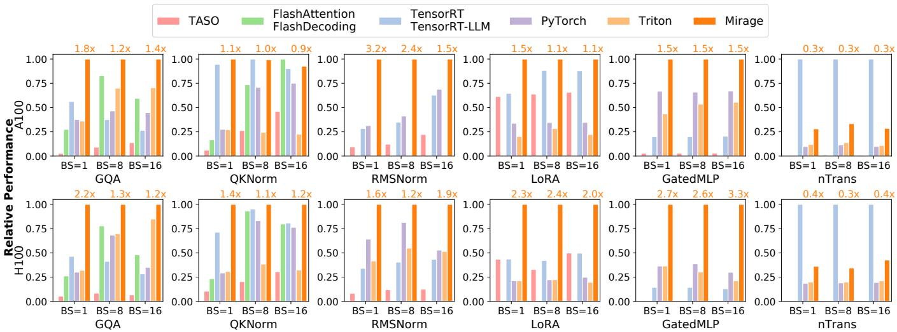{width=100% fig-align=center}

- Mirage improves performance by up to 3.3× compared to the best existing approaches.
- Consistently outperforms expert-designed kernels and state-of-the-art compilers across both A100 and H100 GPUs.

## Case Study: Group-Query Attention (GQA)

- GQA is the backbone of modern LLMs (e.g., LLaMA-3) and is heavily optimized by FlashAttention.
- Mirage outperforms expert-designed kernels by up to 2.2×.
- Automatically searches for the best grid dimensions, achieving full SM utilization (unlike fixed heuristics in TensorRT-LLM).
- Automatically selects the most efficient parallelization strategy (sample, KV heads, query seq, or KV seq) based on the specific attention scenario.

## Case Study: QKNorm

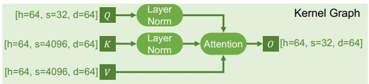{width=70% fig-align=center}

- QKNorm applies layer normalization to query and key vectors before attention.
- Existing systems require launching separate kernels for normalization and attention.

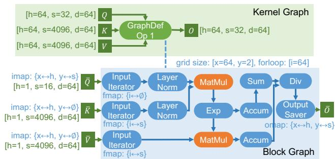{width=70% fig-align=center}

- Mirage discovers a µGraph integrating QKNorm and attention into a single custom kernel.
- Avoids writing intermediate results to device memory, reducing execution time by up to 1.4×.

## Case Study: LoRA

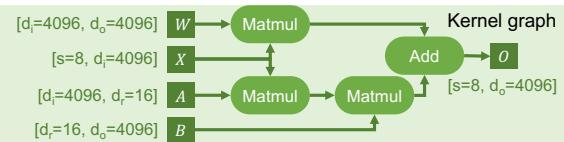{width=70% fig-align=center}

- Low-Rank Adaptation (LoRA) introduces two low-rank adapters to pre-trained linear operators.
- Existing optimizers launch separate kernels, incurring high launch overheads for minimal computation.

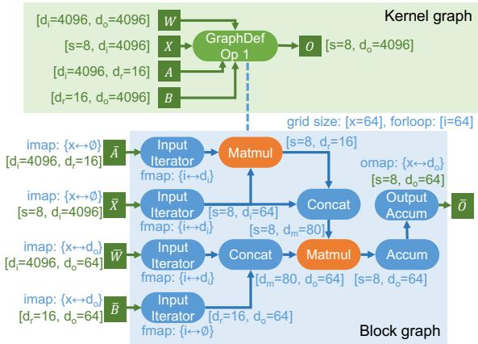{width=70% fig-align=center}

- Mirage fuses three MatMuls and an Add into a single kernel.
- Leverages algebraic transformations and shared memory concatenation to reduce execution cost by 1.1–2.4×.

## Case Study: GatedMLP

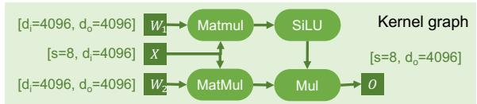{width=70% fig-align=center}

- GatedMLPs capture non-linear representations (e.g., in Falcon-7B).
- Existing optimizers fuse the two MatMuls but leave SiLU and element-wise multiplication as separate kernels.

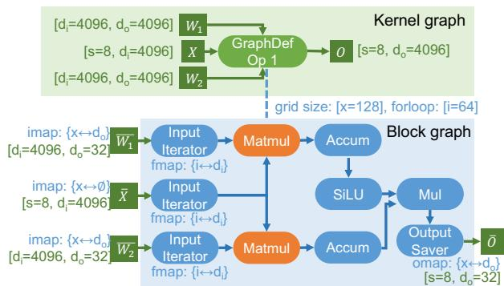{width=70% fig-align=center}

- Mirage performs the two MatMuls in parallel within the same block graph.
- Fuses SiLU and Mul as post-processing steps in the same block graph.
- Yields 1.5× speedups on A100 and up to 3.3× speedups on H100 GPUs.

## End-to-End Inference Performance

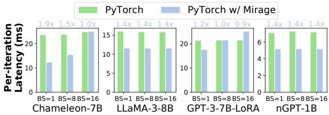{width=100% fig-align=center}

- Mirage supports Just-In-Time (JIT) compilation and easy integration into PyTorch.
- Reduces end-to-end latency of full models (Chameleon-7B, LLaMA-3-8B, GPT-3-LoRA, nGPT-1B) by 0.9–1.9×.
- Achieved with only a few lines of code changes to the original PyTorch programs.

## Search Time & Scalability

- Optimizing a LAX program takes up to 4 hours (a one-time offline cost).
- Multi-threading significantly reduces search time.
- Pruning via abstract expressions is crucial for scalability: allows exploring block graphs with up to 11 operators.
- Without abstract expression pruning, the search times out (>10 hours) for graphs with more than 6 operators.

## Ablation Study on Optimizations

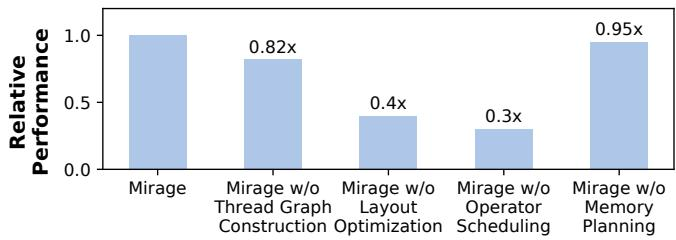{width=70% fig-align=center}

- Evaluated the impact of post-verification optimizations on the GQA benchmark.
- Disabling Thread Graph Construction reduces performance by 18%.
- Disabling Layout Optimization or Operator Scheduling causes severe degradation (60-70% drop).
- Demonstrates that all components of the µGraph optimizer are essential for achieving peak performance.
