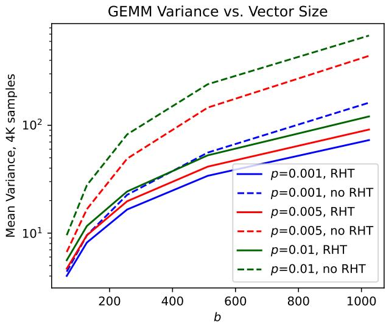
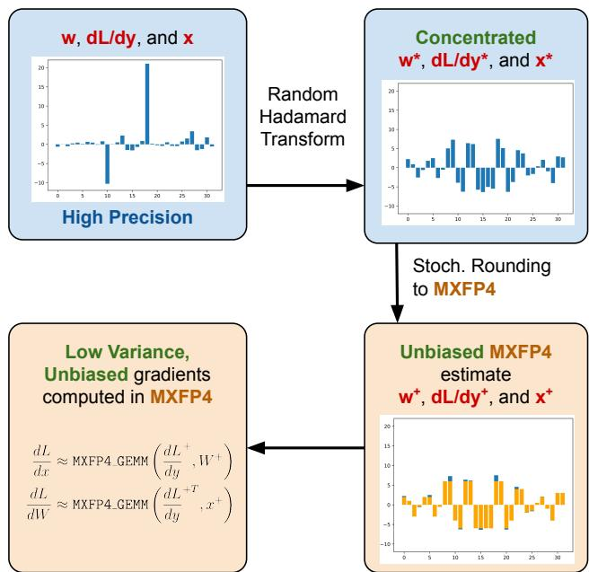
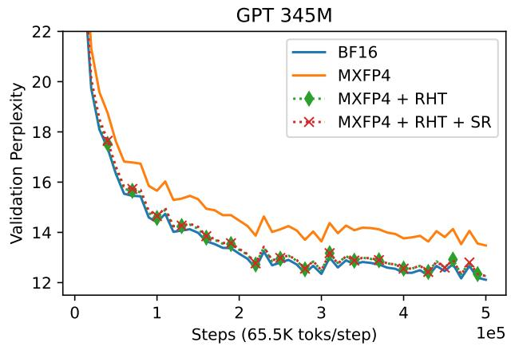
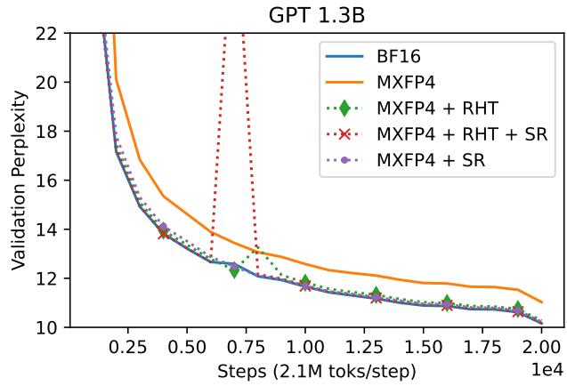
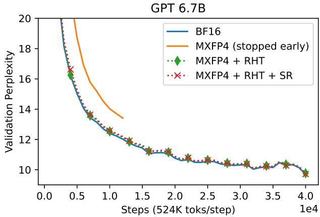
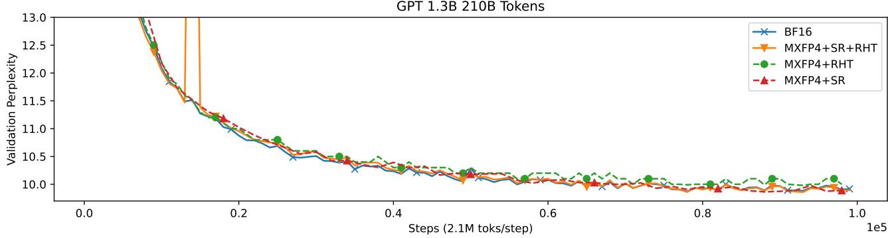
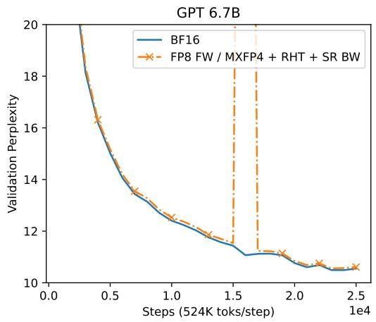

# Background & Motivation

## The Compute Bottleneck in LLM Training

- Modern Large Language Models (LLMs) require massive compute resources.
- Training Llama 3.1 405B required $3 \times 10^{24}$ FLOPs across >10,000 GPUs for months.
- Training is fundamentally compute-bound by matrix multiplications (GEMMs).

## Low Precision (LP) Datatypes

- Hardware accelerators increasingly support LP floating-point GEMMs ($\leq$ 16 bit).
- LP GEMMs offer significantly higher throughput and energy efficiency.
- FP8 GEMMs can be up to 4× faster than FP32 GEMMs.

## Mixed Precision Training

- Standard practice keeps parameters in high precision while converting GEMM operands to LP.
- BF16 mixed precision is typically >70% faster than FP32 training.
- Challenge: Reducing precision increases quantization distortion and numerical instability.
- At extremely low bitrates (e.g., 4-bit), distortion can severely degrade model quality or cause divergence.

## Microscaling (MX) Formats

- MX datatypes add a shared blockwise scale across multiple floating-point numbers.
- MXFP4 uses an INT8 scale for every contiguous block of 32 FP4 numbers.
- This shared scale significantly widens the dynamic range at a cost of only 0.25 extra bits per entry.
- Problem: Directly using MXFP4 in the backward pass still significantly degrades model quality.

## Stochastic Rounding (SR)

- Canonical "nearest rounding" (NR) is biased, which is detrimental to low-precision training.
- Stochastic rounding (SR) randomly rounds numbers so the expected value equals the original number.
- SR can be implemented efficiently in hardware via dithering (adding random uniform noise before NR).
- Adds minimal overhead (<2%) to GEMMs on supported hardware.

# Design

## Near-Lossless MXFP4 Training

- Goal: Enable near-lossless distributed training using MXFP4-accelerated GEMMs.
- Focuses on the backward pass, which accounts for >1/2 of total training FLOPs.
- Key insight: Compute unbiased, low-variance gradient estimates to enable accurate model updates.

## Unbiased Quantization to MXFP4

- Standard MX quantization is inherently biased (clips values scaled between 6 and 8 in FP4).
- Solution Step 1: Scale the input group by 3/4 to prevent clipping.
- Solution Step 2: Use stochastic rounding to quantize to FP4.
- Solution Step 3: Scale the high-precision accumulator output by 16/9 to restore the unbiased magnitude.

## The Variance Problem

- LLMs naturally exhibit activation and weight outliers, alongside sparse gradients.
- MXFP4 relies on groupwise statistics (largest magnitude element).
- Blocks with outliers suffer from high quantization distortion.
- Directly applying SR to these blocks results in high variance, acting as noise and harming convergence.

## Bounding Variance with the Random Hadamard Transform

- The Random Hadamard Transform (RHT) concentrates gradients, activations, and weights before quantization.
- RHT spreads outliers, giving the tensor a sub-Gaussian tail distribution.
- Reduces the variance of the SR GEMM from a linear dependence on blocksize to a logarithmic dependence.

## Empirical Variance Reduction

{width=70% fig-align=center}

- Variance of an SR GEMM grows much slower as a function of vector size when using the RHT.
- Effectively mitigates the noise introduced by stochastic rounding on outlier-heavy blocks.

## Blockwise RHT for Efficiency

- A full RHT across the batch dimension requires expensive cross-GPU communication in data-parallel setups.
- Solution: Apply the RHT as a dense matrix multiplication over a small number of MX blocks (e.g., $g=64$).
- This "blockwise" RHT is memory-bound and adds minimal overhead.
- Acts as a drop-in replacement for linear layers without breaking distributed training semantics.

## The End-to-End Backward Pass Recipe

{width=70% fig-align=center}

- High-precision operands are transformed using the blockwise RHT.
- Operands are stochastically rounded to MXFP4.
- Low-variance, unbiased gradients are computed using MXFP4 GEMMs.
- Output is scaled back to high precision for the optimizer update.

# Evaluation

## Experimental Setup

- Models: GPT 345M, 1.3B, and 6.7B parameters.
- Framework: Megatron-LM with Microsoft microscaling emulation.
- Dataset: GPT2 Wikipedia corpus.
- Baseline: BF16 mixed precision in both forward and backward passes.
- Method: BF16 forward pass, MXFP4 backward pass for decoder linear layers.

## GPT 345M Pretraining Results

{width=70% fig-align=center}

- Pure MXFP4 (orange) shows a massive perplexity gap compared to BF16.
- MXFP4 + RHT + SR closely tracks the BF16 baseline, achieving near-lossless training.

## GPT 1.3B Pretraining Results

{width=70% fig-align=center}

- SR alone (without RHT) exhibits slower initial convergence due to the loss of gradient information (small values flushing to zero).
- Combining RHT and SR stabilizes training and matches BF16 performance.

## GPT 6.7B Pretraining Results

{width=70% fig-align=center}

- The recipe scales successfully to 6.7B parameters.
- MXFP4 + RHT + SR maintains parity with BF16 mixed precision.

## The Importance of SR for Long Runs

{width=70% fig-align=center}

- Evaluated on a longer 210B token run for GPT 1.3B.
- RHT alone (biased) leaves a ~0.1 validation perplexity gap.
- SR is strictly necessary to provide an unbiased estimator and fully close the gap to BF16 over long horizons.

## Downstream Tasks & Fine-Tuning

- Zero-shot evaluation on the 20B token GPT 6.7B model shows identical performance between BF16 and MXFP4+RHT+SR.
- Fine-tuning on Tulu V2 yields similar final training perplexity (1.96 for BF16 vs. 1.98 for MXFP4).

## Overhead and Speedup Estimates

- Blockwise RHT is memory-bound and adds <5% end-to-end overhead.
- SR adds <2% overhead over a standard GEMM on supported hardware (e.g., Trainium).
- Estimated backward pass speedup: >1.3× over FP8 and >1.7× over BF16.

## Compatibility with FP8 Forward Passes

{width=70% fig-align=center}

- The MXFP4 backward pass recipe is fully compatible with FP8 forward passes.
- Combining FP8 (forward) and MXFP4 (backward) yields further speedups without noticeable degradation compared to BF16.
