# Background & Motivation

## Deep Learning Compilers

- DNN compilers translate tensor computations into nested multi-level loops.
- They apply optimizations like loop partitioning, fusion, and reordering.
- Goal: Produce high-performance kernels for modern accelerators (GPUs, TPUs).
- Reduces the burden of hand-crafting custom kernels for new operators.

## The Search Space Problem

- Loop rearrangement creates a massive combinatorial optimization space.
- State-of-the-art compilers (TVM, Ansor) use ML algorithms to search this space.
- Finding a good solution requires thousands of hardware-evaluated search steps.
- Tuning an end-to-end DNN model often takes days or weeks.
- Re-compilation is required whenever model structures or tensor shapes change.

## The Pipeline Perspective

- ROLLER treats DNN operators as a data processing pipeline, not just nested loops.
- Data tiles are moved through a multi-layer memory hierarchy and processed by parallel units.
- The optimization goal shifts to maximizing the throughput of this pipeline.
- Performance depends heavily on how fast data tiles move through Load-Compute-Store steps.

## Tile Shape and Memory Alignment

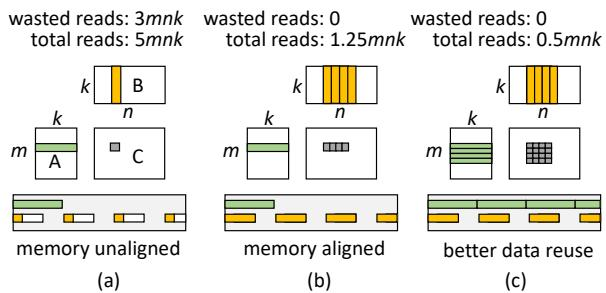{width=70% fig-align=center}

- Tile shape is the key factor affecting pipeline performance.
- Unaligned memory accesses (a) cause massive redundant data reads (e.g., 3/4 waste).
- Aligning tile shape with memory transaction length (b) eliminates bandwidth waste.
- Enlarging tile shapes (c) increases data reuse opportunities via caching.

## The Roller Insight

- To execute efficiently, tile shapes MUST align with underlying hardware characteristics.
- Hardware constraints (memory banks, transaction lengths, warp sizes) severely limit valid shape choices.
- By strictly enforcing hardware alignment, the massive search space is drastically reduced.
- Performance of aligned pipelines is highly predictable, eliminating the need for expensive hardware profiling.

# Design

## System Overview

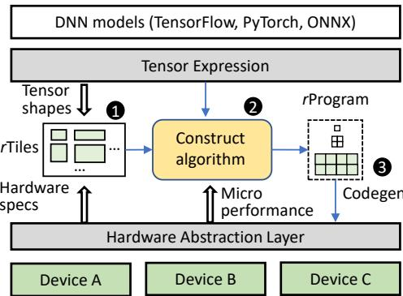{width=70% fig-align=center}

- ROLLER takes a tensor expression from a user or graph-level compiler.
- Extracts tensor shapes and leverages hardware specs to construct `rTiles`.
- Uses a scale-up-then-scale-out algorithm to generate an `rProgram`.
- Evaluates configurations using a fast, static micro-performance model.
- Emits final device-specific kernel code via a code generator.

## The rTile Abstraction

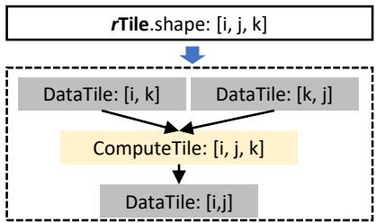{width=70% fig-align=center}

- `rTile` (RollingTile) is the basic computing unit encapsulating a multi-dimensional tile shape.
- Statically infers the involved input and output data tiles for a given tensor expression.
- Must strictly align with both underlying hardware features and input tensor shapes.
- Controls both the logical form (shape) and physical layout (storage padding).

## Alignment with Memory Transactions

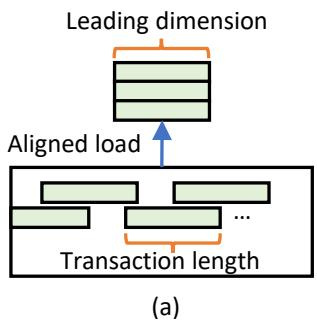{width=50% fig-align=center}

- Data tile shapes must align with the length of memory transactions.
- The leading dimension of a tile must be a multiple of the transaction length.
- Ensures optimal memory access with zero wasted transaction reads.

## Alignment with Memory Banks

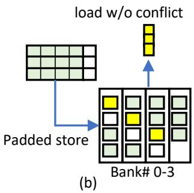{width=50% fig-align=center}

- Memory layout must align its stride with memory banks to avoid read conflicts.
- ROLLER adds specific padding sizes when storing tiles to distribute values across different banks.
- Enables conflict-free, efficient parallel reads by upper-memory layers.

## Alignment with Tensor Shapes

- rTile shapes should align with the original tensor shape to avoid boundary checking overhead.
- ROLLER adds bounded padding to the tensor dimensions.
- Padding is restricted by a parameter ε to ensure wasted computation remains strictly bounded.

## Deriving Valid rTiles

- ROLLER incrementally derives conforming rTiles using a `GetNextAlignedAxisSize` interface.
- Gradually increases dimension sizes until all hardware alignment requirements are met.
- Calculates a "data reuse score" to measure how much memory traffic is saved per unit of memory footprint.
- Prioritizes enlarging axes that yield the highest data reuse score.

## rProgram Construction

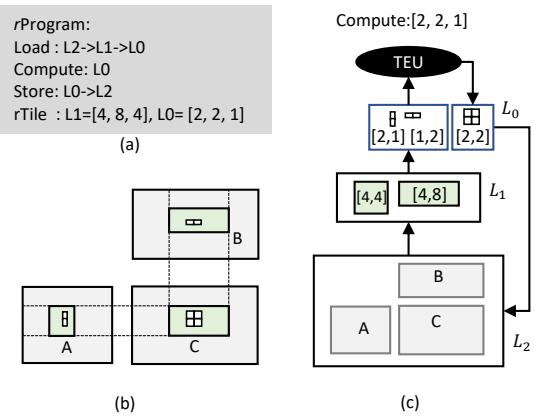{width=70% fig-align=center}

- An `rProgram` describes the data processing pipeline across the memory hierarchy.
- Composed of hierarchical rTile configurations and instructions (Load, Compute, Store).
- Data moves from lowest memory (L2) to highest (L0), is computed, and stored back.
- Optimization goal: saturate the bottleneck stage and leverage all parallel execution units.

## Scaling Up an rProgram

- Focuses on constructing a single-core rProgram to maximize hardware utilization.
- Starts with an initial rTile and recursively enlarges it along the most cost-effective axis.
- Stops when memory capacity is hit or when memory throughput exceeds peak compute throughput.
- Repeats top-to-bottom across memory layers to construct a fully saturated pipeline.

## Scaling Out an rProgram

- Replicates the constructed single-core rProgram across all parallel execution units.
- Uniformly partitions the computation into rTiles matching the lowest layer's size.
- Distributes partitions evenly, favoring assigning reduction axes to the same execution unit.

## Handling Small & Irregular Operators

- **Small Operators:** If parallelism is insufficient, ROLLER shrinks rTiles along the axis with the lowest data reuse score.
- **Irregular Shapes:** ROLLER transforms tensor expressions into canonical forms via "axis fusion" (merging adjacent axes).
- Greedily increases the tensor padding bound (ε) to unlock more valid aligned shapes.

## Hardware Abstraction Layer (HAL)

- Models accelerators as parallel execution units (TEUs) with a hierarchical memory layer.
- Exposes three rTile-based interfaces: Load, Compute, and Store.
- Provides hardware specifications: memory capacity, transaction lengths, cache line size, and bank count.
- Easily extensible to new accelerators (NVIDIA GPUs, AMD GPUs, Graphcore IPUs).

## Micro-Performance Model

- Evaluates rProgram performance statically without running on real hardware.
- Memory footprint and traffic are analytically inferred from the tensor expression and rTile shape.
- Compute throughput is measured via a one-time offline micro-benchmark per operator type.
- Highly accurate because ROLLER only evaluates strictly hardware-aligned configurations.

# Evaluation

## Experimental Setup

- **Hardware:** NVIDIA V100 & K80 GPUs, AMD ROCm MI50 GPUs, Graphcore IPUs.
- **Benchmarks:** 119 operators from ResNet-50, LSTM, NASNet, and BERT-Large.
- **Baselines:** TVM, Ansor, cuDNN/cuBLAS, rocBLAS, Poplar, TensorFlow, TensorRT.
- **Validation:** Compared ROLLER's top-1 and top-10 generated kernels against state-of-the-art.

## Operator Performance on V100 GPUs

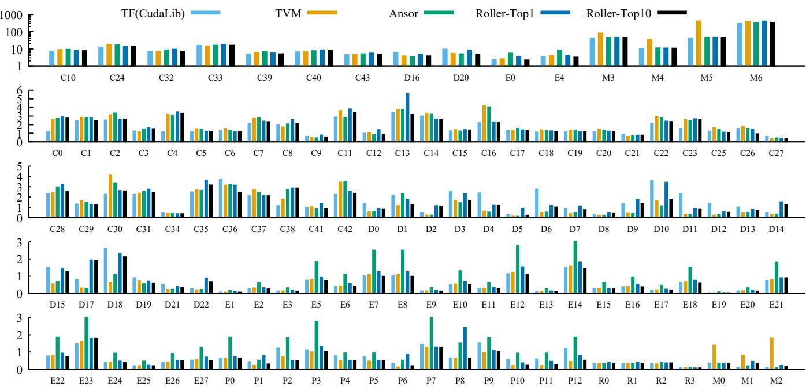{width=80% fig-align=center}

- ROLLER achieves comparable performance to highly-optimized vendor libraries (cuBLAS/cuDNN) for 81.5% of operators.
- Outperforms TVM and Ansor on 54.6% and 65.5% of operators, respectively.
- Excels particularly on large, time-consuming operators (up to 1.85x speedup over TVM).

## Compilation Time

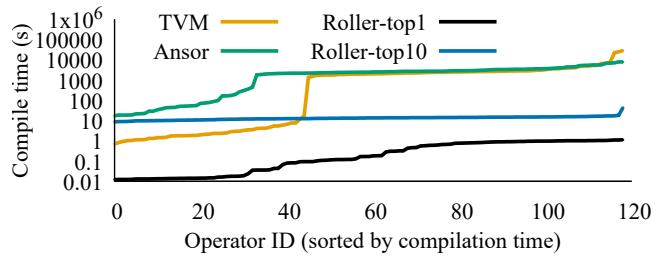{width=70% fig-align=center}

- TVM and Ansor average ~0.65 hours per operator (up to 7.89 hours).
- ROLLER generates top-1 kernels in ~0.43 seconds on average.
- ROLLER evaluates top-10 candidates in just ~13.3 seconds.
- Achieves three orders of magnitude speedup in compilation time.

## Scalability with Operator Size

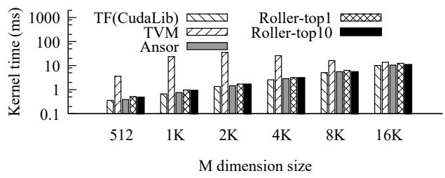{width=70% fig-align=center}

- Evaluated on a BERT MatMul operator scaled by different batch sizes.
- ROLLER demonstrates linear scalability, matching cuBLAS performance.
- Outperforms TVM by an average of 11.2x (up to 36.1x) at larger batch sizes.

## Compilation Time vs. Batch Size

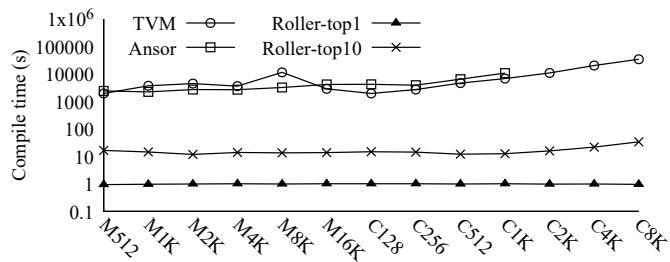{width=70% fig-align=center}

- TVM and Ansor compilation times grow exponentially as batch size increases.
- ROLLER's compilation time remains flat and consistently under a few seconds.
- Construction-based approach avoids the exploding search space of ML-based methods.

## Compiling on TensorCore

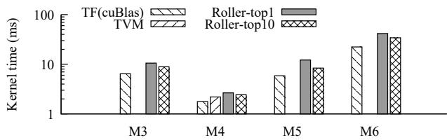{width=70% fig-align=center}

- ROLLER easily supports hardware tensor ISAs (e.g., 16x16x16 WMMA) via shape alignment.
- Quickly produces highly performant kernels on TensorCores.
- TVM fails to generate valid kernels for 3 out of 4 tested operators even after 10,000 tuning steps.

## Optimizing Small Operators

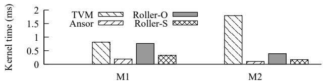{width=70% fig-align=center}

- Small operators lack sufficient parallelism for large rTiles.
- ROLLER's adaptive rTile shrinking (Roller-S) significantly improves performance over original shapes (Roller-O).
- Achieves 2.3x average speedup by matching SM parallelism.

## Optimizing Irregular Tensor Shapes

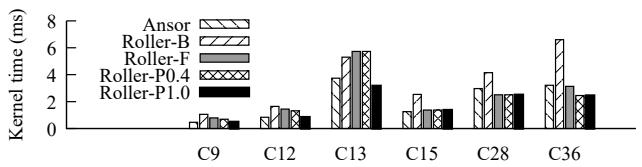{width=70% fig-align=center}

- Axis fusion (Roller-F) improves performance by 1.5x by creating more alignable shapes.
- Bounded tensor padding (Roller-P1.0) further improves performance by 1.4x.
- Unlocks a wider pool of legitimate, hardware-aligned candidate kernels.

## Validating the Micro-Performance Model

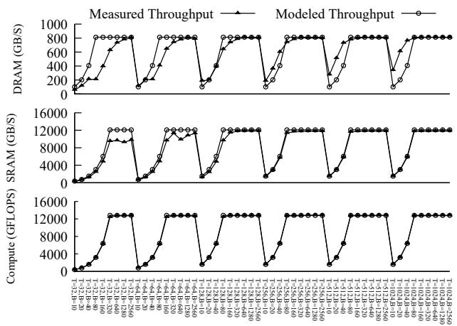{width=70% fig-align=center}

- Compares modeled throughput vs. real measured throughput across configurations.
- Model is highly accurate for shape-aligned configurations (sufficient threads/blocks).
- Inaccuracies only occur in unaligned/underutilized states, which ROLLER explicitly avoids.

## End-to-End Model Performance

- Evaluated in Rammer framework against TF, TF-XLA, and TensorRT.
- ROLLER outperforms state-of-the-art on BERT-Large (1.07x) and LSTM (1.55x).
- Slightly slower on ResNet/NASNet due to cuDNN's proprietary Winograd algorithms.
- Full model compilation takes minutes (~422s) compared to days for Ansor (~29-41 hours).

## Performance on Graphcore IPUs

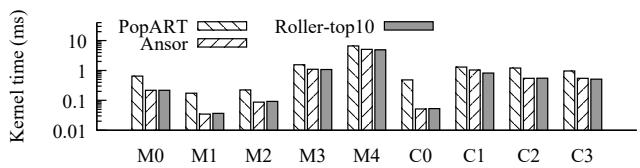{width=70% fig-align=center}

- IPUs feature a massive parallel MIMD architecture with distributed on-chip memory.
- ROLLER generates faster kernels than Graphcore's native PopART library (3.1x average speedup).
- Generates kernels in minutes, whereas ML-based compilers struggle with IPU device compilation overheads.
