# Background & Motivation

## The Rise of Hardware Specialization

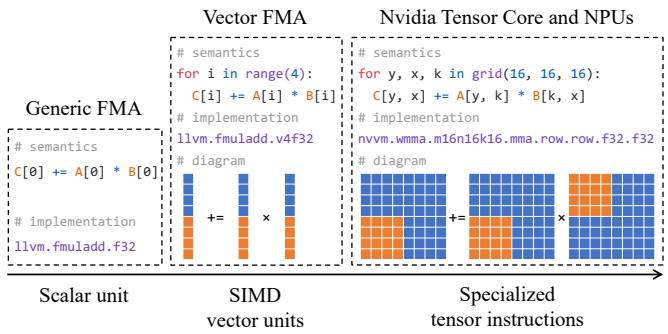{width=70% fig-align=center}

- Deep learning deployment spans from servers to embedded devices.
- Modern accelerators (TPUs, NPUs, GPUs) increasingly rely on specialized high-dimensional tensor computation instructions.
- These instructions (e.g., Tensor Cores) replace traditional scalar/vector units to meet heavy throughput requirements.

## The Engineering Bottleneck

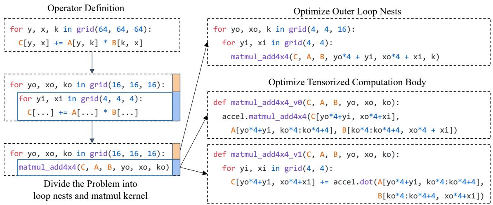{width=70% fig-align=center}

- Currently, domain experts manually optimize tensorized programs using a divide-and-conquer approach.
- Experts craft highly optimized micro-kernels (e.g., Intel MKL-DNN, NVIDIA cuDNN) for specific hardware.
- This requires massive engineering effort and struggles to keep pace with rapidly evolving ML models and hardware.

## Limitations of Existing ML Compilers

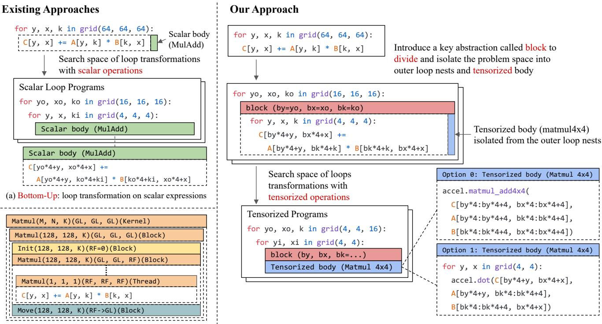{width=70% fig-align=center}

- Existing compilers (TVM, Halide, MLIR) typically use a bottom-up approach focused on scalar operations.
- They search over loop nest transformations but lack native abstractions for opaque tensorized computation primitives.
- Top-down polyhedral approaches also struggle to automatically map to arbitrary hardware tensor intrinsics.

## The Tensorized Program Optimization Challenge

- **Abstraction:** Compilers need a way to pragmatically capture equivalent tensorized computations and multi-dimensional memory accesses.
- **Search Space:** The combination of loop tiling, threading, data layouts, and tensorized computations creates a massive optimization design space.
- **Goal:** Bring automatic program optimization to tensorized programs to unlock domain-specific hardware acceleration without manual micro-kernel writing.

# Design

## The TensorIR Abstraction

- TensorIR introduces a new construct called a `block` into the loop nests.
- A block divides and isolates a tensorized computation region from the outer loop nests.
- Tensor computation becomes a first-class citizen, enabling independent transformations on both outer and inner problems.

## Block Signatures

- Unlike scalar computations, dependencies cannot be easily extracted from opaque tensor bodies.
- Block signatures explicitly store iterator domains, access regions, and read/write dependencies.
- This provides sufficient information to safely transform outer loops without inspecting the block's inner body.

## Reduction Blocks

- Reduction computations (e.g., matrix multiplication accumulation) require initialization and update steps.
- TensorIR introduces an optional initialization statement for blocks performing reductions.
- This allows the scheduler to jointly optimize tiling and compute locations for both steps.

## Scheduling Transformations

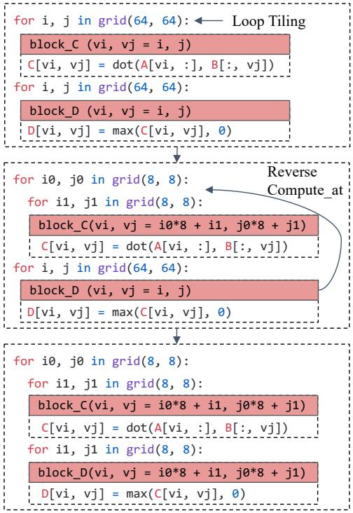{width=70% fig-align=center}

- TensorIR provides primitives to transform programs into equivalent optimized schedules.
- Supports standard loop transformations: tiling, splitting, reordering, and compute location mutation.
- Dependencies are calculated purely by inspecting the block signature, preserving block isolation.

## Blockization

- TensorIR introduces `blockization` to isolate a sub-region computation into a new sub-block.
- Converts a scalar-based program into a tensorized computation candidate.
- Enables the compiler to dynamically create block hierarchies that match hardware tensor intrinsics.

## Correctness Validation

- **Loop Nest Validation:** Ensures iterator bindings match domain constraints and producer-consumer relations are valid.
- **Threading Validation:** Checks thread bindings, cooperative memory accesses, and execution scopes (e.g., warp-level for Tensor Cores).
- Validation filters out invalid programs during automatic search, ensuring semantic equivalence.

## Auto-Scheduling Architecture

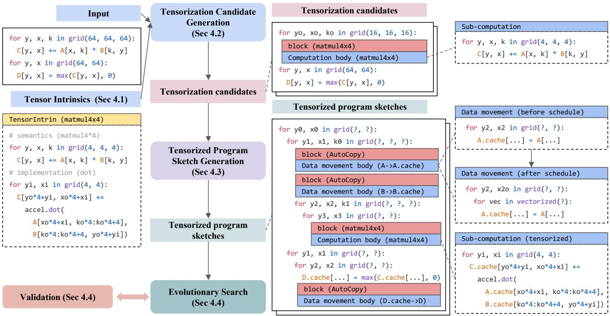{width=70% fig-align=center}

- TensorIR includes a tensorization-aware automatic scheduler.
- Takes a workload description and hardware tensor intrinsic descriptions as inputs.
- Generates tensorization candidates, builds program sketches, and uses evolutionary search to find the optimal schedule.

## Abstraction for Tensor Intrinsics

- Hardware instructions are described using a `TensorIntrin` construct.
- Contains two blocks: one for computation semantics and one for the low-level backend implementation.
- Specifies data types, memory layouts, storage scopes, and contiguity constraints.

## Tensorization Candidate Generation

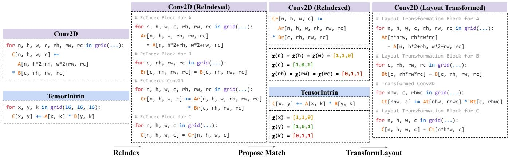{width=70% fig-align=center}

- Matches the program body to possible `TensorIntrin` descriptions.
- Uses a `ReIndex` transformation to rewrite complex buffer access expressions (e.g., Conv2D) into intermediate iterators.
- Calculates characteristic vectors to map workload iterators to intrinsic iterators.

## Loop Reorganization

- Reorganizes the block instance space to match the sub-problem size of the tensor intrinsic.
- Performs necessary padding on computation blocks and input/output operands.
- Tiles and blockizes inner loops to isolate the corresponding tensor computations.

## Data Movement as a First-Class Citizen

- Tensor intrinsics vastly improve compute throughput, making data movement the primary bottleneck.
- TensorIR inserts `AutoCopy` blocks to decouple data movement from computation schedules.
- Allows independent optimization of memory schedules (e.g., cooperative fetching, vectorization, stride padding).

## Evolutionary Search

- Explores the massive search space of generated program sketches.
- Uses a boosting tree ensemble cost model based on features extracted from block signatures and bodies.
- Continuously validates mutated candidates to reject invalid programs caused by unmet hardware constraints.

# Evaluation

## Experimental Setup

- Implemented on top of the Apache TVM framework.
- **GPU Platform:** NVIDIA RTX 3080 (Tensor Cores) using float16.
- **CPU Platform:** AWS Graviton2 (ARM CPU) using 8-bit integer dot products (sdot).
- **Baselines:** TVM, AMOS, PyTorch, CUTLASS, TensorRT, ARMComputeLib.

## Single Operator Performance (GPU)

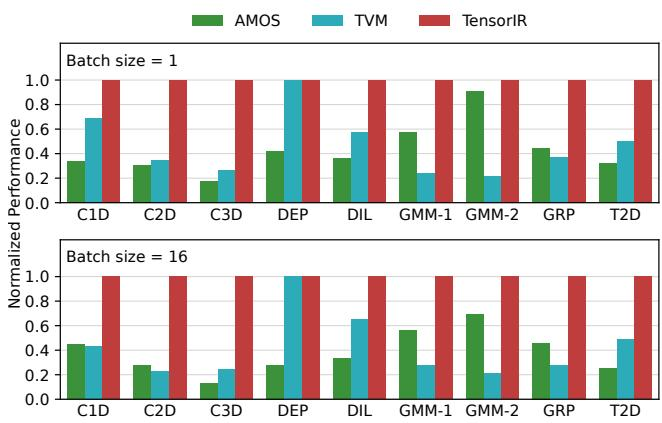{width=70% fig-align=center}

- Evaluated on 1D/2D/3D Conv, Depthwise, Dilated, Group Conv, and GEMM.
- TensorIR outperforms existing ML compilers (TVM, AMOS) by up to 7.5x.
- Improvements stem from better abstraction and automatic scheduling of tensor compute intrinsics.

## Comparison to Vendor Libraries (GPU)

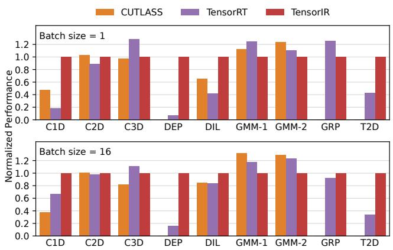{width=70% fig-align=center}

- TensorIR outperforms CUTLASS and TensorRT on several operators (up to 13.9x faster).
- Achieves >75% throughput on heavily optimized operators like 3D Convolution and GEMM.
- Delivers competitive performance automatically, without requiring dedicated engineering teams.

## End-to-End Model Performance (GPU)

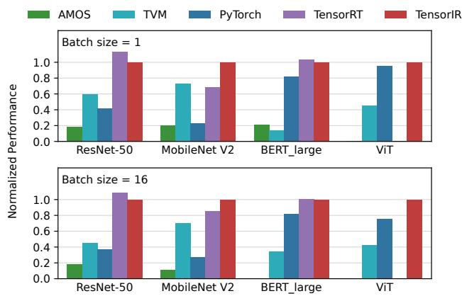{width=70% fig-align=center}

- Evaluated on ResNet-50, MobileNet V2, BERT-large, and Vision Transformer (ViT).
- Outperforms PyTorch, TVM, and AMOS by 1.2x to 8.8x.
- Achieves 30% better performance on MobileNet V2 compared to TensorRT.
- Automatically supports emerging models (like ViT) that TensorRT did not yet support.

## Tuning Efficiency

- TensorIR tunes end-to-end models up to 2x faster than TVM.
- Auto-tensorization generates faster programs, reducing hardware profiling time.
- The divide-and-conquer abstraction significantly reduces the search space size.

## Single Operator Performance (ARM CPU)

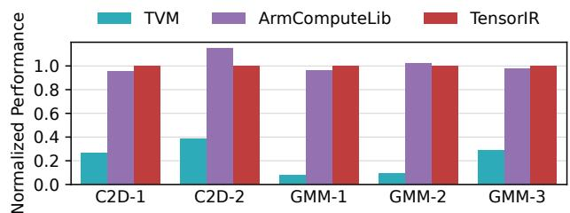{width=70% fig-align=center}

- TensorIR achieves up to 12.5x speedup over TVM by leveraging native hardware acceleration.
- Reaches 85% to 105% of the throughput of the hand-optimized ARMComputeLib.
- Demonstrates TensorIR's ability to easily generalize to different hardware platforms.

## End-to-End Model Performance (ARM CPU)

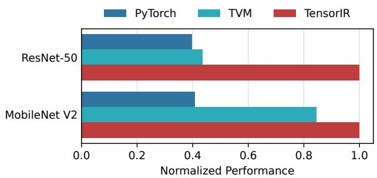{width=70% fig-align=center}

- Outperforms PyTorch and TVM by 1.2x to 2.5x on end-to-end networks.
- Overcomes limitations in framework backends (e.g., PyTorch's QNNPACK lacking sdot support).
- Reduces maintenance burdens by automating performance portability across diverse hardware.
